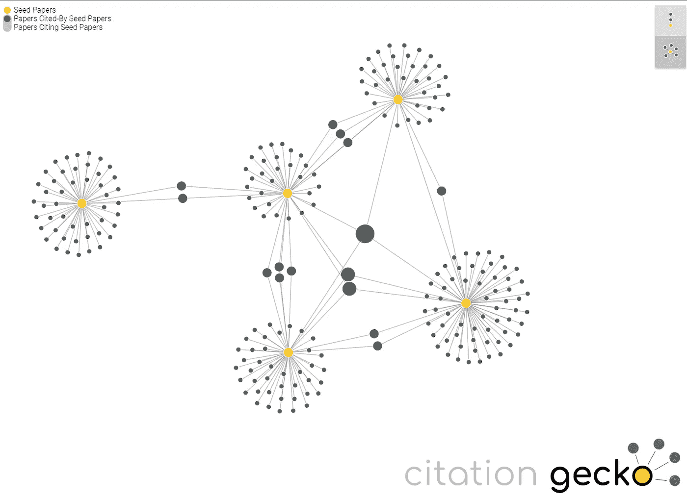
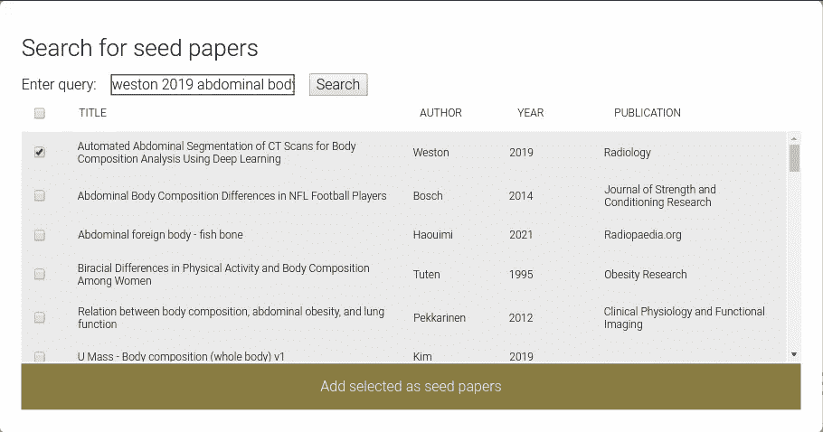
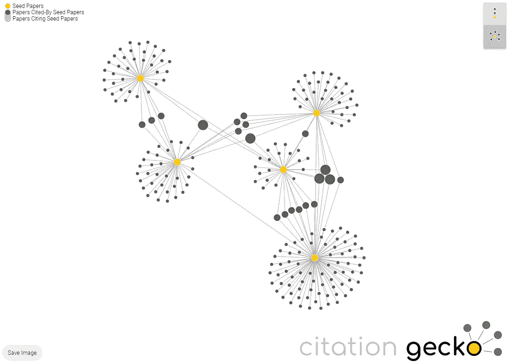
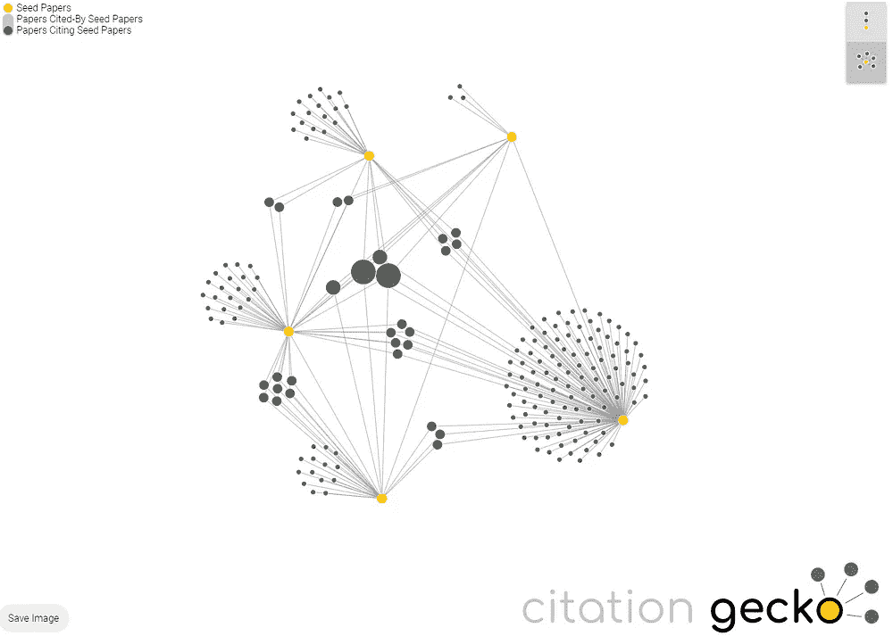
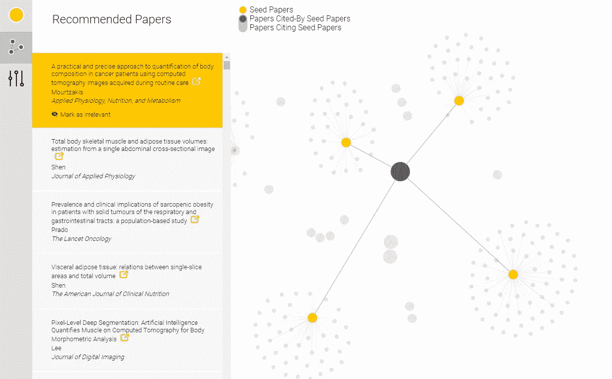

# 使用 Citation Gecko 绘制科技论文参考文献

> 原文：<https://medium.com/geekculture/using-citation-gecko-to-map-references-for-scientific-papers-9c0f2871c540?source=collection_archive---------8----------------------->

## 使用基于浏览器的工具，可以快速方便地获取、分析和索引您的论文

Image from [WikiMedia Commons](https://commons.wikimedia.org/wiki/File:Kartograph.jpg).

对我来说，起草科学论文的引言是写作过程中最耗时的部分之一。

我目前正在为一个我已经工作了一年多的项目起草一篇论文，我发现自己在谷歌上搜索一个工具，它将帮助我组织我无尽的 PubMed 文章滚动，更重要的是防止我忽略该领域的一篇关键论文(它总是出现在评论者的评论中)。

我是一个视觉思考者，希望有一个基于图形的工具，可以帮助我快速发现和总结该领域经常被引用的论文。我相信 [Web of Science](https://clarivate.com/webofsciencegroup/solutions/web-of-science/) 曾经有过这样一个引文映射工具，但现在似乎已经绝迹了。

我在搜索过程中发现了[连接论文](https://www.connectedpapers.com/)、[煽动](https://inciteful.xyz/)、 [VOSViewer](https://www.vosviewer.com/) 、[研兔](/a-academic-librarians-thoughts-on-open-access/researchrabbit-is-out-of-beta-my-review-of-this-new-literature-mapping-tool-3c593d061c63) **。这些工具看起来都很强大，但它们都要求我将软件下载到我的工作电脑上，或者创建一个帐户，这超出了我希望完成的范围。

我最终偶然发现了 Citation Gecko，这是一款基于浏览器的免费工具。我发现它很有趣，也很容易使用；在短短几个小时内，我就能生成一份完整的参考书目，甚至发现了五六篇我原本会忽略的精彩论文。

接下来是一个简短的，一步一步的教程，关于我如何开始使用 Citation Gecko。我正在展示我自己项目的一些截图，这是一份关于使用[深度学习来测量基于人口的虚弱和肥胖差异的原创出版物](https://pubs.rsna.org/doi/full/10.1148/radiol.2018181432)。

**** *注意*** —如果你对这些工具中的一个感兴趣，它有更多的功能，可能更适合长期的研究项目，这里有一个[引文映射工具的全面概述。](https://aarontay.medium.com/3-new-tools-to-try-for-literature-mapping-connected-papers-inciteful-and-litmaps-a399f27622a)

**什么是引文壁虎？**

Figure 1\. Mapping scientific paper citations using the online tool Citation Gecko. Image by Author.

Citation Gecko 是一个简单的图形界面，它映射了论文参考文献之间的联系。它是基于浏览器的，这意味着你不必下载任何东西或创建一个帐户；它只需要几秒钟就可以开始，并且有一个内置的搜索工具来发现新的参考资料。

使用 Citation Gecko，您可以快速生成与您的主题相关的论文列表，可视化论文的“相似性”，并确定哪些文章在该领域产生了最多的引用。

一旦你整理了你的参考资料，Citation Gecko 允许你以一个。bib”文件(参考书目),便于导入到您喜欢的参考资料管理器中。

## **开始添加论文**

Figure 2\. Adding seed papers to Citation Gecko. Every good researcher cites themselves first. Image by Author.

当你第一次登录该工具时，它会提示你添加“种子”论文——网络的起点。Citation Gecko 将自动映射“种子”论文的参考文献，以及任何引用种子的新论文。

我把我的第一个“种子”作为我自己最近关于这个主题的出版物。我还从文献中添加了四篇种子论文。我通常会发现，有一些关键的论文作为方法论或结果的灵感或参考，挑选有用的种子相对容易。

Figure 3\. Visualizing papers which are “cited by” our yellow seed papers (left) and newer papers which “cite” our seed papers (right). Image by author.

图 3 显示了添加五篇种子论文后的网络。每个种子在图上用一个黄点表示。参考种子的论文显示为灰色点，这些点通过线与种子相连。引用壁虎有两个参照系——种子引用的*的论文(图 2，左)和*引用种子*的较新论文(图 2，右)。*被*论文引用看*向后看*，被*论文引用看*论文向前看。*

观察这些图，你会注意到每个图中有 20 个灰点，这些灰点更大，并与多个黄点相连。这些论文引用了多篇 seed 文章。在这个特定的网络中，没有一篇论文被每篇文章引用，但是在左图中，总共有五篇论文被我们的五个种子中的三个引用。

## 我如何使用 Citation Gecko 来组织我的参考文献

从这个看似简单的界面中，您可以快速获得一些重要信息。

首先，查看种子“引用”的论文，您可以快速确定该领域历史上最热门的论文的短名单。我在我的参考书目中包括了每篇被两个或更多种子引用的论文，以及大约 25%被引用一次的论文。

例如，在图 4(下图)中，中间有一篇文章被我的五篇参考论文中的四篇引用。这篇论文的名字叫 [*U-Net:生物医学图像分割的卷积神经网络*](https://link.springer.com/chapter/10.1007/978-3-319-24574-4_28) 作者 Olaf Ronneberger。你们中的一些人可能认识这个，这是一篇基础的深度学习论文，已经被引用了超过 40，000 次。在这种情况下，我所有的种子论文都使用了类似的基于 U-Net 模型的深度学习方法。

第二，回顾“引用”你的种子的论文可以让你迅速了解你的主题的最新进展。该菜单似乎定期更新(几个月前就有引用)，因此很容易快速收集可能难以搜索的新论文，因为它们没有任何引用(以防你最近被抢先一步！)

如果你碰巧发现了一个你忽略了的重要参考文献，你只需点击一下就可以把它添加为种子，Citation Gecko 会把这些论文的引用快速回顾到影响深远的论文中。我发现这比打开 PubMed 文章的无尽标签要容易得多。

Figure 4\. Papers can be viewed/opened in the left menu. Image by author.

这是我完成参考书目的过程—

我保留了所有这些被“*引用的参考文献，由“*至少两个种子，加上大约一半的参考文献被“*引用“*两个或更多种子。这使我的参考书目增加到大约 30 篇论文，这在我的领域中已经很典型了。

对于剩下的大多数只被一个 seed 引用的论文，我在最左边的菜单中快速滚动这些引用。在谷歌学术有一个打开引文的链接来阅读摘要，还有一个将引文标记为“不相关”的按钮，这将把它从列表中删除。

我很努力地删除不相关的文件。对于每一个我不想包含在手稿中的参考文献，我都将其“删除”并从图表中移除。

花了一个小时，在“*引用*”和“*被*引用”图表中筛选出约 300 条引文。我最终删除了大约 90%的引用，这给我留下了一个网络的最终版本，它总共包含大约 50 篇参考文献，其中许多是相互关联的。

最后，我导出了一个可下载的完整的 50 人列表”。bib”文件，我将它直接导入到 EndNote 中。

## 使用引文映射工具的好处

我使用 Citation Gecko 组织参考资料的过程与我的典型习惯相反。通常，我会根据自己先入为主的想法快速起草引言，然后在谷歌上搜索支持我已经写好的内容的参考资料。

通过首先从引用开始，我能够根据其他专家引用的内容，从一个更少偏见的文献快照开始，然后围绕它建立我的介绍。这不仅为我的读者提供了更多的信息，而且我实际上发现它更容易写。我没有盯着一张空白页，而是从别人做过的事情列表开始，将志同道合的出版物分组，并在文中简要总结了影响。

在整个过程中，我发现了大约 5 或 6 篇我以前从未读过的高度相关的论文，包括一整套关于评估对比度对 ct 肌肉密度测量的影响的旧出版物，这些都是我所忽略的。在许多方面，我喜欢仅仅根据引用的基础来组织参考文献的相对公正的过程；我怀疑谷歌学术、PubMed 和其他“推荐”论文的数据库倾向于重复相同的主题和期刊，就像社交媒体中的[过滤泡沫](https://en.wikipedia.org/wiki/Filter_bubble)。

## **工具的局限性**

Citation Gecko 是一个简单的工具(这也是我喜欢它的原因)，它有一些值得一提的限制。

最大的限制是，很难保存会话。您可以将当前会话导出为"。bib”文件，然后在以后将其重新导入到新的会话中。这个过程运行良好，但也有很多出错的机会。

网络似乎在五六个种子和几百篇论文的情况下工作得最好。当我导入一篇有 100 多篇参考文献的论文时，这个工具明显滞后了。你尤其需要小心高被引论文，这可能会导致浏览器崩溃。我还努力从引用较少、因此联系也较少的新论文中构建一个引人注目的地图。

最后，进口论文清单经常包含重复或不可读的参考文献(例如，缺少标题)。我怀疑这可能是导入工具的问题；它尤其影响到那些“非标准”参考格式的论文，如会议摘要或网站。清理这些东西并不费力。

## 结论

可能还有其他更强大的参考资料管理器，但 Citation Gecko 是一个立竿见影的方法。使用 Citation Gecko，我能够在大约一个半小时内生成并导出一个完整的参考书目，这比我通常需要几天的习惯有了巨大的改进。

我希望这篇文章对您有用，

感谢阅读，

亚历克斯