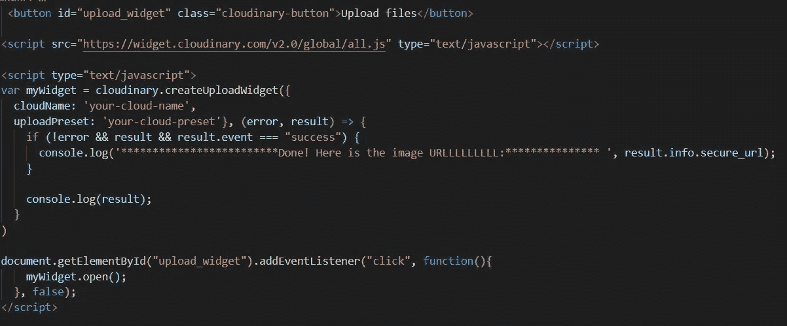
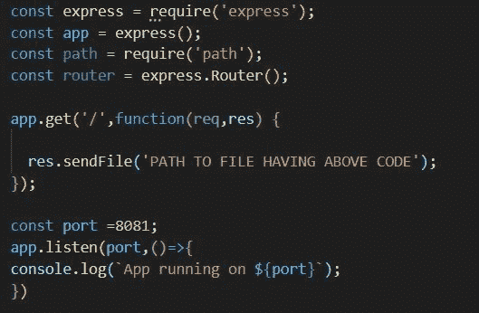
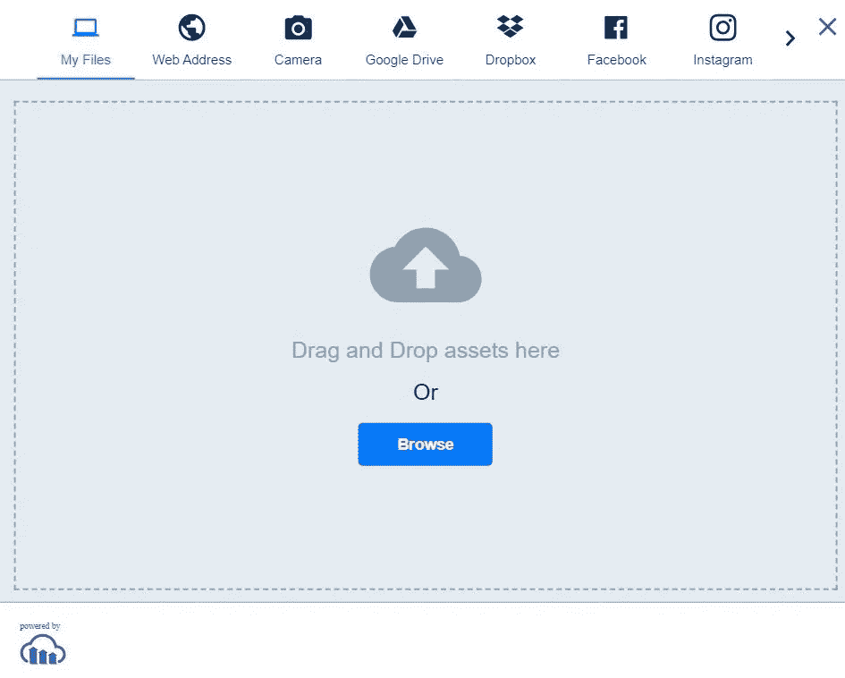

# 使用 Cloudinary 作为上传图像到数据库的替代方案

> 原文：<https://medium.com/geekculture/using-cloudinary-as-an-alternative-for-uploading-images-to-database-e786899e9d3e?source=collection_archive---------12----------------------->

处理公共交互或创建用户简档的全栈应用程序通常会遇到将用户的图像或简档图片存储到数据库的问题。当然，你可以将图片分成字节或比特等，并存储它们，但这是一种可怕的做法，而且在实践中太难了。***另一种方法是将图片上传到服务器或文件夹，从那里生成上传的公共 URL，并将该 URL 存储到数据库中。***

为了做到这一点，我们需要一个第三方或内部服务器或类似的服务，可以推迟我们的图像和做必要的。像 GCP、AWS 等云服务为我们提供了这种服务，但它们通常很昂贵，而且在免费版本中几乎没有存储空间。这些服务的替代品是第三方提供商，如 CloudConvert、Cloudimage 等。一个这样的选择是 Cloudinary，它在免费计划和许多其他服务中提供了近 25 GB 的充足存储空间。

Photo by [Campaign Creators](https://unsplash.com/@campaign_creators?utm_source=medium&utm_medium=referral) on [Unsplash](https://unsplash.com?utm_source=medium&utm_medium=referral)

**使用 CLOUDINARY**

使用 Cloudinary 包括 3 个主要步骤

1.  在 Cloudinary 上创建帐户。
2.  设置我们想要使用的系统和 SDK。
3.  向 Cloudinary API 发出请求并提取所需的内容。
4.  在 Cloudinary 上创建帐户就像在 Gmail 上创建帐户一样简单。点击[链接](https://cloudinary.com/)并执行必要的操作。
5.  这里我们将使用 Javascript 或参考 JS 框架。Cloudinary 支持许多其他框架和 SDK，它们也非常容易使用。现在，要设置环境，我们需要

A. *npm 模块，*可以通过执行**NPM init-y(双连字符 y)轻松下载。**

B.可以通过执行**NPM install Cloudinary-core-save(**double hyphen save)下载的 cloudinary 包(或依赖项)。

C.express 或 node js 服务器。这里我们将使用快速服务器，因此， **npm 快速安装—保存**(双连字符保存)。

D.此外，我们将需要一个预置(这是一个关键)，可在:-设置>上传>上传预置>启用未签名的上传。这里将生成一个密钥，复制粘贴那个密钥，因为我们稍后会用到它。

3.可以通过两种方式向 Cloudinary 服务发出请求

→制作一个上传文件按钮/widget，用公理击中[**https://api.cloudinary.com/v1_1/your-cloud-url/image/uploa**](https://api.cloudinary.com/v1_1/your-cloud-url/image/upload)**d**URL，从生成的结果对象中提取 secure_url。secure_url 将有我们的图像和点击网址。此外，这个 secure_url 可以存储在数据库中并被进一步使用。

→第二种方式是使用 Cloudinary 默认提供的 widget。这个默认的小工具集成了许多第三方应用程序，如 Instagram、脸书、Dropbox 等。

两种方式都可以，只是偏好和可行性的问题。这里，我们将使用后一种方法，其代码如下

*   这是一个 HTML 文件代码，所以很自然地，创建一个 HTML 文件，比如说 index.html，并在那里编写代码。
*   第一行创建了一个简单的按钮。我们可以将 bootstrap 应用于它或任何其他自定义样式。第二行将 Cloudinary API 链接到我们的文件。
*   按下按钮时，将调用 mywidget.open()，这基本上是一个由事件侦听器触发的方法。
*   在该方法中，我们有我们的云细节(将上面复制的键复制到 UploadPreset)以及一个 *createUploadWidget* 方法，该方法具有自我解释的字段并且易于理解。

好的，这里的想法是通过一个快速服务器呈现这个 HTML 页面，并运行整个设置，为了做到这一点，我们有:-

上面的快速代码必须在一个单独的文件中，我们可以通过键入 **node filename.js.** 来运行它。现在，通过点击 [http://localhost:8081](http://localhost:3000/) ，我们可以得到我们想要的结果。

屏幕将显示为:-

The Upload file button

Widget after clicking the upload button

上传文件后，我们可以在控制台中找到我们的 URL。

注意事项:-

1.  记住，制作一个未签名的预置键。这是一种非常不安全的使用 API 的方式，因为任何人都可以将文件上传到我们的 Cloudinary 存储中。所以要不断改变它，永远不要把它留在前端。**改用环境变量或任何其他安全的方式。**本文是关于 API 的简单用法，因此不关注安全性方面。
2.  使用 express 服务器可能无法呈现具有复杂 CSS 代码的高度复杂的 HTML 文件。因为这篇文章是关于 API 的简单用法，所以它不关注这个方面。但是您更愿意尝试解决任何可能出现的错误(如果有的话)，或者考虑使用公理或任何其他方法来呈现复杂的 CSS。

最后，本文展示了使用上述 API 的另一种方法。还有许多其他的使用方法，所以请随意阅读文档并尝试其他的设置和方法。

感谢您的阅读！希望这篇文章有所帮助。