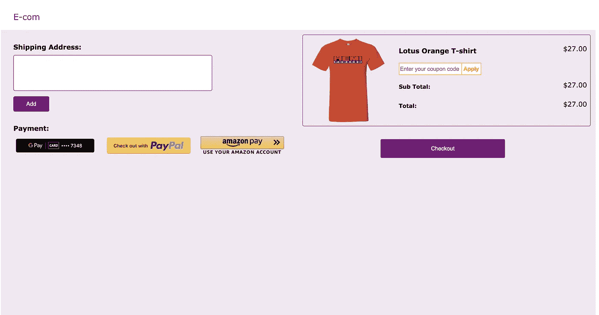
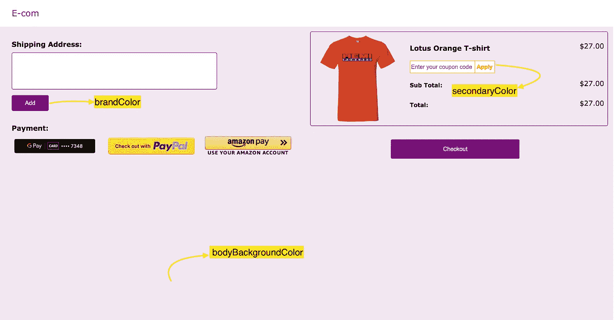

# 使用 CSS 变量进行动态品牌主题化

> 原文：<https://medium.com/geekculture/using-css-variables-for-dynamic-brand-theming-323cd7cd4879?source=collection_archive---------32----------------------->

最近，我开发了一个电子商务结账页面生成器(无代码工具)，商家可以根据他们的品牌改变主题。商家可以为按钮、主体等各种元素配置他们的品牌颜色和次要颜色。该配置将使用 API 获取，并在呈现时应用于结帐页面。我探索了各种方法，比如 SASS/LESS/Stylus 变量、CSS-in-JS 库和应用主题的 CSS 变量。经过深入的探索，我最终使用了 CSS 变量。在本文中，我将解释每种方法的优缺点，以及我是如何使用 CSS 变量的。

# SASS/LESS/Stylus 变量:

CSS 预处理程序是脚本语言，允许开发者使用变量、函数、混合等编写干巴巴的风格。这些枯燥的样式在编译时会被转换成原始的 CSS 样式。如果我们在编译时知道所有与主题相关的信息，我们可以很容易地将它们映射到这些变量并实现主题化。由于收银台必须允许商家在运行时动态改变主题，我们不能采用这种方法。

# CSS-in-JS 库:

市面上有很多 CSS-in-Js 库，比如[**styled-components**](https://styled-components.com/docs/advanced#theming)**[**emotion**](https://emotion.sh/docs/theming)**[**laminary**](https://glamorous.rocks/advanced/#theming)等。这些提供了广泛的主题化支持。然而，这些库需要`<ThemeProvider />`，它必须包装在应用程序上，以便提供主题上下文。供应商锁定是使用这种方法的另一个缺点。未来我们将无法轻松地切换到不同的方法。由于我们已经习惯了传统的 CSS 方法，学习曲线也很高。****

# ****CSS 变量:****

****CSS 变量(也称为自定义属性)允许我们使用 Javascript 在运行时动态更改值。我们可以使用`var()`在样式表的引用中使用一个变量。您可以在 CSS 或 javascript 中指定 CSS 变量的值。[很多最新的浏览器](https://developer.mozilla.org/en-US/docs/Web/CSS/Using_CSS_custom_properties#browser_compatibility)版本都支持 CSS 变量。由于 CSS 变量受原生 CSS 支持，而且学习曲线也很低，所以我更喜欢将 CSS 变量用于我的主题化系统。****

****让我们创建一个简单的结帐页面，包含送货地址部分、付款部分和购物车部分。商家将能够为这些部分配置 **brandColor、secondaryColor** 和 **bodyBackgroundColor** 。****

********

## ******步骤 1 —映射变量以检出元素******

****让我们将每个变量映射到各自的 checkout 元素。****

1.  ******品牌颜色** -用于主要按钮、标志和边框颜色****
2.  ******secondaryColor** —用于应用优惠券输入组****
3.  ******bodyBackgroundColor** -这是主容器的背景色。****

********

## ******第二步——在样式表中使用 CSS 变量。******

****要将一个 CSS 变量赋给一个属性，我们必须使用`var()`。****

****让我们看看使用`brandColor`变量的选择器。这个变量的值将在运行时使用 javascript 设置。****

****`secondaryColor`变量用于应用优惠券按钮。****

****`bodyBackgroundColor`应用于应用程序的主容器。****

## ******步骤 3 —创建商户配置 JSON******

****我们的主题构建器配置将通过服务器的 API 公开。JSON 的配置看起来会像这样****

****为了演示，让我们用静态 JSON 模拟服务器响应。`getMerchantConfig`函数将返回一个使用`merchantId`参数解析商户配置的承诺。****

## ******步骤 4 —在 Javascript 中设置 CSS 变量的值******

****现在，让我们看看 Javascript 中的变量是如何设置的。因为变量在样式表中使用，所以让我们在根元素中设置变量。****

```
**const root = document.querySelector(':root');root.style.setProperty('--brandColor', merchant.brandColor);root.style.setProperty('--secondaryColor', merchant.secondaryColor);root.style.setProperty('--bodyBackgroundColor', merchant.bodyBackgroundColor);**
```

****现在，我们必须为商家获取主题配置。假设商家 1 是活跃的。我们必须通过传递 merchantId `merchant1`来调用`getMerchantConfig`函数。****

```
**const setTheme = async () => { **const merchant = await getMerchantConfig('merchant1');** const root = document.querySelector(':root'); root.style.setProperty('--brandColor', merchant.brandColor); root.style.setProperty('--secondaryColor',     merchant.secondaryColor); root.style.setProperty('--bodyBackgroundColor', merchant.bodyBackgroundColor);};setTheme();**
```

****最终的 Js 代码将如下所示。****

****就这样，我们结束了😎。你可以在[代码笔](https://codepen.io/mathumithapalani/pen/OJpBGjL?editors=1111)中看到工作演示。您可以通过将不同的商品传递给`getMerchantConfig`函数来进行操作。您也可以尝试配置其他属性，如字体大小、字体系列等。****

 ****[## CodePen Embed -动态品牌主题

### const getmerchant config =(merchant id)= > { const merchant configs =[{ id:' merchant 1 '，brandColor: '#800080'…

codepen.io](https://codepen.io/mathumithapalani/embed/OJpBGjL?editors=1111)**** 

# ****结论:****

****使用 CSS 变量可以大大简化主题化。没有供应商锁定。CSS 变量受原生 CSS 支持，并具有[出色的浏览器兼容性](https://developer.mozilla.org/en-US/docs/Web/CSS/Using_CSS_custom_properties#browser_compatibility)。最适合我的特点了。CSS 变量比主题化有更多的潜力。它减少了大量重复的任务。你可以试一试。我在这里附上一些好的资源。****

****[https://developer . Mozilla . org/en-US/docs/Web/CSS/Using _ CSS _ custom _ properties # basic _ usage](https://developer.mozilla.org/en-US/docs/Web/CSS/Using_CSS_custom_properties#basic_usage)****

****[https://electerious . medium . com/the-power-of-CSS-variables-6 C4 E4 ebaf 279](https://electerious.medium.com/the-power-of-css-variables-6c4e4ebaf279)****