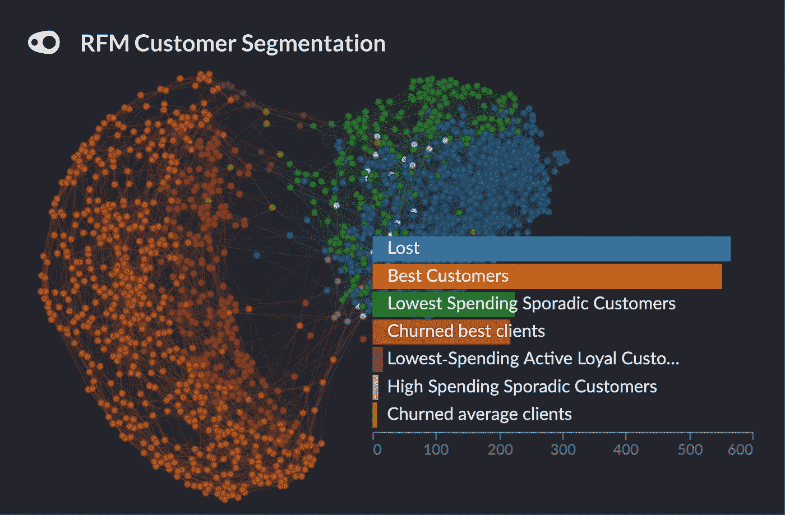
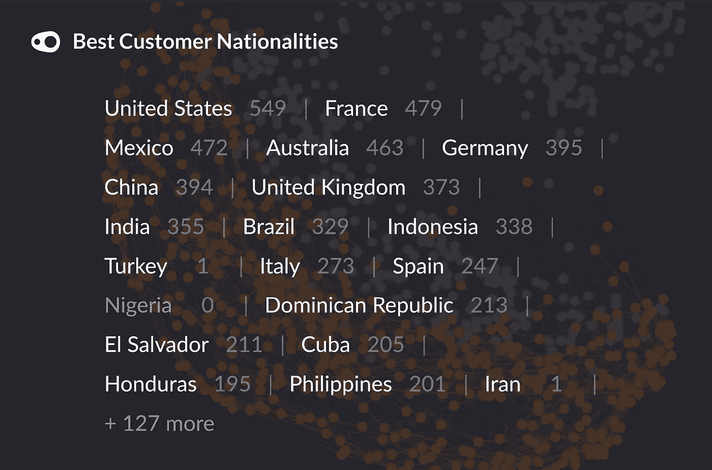
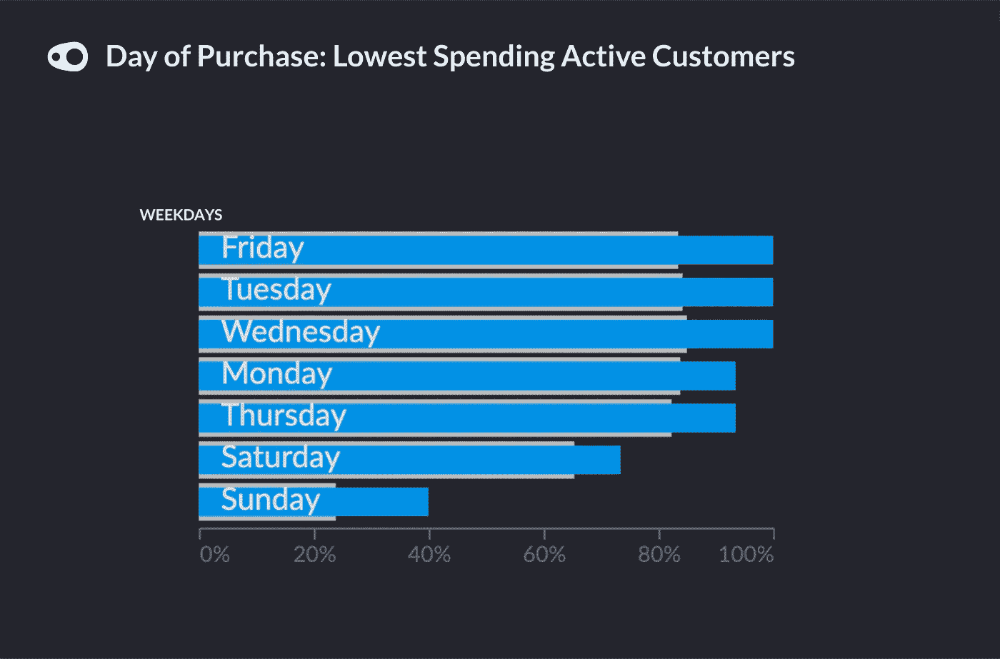

# 利用客户数据和 RFM 分析创建相关的广告活动

> 原文：<https://medium.com/geekculture/using-customer-data-and-rfm-analysis-to-create-relevant-ad-campaigns-373764ee50c8?source=collection_archive---------8----------------------->

大约 6 个月前，我从一家较大的咖啡公司购买了一台咖啡机，我立即收到了一封电子邮件，告诉我注册并从我的第一批 100 多盒咖啡中扣除 20 英镑。太棒了，我想。我立即从一家高级供应商那里订购了 100 盒，收到后就开始喝 100 杯咖啡。

现在，大约一个月一次，我会在我的邮箱里收到一模一样的优惠券。这封邮件我现在归类为垃圾邮件。我不能再做我的第一个订单，将支付全价。我不是那种讨厌被广告盯上的人，事实上，作为一个从事数据工作的人，我觉得只有做对了，广告才会有用。‍

> 广告是好的，只要它们是相关和有用的。 ‍

将所有客户放在同一个篮子里，向他们提供一揽子交易和服务，不会让我们感到受到了照顾。它纠缠着我们，激怒着我们。对这一点的无知是糟糕广告的核心。让顾客感到被欣赏意味着欣赏他们独特的品味和需求。

在数字经济中，营销人员拥有大量客户数据，包括他们的购买历史、页面访问和活动响应模式。分析 RFM——新近性、频率、货币价值——可以让你把你的客户聚集起来，发现子社区，并根据他们的行为锁定他们。‍

> *让顾客感到被欣赏意味着欣赏他们独特的品味和需求。* ‍

我们的团队起草了一个数据集，其中包含了 1590 名顾客在 4 年时间里在一家网上超市的购物信息，他们想证明 RFM 分析的有用性。为了准备用于分析的数据集，我们首先聚合数据集，以便每行代表一个客户的购买历史。然后，我们计算每个客户的近期、频率和货币价值得分。‍

*   **—当前日期和客户最近一次交易之间的时间差。**
*   ****频率** —客户交易的总和。**
*   ****货币价值** —客户总体消费总额的总和与平均值(两个不同的变量)。‍**

**通常，这种类型的分析会涉及到使用 R 或 Python 等编程语言的数据分析。我们迅速错过了这个机会，使用 Graphext 的内置 RFM 分析流程设置了近期、频率和货币值变量，并执行了该项目。‍**

****

**图表:RFM 客户细分。‍**

> ***网络可视化将更好的客户分组到图表的底部。客户在网络中的地位越低，他们花费的就越多。* ‍**

**直接进入分析，我们的第一步是根据客户的近期、频率和货币价值指标对客户进行细分。例如，*流失的*客户是新近得分低的客户，而*最佳客户*代表频率和货币价值最高的客户群**

**我们团队的一个惊人发现是,*最佳客户*群中的人通常都被好客户包围着，这些好客户最终会制造麻烦。尽管是常客，但数据显示，这些人会流失，并可能在某些方面不满意。为了避免流失，应该对它们进行更详细的分析，以便采取具体和适当的行动。‍**

> **温和地提醒老顾客，这将是一个明智而相关的活动策略。**

**在*最佳客户*群中的‍For 客户，保持定期优惠似乎很重要，因为他们很容易流失。此外，*流失的最佳客户*群可能会通过发送到他们电子邮件的好的促销活动而被轻松带回。他们以前是忠诚的，很可能他们的忠诚会随着一些温和的提醒而回归。**

**快速比较集群显示，大多数在线超市的最佳客户来自美国，主要购买办公用品。增加这些客户的办公用品交易数量是一种直接而明智的促销方式。‍**

****

**图表:最佳客户细分中客户的来源国家。‍**

**着眼于未来的营销策略，我们的团队假设在英国、巴西或西班牙等国家开展营销活动是有益的。比较我们的*最佳客户*细分的来源国，表明这些国家已经有了一些有价值的客户。**

**在广告活动的背景下，明智的做法是瞄准已经表现出参与度的国家，希望增加它们在重要客户中的份额。与针对加拿大等参与度较低的国家的不了解情况的策略相比，这种了解情况的竞选策略更有可能产生积极的结果。**

**最后，值得注意的是，一些忠诚的顾客不会花那么多钱购买。对于这个群体来说，一个明智的决定，创造一个有针对性的促销活动，鼓励他们购买更多可能会增加销量。促销活动可以在周五开始，因为这通常是他们购买最多的时候。考虑他们通常购买的产品类型将有助于进一步定制这些促销活动。‍**

****

**侧边栏图表:一周中支出最低的活跃客户通常购买的日期。**

**‍The 越多的公司了解——更重要的是——了解他们的客户，就越好。他们应该考虑自己独特的品味、偏好和态度，以及发现自己的行为与产品和购买平台的关系。数据和 RFM 分析可以帮助公司实现这一目标。开发一种处理、转换和分析客户数据的强大方法，意味着企业将留住最好的客户，赢得新客户，并提高利润。**

**如果你想为你的客户试用，你可以在这里创建一个免费账户:[https://accounts.graphext.com/users/sign_up](https://accounts.graphext.com/users/sign_up)**