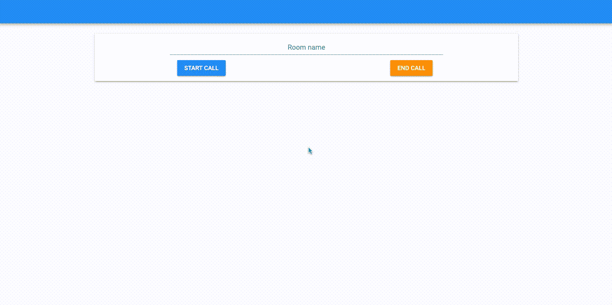
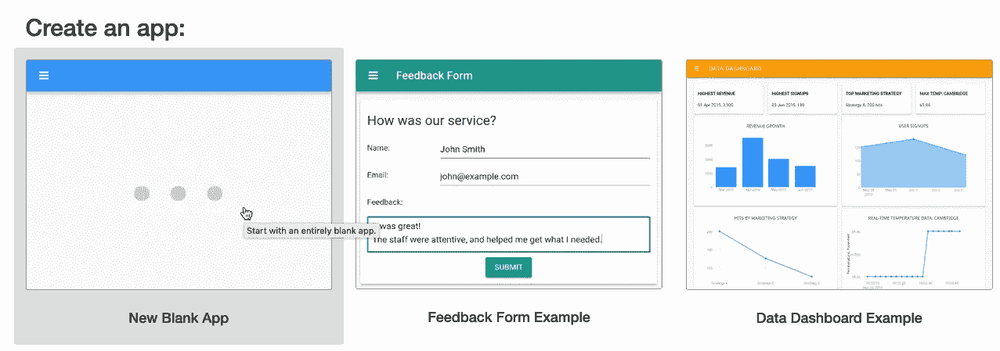
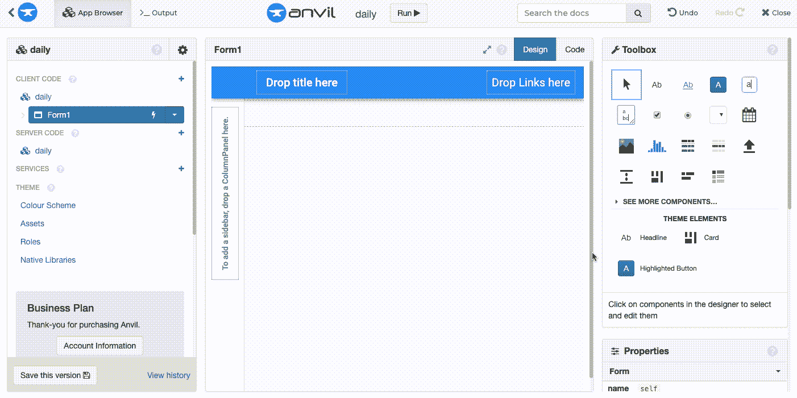
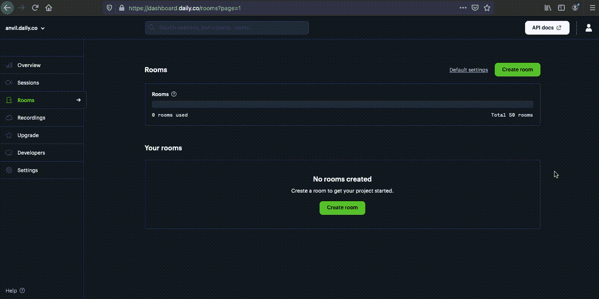
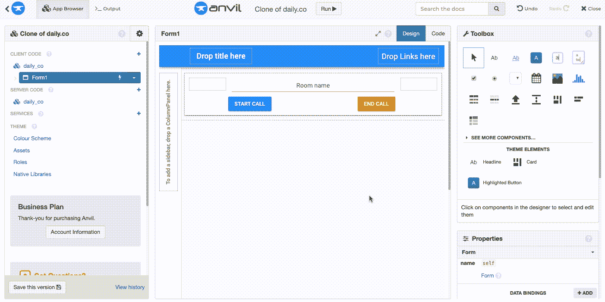

# 用 Anvil 使用 Daily 的视频聊天 API

> 原文：<https://medium.com/geekculture/using-dailys-video-chat-api-with-anvil-689c5a10e7b4?source=collection_archive---------35----------------------->

[Daily](https://www.daily.co/) 的 API 让你只需几行代码就能给任何应用添加实时视频通话。 [Anvil](https://anvil.works) 使得完全用 Python 构建 web 应用程序变得容易——不需要 Javascript。在这篇文章中，我将告诉你如何一起使用它们，并告诉你如何开始使用 Daily 的 API。

我们将开发一款应用程序，让您的用户加入视频通话。您可以将它与任何东西集成，例如基于网络游戏的通信、基于视频的协作软件或实时客户支持。(点击此处[查看一些您可以使用 Anvil 构建的应用示例](https://anvil.works/learn/examples)。)

Daily call being started

*等等 Daily 不是 JavaScript API 吗？没错，但是用 Anvil* ***可以将 Javascript 库导入到你的 Python 前端*** *。怎么会？继续阅读…*

# 创建加入视频通话的表单

## 创建应用程序

用 Anvil 创建 web 应用程序很简单。我们将创建一个来开始。

[登录](https://anvil.works/login)到 Anvil，点击‘新建空白 App’。选择材料设计主题。

## 创建用户界面

我们需要一个带有文本框的表单来输入我们的会议室的名称和按钮来开始和停止通话。我们完成的表单看起来会像这样:

Finished call form

我们通过拖放[组件](https://anvil.works/docs/client/components)来构建表单。让我们从将一张卡片放入表单开始。然后将一个[文本框](https://anvil.works/docs/client/components/basic#textbox)拖到卡片中，在右边的属性面板中，将组件的名称改为`room_name_textbox`。

在文本框下方，拖放两个[按钮](https://anvil.works/docs/client/components/basic#button)。将第一个按钮的名称改为`start_call_button`，文本改为`Start call`。将第二个按钮的名称改为`end_call_button`，文本改为`End call`。

Building our call form

就是这样！我们的用户界面已经完成。

# 使用每日 API

## 创建每日视频通话室

我们需要创建一个我们的 Anvil 应用程序用户可以加入的视频通话室。

让我们转到[https://dashboard.daily.co/rooms](https://dashboard.daily.co/rooms)，点击`Create room`并给我们的房间命名。

Creating a room

关于创建房间的更多信息，每日有一个有用的指南[在这里](https://docs.daily.co/docs/experiment-in-the-dashboard#step-by-step-guide-create-a-daily-room-url-from-the-dashboard)。

## 导入每日 API 库

要导入 Daily 的库，请导航到我们应用程序的[原生库](https://anvil.works/docs/client/javascript#using-native-javascript-libraries)并添加以下代码行:

## 开始通话

Anvil 允许您在 Python 代码中导入和使用 JavaScript 函数——为您处理所有转换。让我们编写用户界面启动呼叫所需的代码。

导航回我们的`Form1`，在表单的[代码视图](https://anvil.works/docs/editor#code-view)的顶部，导入`[DailyIframe](https://docs.daily.co/reference#the-dailyiframe-class)` [类](https://docs.daily.co/reference#the-dailyiframe-class)。

然后，回到表单的[设计视图](https://anvil.works/docs/editor#design-view)，为我们的`start_call_button`创建一个点击事件处理程序。

Adding a click event to our ‘Start call’ button

每次点击按钮都会调用`start_call_button_click`函数。在该函数中，我们将检查用户是否输入了房间名称，然后创建一个名为`call_frame`的`DailyIframe`实例。然后，我们将调用`DailyIframe`的方法，将我们的会议室链接加上`room_name`作为参数传递给它。

*(将* `*'https://your-team.daily.co/'*` *替换为自己的会议室链接，可以在自己的* [*每日仪表盘*](https://dashboard.daily.co/) *中找到)。)*

## 如果那个房间不存在呢？

如果指定的房间不存在，`join()`方法将抛出异常。我们可以用通常的方法抓住它，用一个木块。然后我们会用 Anvil 的函数弹出一个对话框:

这就是我们的开始通话功能完成。让我们编写结束呼叫的功能。

## 结束通话

当用户点击“结束呼叫”时，我们希望通过调用`DailyIframe`的和方法来结束呼叫。

像我们对`start_call_button`所做的那样，为`end_call_button`创建一个名为`end_call_button_click`的事件处理函数。然后调用这些方法:

干得好！我们的应用程序的用户现在可以输入他们想要加入的会议名称，开始和结束通话，而无需离开您的 Anvil 应用程序。

# 就是这样！

我们刚刚只用 Python 创建了一个 web 应用程序；将它与 Daily 整合在一起，让它只需点击一个按钮就可以开始视频通话。很酷吧。

Daily call being started

## 克隆应用程序

如果你想看这个应用的源代码，你可以**在这里**克隆完成的应用:

 [## 注册

### Anvil 是一个免费的基于 Python 的拖放式 web 应用构建器

铁砧工厂](https://anvil.works/build#clone:PGXAZV7D53UI5FCJ%3d6VO4CP4AGJI4LHMCURXCYN2R) 

# 刚接触 Anvil？

如果你是新来的，欢迎！Anvil 是一个只使用 Python 就能构建全栈 web 应用的平台。不需要与 JS、HTML、CSS、Python、SQL 和它们所有的框架角力——只需要用 Python 构建所有的框架。

是—在浏览器中运行[的 Python。在服务器](https://anvil.works/docs/client/python)上运行的[python。Python 让](https://anvil.works/docs/server)[构建你的 UI](https://anvil.works/docs/client) 。一个[拖放 UI 编辑器](https://anvil.works/docs/client/ui)。我们甚至有一个内置的 [Python 数据库](https://anvil.works/docs/data-tables)，以防你没有自己的数据库。

为什么不试试应用程序构建器呢？**免费的！**点击此处开始:

[https://anvil.works/build](https://anvil.works/build)

**想试试别的教程吗？**通过我们的反馈表单教程了解 Anvil 中的数据库:

[https://anvil.works/learn/tutorials/feedback-form](https://anvil.works/learn/tutorials/feedback-form)

*原发布于*[*https://anvil . works*](https://anvil.works/articles/daily-co-video-chat)*。*