# 在中使用 Dapper 和 SQLKata。面向高性能应用的网络核心

> 原文：<https://medium.com/geekculture/using-dapper-and-sqlkata-in-net-core-for-high-performance-application-716d5fd43210?source=collection_archive---------0----------------------->


Photo by [Joe Neric](https://unsplash.com/@jneric?utm_source=medium&utm_medium=referral) on [Unsplash](https://unsplash.com?utm_source=medium&utm_medium=referral)

# 介绍

[对象关系映射](https://en.wikipedia.org/wiki/Object-relational_mapping) (ORM)是一种让你使用面向对象的范例从数据库中查询和操作数据的技术。它在应用程序和数据源之间创建了一个层，并向您返回关系对象，而不是(就您正在使用的 c#而言)ADO.NET 对象。这是每个 ORM 做的基本事情。

ORM 库是用你选择的语言编写的完全普通的库，它封装了操纵数据所需的代码，所以你不再使用 SQL 你可以用你正在使用的同一种语言直接与一个物体互动。这里有很多 ORM 库:

*   **爪哇** : [冬眠](https://en.wikipedia.org/wiki/Hibernate_(Java))。
*   **PHP** : [Propel](https://en.wikipedia.org/wiki/Propel_(PHP)) 或 [Doctrine](https://en.wikipedia.org/wiki/Doctrine_(PHP))
*   **Python**:Django ORM 或者 [SQLAlchemy](https://en.wikipedia.org/wiki/SQLAlchemy)
*   **c#**:[NHibernate](https://en.wikipedia.org/wiki/NHibernate)或[实体框架](https://en.wikipedia.org/wiki/Entity_Framework)

除了上面的 ORM 库，还有类似于。网络世界。

# ORM 和 Micro ORM (EF 和 Dapper)


Photo by [Ralph Blvmberg](https://unsplash.com/@rblvmberg?utm_source=medium&utm_medium=referral) on [Unsplash](https://unsplash.com?utm_source=medium&utm_medium=referral)

实体框架是一个开源的 ORM 库。微软支持的. NET 应用程序。它也是一个跨平台的框架，可以运行在 Windows、Linux 和 Mac 上。

Dapper 是一个微型 ORM，或者说它是一个简单的对象映射框架，帮助将本地查询输出映射到一个域类或 C#类。这是一个高性能的数据访问系统，由 StackOverflow 团队构建，并以开源形式发布。

**实体框架**有很多好的特性，比如为你生成查询，让你的应用数据库独立，缓存你的数据以备将来调用，为你管理工作单元等等；其中一个是 UnitOfWork。追踪是 UoW 的职责之一。当对象第一次被请求(SQL 查询)时，它会导致到数据库的一次往返。然后，该对象被保存在内存缓存中。完整的 ORM 跟踪对这个已经加载的对象所做的更改。如果再次请求相同的对象，那么 EF 将从内存缓存中返回该对象，而不是调用数据库。这样可以节省大量时间。

*注意:* ***衣冠楚楚*** *不支持此功能。*

但是，这种优势仅适用于多次加载相同对象的情况。此外，如果加载到内存中的对象数量太多，这会降低应用程序的速度，因为*检查*内存中的对象所需的时间会更长。

EF 通常执行查询，并将返回的`DataReader`映射到 POCO 类。 **Dapper** 仅限于此。

**Dapper** 不能为你生成类模型，不能为你生成查询，也不能为你跟踪对象及其变化，而 **EF** 可以。但是如果你真的想提高你的应用程序性能，那么 **Dapper** 在性能方面拥有 Micro ORM 之王的称号。

> 注意:可以在这里访问[查看 Dapper 与其他 ORM 库的细节基准测试(小节性能)。](https://github.com/StackExchange/Dapper)

让我们来做一个用 Dapper in 的例子。网芯！


# 与 Dapper 一起工作

Dapper 没有特定于 DB 的实现细节，它适用于所有。NET ADO 提供者包括 SQLite，SQL CE，Firebird，Oracle，MySQL，PostgreSQL 和 SQL Server。

让我们用 Dapper 制作简单的 CRUD 函数“ **ProductType** ”和“ **Product** ”如下表:

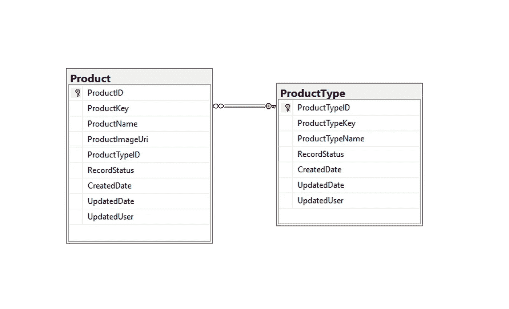

figure 1: Product and ProductType table

下面是创建表的 SQL 脚本:

首先，你应该安装 NuGet 的" **Dapper** "包。

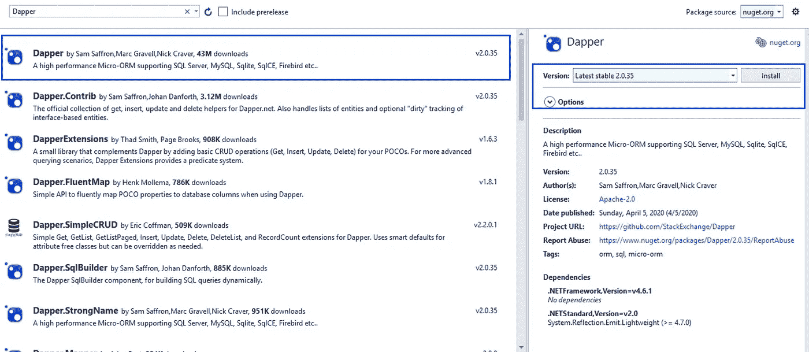

figure 2: install Dapper package from NuGet

**Dapper** 主要包括 3 个步骤:

*   **步骤 1** :用数据库的连接字符串创建一个 **IDBConnection** 对象。
*   **第二步**:编写一个查询，并将其存储在一个普通的字符串变量中。
*   **第三步**:调用 db.execute()并传递查询就完成了。

**第一步**

下面的 SQLConnectionFactory 类将设法打开您的连接字符串。

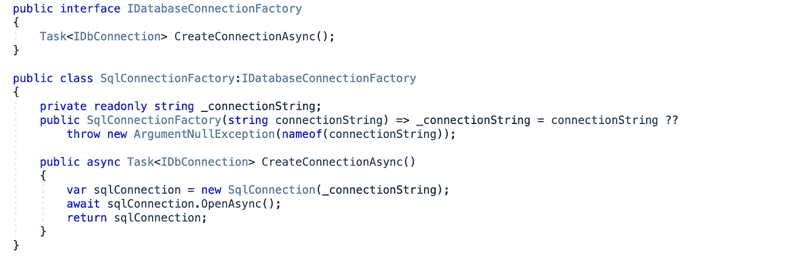

figure 2: SQLConnectionFactory class

我们还需要用您的连接名注册它来使用依赖注入。

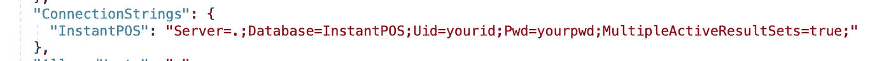

figure 3: connection string in appsettings.json


figure 4: register DI

注意:如果你不熟悉。NET Core，这个可以参考我的文章。

[](/@letienthanh0212/net-core-dependency-injection-in-asp-net-core-7fdf5e1cc200) [## [.ASP 中的依赖注入。网络核心——“老而金”

### 在本文中，我们将讨论依赖反转原则(DIP)、控制反转(IoC)和依赖…

medium.com](/@letienthanh0212/net-core-dependency-injection-in-asp-net-core-7fdf5e1cc200) 

事实上，您可以像这样打开到数据库的连接:

```
var cs = @"Server=localhost;Database=testdb;Trusted_Connection=True;";

using var con = new SqlConnection(cs);
con.Open();
```

但是在一个真实的项目中，我们永远不会那样做。因为它很难维护，还有很多重复的代码。

**第二步和第三步**

编写并执行查询

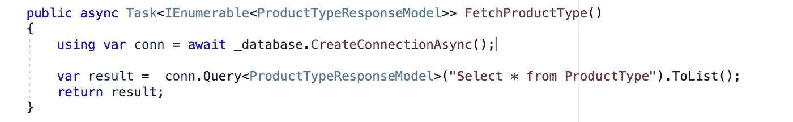

figure 5: fetch ProductType table

使用 SQL 参数编写和执行查询

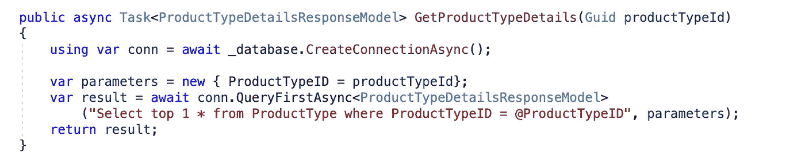

figure 6: get ProductType details with SQL Params

*注意:你必须使用 SQL 参数化来防止 SQL 注入问题。*

插入命令

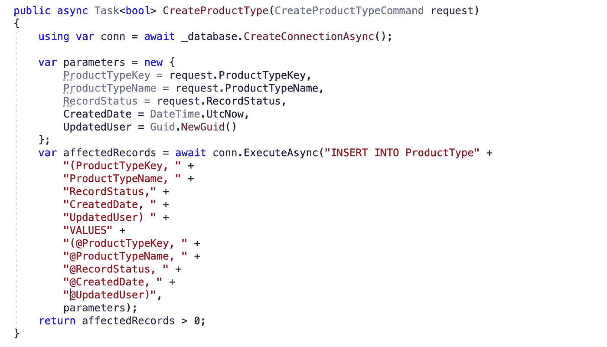

figure 7: insert ProductType table

更新命令

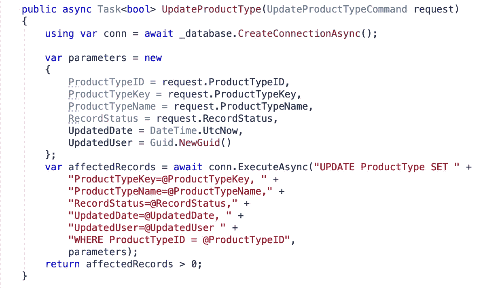

figure 8: update ProductType

删除命令

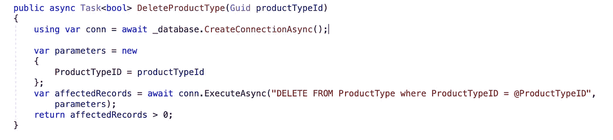

figure 9: delete ProductType by ID

执行存储过程

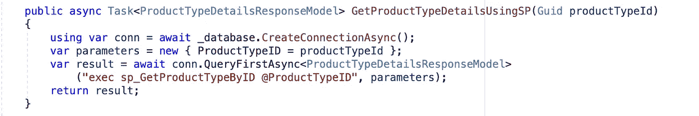

figure 9: execute Stored Procedure

或者可以使用命令类型参数来调用存储过程

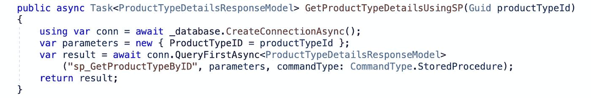

figure 9: execute Stored Procedure with command type is StoredProcedure

通过上面的例子，您可以看到，当您决定将 **Dapper** 应用到您的应用程序中时，大部分精力都用在了编写 SQL 语句上。别担心，有很多 SQL Builder 库可以帮助您节省时间。SQLKata 就是其中之一。

# 用于查询生成器的 SQLKata


Photo by [Wil Stewart](https://unsplash.com/@wilstewart3?utm_source=medium&utm_medium=referral) on [Unsplash](https://unsplash.com?utm_source=medium&utm_medium=referral)

[](https://sqlkata.com/) [## SQL data . net SQL 查询生成器

### 一个 C# var query = db 的流畅 SQL 查询生成器。查询(“书籍”)。OrderByDesc("PublishingDate")…

sqlkata.com](https://sqlkata.com/) [](https://github.com/sqlkata/querybuilder) [## sqlkata/querybuilder

### 关注@ahmadmuzavi 了解关于 SqlKata 的最新更新。SqlKata 查询生成器是一个功能强大的 Sql 查询生成器…

github.com](https://github.com/sqlkata/querybuilder) 

SqlKata 是一个优雅的 C # SQL 查询生成器，它帮助你以更高的自由度与数据库引擎对话，它允许你非常容易和快速地编写复杂的查询。

让我们更新上面的示例，将 **SQLKata** 用于查询构建器！

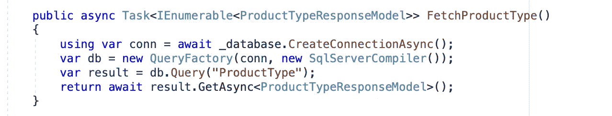

figure 10: Fetch ProductType using SQLKata

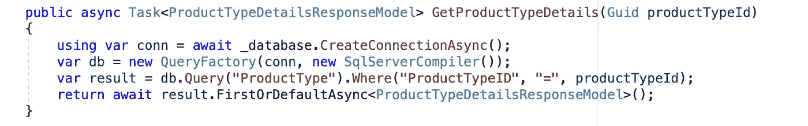

figure 11: get ProductTypeDetails using SQLKata

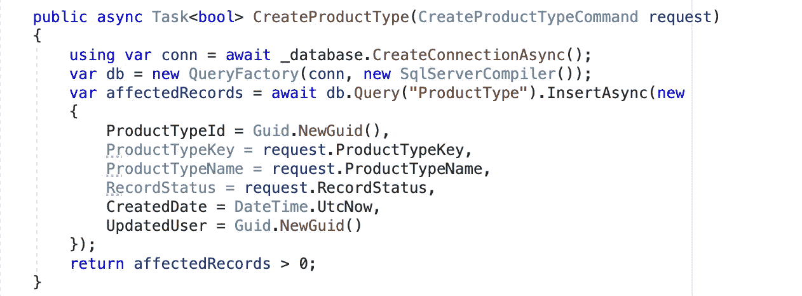

figure 12: create Product Type using SQLKata

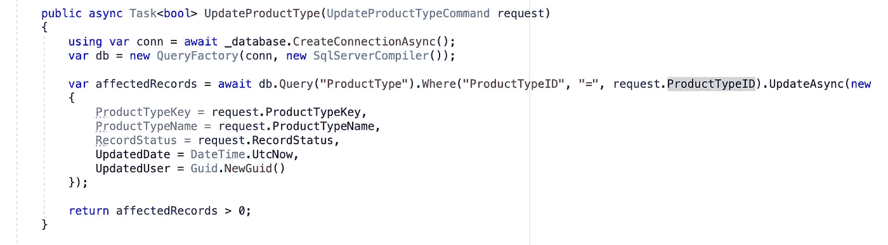

figure 13: update Product Type using SQLKata

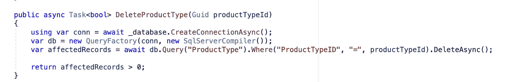

figure 14: delete Product Type using SQLKata

> 注:你可以从我的 Github 获得源代码供你参考

[](https://github.com/thanhle0212/Self-Order-System) [## thanh le 0212/自订系统

### 注意:运行 database/database_scripts.sql 创建数据库架构后端技术栈 ASP。网络核心 3.1…

github.com](https://github.com/thanhle0212/Self-Order-System) 

# 结论

所有对比都很蹩脚，仅供参考。尽管 EF 的性能不如 **Dapper** 好，但它仍然有很多好的特性，比如为你生成查询来独立地创建你的应用数据库，缓存你的数据以备将来调用，为你管理工作单元等等。

使用 **Dapper** 的主要缺点是你的代码中有赤裸裸的 SQL 查询。如果有人做了手脚，在我们对代码进行测试之前，我们不会意识到任何问题。另外，我的团队成员比 **Dapper** 更熟悉 **EF** ，因此开发时间会更快。

# **参考文献**

[](https://sqlkata.com) [## SQL data . net SQL 查询生成器

### 一个 C# var query = db 的流畅 SQL 查询生成器。查询(“书籍”)。OrderByDesc("PublishingDate")…

sqlkata.com](https://sqlkata.com) [](https://github.com/sqlkata/querybuilder) [## sqlkata/querybuilder

### 关注@ahmadmuzavi 了解关于 SqlKata 的最新更新。SqlKata 查询生成器是一个功能强大的 Sql 查询生成器…

github.com](https://github.com/sqlkata/querybuilder) [](https://en.wikipedia.org/wiki/Entity_Framework) [## 实体框架

### 实体框架(EF)是一个用于 ADO.NET 的开源对象关系映射(ORM)框架。它是。网络…

en.wikipedia.org](https://en.wikipedia.org/wiki/Entity_Framework) [](https://en.wikipedia.org/wiki/Dapper) [## 衣冠楚楚的

### Dapper 可能指的是:Musée Dapper，一家专门收藏非洲艺术的巴黎博物馆 Dapper 级炮艇，一艘皇家海军…

en.wikipedia.org](https://en.wikipedia.org/wiki/Dapper)