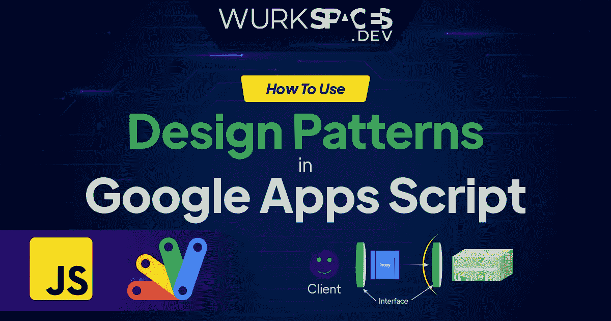

# 在 Google Apps 脚本中使用设计模式

> 原文：<https://medium.com/geekculture/using-design-patterns-in-google-apps-script-ceaa7606d2d6?source=collection_archive---------11----------------------->

# 介绍

Google Apps Script 是一种基于 JavaScript 的语言，可以访问 Gmail、Google Sheets、Google Forms、Google Drive 等 Google Workspace 特定的库。，使您能够快速高效地自动化您的任务和业务应用程序。

天然气带来了巨大的机遇。它允许构建解决方案来帮助…