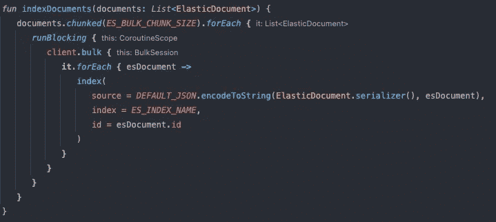
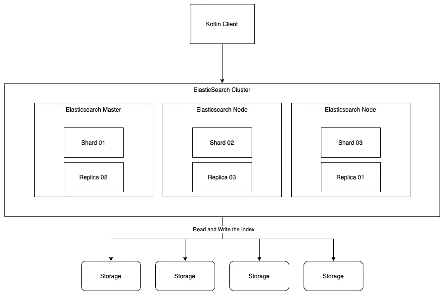

# 通过 Kotlin 使用 Elasticsearch

> 原文：<https://medium.com/geekculture/using-elasticsearch-with-kotlin-f802a738b389?source=collection_archive---------2----------------------->

Indexing Elastic Documents with Kotlin

上周，我不得不在我的网站上添加搜索功能。已经有了某种搜索机制，但它只能根据标题而不是内容列出文件。由于内容是这些文件中最重要的部分，我需要找到动态搜索文件内容的方法，而不必处理性能问题。那正是我偶然发现 Elasticsearch 的地方。

# 什么是 Elasticsearch？

据橡皮筋自己的[网站](https://www.elastic.co/de/what-is/elasticsearch) …

> Elasticsearch 是**一个分布式、免费和开放的搜索和分析引擎，适用于所有类型的数据，包括文本、数字、地理空间、结构化和非结构化数据**。Elasticsearch 建立在 Apache Lucene 之上，由 Elasticsearch N.V .(现名为 Elastic)于 2010 年首次发布

这意味着您可以搜索几乎任何以字符形式存储的数据，只要您将其映射到正确的基本格式。

# Elasticsearch 如何工作

Elasticsearch 从不同的位置获取数据，根据用户指定的映射(也可以从数据中自动获得)存储和索引数据，并使其可搜索。它的分布式架构使得近实时搜索和分析海量数据成为可能。

弹性搜索的主要好处是速度快。通常，当你手动过滤你的内容时，要花很长时间才能找到相应的文档。使用 Elasticsearch，搜索需要的时间大大减少，因为它以 JSON 格式进行了巧妙的存储和索引。

Elasticsearch 使用分片，在集群中分发数据。碎片是组织集群数据的单位。每个索引可以由至少一个到多个碎片组成。当磁盘突然停止工作时，群集的其他节点上有副本来恢复数据。

# 如何使用 Elasticsearch

Elasticsearch 提供了许多与其 API 交互的可能性。一方面有标准的 REST API，另一方面有很多不同的 [API 客户端](https://www.elastic.co/guide/en/elasticsearch/client/index.html)可供每一种主流编程语言使用。显然有一个用于 java 的，我们也可以在 Kotlin 中使用，但是这个客户端需要很多第三方依赖才能工作。这些依赖关系中的大多数在标准的 Kotlin 项目中并不常见，通常会被它们的 Kotlin 替代方案所取代。您可以更改所使用的依赖项，但是这会使项目变得不必要的复杂。

好消息是，在 Github 上有一个很棒的社区支持的 Kotlin 客户端。这个客户端依赖于标准的 Kotlin 库，这些库不会干扰项目的其他部分。

## 创建客户端

首先，我们需要在 build.gradle.kts 文件中声明依赖关系。

之后，我们可以像这样创建我们的客户端:

## 索引文档

接下来要做的是创建一个数据类，它将用于将数据作为 JSON 上传到 Elasticsearch 的索引中。

但首先，我们需要知道什么是指数。根据弹性网站:

> 索引就像关系数据库中的“数据库”。它有一个定义多种类型的映射。
> 索引是一个逻辑名称空间，它映射到一个或多个主分片，并且可以有零个或多个副本分片。

好的。所以这个定义中有两个概念。首先，索引是某种类型的数据组织机制，允许用户以某种方式划分数据。第二个概念与副本和碎片有关，这是 Elasticsearch 用来在集群中分发数据的机制。

如您所见，索引函数将一组 ElasticDocuments(可以是任何数据类)作为参数，并遍历它们。我将这个列表分成了几个小块，因为在一个批量请求中可以索引的文档数量是有限制的。“ES_BULK_CHUNK_SIZE”的确切值只能通过试验和关注性能来定义。

之后，我调用客户端的`bulk`方法并索引我的 ElasticDocument。这里重要的是要知道，您可以使用 kt-search 提供的 DEFAULT_JSON，而不需要创建自己的 JSON 映射器。每个文档都需要一个 ID。这就是为什么我们将 esDocument-id 设置为资源的 id。另一件要注意的事情是，您总是需要定义保存文档的索引的名称。

## 在索引中搜索

Elasticsearch 最重要的部分就是搜索本身。Elasticsearch 提供了许多可能的搜索过滤器组合，但我将只查看我在项目中使用的那个。

这个函数只返回包含我们提供的部分标题和版本的文档。在这种情况下是“一些标题”和“v1.2.3”。

您可以通过提供 query 属性并配置不同的值来配置此搜索查询的模糊性。

如果您想用查询精确匹配值，您可以使用`term`匹配器。这个匹配器直接比较给定值和索引，并返回结果。它不使用任何类型的模糊匹配，因此非常适合根据识别属性删除文档。

您可以通过添加其他关键字(如`should`)或添加更多参数来增加复杂性。[这里的](https://www.elastic.co/guide/en/elasticsearch/reference/current/query-dsl.html)列出了使用 ElasticSearch query-DSL 的可能性。

如果你想看到更多伟大的例子，看看这个[博客](https://coralogix.com/blog/42-elasticsearch-query-examples-hands-on-tutorial/)。

调用结束时的`.ids`函数只返回找到的搜索结果的 id。如果需要整个对象，需要调用`.hit.hit.source.toString`，它会以 JSON 字符串的形式返回对象。

# 反射

## 什么进展顺利

我认为，在我弄清楚使用哪个插件之后，搜索的实际实现工作得相当好，并且是不言自明的。

## 什么需要改进

我浪费了太多时间尝试使用 Java 客户端，而不是为我的问题寻找更合适的解决方案。下一个问题是我如何测试它。首先，我只能通过运行本地 Docker 容器来手动测试它，这无论如何都不是最佳的。在我向我的团队询问任何更好的解决方案之后，我开始使用 [Testcontainers](https://www.testcontainers.org/) 进行我的集成测试。通过这些测试，我的代码变得更加可靠，我终于能够为我的项目编写一些高级逻辑了。