# 用集合方法预测房价和建筑类型

> 原文：<https://medium.com/geekculture/using-ensemble-methods-to-predict-housing-prices-and-building-type-8ad17e40503f?source=collection_archive---------47----------------------->

Lambda 学校第二单元组合项目

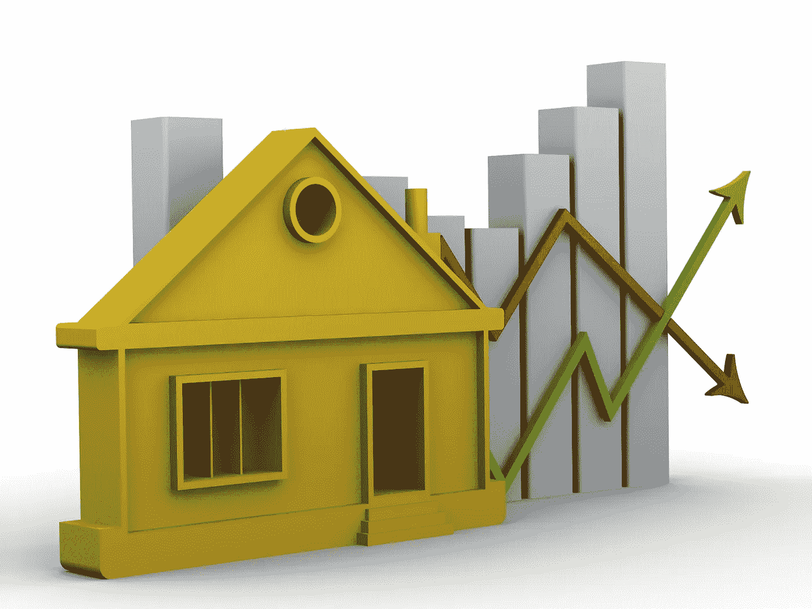

# **预测房价和**建筑类型

你有没有想过你的房子是否物有所值？你曾经尝试过预测当前或未来投资的住房市场吗？这是许多人试图做的事情，但很少有人成功。

在过去的四周里，我一直在研究机器学习。机器学习是一种自动建立分析模型的数据分析方法。它是人工智能的一个分支，基于这样一种想法，即系统可以从数据中学习，识别模式并在最少的人工干预下做出决策。我的计划是使用监督学习方法来预测房价和房屋类型。

这个月我深入研究了集成方法，这些技术创建多个模型，然后将它们组合起来以产生改进的结果。集成方法的一些例子是随机森林和梯度推进。现在是时候利用我的新知识，把我的计划付诸行动了！

# 数据

我能够从 Kaggle 获得超过 500 万份俄罗斯房屋清单的数据。数据集的列中列出了日期、时间、纬度、经度、地区、建筑类型、对象类型、楼层、房间、面积、厨房面积和价格。这个大型数据集没有任何缺失值，但肯定有异常值。这些数据是从 2018 年至 2021 年俄罗斯的房地产搜索服务中解析出来的。俄罗斯房地产市场几年来一直处于增长阶段，这意味着你仍然可以找到价格非常有吸引力的房产，但未来增值的机会很大。下面是 columns 键。

# 数据争论

在查看了我们的列和列键之后，是时候加载我们的数据了。数据加载后，我用 pandas-profiling 进行了一次自动化的探索性数据分析。

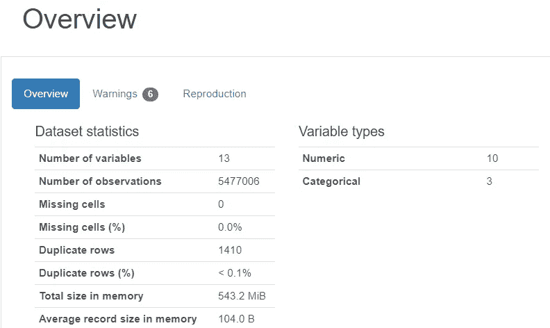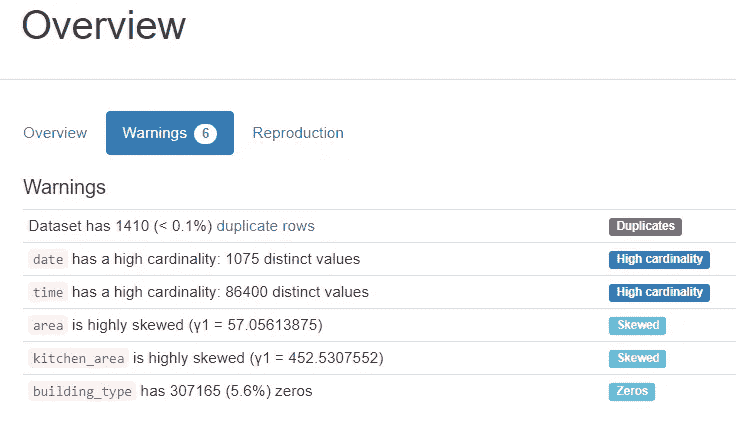

profile 报告让我对我的数据以及需要对它做什么有了很好的了解。首先，对于超过 5，000，000 个观察值，数据修整是使用我的模型所必须的。接下来，我注意到我不需要时间列，因为日期列是我可以用于索引的。我还注意到我的数据集中有重复的数据要删除。知道需要做什么后，我开始写代码。

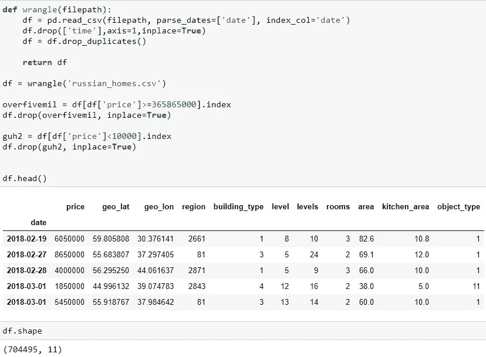

在解决了上述所有问题后，我的新数据集有 704，495 行和 11 列。现在是时候建立我们的模型和使用我们的数据了！

# 这是什么类型的问题？

既然我们的数据已经准备好了，我们首先要问的是我们要解决什么样的问题，分类还是回归？房价是一个回归问题，意味着我们试图预测连续数量的产出。建筑类型是一个分类问题，这意味着我们试图预测离散类别标签 0-5 的输出，在我们的情况下，这是一个多类别分类问题。

# 建立基线

在将数据帧分割成目标向量和特征矩阵之后，我们为每个问题建立基线。这条基线是我们用来比较模型的。在我们的建筑类型问题中，我们得到了基线的准确性分数。准确性是我们的模型预测正确的部分，这意味着我们想要尽可能高的准确性。另一方面，我们得到了价格预测问题的基线 MAE。平均绝对误差( **MAE** )是表达同一现象的成对观察值之间误差的度量，意味着我们希望 MAE 尽可能低。最后，我们将查看价格预测的 R 评估指标。R-squared 是一种统计度量，表示回归模型中由自变量或变量解释的因变量方差的比例。这是一个 0-1 的指标，我们需要高分。

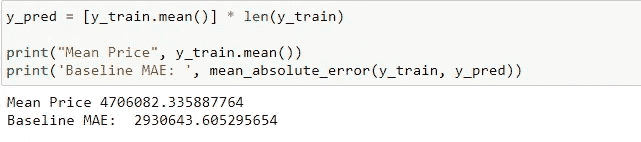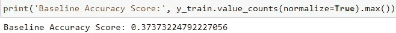

# 装袋和增压

两种最流行的集合方法是打包和提升。在这个项目中，我将使用它们来为每个问题找到最佳模型。当目标是减少决策树分类器的方差时，使用 Bagging。这里的目标是从随机选择的训练样本中创建几个数据子集。子集数据的每个集合被用来训练他们的决策树。结果，我们得到了不同模型的集合。使用来自不同树的所有预测的平均值，这比单个决策树分类器更健壮。随机森林就是一个装袋模型的例子。

增强用于创建预测器的集合。在这种技术中，学习者是顺序学习的，早期的学习者将简单的模型与数据拟合，然后分析数据的错误。连续的树(随机样本)是合适的，并且在每一步，目标是从先前的树提高准确性。当一个输入被一个假设错误分类时，它的权重会增加，以便下一个假设更有可能将其正确分类。这个过程将弱学习者转换成表现更好的模型，并且通常是更准确的模型。XGBoost 就是一个增强模型的例子。

# 制作模型

对于价格预测的任务，我决定运行多个模型并比较它们的得分。我用了线性回归，岭回归，随机森林回归，xgb 回归。运行我的模型后，我得到了下面的分数，显示了随机森林回归和 xgb 回归远远优于线性和岭回归方法。在这些模型中，我们还可以看到我们的 MAE 从原始基线得分显著下降。

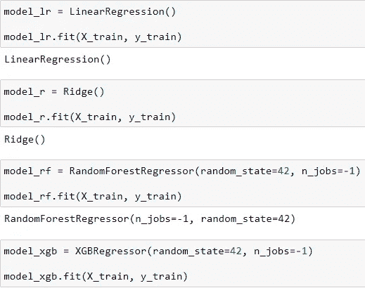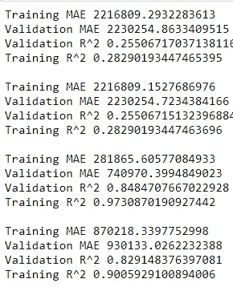

然后，我切换到我的另一个预测建筑类型的任务，运行我的随机森林分类器和 XGBclassifier 模型。

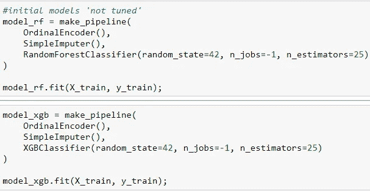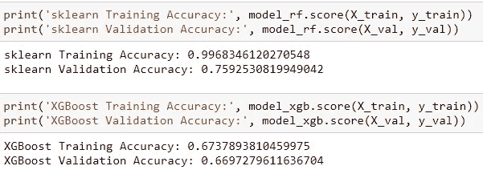

如您所见，两个模型的准确度分数都显著高于我们的基线 0.37。现在你可能认为随机森林模型是更好的选择，但是你错了。随机森林模型确实具有更高的验证精度，但是由于训练精度为 0.99，我们可以看出该模型过度拟合了。过度拟合是指模型对训练数据建模得太好。当模型学习训练数据中的细节和噪声达到对新数据的模型性能产生负面影响的程度时，就会发生过度拟合。

# **模型调整**

针对每个问题建立并运行模型后，是时候选择最好的模型并对其进行调优了。调整是在不过度拟合或产生过高方差的情况下最大化模型性能的过程。这是通过选择适当的超参数并测试它们来实现的。对于我们的价格预测问题，我们看到随机森林和 XGB 模型效果最好，但随机森林过度拟合。我决定对 XGB 模型进行调优，以获得可能的最佳指标。

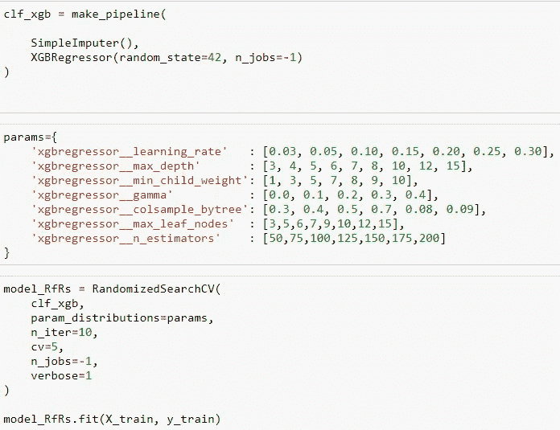

运行随机搜索 cv 后，我能够找到最佳的超参数来使用。在调整 XGB 模型超参数并运行它之后，与我们之前的分数和基线相比，我们获得了一些惊人的评估指标。

现在回到我们的建筑类型问题。如前所述，随机森林模型过拟合，所以我决定为这个多类分类问题调整 XGB 模型。

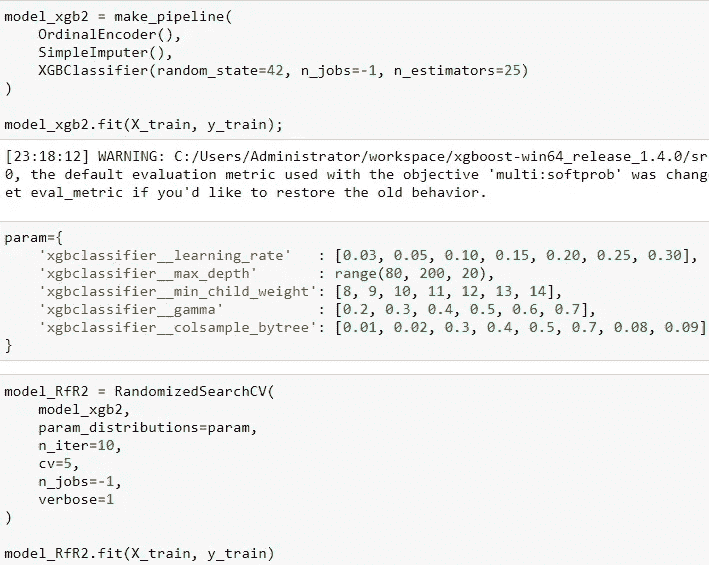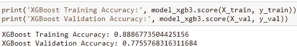

就像以前一样，我使用随机搜索 cv 来找到最佳超参数，并将它们插入我们的模型中。我们再次取得了迄今为止最好的成绩。

# **排列重要性**

现在我们已经针对每个问题调整并运行了模型，让我们看看每个模型的排列重要性。置换特征重要性被定义为当单个特征值被随机打乱时模型得分的减少。该过程打破了特征和目标之间的关系，因此模型分数的下降指示了模型对特征的依赖程度。左边是排列特征对我们的价格预测的重要性，右边是我们的建筑类型。

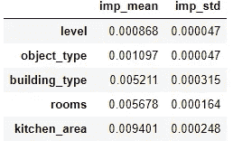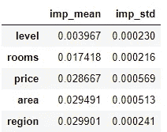

# 最重要的功能

下面是预测我们两个问题的最重要的特征列表。左边是我们的价格预测问题的最重要特征，右边是我们的建筑类型预测问题。

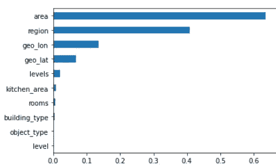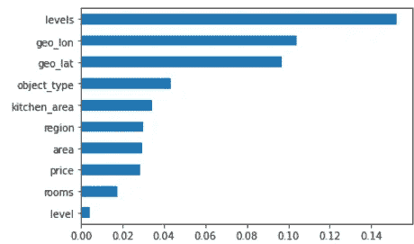

# 分类报告

顾名思义，分类报告仅针对分类问题，以下是针对我们的建筑类型问题的报告。简单来说，0-5 代表我们不同的建筑类型。精确度告诉我们有多少比例的肯定识别实际上是正确的。而回忆告诉我们正确识别实际阳性的比例。F1 分数结合了精确度和召回率。相对于特定的正面类别，F1 分数可以被解释为精确度和召回率的加权平均值，其中 F1 分数在 1 处达到其最佳值，在 0 处达到其最差值。

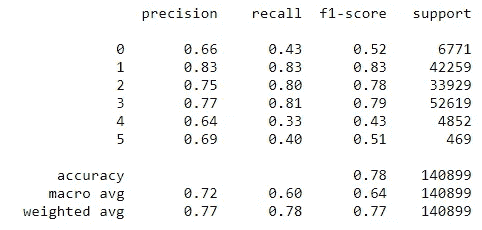

# 混淆矩阵

最后，我们来到了我们的最后一个度量——混淆矩阵。这是另一个矩阵，只处理分类问题，所以这代表了我们的建筑类型问题。在查看了这个混淆矩阵后，我们可以看到我们的模型在预测建筑类型方面表现良好，大多数建筑类型是 1、2 和 3。

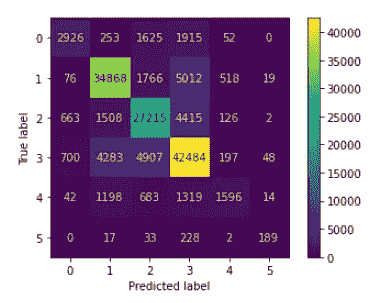

# 结论

总之，过去的四周太棒了，我学到了很多关于机器学习和预测模型的知识。虽然最终产品可能看起来不错，但我在这个项目中遇到了很多小问题。这些问题帮助我学习并获得了对机器学习世界的宝贵见解。学习并拥有预测房价和建筑类型的能力是我拥有的最接近超能力的东西。这个项目除了让我对机器学习和人工智能感到兴奋之外，什么也没做。我希望把这种热情带到接下来的几个月，继续喂饱我的好奇心！