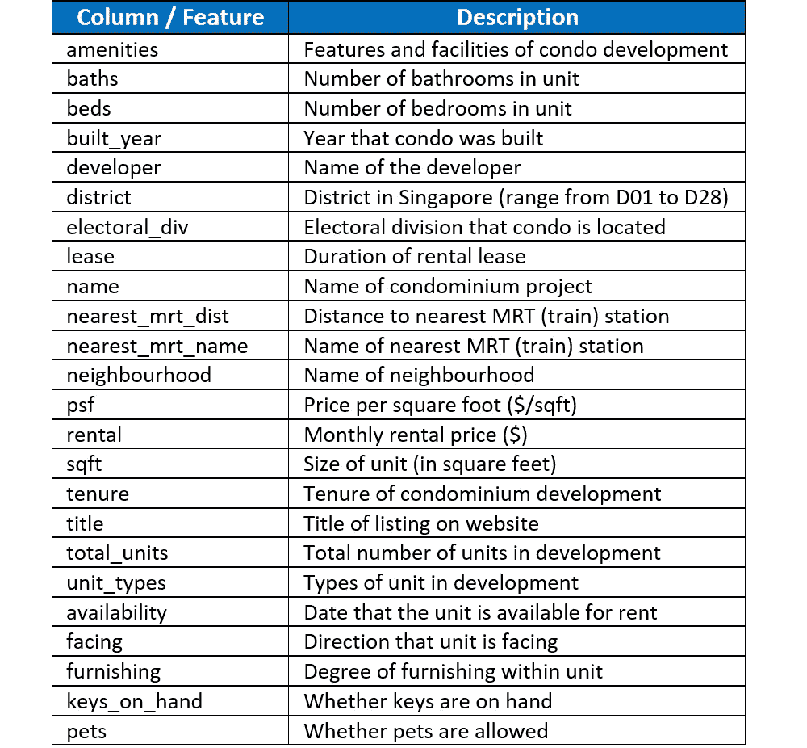
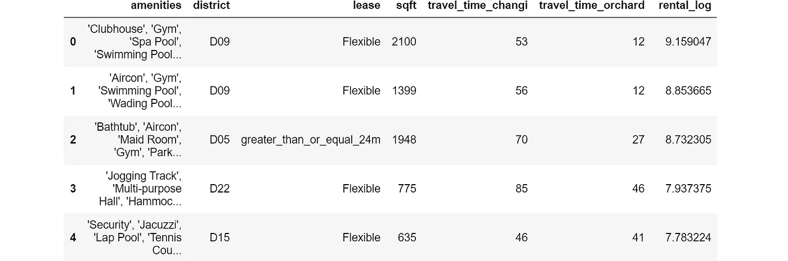
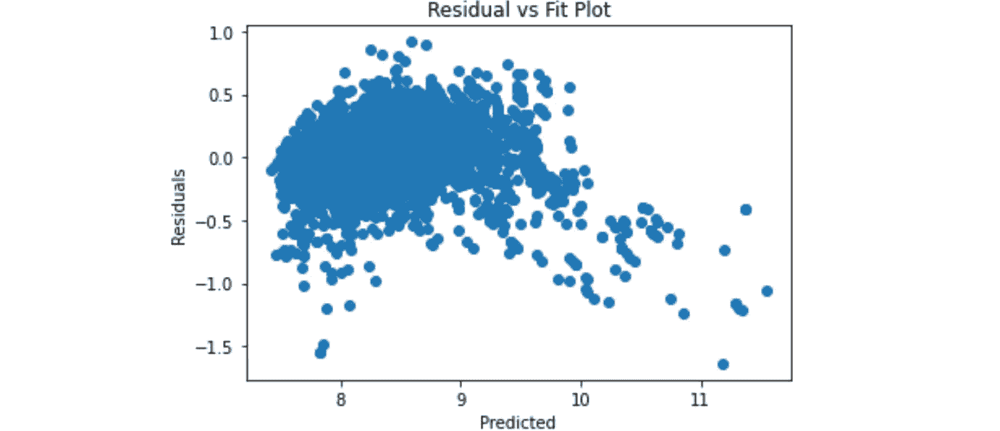
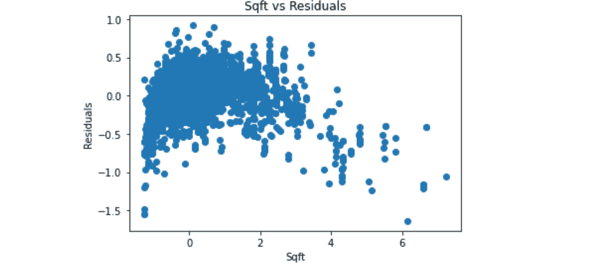
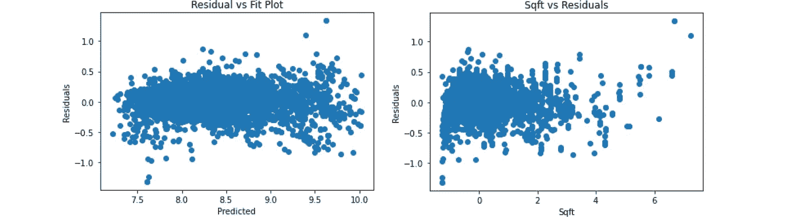
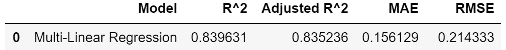
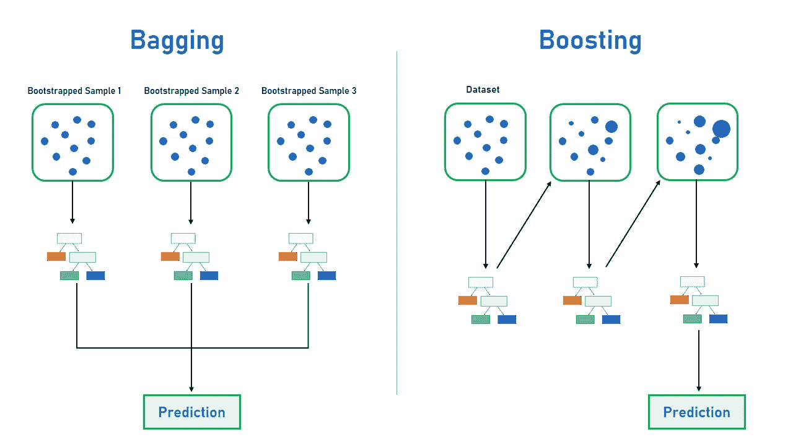
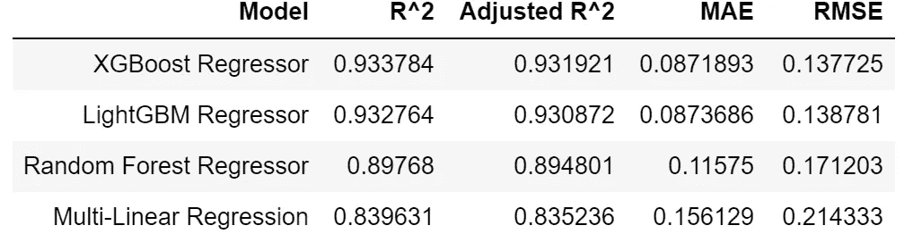
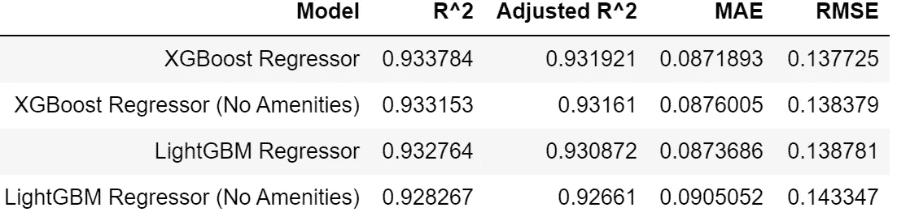
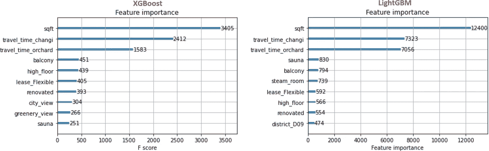

# 用集合回归预测公寓租金

> 原文：<https://medium.com/geekculture/using-ensemble-regressors-to-predict-condo-rental-prices-47eb7c3d5cd9?source=collection_archive---------4----------------------->

## Python 中集成学习和多元线性回归在公寓租金预测中的应用

Photo by [Burak Ceviz](https://unsplash.com/@burakcev?utm_source=unsplash&utm_medium=referral&utm_content=creditCopyText) on [Unsplash](https://unsplash.com/?utm_source=unsplash&utm_medium=referral&utm_content=creditCopyText)

这是新加坡公寓租赁市场分析系列文章的第二部分。另外请查看 [*第 1 部分(数据采集& EDA in Python)*](/swlh/web-scrapping-and-data-analysis-of-condominium-rental-market-in-singapore-da5265c71d19) *。*

# 简介和动机

如第一部分所述，我热衷于考察新加坡的公寓租赁市场，这是一个相对开发不足的市场。

完成数据采集和探索性数据分析后，是时候对数据集进行一些预测了。本文探讨了集成学习模型(Random Forest、XGBoost 和 LightGBM)和多元线性回归在预测公寓租金价格中的应用。

# 预测前的数据预处理

概括地说，我们的数据集包括 2020 年 12 月提取的 **7，317 套公寓房源**。

Description of condominium rental listing attributes

以新加坡元( ***租金*** )为单位的月租价就是我们要预测的。因为租金价格的分布是右偏的，所以应用了**对数变换**使其近似符合正态性(从而创建了**新因变量** ***【出租 _ 对数】*** )。

为了准备预测建模，我们在前面(第 1 部分)执行的数据清理的基础上，增加了两个预处理步骤:

## 1)删除列

*   缺失值≥40%的已删除特征，例如 ***、朝向、可用性、建造年份、楼层、最近距离*** 。
*   ***electoral _ div***中的值不平衡(仅*丹戎巴葛*分区就有约 44%)，而 ***邻域*** 有约 21%的数据缺失。因此， ***区*** 反而被选为位置指示符。
*   处理了共线性问题，例如，删除了 ***床*** 并保留了 ***平方英尺*** ，因为这两个特征高度相关。同样，我把 ***psf*** (与 ***出租*** )和 ***旅行 _ 时间 _ 来福士*** (与 ***旅行 _ 时间 _ 果园*** 相关)。
*   删除了不太可能对价格预测产生影响的特征，例如:公寓 ***名称*** 、 ***开发商*** 名称 ***、房源标题*** 、 ***使用权、总单元数、单元类型*** 。

First 5 rows of DataFrame after pre-processing steps above

## 2)创造有趣的娱乐

新奇的是对各种娱乐设施的探索。我的假设是，只有某些便利设施对租赁价格有影响，这是我重点关注的 7 个便利设施:*阳台、高层、翻新、城市景观、绿色景观、蒸汽浴室、桑拿浴室。*

***便利设施*** 栏中的每个值都是每个列表的便利设施列表。然后，这些列表被争论，以便只保留上面确定的选定的娱乐设施。之后，在建模之前，这些设施类型被相应地一次性编码。

# 基线模型—多元线性回归(MLR)

在进入高级方法之前，让我们不要放弃我们古老而可靠的线性回归。运行 MLR 为我们提供了一个基线模型来测试后续模型的性能。

MLR 附带[许多假设](http://people.duke.edu/~rnau/testing.htm)需要检查。在对自变量的**正态性、同方差性、独立性、**和**线性度进行 4 次假设检查后，在残差图中发现了一个问题。同方差检验(又名等方差)中的残差与拟合散点图揭示了一种非线性(曲线)模式:**

*   在进一步的研究中，还观察到了 ***sqft*** 和残差之间类似的非线性模式:

为了克服这一点，在模型中引入了二次项( ***sqrt*** )。这样，事情得到了很大的改善，因为残差图中的点现在是对称分布的，没有任何明显的非线性模式(即**同质性检查**被清除)。

Improved residual plots after polynomial term (***sqft²***) was introduced

以下是基线 MLR 模型的性能指标(在测试集上):

# 集成学习

**集成学习**是指将来自多个模型的预测进行组合，以提高整体性能的方法。特别是最流行的两种合奏方法是**装袋**和**助推**。

*   **装袋**是 **b** 绑带 **agg** 收卷的简称。bagging 背后的直觉是，我们首先生成(替换)训练数据集的大量随机样本(这是**引导**)。从那里，我们在每个样本上训练一个模型(通常是一个决策树)。所有的训练都是并行进行的，这些单独模型的结果使用平均或多数投票进行组合(这是**聚合**)。
*   **Boosting** 基于训练模型依次迭代。这样，每个单独的模型都能够通过从先前模型产生的误差(或残差)中学习来改进。

Illustration of Bagging and Boosting | Image by author

记住这一点，让我们继续进行 3 个集合模型:**随机森林**(装袋) **XGBoost** (梯度增强)和 **LightGBM** (梯度增强)。

*注意:这里的目标是提供一种集成学习的味道。因此，我并没有追求激进的超参数调优来试图获得模型性能的最大小数点改进。*

# 模型 1——随机森林回归量

随机森林是一种集成算法，使用 **bagging** 作为集成方法，使用**决策树**作为个体模型。GridSearchCV(具有 5 重交叉验证)被用于找到给出最佳训练性能的超参数。Python 实现如下所示:

# 模型 2 — XGBoost 回归器

XGBoost 代表 e**X**treme**G**radient**Boost**ing，它也是另一个基于决策树的集成模型。它采用了**梯度提升**算法，这是一种使用梯度下降来最小化顺序添加的每个模型中的损失(即观察值和预测值之间的差异)的技术。在训练期间，它迭代地添加新的树，这些树与先前的树相结合，以做出最终的预测。

# 模型 3 — LightGBM 回归器

LightGBM 代表 Light**G**radient**B**oosting**M**machine，也是一个包含**梯度提升**框架的集成模型，该框架使用基于树的学习算法。它之所以“轻”，是因为它速度快，是为分布式训练设计的。其速度背后的一个关键因素是它使用基于直方图的算法，该算法将连续的特征值存储到离散的箱中。这加快了训练速度，减少了内存使用。

# 评估和比较模型

现在，我们已经在测试数据集上运行了所有模型，并获得了性能指标，我们可以开始比较它们了:

从上面的指标来看(重点是**均方根误差**)， **XGBoost** 拔得头筹(RMSE **0.1377** )，而 **LightGBM** 紧随其后(RMSE **0.1387** )。LightGBM 的优势在于它能够比 XGBoost 更快地完成训练。

这些指标表明，我们的模型总体表现良好，我们的集成方法明显优于我们的基线 MLR 模型(RMSE 0.2143)。

# 便利设施重要吗？

我一开始的假设是，可用设施的类型会影响公寓的租金。深入研究后，两个表现最好的模型(XGBoost 和 LightGBM)在一个截断的数据集上进行训练，该数据集**排除了**所有与娱乐设施相关的功能。下表比较了这些新型号与原始型号的性能:

似乎在数据集中包含舒适性类型(作为一次性编码的要素)确实有助于(尽管只是一点点)提高两个 XGBoost 的 RMSE(从 0。 **1383** 为 0。 **1377** )和 LightGBM(从 0。 **1433** 为 0。 **1387** )。与 XGBoost 相比，这种影响对于 LightGBM 来说更加明显。

鉴于并非所有的便利设施都被准确地捕捉并张贴在网站列表上，上述解释更多的是探索性的，而不是权威性的。

# 特征重要性

XGBoost 和 LightGBM 模型可以很容易地产生特征重要性分数，这表明每个特征在模型内的增强决策树的构造中有多有用。在决策树中，某个特性被用于做出关键决策的频率越高，它的重要性得分就越高。

对于 XGBoost 和 LightGBM，我们可以使用`plot_importance`函数来可视化特性的重要性。以下是这两种型号的 10 大特点:

我们可以看到，对于**的两个**集合模型来说，**单位面积(*平方英尺* )** **是目前预测租金价格最重要的因素。**紧随其后的是**前往樟宜机场(新加坡国际机场)和乌节路(新加坡购物和旅游区的中心，恰好位于该国的核心中心区域)等关键地点的旅行时间**。

# 结论

在本文中，我分享了多元线性回归和集成学习回归(Random Forest、XGBoost 和 LightGBM)的概念和实现，以预测公寓租金价格。

向前看，如果还可以获得**纬度-经度(lat-long)坐标**的数据，这将是非常有益的，因为它可以帮助我们确定不同出行方式到不同地点的出行时间，以及为我们提供到最近(MRT)火车站( ***nearest_mrt_dist*** )的距离特征的完整信息。这是因为，到火车站的距离越短，租赁价格越贵，因此，将这一特征纳入我们的模型是非常有用的。

最后，请在 [Github repo](https://github.com/kennethleungty/Singapore-Condo-Rental-Market-Analysis) 中查看该项目的代码，我也期待通过 [LinkedIn](https://linkedin.com/in/kennethleungty) 与您联系。一如既往，欢迎所有反馈！