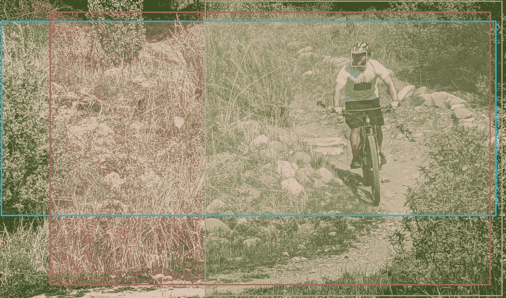

# 使用面部识别创建健康热点

> 原文：<https://medium.com/geekculture/using-facial-recognition-to-create-sanity-hotspots-a8eca85354b0?source=collection_archive---------38----------------------->

## 在本指南中，我们将使用 AWS Rekognition 在 Sanity.io 映像中寻找一个面孔，以便更好地为用户提供资产

所以，你已经用一个正方形的方面图像建立了你的理智模型…但是等等！现在，设计师们想要另一个 16:9 的图像剪辑。同时，在…上添加另一个图像域可能很有吸引力