# 在你的 Flutter 应用中使用 Firebase |设置一切

> 原文：<https://medium.com/geekculture/using-firebase-in-your-flutter-apps-setting-up-everything-ec61b2dba8fa?source=collection_archive---------30----------------------->

在你的 flutter 应用中集成 firebase 的指南


Credits: Myself

在这一系列文章中，我将帮助您将 firebase 集成到您的 flutter 应用程序中，使其可以投入生产。

在这一部分，我们将设置新的 flutter 项目，并将其连接到 firebase 项目，为 android 和 iOS 设置一切。

## 添加依赖项

让我们从将 firebase 依赖项添加到 pubspec.yaml 文件开始。向下滚动到依赖项部分。

**注意**:将这些添加到“依赖项”部分，而不是“开发依赖项”。在此了解不同之处。

```
firebase_core: "^1.2.1"
firebase_analytics: "^8.1.1"
```

第一个依赖项是核心 firebase 依赖项，我也包括了分析依赖项，因为如果您计划将此应用程序发布到应用程序商店，使用分析非常重要。这不仅给出了一些关于你的用户群的漂亮的图表，还提供了你的用户如何使用你的应用的信息。

啊！此外，添加 crashylitics 依赖，帮助您找到并修复应用程序中的错误。

```
firebase_crashlytics: "^2.0.5"
```

现在，您已经添加了 firebase 依赖项，我们需要在项目中同步这些依赖项。

*   使用 vs 代码中的终端执行“flutter pub get”。
*   如果您安装了 dart 扩展，请打开命令调色板(Command/Ctrl + shift + p)并搜索“Dart: Get Packages”。

这两者做同样的事情，你可以选择任何你觉得舒服的。

## 设置 Firebase 项目

现在，让我们来看看后端。登录到您的 firebase 控制台，创建一个全新的项目。

现在，让我们在您的项目中创建新的 iOS 应用程序。

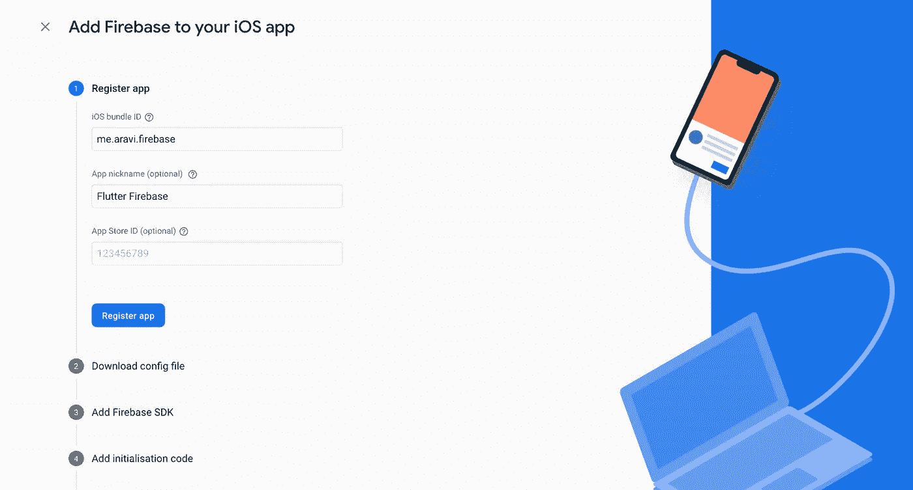

Creating an iOS app in firebase

你需要确保选择一个有意义的名称作为包名，因为这不是你以后可以轻易更改的，尤其是如果你已经将你的应用程序部署到商店。

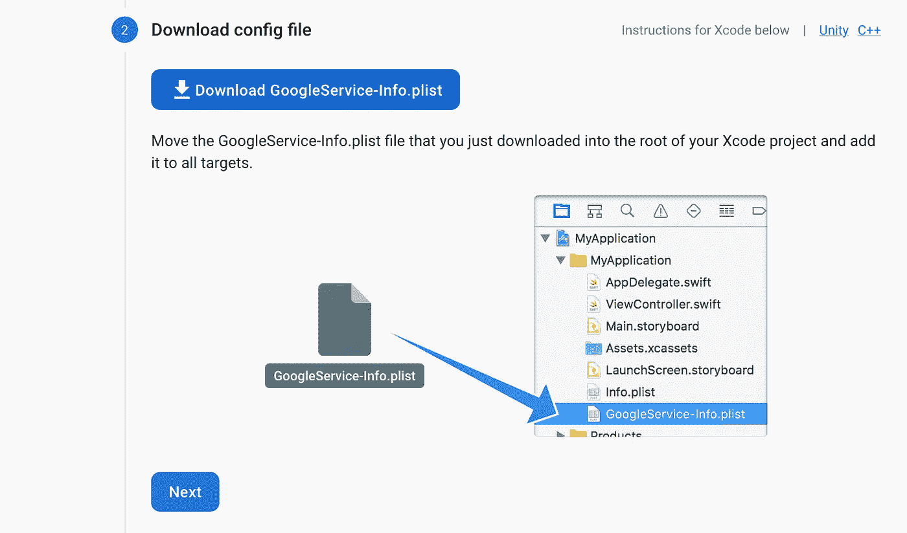

Downloading the plist file

现在，下载 plist 文件并保存在一个需要时可以找到的地方。

同样，在 firebase 项目中创建一个 android 应用程序引用。

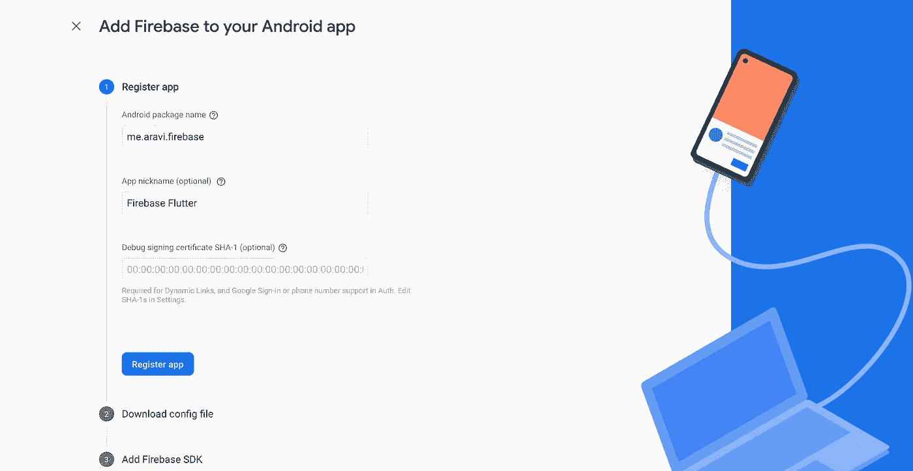

Android app setup

现在，如果你想使用 firebase 提供的谷歌认证电话认证。您需要将 SHA-1 证书添加到您的控制台。

阅读官方文档在这里创建它

获取调试应用程序时可能要使用的调试证书。你可以看看我写的一篇文章:

[](https://www.370codes.com/flutter/2021/06/17/debug-certificates-in-flutter.html) [## 在一个 Flutter 项目中获得 Android 调试证书

### 这是一个关于获取调试证书的简短指南，你可能需要它来设置你的 android 应用程序…

www.370codes.com](https://www.370codes.com/flutter/2021/06/17/debug-certificates-in-flutter.html) 

获得证书后，只需将其粘贴到控制台，然后单击继续。

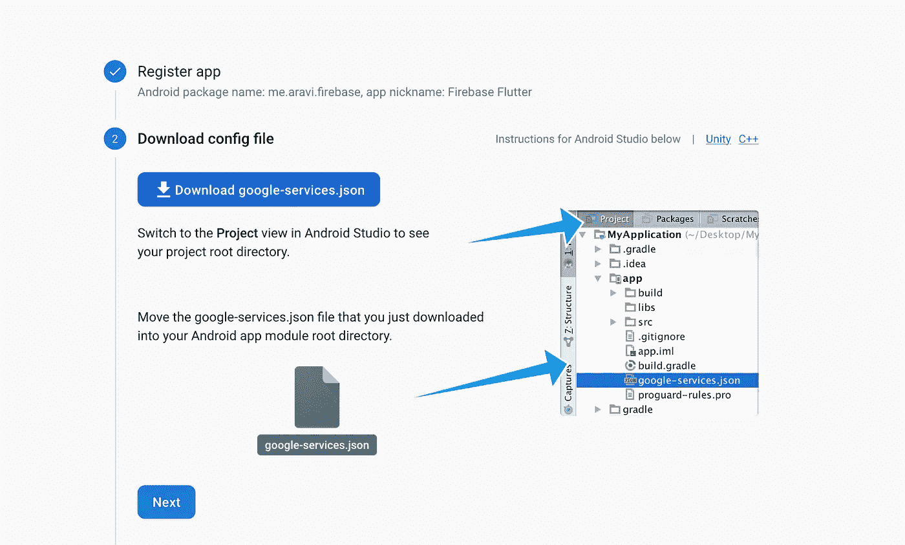

GoogleServices.json

下载 google-services.json 并把它放在一个容易找到的地方，我们在路上会用到它。

## 在 Xcode 中设置 iOS 项目

首先在 xcode 中打开您的项目/ios。

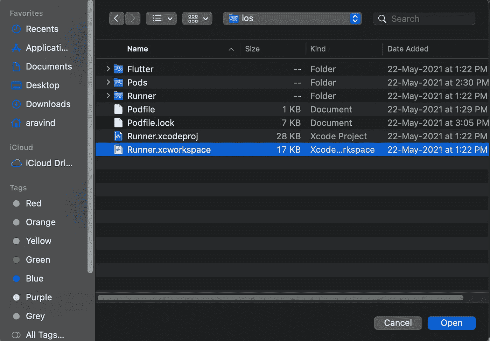

Flutter app in Xcode

一旦你打开它，xcode 处理项目。在文件面板中选择 Runner，您应该会看到类似这样的内容

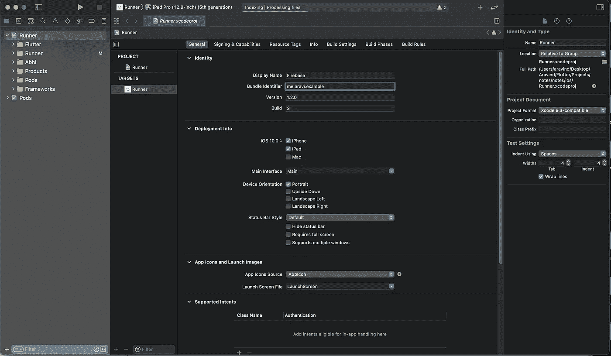

Here you can change your bundle id in Xcode

确保您使用的捆绑包 id 与您在 firebase 控制台中使用的相同，并为您的应用程序添加名称。

然后将 GoogleServices-Info.plist 文件添加到应用程序的 Runner 文件夹中:

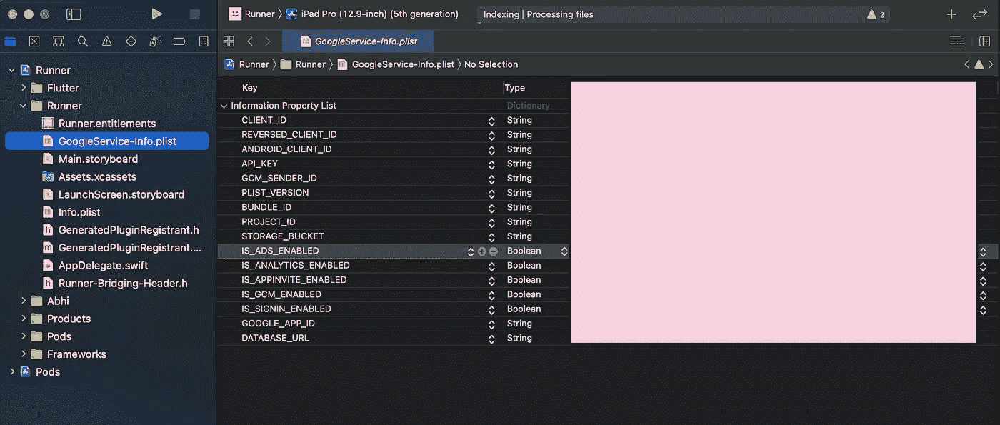

这就是 iOS 应用程序，现在您可以从 Xcode 或 flutter run 在 iOS 模拟器或物理设备上成功构建和运行您的应用程序。

## 设置 Android 应用程序

与 iOS 设置不同，这有点复杂。首先，将您之前下载的 google-services.json 添加到 android/app 文件夹中。

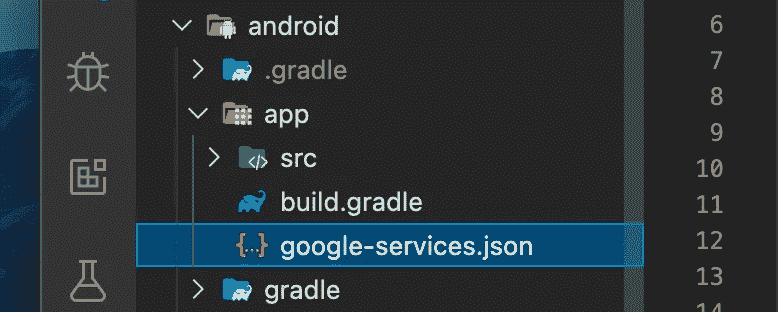

google-service.json

现在导航到位于 android/build.gradle 的项目级 build.gradle 文件。

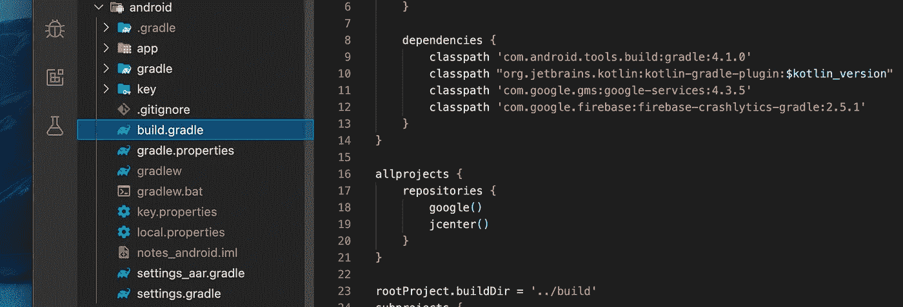

Project level build.gradle

并将以下依赖项添加到文件的依赖项部分:

```
classpath 'com.google.gms:google-services:4.3.5'
classpath 'com.google.firebase:firebase-crashlytics-gradle:2.5.1'
```

然后导航到位于“android/app/build.gradle”中的应用级 build.gradle 文件。

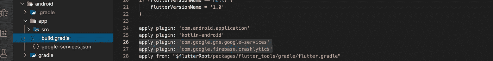

app-level build.gradle

将这些插件添加到 android 标签上方的部分:

```
apply plugin: 'com.google.gms.google-services'apply plugin: 'com.google.firebase.crashlytics'
```

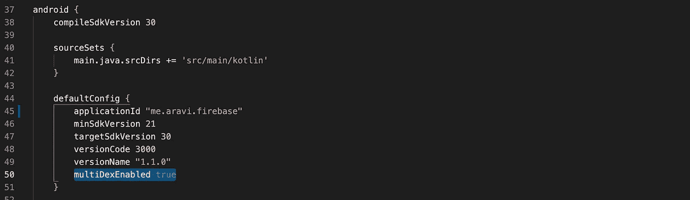

检查您的应用程序包名称是否与您在 firebase 控制台中使用的名称匹配，并添加

```
multiDexEnabled true
```

到默认配置部分。

了解更多关于 multi-dex 的信息，以及加入它的重要性:

[https://developer.android.com/studio/build/multidex](https://developer.android.com/studio/build/multidex)

现在向下滚动到依赖项部分，添加下面的依赖项以完成设置。

```
implementation 'com.android.support:multidex:1.0.3'
```

这就是你所做的一切，现在你可以在 android 模拟器或物理设备上构建和运行你的应用。

如果这没有帮到你，有一本很好的书叫做[的](https://amzn.to/361fADU)，作者是[弗兰克·扎梅蒂](https://www.amazon.in/s/ref=dp_byline_sr_book_1?ie=UTF8&field-author=Frank+Zammetti&search-alias=stripbooks)。

[](https://www.amazon.in/gp/offer-listing/1484249712/ref=as_li_tl?ie=UTF8&camp=3638&creative=24630&creativeASIN=1484249712&linkCode=am2&tag=370codes-21&linkId=688b09138eb1694137f5286831544229) [## 实用技巧:使用 Google 最新的开源 SDK 改进您的移动开发

### 探索 Flutter 能提供什么，它从何而来，将走向何方。移动开发正以一种…

www .亚马逊. in](https://www.amazon.in/gp/offer-listing/1484249712/ref=as_li_tl?ie=UTF8&camp=3638&creative=24630&creativeASIN=1484249712&linkCode=am2&tag=370codes-21&linkId=688b09138eb1694137f5286831544229) 

希望这个指南能帮助你在应用中设置 firebase。如果是的话，不要忘记鼓掌或[支持我的工作](https://www.patreon.com/kamaravichow) k。如果你面临任何问题或发现本指南中的错误，请在下面随意评论。