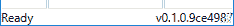
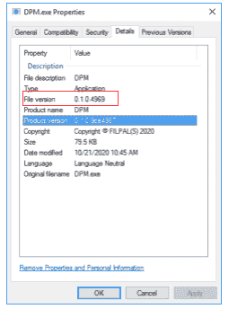

# 使用 Git 哈希进行软件版本控制

> 原文：<https://medium.com/geekculture/using-git-hash-for-software-versioning-c8e2c17349bc?source=collection_archive---------29----------------------->

版本控制在编程开发中非常重要。以便

1.  用户总是在下载最新版本。
2.  测试人员总是在开发人员修复 bug 后从管道中下载正确的版本。

最近，CI/CD(持续集成/持续开发)编程实践的概念意味着版本化变得更加重要。因此，在应用程序构建中使用唯一的版本编号变得至关重要。

内部版本号是从源代码中生成的，所以在每次推送代码之后，这对开发人员来说都是额外的维护工作。幸运的是，在 Visual Studio 等 IDE 的帮助下，build 可以在每次编译源代码时自动生成一个新的数字。有两种方法可以做到这一点。



# 方法 1

在 IDE 工具(Visual Studio)的帮助下，它可以为每个新编译生成一个唯一的版本号。通常，版本号中的第四位数字是为 IDE 保留的，以便在每次构建软件时自动增加。以下是如何设置流程的步骤:

1.  创建一个名为 *AssemblyInfo.cs* 的文件
2.  在 *AssemblyInfo.cs* 中定义文件和汇编版本
3.  在* *中将“确定性”属性设置为 false。csproj* 。
4.  在 Visual Studio 中生成项目。
5.  完成了。

在 *AssemblyInfo.cs* 中，我们删除了最后一行，只保留如下。

```
*// You can specify all the values or you can default the Build and Revision Numbers 
// by using the '*' as shown below:* [assembly: AssemblyVersion("0.1.2.*")]
```

从理论上讲，每一次提交都被认为是一次新的构建，因为任何一行代码的更改都会导致现有程序的行为发生变化，或者使其看起来与其先例不同。因此，当在单个发布之前提交了大量的构建，并且自动生成的数量变得非常大时，使用这种方法就变得很笨拙。

# 方法 2

这也是 git 推出替代解决方案的原因。它被称为 git hash，不同于增加任意数的 svn 方法。哈希是随机的、唯一的，适合较大的数字。一个 *git hash* 只在你提交之后生成。所以这些步骤只能在 git 提交后执行。一旦您做出新的更改并提交，它将运行 msbuild *build.proj* 。msbuild 将编译项目并为您生成二进制文件，方法是将*的前 7 位 git hash* 作为版本的最后一位。



以下是如何设置流程的步骤:

1.  安装和下载预申请
2.  创建一个 MSBuild 脚本(即 *build.proj* )
3.  建设
4.  完成的

您可以调用下面的代码来检索刚刚构建的可执行文件*产品版本*。

```
*// show application version at footer* 
System.Reflection.Assembly assembly = Application.Current.MainWindow.GetType().Assembly; 
this.Footer += " v" + FileVersionInfo.GetVersionInfo(assembly.Location).ProductVersion;
```

这是您可以开始使用的 *build.proj* 的示例。

```
<?xml version="1.0" encoding="utf-8"?> 
<Project DefaultTargets="Version;Build" ><PropertyGroup>     <MSBuildCommunityTasksPath>$(MSBuildProjectDirectory)\.build</MSBuildCommunityTasksPath>
</PropertyGroup> 

<Import Project="$(MSBuildCommunityTasksPath)\MSBuild.Community.Tasks.targets"/> <!-- TODO: Version Number -->   
<PropertyGroup Condition=" '$(BUILD_NUMBER)' == '' ">     <Version>0.1.0</Version>     
<FileVersion>0.1.0</FileVersion>     <InformationalVersion>0.1.0</InformationalVersion>   </PropertyGroup>

<PropertyGroup>    
<Configuration Condition=" '$(Configuration)' == '' ">Release</Configuration>   
</PropertyGroup>

<PropertyGroup Condition=" '$(BuildConfiguration)' == '' ">     <BuildConfiguration>Release</BuildConfiguration>   
</PropertyGroup> <Target Name="Clean">     
<DeleteTree Directories="**\obj\**;**\bin\**" />   
</Target> <Target Name="Version">     
<Time>       
<Output TaskParameter="Year" PropertyName="Year" />     
</Time> <Message Text="Version: $(Version)"/>       
<Attrib Files="$(MSBuildProjectDirectory)\YouProject\Properties\AssemblyInfo.cs" ReadOnly="False" /> <GitVersion LocalPath="$(MSBuildProjectDirectory)">       
<Output TaskParameter="CommitHash" PropertyName="Revision" />     </GitVersion> <AssemblyInfo CodeLanguage="CS"                   OutputFile="$(MSBuildProjectDirectory)\YouProject\Properties\AssemblyInfo.cs"                   
GenerateClass="true"                   
AssemblyCompany=""                   
AssemblyCopyright="Copyright © $(Year)"                   AssemblyConfiguration="$(BuildConfiguration)"                   AssemblyProduct=""                   
AssemblyTitle=""                   
AssemblyVersion="$(Version).*"                   AssemblyInformationalVersion="$(Version).$(Revision)" />   
</Target> <!-- Projects to Build -->   
<ItemGroup>     
<ProjectFiles Include="$(MSBuildProjectDirectory)\**\YouProject\yourproject.csproj">       
<Properties>Configuration=$(BuildConfiguration)</Properties>  </ProjectFiles> </ItemGroup>     
<Target Name="Compile" DependsOnTargets="Clean;Version">    
<MSBuild Projects="@(ProjectFiles)" />   
</Target> <Target Name="Build">     
<CallTarget Targets="Compile" />   
</Target>   
</Project>
```

上面的脚本构建了带有发布配置的代码。与执行时相同

```
msbuild /p:Platform="Release" Solution1.sln
```

此外，脚本还做了一些事情，比如设置版权的当前年份。感兴趣的地方在变量*AssemblyInformationalVersion*中，它将 git 散列的前 7 位数字附加到最初定义的版本中。

有了这些设置，MSTask 现在可以变魔术了。基本上这是由 GitVersion 任务完成的，其中 C#编译器实际上修改所需的文件以获得版本值。在本例中，它是 *AssemblyInfo* .cs。在 build 命令之后是 *AssemblyInfo* 。cs 将自动被修改，以包括如下所示的附加行。

```
[assembly: System.Reflection.AssemblyVersion("0.1.0.*")] [assembly: System.Reflection.AssemblyInformationalVersion("0.1.0.9ce4987")]
```

# 脚本方法

此外，还可以使用脚本来完成上述方法。安装 git 客户端后，可以使用 git 命令 *git rev-parse HEAD* 来完成。该脚本将自动更新。 *csproj* 文件，方法是将 git 哈希追加到版本中。

为了使事情更加自动化，该脚本可以合并到*中。gitlab-ci.yml* 文件，自动化 CI/CD 流程的版本控制。最近，还有一个 nuget 包，它将帮助实现整个过程，而不需要太多的手动工作来完成脚本。检查 [GitVersion](https://github.com/GitTools/GitVersion) 。这可能是在不维护 msbuild 脚本(本例中为 *build.proj* )的情况下实现版本控制的最简单、最好的解决方案。

# 进一步阅读

1.  [https://github.com/loresoft/msbuildtasks](https://github.com/loresoft/msbuildtasks)

如果你有任何想法或想法，请在下面留下你的评论。谢了。

*原载于 2021 年 6 月 13 日 http://filpal.wordpress.com**T21*[。](https://filpal.wordpress.com/2021/06/13/using-git-hash-for-software-versioning/?fbclid=IwAR3TGO1cDpV_QNpQvuDVy-ZoeZ89OEJWmEVFlI3Pou1459I_EOP7ez84G20)