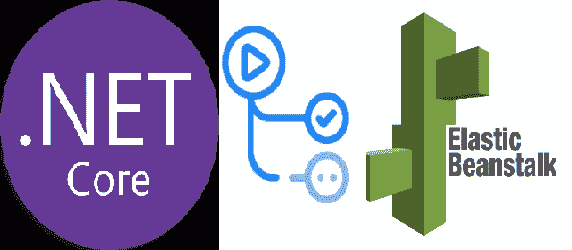

# 对 CI/CD 使用 GitHub 动作。网芯 5 和 AWS 弹性豆茎

> 原文：<https://medium.com/geekculture/using-github-actions-for-ci-cd-with-net-core-5-and-aws-elastic-beanstalk-5141228b61bd?source=collection_archive---------4----------------------->

对于我正在从事的一个自由职业项目，我有一个在 AWS 上托管服务器的要求。因为我有。NET Core 和 C#，我想用我现有的技能和知识来构建一个服务器应用程序。此外，由于 System.Drawing 的 DLL 要求，我需要使用 Windows 服务器

对我来说不幸的是，AWS 文档。NET 核心应用程序缺乏且过时，所以在网上搜索了几个小时后，我终于找到了一个 GitHub Actions yml 文件来无缝部署我的应用程序。我将与你分享我的文件，希望能节省你的时间和精力。

注意:这是针对 ELB 上的 Windows 服务器的。如果您想使用 Linux，您可以跳过这个清单文件，对我在文章结尾描述的 yml 文件做一点小小的修改就可以让它工作了。对于这个特别的项目，我需要一台 windows 机器，这让它变得有点复杂。

## AWS-windows-deployment-manifest . JSON 文件

首先，您需要在项目的根目录下有一个 AWS-windows-deployment-manifest . JSON 文件。这将告诉 ELB 如何为 Windows 托管您的服务器。请注意“site.zip”。我们将在 GitHub 动作的 yml 文件中使用该名称，但是您可以根据自己的喜好进行定制。

## GitHub 行动— CI/CD

如果你不熟悉 GitHub 的动作，请在这里[阅读一下。为了简洁起见，我假设你理解他们。](https://github.com/features/actions)

这里有很多东西要解开，但我会先看一下主要的主题。为了让 ELB 处理我们的应用程序文件，它需要一个包含我们上面声明的清单的 zip 文件夹，以及一个包含您的 NET Core app。

在第 32 行，我们运行 dotnet 命令来创建应用程序的发布文件夹，然后在第 35 行，我们将所有文件压缩在一起(manifest 和压缩的 app ),并将它们放在根目录中。在第 46 行，我们获取包含清单文件的压缩文件夹和压缩发布文件夹，并将它们推送到 ELB。

第 40 到 43 和 45 行与您的 AWS 配置相关。我选择将我的 AWS 访问密钥和秘密存储在 GitHub secrets 中，以保护我的信息并使其易于访问。

**如果您想部署到一台 Linux 机器上，您将需要更新第 32 行来发布为" *-r linux-x64*** "而不是"-r win 10–x64。"**此外，您将希望通过更新第 35 行来上传您发布的结果的 zip 文件，而不是包含在 zip 文件中的 zip 文件。**

## 结果呢

现在，每当您将更改推送到主分支时，您的 ELB 环境应该会自动更新！对我来说只需要几分钟，取决于你的申请有多大。

我希望你喜欢这篇文章，如果你觉得这有用的话，请留下一些掌声并关注我。编码快乐！