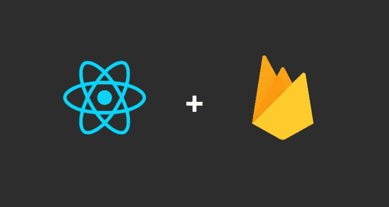
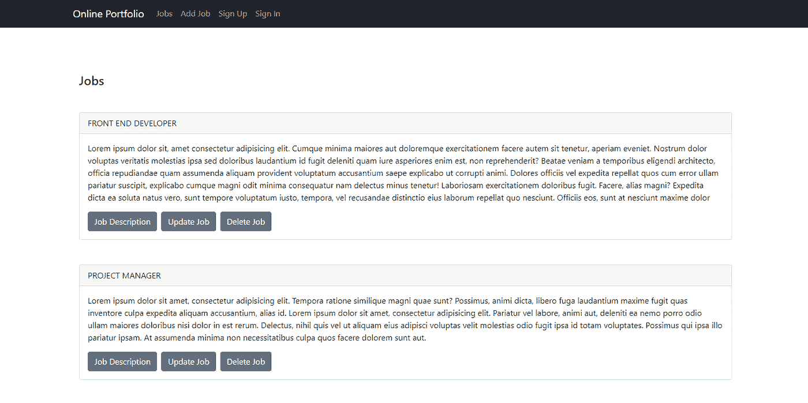
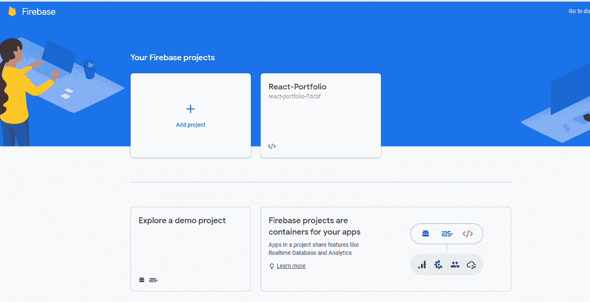
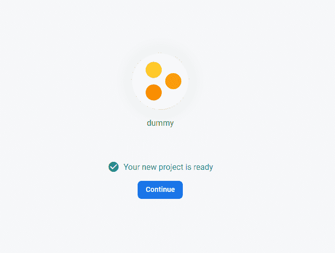
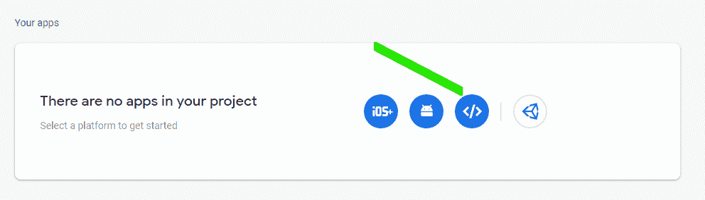
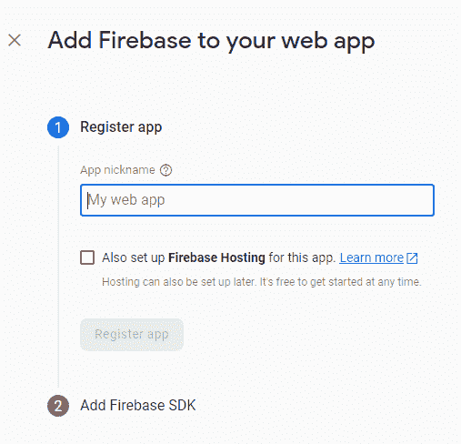
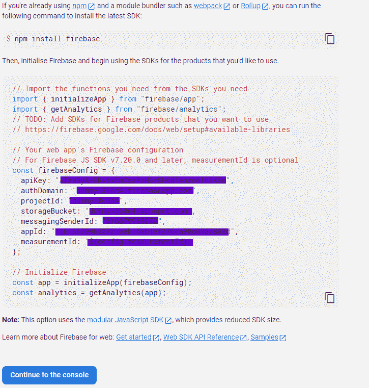

# 通过 ReactJS 使用 Google Firebase 9

> 原文：<https://medium.com/geekculture/using-google-firebase-9-with-reactjs-298652ba0843?source=collection_archive---------7----------------------->

这将是一个系列，第一部分是如何使用 Parcel 建立一个 React 项目，以及如何将 Firebase 集成到其中。

# 先决条件

*   关于 React 的基础知识。

*建一个小项目可能会有帮助，这里查一下*[](/swlh/how-to-make-a-side-navigation-bar-in-reactjs-c90747f3410c)**。**

*   *用包裹设置虚拟反应项目(说明如下)*
*   *对表单的热爱(我们会经常用到它们)*
*   *你内心燃烧的火焰学习火焰基础(双关语)*
*   *一个好的代码编辑器(最好是 Visual Studio 代码)*

# *你将学到什么*

*   *在您的项目上设置 Firebase*
*   *使用 Firebase 的 CRUD 功能*
*   *用到达路由器路由*

# *入门指南*

*如果您发现自己处于全栈状态，并且在完成前端任务后需要一个简单的后端。我可以向你保证，最好的解决方案是谷歌自己的 FIREBASE。现在，有什么比主要的前端框架 React 更好的工具来集成它呢*

**

*我们将与 package bundler 一起初始化我们的 React 项目。*

*你可以在这里找到另一种方法*

## *[*与包裹 app*](https://www.developerhandbook.com/parcel.js/build-a-react-web-app-with-parcel/) 反应*

*但是让我们看看如何在本文中实现它*

# *使用 Parcel.js 构建 React 应用程序*

*创建一个文件夹，在代码编辑器中打开它，然后在项目目录中运行命令*

```
***npm init -y***
```

1.  *可选地，你可以初始化 Git，这样你就可以在以后使用*

```
***git init***
```

*这将初始化 package.json，选择 y 表示是*

*2.使用安装 React 和 react-dom*

```
***npm install — save react react-dom***
```

*3.使用安装 Babel 和 package-bundler*

```
***npm install — save-dev @babel/core @babel/plugin-proposal-class-properties @babel/preset-env @babel/preset-react parcel-bundler***
```

*4.安装 react 热加载程序，并使用*

```
***npm i -D react-hot-loader***
```

*5.在项目目录下创建一个名为“**的文件。babelrc** 并添加*

```
*{
  **“presets**”: [
      “@babel/env”,
      “@babel/react”
      ],
**“plugins**”: [
      “react-hot-loader/babel”,
      [“@babel/transform-runtime”]
          ]
}*
```

*6.创建一个名为 src 的新文件夹，并在其中创建一个 index.js 文件，添加:*

```
*import React from ‘react’
import ReactDOM from ‘react-dom’
import App from ‘Components/App’
if (module.hot) {
    module.hot.accept()
}
ReactDOM.render(
         <div>
            <App />
        </div >, document.getElementById(‘root’))
ReactDOM.render(<App />, document.getElementById(‘root’))*
```

*7.使用以下语法创建 HTML 文件:*

```
*<!DOCTYPE html>
<html lang=”en”>
<head>
<meta charset=”UTF-8" />
<meta name=”viewport” content=”width=device-width, initial-scale=1.0" />
<meta http-equiv=”X-UA-Compatible” content=”ie=edge” />
<title>React with Parcel.js</title>
</head>
<body>
   <h1>Hello, World!</h1>
<div id=”root”></div>
</body>
</html>*
```

*8.找到 **package.json** 并在其中添加:*

```
*“scripts”: {
    “start”: “parcel index.html”
}*
```

*9.创建一个名为 Components 的文件夹，并在其中创建一个名为 App.jsx 的文件，如果你熟悉 react，你会知道这是我们将创建的任何子组件以及路由的主应用程序。如果您不熟悉 React，您可能需要补上基础知识*

*您可以随意设计它，但是因为它是一个功能组件，所以看起来应该是这样的*

```
*import React, {useEffect, useState} from ‘react’
export default function App(props) {
       return (
            <div>
             # add code or classes here
            </div>
          )
}*
```

*运行 **npm 运行开始**，我们开始吧。*

# *登录页面*

**

*您选择的任何设置都可以，但是要构建虚拟组件来保存您保存到 firebase 数据库中的数据。*

*提示:为此创建一个组件，然后在你的 App.js 中调用它，因为这是 React，Componen ts 的美妙之处！*

*我在这个项目中使用引导程序，了解如何在 React 中正确配置引导程序，请单击下面的链接:*

## *[使用自举和 ReactJs(正确的方式)](/geekculture/using-bootstrap-with-reactjs-the-right-way-9d7ce6cf249e)*

# *设置 Firebase*

*在我们做任何事情之前，我们必须在我们的项目中设置 Firebase。*

*如果您没有 firebase 帐户，第一步是在此处创建一个 Firebase 帐户:*

## *[消防基地控制台](https://console.firebase.google.com/)*

*系统将提示您注册/登录，之后您将看到您的控制面板。*

**

*类似上图的东西。*

*然后你可以初始化一个新的项目；选择一个合适的名称，然后打开分析(在这种情况下是可选的)。*

*几秒钟后。*

**

*在新找到的控制面板的左侧，打开侧面导航，然后单击“云 Firestore”。*

****边注:你知道我有一个教程可以帮助你在 React 中创建这样的边导航吗，点击这里学习如何:****

# *[如何在 ReactJS 中制作侧面导航栏](/swlh/how-to-make-a-side-navigation-bar-in-reactjs-c90747f3410c)*

*单击创建数据库，在测试模式下启动它，因为我们的应用程序还没有准备好生产，然后，选择任何位置，最好保留默认选择。*

*最后，我们通过单击导航栏(右上角)中的齿轮图标转到项目设置，在常规选项卡中滚动到底部并单击图标，如下所示*

**

*这将导致这个页面:*

**

*命名你的应用程序，现在，不要点击 Firebase 主机，我们稍后将设置它。注册您的应用程序，SDK 是 firebase 提供给我们用于安装 firebase 的开发工具包。我们的首选是:*

**

*运行 **npm 安装 firebase，然后***

*然后，我们转到文件夹的根目录，创建一个名为 firebase.js 的文件，并粘贴这个文件*

```
*import “regenerator-runtime/runtime”
import { initializeApp } from “firebase/app”;
import { getFirestore } from “@firebase/firestore”;
import React, { useState, useEffect } from ‘react’
// Authentication
const firebaseConfig = {
    apiKey: “xxxxxxxxxxxxxxxxxxxxxxxxxxx-xxxx-xxx-xx”,
    authDomain: “xxxxxxxxxxxxxxxxxxxxxxxx.firebaseapp.com”,
    projectId: “xxxxxxxxxxxxxxxxx-xxxxxx”,
    storageBucket: “xxxx-xxxxxxxxxxx-xxxxx.xxxxxx.com”,
    messagingSenderId: “xxxxxxxxxxxx”,
    appId: “1:104449724706:web:xxxxxxxxxxxxxxxxx”,
    measurementId: “x-xxxxxxxxxxx”
}
// Initialize Firebase
const app = initializeApp(firebaseConfig);
const auth = getAuth()
export default getFirestore()*
```

*用 firebase 提供的对象替换 firebaseConfig 对象，因为它对于每个项目都是唯一的。*

*对于第一行，我一直遇到一个再生器运行时错误，所以安装并导入这个包，似乎可以解决这个问题，所以安装时使用:*

```
***npm I regenerator-runtime***
```

*这样，我们就可以开始在 Firebase 应用程序上执行 CRUD 操作了。*

*任何你可能有的问题，或者你遇到的麻烦，我很乐意帮助你解决，所以请在评论中留下它们吧！我们来调试一下。*

*如果你顺利通过这一关，你就可以进入下一部分了。*