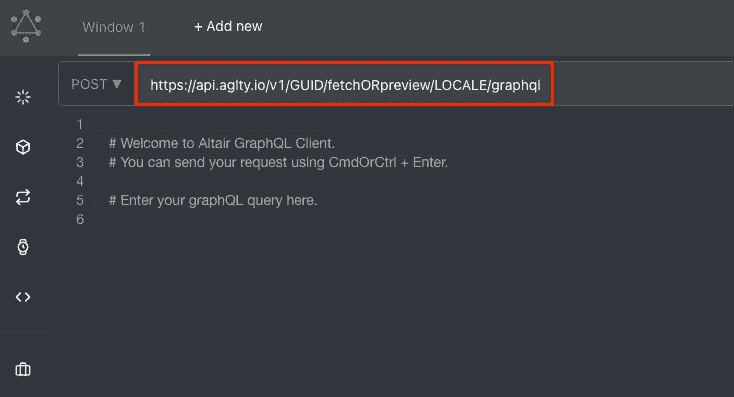
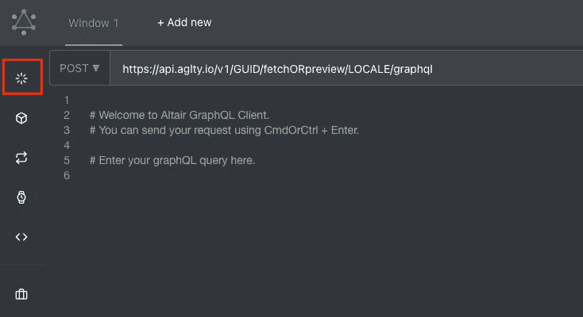
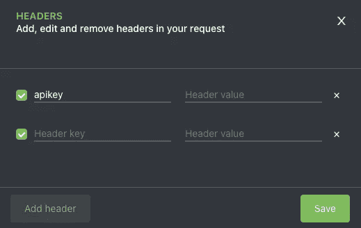
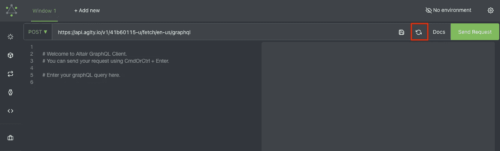
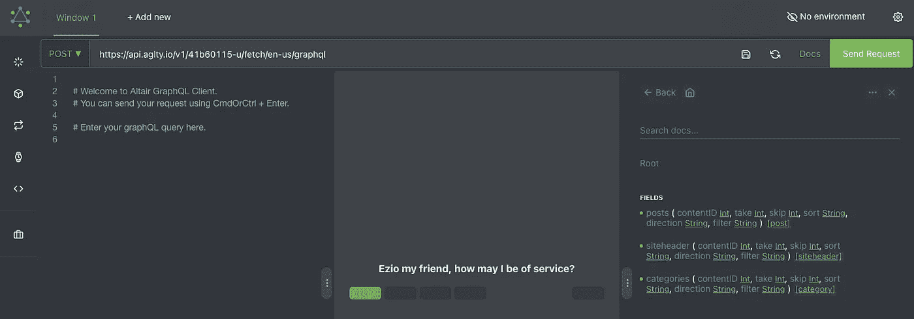

# 使用 GraphQL 和 AgilityCMS

> 原文：<https://medium.com/geekculture/using-graphql-with-agilitycms-75db6c03068b?source=collection_archive---------33----------------------->

根据 JavaScript 2019 的[状态，38.7%的开发者愿意使用 GraphQL，而 50.8%的开发者愿意学习 GraphQL。](https://2019.stateofjs.com/data-layer/graphql/)

作为一种查询语言，GraphQL 简化了构建客户端应用程序的工作流程。它消除了在客户端应用程序中管理 API 端点的复杂性，因为它公开了一个 HTTP 端点来获取所需的数据。因此，它[消除了数据的过量提取和不足提取](https://hub.packtpub.com/7-reasons-to-choose-graphql-apis-over-rest-for-building-your-apis/)，就像 REST 的情况一样。

**注意** : *本教程将有益于那些过去在客户端使用 RESTful 或其他形式的 API，并想看看 GraphQL 是否值得一试的人。这意味着你以前应该使用过 API 只有这样，你才能理解 GraphQL 对你有多大的好处。虽然我们将涉及 GraphQL 的一些基础知识，但是对 headless CMSworks 的良好了解将会派上用场。*

# GraphQL 基础知识

本文不是 GraphQL 的 [**完整介绍**](https://www.howtographql.com/) ，但是在继续之前我们将定义一些约定。

**什么是 GRAPHQL？**

GraphQL 是一个[规范](http://spec.graphql.org/June2018/)，它描述了一种声明式查询语言，客户可以使用这种语言向 API 请求他们想要的确切数据。这是通过为 API 创建强类型模式来实现的，具有极大的灵活性。它还确保 API 解析数据，并根据模式验证客户端查询。这个定义意味着 GraphQL 包含一些规范，使其成为一种声明式查询语言，具有静态类型化(围绕 Typescript 构建)的 API，并使客户端能够利用这些类型系统向 API 请求它想要的确切数据。

因此，如果我们创建了一些类型，其中包含一些字段，那么，从客户端来看，我们可以说，“给我们这些包含确切字段的数据”。然后 API 会以那个确切的形状来响应，就像我们在强类型语言中使用类型系统一样。你可以在[我的打字稿文章](https://www.smashingmagazine.com/2020/05/typescript-modern-react-projects-webpack-babel/#comments-typescript-modern-react-projects-webpack-babel)中了解更多。

GraphQL 是针对 API 的查询语言，而不是针对数据库的。它是数据库不可知的。它可以用于任何数据库。GraphQL 允许客户端在一次请求中查询来自 API 中多个来源的数据，并允许客户端定义自己需要的数据部分。同时为您提供这种灵活性。

让我们看看 GraphQl 的一些约定，它们将在我们继续的过程中对我们有所帮助。

**基础知识**

*   **操作** 在 GraphQL 中，执行的每一个动作都称为一个操作。有几个操作，即:
*   **查询** 该操作与从服务器获取数据有关。你也可以称之为只读获取。
*   **突变** 这个操作涉及到从服务器创建、更新和删除数据。它通常被称为 CUD(创建、更新和删除)操作。
*   **订阅** graph QL 中的这个操作涉及到当特定事件发生时从服务器向其客户端发送数据。它们通常用 [WebSockets](https://itnext.io/how-we-manage-live-1m-graphql-websocket-subscriptions-11e1880758b0) 来实现。
*   **操作** **人名** 有**独有的** **人名**供您进行客户端查询和变异操作。
*   **变量** **和自变量** 操作可以定义自变量，非常像大多数编程语言中的函数。然后，这些变量可以作为参数传递给操作内部的查询或变异调用。变量应该在运行时从客户端执行操作的过程中给出。
*   **别名** 这是客户端 GraphQL 中的一个约定，涉及到用简单易读的 UI 字段名来重命名冗长或模糊的字段名。在不希望字段名冲突的用例中，别名是必要的。

# 如何使用 GraphQL 和 Agility CMS

为了开始使用 GraphQL 从 Agility 查询您的内容，您需要验证您的请求并设置您的 GraphQL API 客户端。

首先，转到 [**设置> API 键**](https://manager.agilitycms.com/settings/apikeys) 并点击**探索 GraphQL API** 按钮，进入您的实例中的 GraphQL IDE 游乐场。

您将注意到您想要更新的 GraphQL API URL 端点，以包括以下内容:

1.  您的实例 GUID。
2.  指示您是要获取已发布内容(获取)还是暂存内容(预览)。
3.  要从中检索内容的区域设置。

接下来，您还需要通过添加 API 密钥作为头来验证您的请求。为此，单击位于 GraphQL API Playground 左侧的 **Set Headers** 按钮。

我使用哪个 API 键？

*   *如果您正在获取已发布的内容，并且已经使用 GraphQL API URL 端点中的 fetch 对其进行了定义，请确保使用您的****Fetch****API 键。*
*   *如果您正在获取暂存内容，并且已经使用 GraphQL API URL 端点中的 preview 对其进行了定义，请确保使用您的****Preview****API 键。*

点击**保存**将您的 API 密钥保存为请求中的标题。

一旦你更新了你的 GraphQL API URL 并添加了你的 API 密匙作为标题，你可以点击 **Reload** 按钮来重新加载文档。

4

一旦你重新加载了文档，你可以点击**文档**按钮，你应该会看到**根**。如果您单击 Root，那么您将能够从您的实例中看到可查询的内容。

# 结论

到目前为止，我们已经了解了 GraphQL 模式定义语言、基本类型、变异和查询类型，以及如何用 AgilityCMS 实例对其进行认证。现在，您将能够创建一个包含突变和查询的基本模式。

# 资源

*   [如何使用 Agility CMS 设计内容优先策略](https://agilitycms.com/resources/guide/how-to-design-a-content-first-strategy-using-agility-cms)——Agility CMS
*   [结构化内容管理系统的无头项目策略](https://www.smashingmagazine.com/2018/11/structured-content-done-right/)—Knut melvr
*   [作为开发人员，你为什么应该使用 CMS](https://agilitycms.com/resources/posts/why-you-as-a-developer-should-be-using-a-cms)
*   [无头商务解释:定义、用例以及障碍|敏捷 CMS](https://agilitycms.com/resources/posts/headless-commerce-explained-definitions-use-cases-and-roadblocks)
*   [API vs . SDK:有什么区别？|敏捷 CMS](https://agilitycms.com/resources/posts/apis-vs-sdks-what-s-the-difference)
*   [2021 年顶级静止站点发电机值得关注](https://agilitycms.com/resources/posts/static-site-generators)
*   [https://agility CMS . com/resources/posts/what-s-the-difference-between-headless-CMS-and-static-site-generator/](https://agilitycms.com/resources/posts/what-s-the-difference-between-headless-cms-and-static-site-generator/)
*   [什么是网络生活，作为一名编辑，你为什么要关心它？|敏捷 CMS](https://agilitycms.com/resources/posts/what-is-netlify-and-why-should-you-care-as-an-editor)
*   [什么是无头 CMS？|敏捷 CMS](https://agilitycms.com/resources/guide/what-is-a-headless-cms)
*   [无头 CMS 相对于传统 CMS 的优势|敏捷 CMS](https://agilitycms.com/resources/guide/top-10-reasons-why-you-should-choose-a-headless-cms-over-a-traditional-cms)
*   [内容架构:组织和管理你的内容和团队的关键](https://agilitycms.com/resources/posts/content-architecture)
*   WordPress 及其替代品:Headless CMS | Agility CMS
*   [开源 CMS 与专有 CMS:你能拥有二者之长吗？|敏捷 CMS](https://agilitycms.com/resources/whitepaper/proprietary-vs-open-source-content-management-systems)
*   选择 React CMS:寻找什么？|敏捷 CMS
*   [掌控你的内容架构:内容建模](https://agilitycms.com/resources/posts/content-modelling)
*   [DXP vs 无头 CMS:现代 DXP 建筑](https://agilitycms.com/resources/posts/the-benefits-of-a-hybrid-dxp)
*   Jamstack 开发:[2021 年你需要了解的 10 个 JAMstack 先驱](https://agilitycms.com/resources/posts/top-jamstack-pioneers)