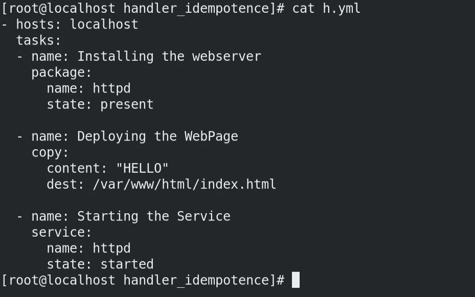
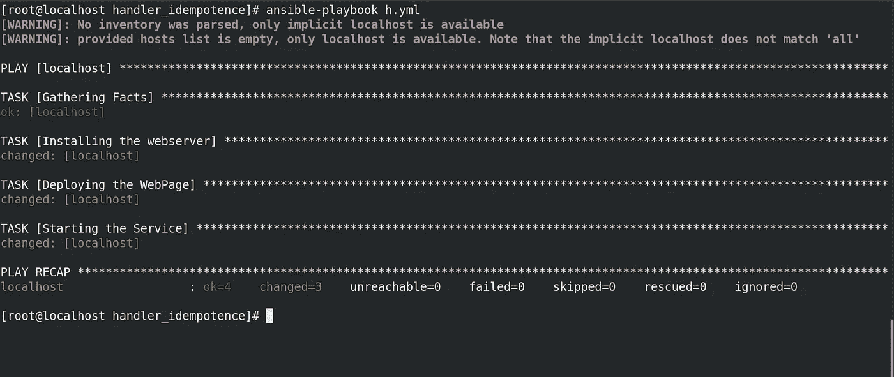
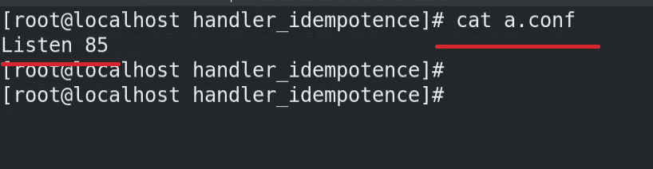
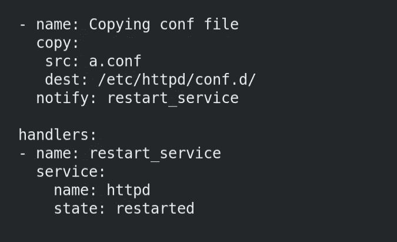
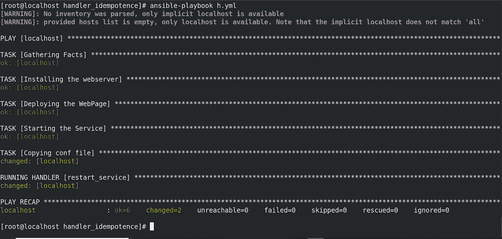
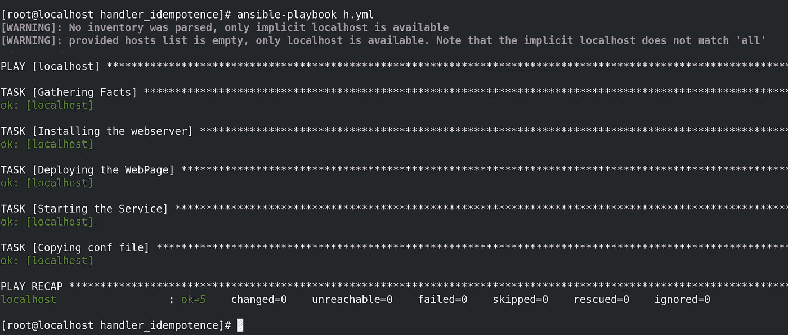

# 🔰重新启动服务时使用 Ansible 中的处理程序实现幂等性🔰

> 原文：<https://medium.com/geekculture/using-handlers-in-ansible-to-achieve-idempotence-while-restarting-a-service-b97d5a0eace8?source=collection_archive---------23----------------------->

如果您熟悉 Ansible 的使用，您可能会遇到无法从 Ansible 的幂等性中获益的情况。

*例如，假设我们使用 Ansible 配置了一个 Apache 服务器(比如 HTTPD)。然后，我们启动了这项服务，并在其上部署了我们的 web 应用程序/网页。一切正常。*

现在，在某种情况下，**我们想对 HTTPD 服务器**的配置文件做一些更改，比如说我们想更改它运行的端口。更改端口号后，我们还必须重新启动服务。

一切都由 Ansible 来做。在这里，我们第一次在做出更改后运行剧本，剧本将在重新启动 HTTPD 服务后成功运行。

但是在这里，我们有一个挑战。 *下一次无论何时运行剧本，无论我们是否在配置文件中做了任何更改，它都会重新启动 HTTPD 服务*。这是因为 Ansible 中有一个重新启动 HTTPD 服务的任务，它将一直运行，在这里，我们不能利用 Ansible 的幂等性。

## 重新启动服务，一次又一次，将消耗额外的计算，并浪费资源，这根本不是一个好的交易。

*在这里，我们想要实现这样的设置，即“重新启动服务”任务将仅在配置文件中有任何更改时运行，否则它不应该运行。这就是处理程序的概念开始发挥作用的时候了。*

# 这项任务的主要目的是:

> **✨restarting httpd 服务本质上不是等幂的，并且还消耗更多的资源，以建议一种方法来纠正在可回答的 playbook✨中的这种挑战**

**在这里，我们使用“通知”的概念**。我们将以这样一种方式配置“在配置文件中进行的更改”任务，即无论它何时运行，它都会通知任务重新启动保存在处理程序块中的服务，否则它不会。

让我们努力切实做到这一点。

***下面是我在配置剧本时要遵循的步骤:***

## ✨安装网络服务器
✨部署网页
✨启动服务

**为了方便起见，我只在我的本地主机上运行上面的剧本:**

**因此，剧本运行成功，网页可访问:**

现在，假设我想将 HTTPD 服务器的端口号从 80 改为 85。为此，我必须对 HTTPD 的配置文件进行修改。

在这里，我将创建任何带有“.conf "扩展名，然后使用 Ansible 将其传输到/etc/httpd/conf.d/ location。

**要更改端口号，我们有“Listen”关键字。**以下是配置文件:

**现在，下一步是将这个文件复制到所需的位置并重启 Webservice。**

这里，我将重启的服务放在处理程序中，因此，它将只在“复制”模块通知它时运行，并且“复制”模块将只在任务中有任何更改时通知它。

所以，让我们来看看剧本:

## 注意:这里，当你把端口从 80 改为 85 时，SELinux 可能会引起冲突，为了方便起见，我用“setenfoce 0”禁用了 SELinux 一段时间。

当我执行剧本时，它通过运行处理程序更改了端口并重启了服务:

网页也可以通过端口 85 访问:

*但是如果我再次运行同样的剧本会发生什么？*让我们来了解一下:

***这一次，当我们再次运行剧本时，配置文件没有变化，因此，它没有通知处理程序。因此，我们成功地实现了重启服务的幂等性。***

如果你喜欢这篇文章，请鼓掌并分享。

在 LinkedIn 上与我联系-

 [## Shubham Mehta - S.K.M.U Dumka -印度| LinkedIn

### ✨:我是一个积极的学习者，喜欢以一种敢做的心态挑战每一个问题，以便将任何想法变成现实

www.linkedin.com](https://www.linkedin.com/in/shubham-mehta-b09335188/)