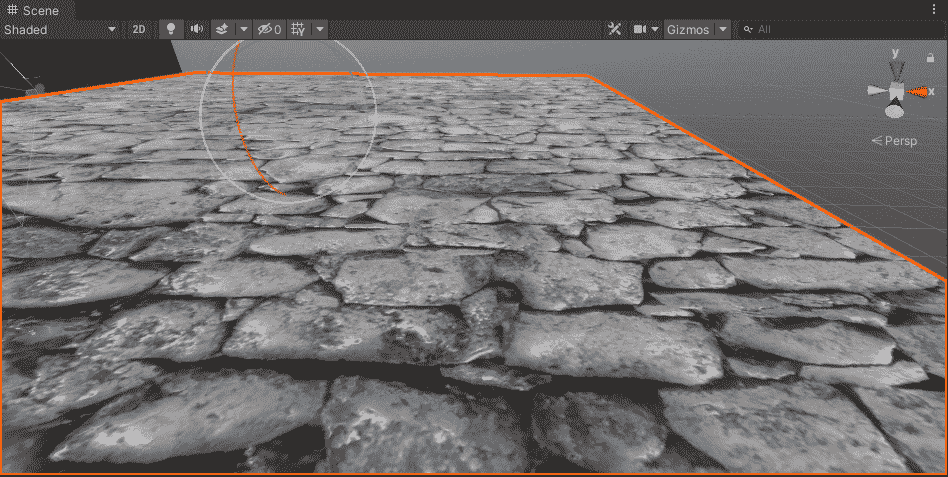
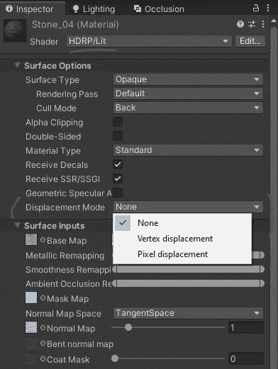
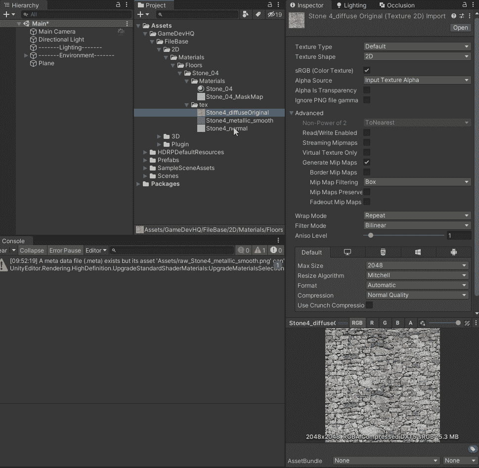
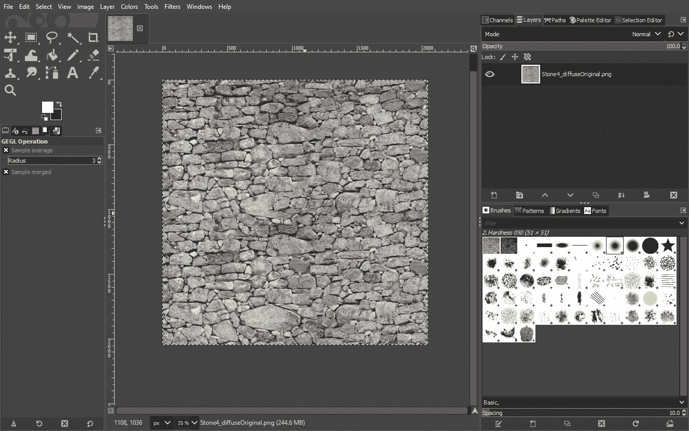
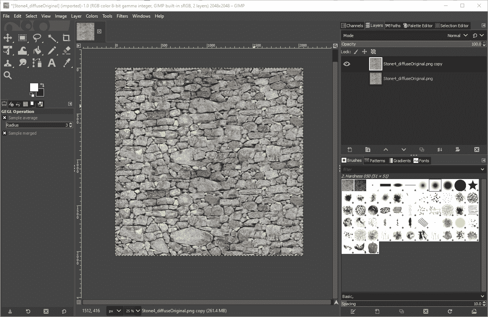
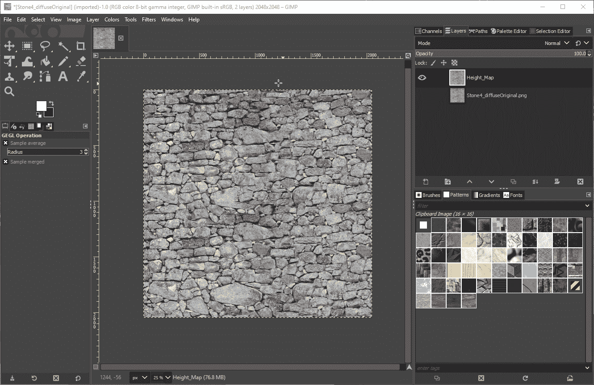
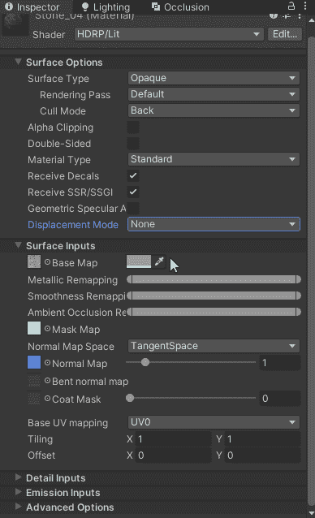

# 在 Unity 中使用高度图和像素位移—第 1 部分

> 原文：<https://medium.com/geekculture/using-height-maps-and-pixel-displacement-in-unity-part-01-37cf13e132cb?source=collection_archive---------6----------------------->

**目的**:了解 **Unity** 中的**高度图**和**像素位移**是什么，以及如何使用。

在**高清渲染管道**中，我们在**着色器选项**中获得了这个非常酷的工具，名为“**位移模式**”，当用于**连接**与**高度** & **法线贴图**时，我们能够给出**平面**具有**凸起的**幻觉**。**

## 置换模式

根据使用**光照着色器**还是**镶嵌着色器**，在 **HDRP** **中有 **3 种不同类型的**高度贴图位移**。**光照着色器**为用户提供**顶点**或**像素位移**的选项，而**镶嵌着色器**提供**镶嵌位移**。*这些文章的第 02 部分将专门讨论像素位移，我将在后续文章中讨论镶嵌。*

Displacement Mode in the Inspector / Lit Shader

## 高度贴图(视差贴图)

来自 **Unity 的文档** —高度贴图*用于给表面额外的定义，纹理贴图负责渲染大的凸起和突起*。一般来说**高度贴图**和**法线贴图**是齐头并进的，会一起使用。与只使用**法线贴图**相比，使用**高度贴图**会更加**性能密集型**。

代表**高度图**的是一个**灰度图像**，它具有对应于**高区域**的**白色**和代表低区域的**黑色** **。为了得到一个**灰度图像**设置，让我们来看看如何在 **GIMP** 和 **Photoshop 中做到这一点。***第 02 部分文章打算用 Photoshop 进行封面处理。***

## 瘸子

**在 **Unity** 和*中找到***你要调整的**纹理**右键→在浏览器中显示→用 **GIMP 打开。**

然后让我们通过右击*原始* *图层* → d *复制图层*来创建一个**复制图层**。现在，让我们通过按下图层旁边的**眼睛图标** **来隐藏**原来的**图层**。

从这里开始，我们对**图像**进行**去饱和**，这将使**图像**的**颜色**更加**黑白**。让我们也将**模式**设置为“*亮度(HSL)* ”

现在我们可以原样使用这个**图像**，但是我们真的想要**突出**凸起，为了做到这一点，我们必须**调整**对比度使**更接近**黑色和**白色图像**

*颜色→亮度/对比度→* *增加对比度* ***+*** *降低亮度*

现在让我们**重命名**我们的**图像**为’*凹凸贴图*并且**导出**作为 **PNG** 到**相同的位置**在那里我们**打开**文件**并且当你回到 **Unity** 时它应该在那里等着你！**

一旦你创建了你的**灰度纹理**，下一步将是选择一个“**置换模式**”。点击**检查器**中的**下拉框**并选择“**像素位移**，这将为我们提供新的“**高度贴图**选项，在这里我们可以**拖动**我们的**灰度纹理**到这个**框中:**

调整'**振幅**'字段将显示变化。

**有用链接**:
[*https://docs . unity 3d . com/Manual/standardshadermaterial parameterheightmap . html #:~:text = Height % 20 mapping % 20(也就是% 20known % 20as，即% 20pixel %所代表的% 20face %。*](https://docs.unity3d.com/Manual/StandardShaderMaterialParameterHeightMap.html#:~:text=Height%20mapping%20(also%20known%20as,the%20face%20that%20pixel%20represents.)[https://docs . unity 3d . com/Packages/com . unity . render-pipelines . high-definition @ 6.7/manual/Displacement-mode . html](https://docs.unity3d.com/Packages/com.unity.render-pipelines.high-definition@6.7/manual/Displacement-Mode.html)