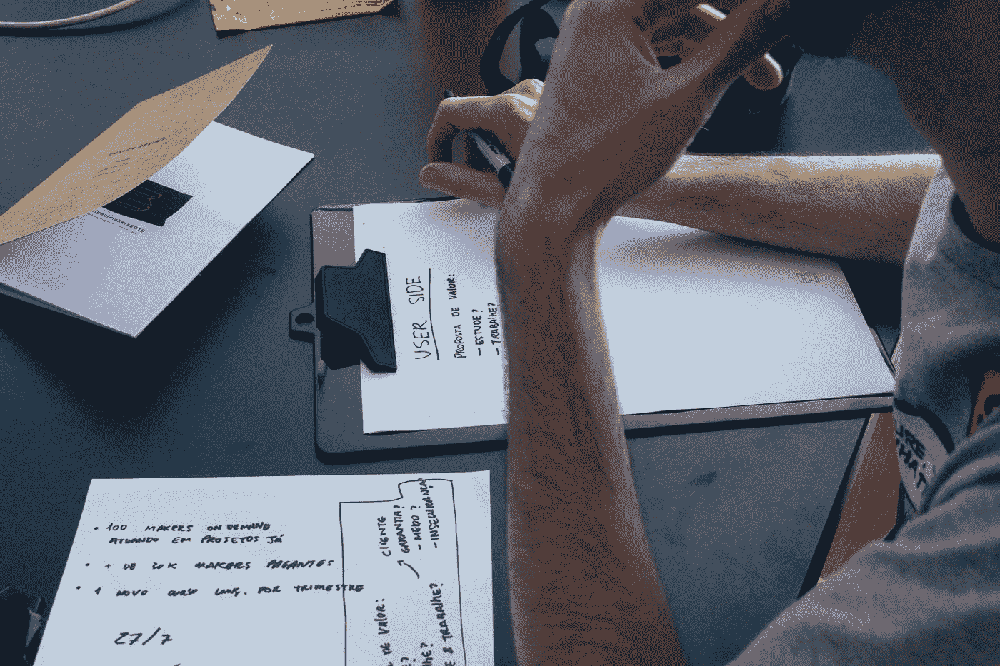

# 在 UX 使用互动技术

> 原文：<https://medium.com/geekculture/using-interaction-techniques-in-ux-c2ab2bafaab4?source=collection_archive---------15----------------------->

## 交互技术对于提供一个伟大的 UX 是必不可少的。

Photo by [Startaê Team](https://unsplash.com/@startaeteam?utm_source=medium&utm_medium=referral) on [Unsplash](https://unsplash.com?utm_source=medium&utm_medium=referral)

用户体验(UX)就是让用户体验尽可能的流畅和简单。这意味着要考虑网站的布局，用户如何与网站内容互动，以及他们能多快找到他们想要的东西。