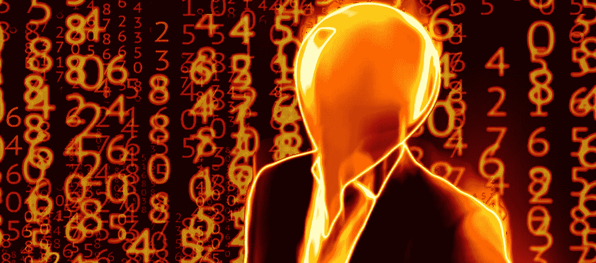
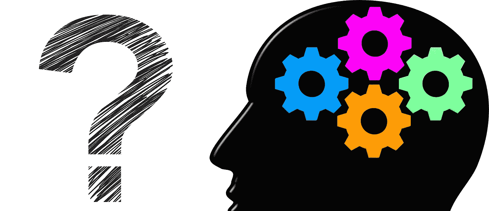

# 使用 JavaScript 解决一个简单的统计挑战——我应该改变我的选择吗？

> 原文：<https://medium.com/geekculture/using-javascript-to-solve-a-simple-statistical-challenge-should-i-change-my-choice-85feea8c29a3?source=collection_archive---------14----------------------->



# 解决一个常见的(明显的)统计问题

我和我的团队从一家酒吧出来，就许多不同的事情进行了激烈的辩论，期间一个人问了一个问题，这显然是一个常见的统计问题:

> “这里有 50 扇门，只有一扇门后面是宝藏。你可以选择任何一扇门；我会移除剩下的 48 扇门，但不包括宝藏。所以你会留下你的门和一个，你知道其中一个必须隐藏宝藏。你现在可以改变你的选择。你会改变它吗？”

我没有多想，就说我不会。然而，我被告知正确的做法是改变最初的选择，因为这将使我有更高的机会获得宝藏。

## 我在特定时刻对它的思考

虽然我最初的选择只有 2%的可能性，但第二个选择，无论我是否改变，都有 50%的可能性是正确的。我遵循的逻辑类似于掷硬币——无论之前的投掷是什么，总是有 50%的机会获得“正面”，但这个例子并没有我想象的那么相似。每次扔硬币都是不相关的事件。它不是上一个的延续，我错误地假设这里也是一样的。

我已经很久没有考虑过整个问题了，很快就忘记了…但是周末来了，它像回旋镖一样回到了我的脑海。

# 让我们来谈谈回旋镖

当我写这些文字的时候，我还不知道答案，我也不想在网上搜索答案——我想自己学习。

## 为什么我现在认为我的答案是错的？

除了有人告诉我这是错的:)

虽然第一个选择是 2%,第二个选择是 50%,但只有当我在第二次机会中改变最初的选择时，这个选择才有效。如果我坚持我最初的选择，没有什么会比仅仅 2%更好。第二个变化给我的印象是，这两个事件没有关联，我真的有 50%，即使我坚持最初的门。

> 注意:我刚刚读了我到目前为止写的东西，我几乎可以肯定这将是 2%对 50%，做出改变是正确的事情。

我求助于一些 JavaScript 代码来帮助我。

# 使用少量代码解决问题

我写了一个将运行 100，000 次的简单函数。一次运行时不改变答案，另一次运行时选择不同的门。第一个应该有大约 2%的成功率，第二个大约 50%。当然，由于这些运行会生成随机数，所以分数不会完美，但经过这么多次迭代，分数会非常接近。

我保持代码简单，没有任何捷径，以确保它易于理解。如果你想在第二个机会改变答案，你可以在浏览器中运行它，并将 **SHOULD_SWAP** 调整为 **true** 。您可以尝试运行次数或门的数量等其他变量，看看会产生什么结果。

```
const RUNS = 100000;
const DOORS = 50;
const SHOULD_SWAP = false;

let allDoors = [];
let myChoice = null;
let otherDoors = null;

let result = [];
let accuracy = null;

function chooseDoors() {
  // generate 50 doors, and make one treasure (true)
  allDoors = Array(50).fill(false);
  allDoors[Math.floor(Math.random() * DOORS)] = true;

  // choose one door and eliminate remaining except 1
  let selectedDoorsIndex = Math.floor(Math.random() * DOORS);
  myChoice = allDoors[selectedDoorsIndex].toString();

  // I don't have to chop the array, it's easy to figure out what the "otherDoors" will be
  if (myChoice === 'false') {
    otherDoors = 'true'
  }
  else {
    otherDoors = 'false'
  }

  // swap the answer at second chance?
  if (SHOULD_SWAP) {
    myChoice = otherDoors;
  }

  result.push(myChoice);
}

// run X times
for (let i = 0; i < RUNS; i++) {
  chooseDoors();
} 

// calculate the final %
let trues = 0;
for (let item in result) {
  if (result[item] === 'true') {
    trues++;
  }
}
accuracy = trues / RUNS * 100;

console.log(accuracy.toString() + '%');
```



# 结论(不是我想的那样！)

我问了几个人答案，大多数人说如果我不改变我的答案的话 **2%,如果我改变了**的话 **50%。前面几段，我也是这么说的！**

**得知是 2%和 98%很激动！** 有道理……现在！当然会是 98！😂

带着一点好奇和几行代码，我发现了一些关于数字的新东西。对未来最重要的教训是，事情并不总是像它们看起来的那样，不管我有多自信，我可能就是错了。这提醒我们改变想法也不是一个坏主意。

这让我想起了关于改变我们想法的研究，以及人们坚持最初选择的频率，相信这一定是最好的。对后悔的恐惧如此强烈，以至于影响了我们的逻辑思维。实话实说吧；情绪控制我们的次数比我们愿意相信的要多。我们害怕如果我们在第二次机会改变主意会发生什么，但是我们的门藏着宝藏。经典的“我就知道！我就知道应该坚守我的大门！”…在 2%的情况下，这是真的:)

挑战完成。很好玩:)