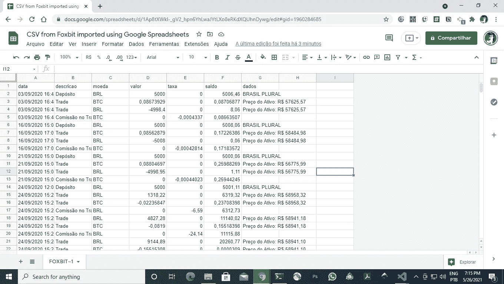
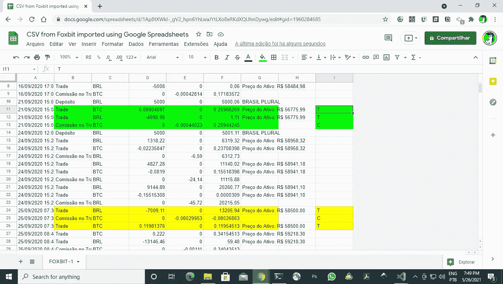
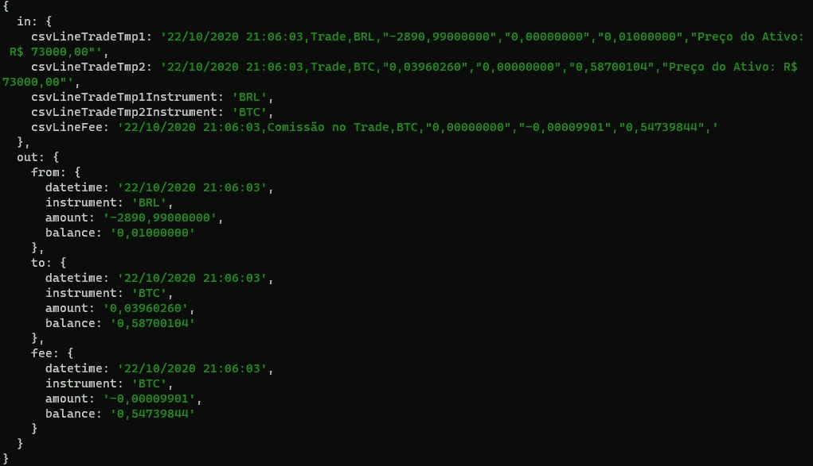

# 使用 JavaScript 将加密交易记录从 CSV 转换为 JSON

> 原文：<https://medium.com/geekculture/using-javascript-to-translate-crypto-trade-records-from-csv-to-json-6800917adba6?source=collection_archive---------47----------------------->

## 解释本地加密货币交易所#Foxbit 的交易记录时面临的挑战

本文假设您了解使用加密货币交易所进行交易的基础知识。当用户进行多项交易时，购买和出售，交易所将存储记录。一般来说，这些记录是供下载的，对会计或税务用途很有用。

这些记录的格式没有标准化。因此，由交易所决定其格式和结构。在接下来的几节中，您将按照步骤来理解一个特定的交易所是如何使用 CSV 文件组织其交易历史的。

我们的目标是理解文件结构，然后我们将解析数据并生成 JSON 输出，这是一种更灵活的文件格式，便于软件操作。

# 了解 CSV 文件和结构化格式

接下来的部分，以及伴随的例子，是 Foxbit——一个巴西的加密货币交易所所特有的。

我没有问他们为什么是 CSV，但我可以假设他们这么做了，因为 a) **CSV 是基于文本的，**和 b) **每行可以显示多个值，用逗号分隔**。这种格式的简单性允许任何人将其导入流行的电子表格系统。Foxbit 发表了一篇[操作文章，解释了如何在电子表格](https://foxbit.com.br/blog/como-utilizar-arquivo-em-csv/)中导入 CSV 文件。让我们来庆祝一下如果您将 CSV 导入电子表格，它会是什么样子:



Example of a CSV file CSV-Foxbit-version1 imported using Google Spreadsheets

## 识别每笔交易(用三元组描述)

下面是从参考资料部分找到的 CSV 文件中截取的一小部分。考虑前五行，它指的是标题行、存款和一笔交易(用**粗体**表示)，由三行描述:

```
data,descricao,moeda,valor,taxa,saldo,dados03/09/2020 16:41:28,Depósito,BRL,"5000,00000000","0,00000000","5006,46000000",BRASIL PLURAL**03/09/2020 16:44:26,Trade,BTC,"0,08673929","0,00000000","0,08706877","Preço do Ativo: R$ 57625,57"****03/09/2020 16:44:26,Trade,BRL,"-4998,40000000","0,00000000","8,06000000","Preço do Ativo: R$ 57625,57"****03/09/2020 16:44:26,Comissão no Trade,BTC,"0,00000000","-0,00043370","0,08663507",**
```

第一行只是一个标题，它试图解释每行的内容。*数据*为日期， *descricao* 为描述， *moeda* 为资产类型， *valor* 为价值， *taxa* 为费用， *saldo* 为余额，*数据*为附加备注字段。

```
data,descricao,moeda,valor,taxa,saldo,dados
```

删除它，您将得到下面显示存款的行。在 16:41，这意味着一笔钱，5000.00 BRL，被存入交易所，总余额上升到 5006，46 BRL。因此，该数据显示用户帐户中已经有 6.46 BRL。

```
03/09/2020 16:41:28,Depósito,BRL,"5000,00000000","0,00000000","5006,46000000",BRASIL PLURAL
```

下面三行解释了一个交易——16:44 处理的一个交易。“贸易”这个词可能会引起混淆。这更像是交易的一部分。

```
03/09/2020 16:44:26,Trade,BTC,"0,08673929","0,00000000","0,08706877","Preço do Ativo: R$ 57625,57"03/09/2020 16:44:26,Trade,BRL,"-4998,40000000","0,00000000","8,06000000","Preço do Ativo: R$ 57625,57"03/09/2020 16:44:26,Comissão no Trade,BTC,"0,00000000","-0,00043370","0,08663507",
```

第一行意味着 0.08673929 BTC 被买入，新的余额变成 0.08706877 BTC。因此，此用户帐户在此事件之前具有(0.08706877- 0.08673929) BTC。请注意，第 5 个属性，即 fee 属性，没有被使用。是的，它显示的是“0，00000000”的值，这很令人困惑。你可以忽略它。我更希望该字段类似于“NA”而不是“0，00000000”。你会看到第三行描述了佣金。

第二行是指在 BRL 的付款。它告诉我们-4998.40 BRL 被从用户帐户中取走，这导致了 8.06 BRL 的余额。这个例子可能会令人困惑(为什么会把 8.06 放在那里)，但这是可能发生的事情。我不是在评判这篇文章中的数据。

第三行表示在该交易中应用的实际佣金 0.0004337 BTC。该费用基于购买事件的总金额，即第一行的值 0.08706877 BTC，因此余额为 0.08663507 BTC。

# 作为事件组织

从会计的角度来看，三个有意义的事件同时发生。为了更有意义地讲述故事，让我们调整一下顺序:

*   **事件 A，为了购买 BTC，从账户中取走了 4998.00 BRL，导致余额为 8.06 BRL—***03/09/2020 16:44:26，贸易，BRL，“-4998，400000000”，“0，0000000”，“8，06000000”，“preo do Ativo:R $ 57625，57”*
*   **事件 B，0.08673929 BTC 被收购，导致 0.08706877 BTC**—*03/09/2020 16:44:26，贸易，BTC，" 0.08673929 "，" 0.000000000 "，" 0.08706877 "，" preo do Ativo:R $ 57625.57 "*
*   **事件 C，在 BTC 收取了一笔费用，该费用是根据获得的金额(0.08673929 BTC)计算的，导致从 0.08706877 BTC 的总余额中扣除 0.00043370 BTC，这导致用户账户中的 0.08663507 BTC**—*03/09/2020 16:44:26，BTC 科米索无贸易，“0*

# 解析每笔交易的挑战(可选)

你可以在这里选择退出，但是如果你好奇的话，我必须应对挑战来解析这些交易。我最初的假设是，订单严格用三行来描述一笔交易:交易操作、交易操作、佣金。我称这个订单为 TTC 订单。

但是在试图解析它的时候，我发现三元组会以不同的顺序出现，比如 TTC 或者 TCT。下面的屏幕截图显示了这一挑战:



The trade in green is BUY trade, described by two Trade lines followed by a Fee line. The trade in yellow is also a buy kind of trade, described in a different order, TFT.

# 解决方案—缓冲线路，直到满足标准

一种可能的解决方案是读取行，直到预期的行就位。找到两个交易操作和一个佣金后，当所有条件都具备时，就该准备交易数据了。

## 朝着我们的目标前进

我们的目标是生成关于每笔交易的尽可能多的信息。因此，考虑以下主要描述符:

*   “来自”——代表给定的资产。
*   “至”——代表被取走的资产。
*   “费用”——代表手术完成后收取的佣金。

要明白方向，买还是卖，我是在交易佣金适用的时候学的。佣金是在手术后收取的。因此，例如，如果您使用 BRL 购买 BTC，费用将从 BTC 收取。同样，如果你卖出 BTC，费用将从你的 BRL 账户中扣除。

所以关于方向的信息可以从佣金线来。在以下示例中，佣金行表明该操作使用 BRL 购买 BTC:

*   *16:44:26，BTC 贸易委员会，“0，000，000，000”，“-0，00043370”，“0，08663507”，*

因此,“从”对象可以通过 BRL 工具的交易操作来形成。相反地,“到”对象是由其他操作形成的。换句话说，顺序不再重要，如代码所示:

```
**if(tradeCurrent.out.fee.instrument == tradeCurrent.in.csvLineTradeTmp1Instrument) {**tradeCurrent.out.from = parseInstrument(tradeCurrent.in.csvLineTradeTmp2);tradeCurrent.out.to =  parseInstrument(tradeCurrent.in.csvLineTradeTmp1);} else {tradeCurrent.out.from = parseInstrument(tradeCurrent.in.csvLineTradeTmp1);tradeCurrent.out.to =  parseInstrument(tradeCurrent.in.csvLineTradeTmp2);}
```

# 我们的 JSON

出于责任的考虑，我决定将原始数据保存在 JSON 对象中。对于每笔交易，我们的输出对象分为两部分。“进”和“出”。“in”保存从 CSV 收集的行。“out”对象是我们的结果结构的占位符。



# 结论

假设您对处理与交易相关的记录文件感兴趣，我希望这篇概述能对您有所帮助。虽然这种转换不是一个复杂的项目，但我的目标是揭示一些想法，以帮助理解数据通常是如何被交换所构造和告知的。现在，从这里开始，开发商可以在数据的基础上进行计算，例如平均购买价格；并走向更复杂的解决方案。

# 参考

*   [如何导入 Foxbit CSV 文件](https://foxbit.com.br/blog/como-utilizar-arquivo-em-csv/)(葡萄牙语-BR)。
*   [示例代码—用于 Foxbit CSV 的 CSV 到 JSON 转换器。](https://github.com/taboca/article-sample-code-parsing-csv-trades-record-foxbit-2020)
*   [CSV 测试文件 1——来自代码样本库。](https://github.com/taboca/article-sample-code-parsing-svg-trades-record-foxbit-2020/blob/main/src-tests/foxbit-v1/sample-01.csv)
*   [CSV 测试文件 2——来自代码样本库。](https://github.com/taboca/article-sample-code-parsing-svg-trades-record-foxbit-2020/blob/main/src-tests/foxbit-v1/sample-02.csv)
*   [CSV 测试文件 3——来自代码示例存储库。](https://github.com/taboca/article-sample-code-parsing-svg-trades-record-foxbit-2020/blob/main/src-tests/foxbit-v1/sample-03.csv)
*   [CSV 测试文件 4——来自代码示例存储库。](https://github.com/taboca/article-sample-code-parsing-svg-trades-record-foxbit-2020/blob/main/src-tests/foxbit-v1/sample-04.csv)

# 附录 1 —主转换器样本代码

请查看[github . com/tabo ca/article-sample-code-parsing-SVG-trades-record-foxbit-2020](https://github.com/taboca/article-sample-code-parsing-svg-trades-record-foxbit-2020)查看基于 4 个不同输入测试文件的完整源代码。这些输入测试文件是根据我发现的真实挑战创建的。

# 结束语

*这篇文章产生于学习和工作时间的活动，因为我正在学习如何使用他们的 API 访问交换。我知道这并不多，这是迈向会计工作的第一步。它应该有助于税收的计算。我的目标是捕捉挑战，并提供关于交易结构的见解。我和福克斯比特没有任何关系。私人注释:本文是根据我自己与 id:c 09 cc 72e-71d 4–4e 33–8976–2d 6 EC 1825242、3799397 b-B1 B9–4a1c-9160-c0ff 8196 CB 45、BF 33 a 32 c-322 a-4000-bd4a-8 c 7 eccca 0 aa 4 和*0 f60 D1 b-a6e 2–42e 3–9 fbb-97 b 的会议编写的

感谢[卡伊奥·卡尔德琳](https://www.linkedin.com/in/caio-calderine-3b8956b7/)，帮助理解 CSV 文件。感谢 [Fabricio Zuardi](https://www.linkedin.com/in/caio-calderine-3b8956b7/) 的同行评审。