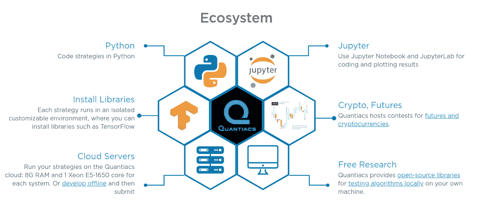
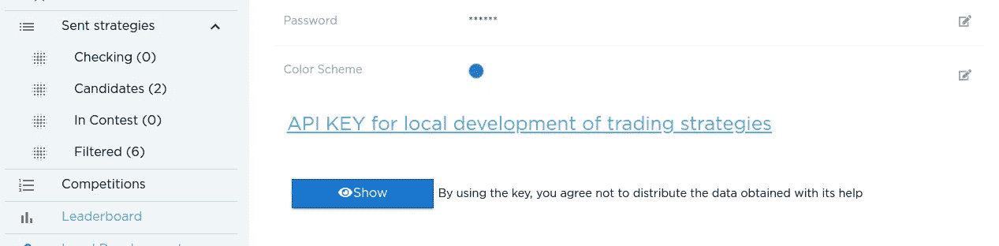
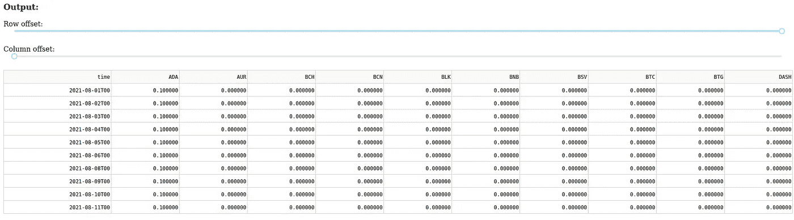
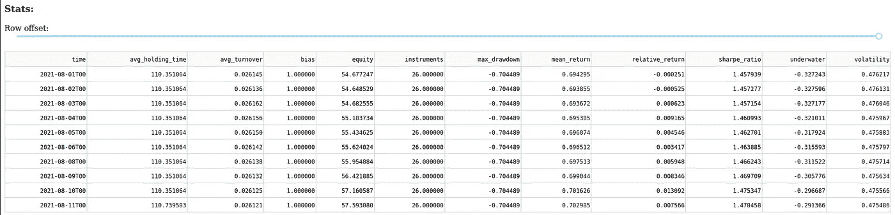
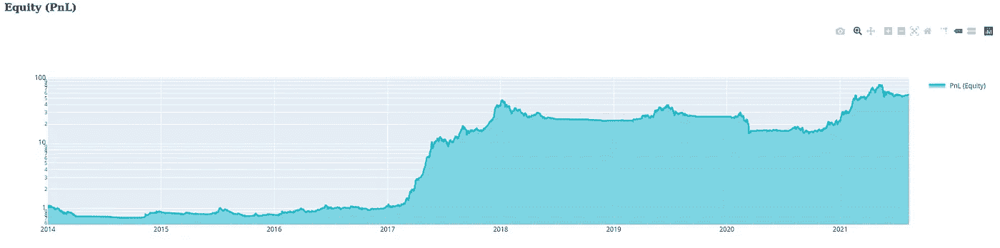
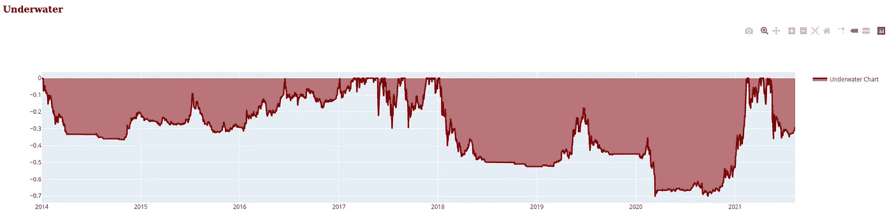
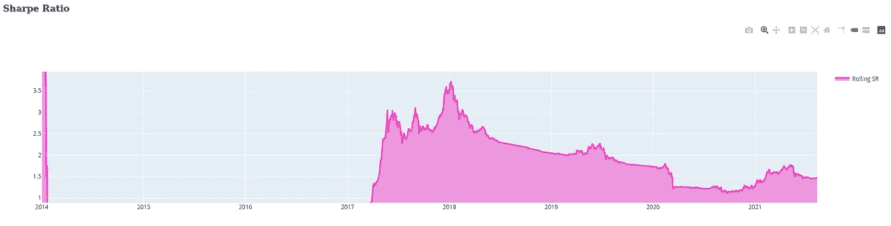

# 在您自己的环境中本地使用 Python Quantiacs 工具箱

> 原文：<https://medium.com/geekculture/using-locally-the-python-quantiacs-toolbox-in-your-own-environment-d035beae66da?source=collection_archive---------5----------------------->

在本文中，我们将介绍如何在您的机器上安装最新版本的 Python Quantiacs 工具箱，以及如何为本地算法开发设置您自己的环境。

[**Quantiacs**](http://www.quantiacs.com) **工具箱**是一个开源引擎，用于开发和测试用 Python 编写的交易算法。工具箱可以轻松地与所有用于数据科学、机器学习和统计数据可视化的 Python 库集成。

工具箱可以在**注册到**[**quanti ACS**](http://www.quantiacs.com)后在线使用，或者离线下载到您的本地机器上使用。在我们的云上开始更容易，但是过一段时间后，出于不同的原因，离线工作更有用:

*   Quantiacs 为 Jupyter 笔记本和 JupyterLab 提供在线支持。脱机工作时，您可以**使用您喜欢的 IDE** 。
*   在你的机器上工作，你可以使用你的本地内存、处理和存储资源。
*   您可以**修改源代码**，如果您认为工具箱可以改进，请向我们发送建议。
*   你可以在自己的机器上下载数据集，然后随心所欲地分析它们。



源代码可以在我们的 [**GitHub 仓库**](https://github.com/quantiacs) 中查看，在那里你可以找到源代码和许多例子，用于 [**入门**](https://github.com/quantiacs/strategy-first-crypto-daily-long) 算法交易和使用 [**更高级的方法**](https://github.com/quantiacs/strategy-cryptofutures-ml-ridge) 。

Quantiacs 工具箱是用 Python 编写的，它可以在 Linux、Mac 和 Windows 操作系统上运行，并且支持用 **Python 3.7** 编写的交易系统。它的结构高度模块化，引擎非常快，因为它依靠 [**xarray**](http://xarray.pydata.org/en/stable/) 和 [**pandas**](https://pandas.pydata.org/) 进行数据处理，依靠 [**numba**](http://numba.pydata.org/) 进行高性能计算。

# 安装工具箱

安装 Quantiacs 工具箱的最佳解决方案是使用 [**conda**](https://docs.conda.io/en/latest/) ，因为它允许稳定和灵活地处理软件包，并且它提供了为您的项目轻松定义**环境**的选项。此外，作为一个软件包管理器，康达可以帮助您查找和安装软件包，它可以在[**【repo.anaconda.com】**](https://repo.anaconda.com/)安装和管理上千个软件包。

要使用 conda，您可以简单地遵循安装说明，例如在 [**Anaconda**](https://www.anaconda.com/products/individual) 页面。

安装 conda 后，您可以创建一个用于开发策略的隔离环境，并安装 Quantiacs 工具箱，如下所示:

```
conda create -n qntdev quantiacs-source::qnt conda-forge::ta-lib conda-forge::pandas==1.2.5 conda-forge::dash==1.18 python==3.7
```

该命令将创建一个名为 **qntdev** 的环境，可以使用以下命令将其禁用:

```
conda activate qntdev
```

和停用，例如当您想要恢复到 conda base 环境时，使用:

```
conda deactivate qntdev
```

# 设置您的 API 密钥

接下来，您需要**设置您的 API 密钥**。您的 API 密钥可在您的个人帐户中获得。单击“显示”并将密钥复制到剪贴板中。



然后，使用以下命令将您的 API 密钥保存在我们的 conda 环境中:

```
conda env config vars set -n qntdev API_KEY=your_key
```

如果您遇到问题，例如使用 [**PyCharm**](https://www.jetbrains.com/pycharm/) 可能会出现问题，您可以在策略的开头添加以下行，以确保 API 键设置正确:

```
import os
os.environ['API_KEY'] = "your_key"
```

# 在本地运行系统

现在，您可以在本地运行一个策略:激活您的环境，在一个 **strategy.py** 文件中编写系统代码，并键入以下内容运行它:

```
python strategy.py
```

一个简单的起始示例交易 [**加密货币**](https://quantiacs.com/contest) 可以是例如一个交叉系统:

```
import xarray as xrimport qnt.ta as qnta
import qnt.backtester as qnbt
import qnt.data as qndatadef load_data(period):
  return qndata.cryptodaily_load_data(tail=period)def strategy(data):
  close = data.sel(field=”close”)
  is_liquid = data.sel(field=”is_liquid”)
  sma_slow = qnta.sma(close, 200).isel(time=-1)
  sma_fast = qnta.sma(close, 20).isel(time=-1)
  weights = xr.where(sma_slow < sma_fast, 1, 0)
  weights = weights * is_liquid
  weights = weights / 10.0
  return weightsweights = qnbt.backtest(
  competition_type = “crypto_daily_long”,
  load_data = load_data,
  lookback_period = 365,
  start_date = “2014–01–01”,
  strategy= strategy)
```

运行系统后，会出现一个基于 [**破折号**](https://dash.plotly.com/) 的数据可视化 app。在那里，您可以检查资产的**位置值**:



您可以检查最重要的**统计指标**的值:



此外，您可以可视化**盈亏**、**水下图**和**滚动夏普比率**的演变:



更多信息可在 **Quantiacs** [**文档页面**](https://quantiacs.com/documentation/en/) 找到。

您的代码可以上传到我们的比赛，方法是将其翻译到名为 **strategy.ipynb** 的 Jupyter 笔记本上并提交。

# 添加包

安装新软件包很容易，只需使用 conda，例如:

```
! conda install -y scikit-learn
```

可用于安装 [**scikit-learn**](https://scikit-learn.org/stable/) 包。对云的依赖可以通过编辑根目录中的 **init.py** 文件来解决。

你有问题或建议吗？在我们的 [**论坛**](https://quantiacs.com/community/) 页面联系我们！

你在用 [**Google Colab**](https://colab.research.google.com/notebooks/intro.ipynb) 吗？

*   如果你想使用一个**托管的运行时**，从这个[笔记本](https://quantiacs.com/documentation/en/_static/colab.ipynb)开始。它包含配置托管运行时所需的命令。
*   如果您将 colab 与一个**本地运行时**一起使用，那么您可以使用一个常规的 conda 环境。