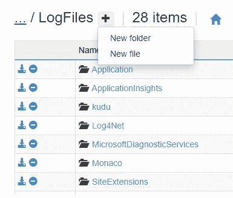

# 在 Azure 应用服务应用中使用 log4net

> 原文：<https://medium.com/geekculture/using-log4net-in-your-azure-app-service-applications-faeb5de7809c?source=collection_archive---------5----------------------->

在本文中，我们将配置我们的 [log4net](https://logging.apache.org/log4net/) 来将我们的日志写到 [Kudu](https://docs.microsoft.com/en-us/azure/app-service/resources-kudu#:~:text=Kudu%20is%20the%20engine%20behind,like%20Dropbox%20and%20OneDrive%20sync.) ，这样我们就可以随时消化它们。


Image by [hudsonhintze](https://unsplash.com/@hudsonhintze) on [Unsplash](https://unsplash.com/)

## log4net 是什么？

log4net 是一个日志记录工具。NET 应用程序，基于 Java 流行的 [log4j](https://logging.apache.org/log4j/2.x/) 。下面是 Apache 对它的描述:

> Apache log4net 库是一个帮助程序员将日志语句输出到各种输出目标的工具。log4net 是优秀的 Apache log4j 框架到微软的一个移植。NET 运行时。我们保留了与原始 log4j 精神上相似的框架，同时利用了。NET 运行时。有关 log4net 的更多信息，请参见[功能](https://logging.apache.org/log4net/release/features.html)文档。

探索这个工具的强大特性超出了本文的范围，您唯一需要知道的是 **log4net** 允许我们以高度可定制的方式编写应用程序日志。

## 在 ASP 中设置 log4net。网

使用 NuGet 添加 Log4Net 插件

```
PM> Install-Package log4net -Version 2.0.12
```

接下来，为了将 Log4net 配置为我们的 ASP.NET 核心应用程序上的 Microsoft 扩展日志处理程序，我们需要安装以下扩展:

```
PM> Install-Package Microsoft.Extensions.Logging.Log4Net.AspNetCore -Version 5.0.3
```

在项目的根级别，创建包含以下内容的`log4net.config`文件:

log4net.config

让我们解释一下 Kudu 日志的相关部分:

logfile appender section

简而言之，appender 是负责将日志消息发送到某个目的地的部分。在我们的案例中，我们希望将日志发送到

```
D:\Home\LogFiles\Log4Net\application.log
```

如[登录中所述。NET Core 和 ASP.NET Core](https://docs.microsoft.com/en-us/aspnet/core/fundamentals/logging/?view=aspnetcore-5.0)，日志文件的默认位置在**D:\ home \ log files \ Application**文件夹中。在我们的例子中，我们引入了一个额外的文件夹 Log4Net(我们需要在 Kudu 中创建它)，我们的日志将驻留在这个文件夹中。

## 在应用程序中配置 log4net

在配置日志的最后一部分，我们需要将以下内容添加到`Program.cs`:

Program.cs

仅此而已！让我们在应用程序中添加一些日志:

SomeApplication.cs

## 访问应用服务中的日志

正如我们之前提到的，我们应该创建 **Log4Net** 文件夹。导航到 Kudu 控制台:

**https:// <你的应用名称>. SCM . azure websites . net/debug console**

并创建一个新文件夹，如下图所示:



Creating the Log4Net folder

现在，发布您的应用程序，触发代码，您应该会看到新创建的日志文件 **application.log** ，其中有行“Hello user”。

## 摘要

如果您的应用程序已经配置为使用 log4net，并且您正在迁移到 Azure app service，您可以保留该库，只需添加一个 appender，这样您的日志就可以在 app service 本身中查看，而无需更改日志库。

延伸阅读:

*   [https://docs . Microsoft . com/en-us/azure/app-service/troubleshoot-diagnostic-logs](https://docs.microsoft.com/en-us/azure/app-service/troubleshoot-diagnostic-logs)
*   [https://docs . Microsoft . com/en-us/azure/app-service/resources-kudu](https://docs.microsoft.com/en-us/azure/app-service/resources-kudu)
*   [https://logging.apache.org/log4net/](https://logging.apache.org/log4net/)
*   [https://dotnetthoughts . net/how-to-use-log 4 net-with-aspnetcore-for-logging/](https://dotnetthoughts.net/how-to-use-log4net-with-aspnetcore-for-logging/)