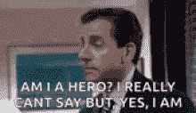
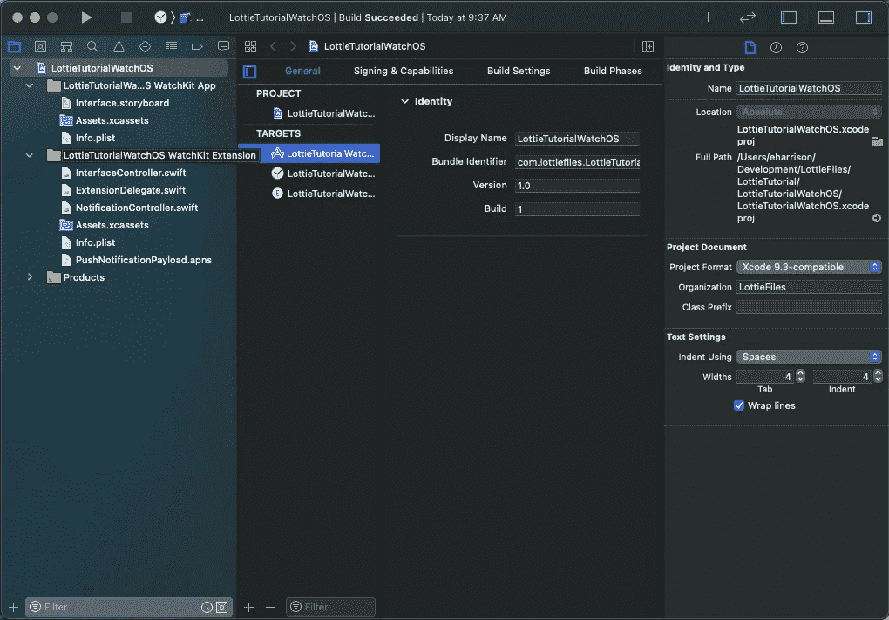
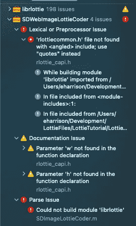
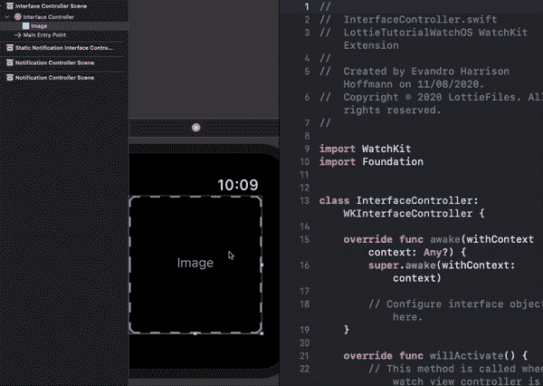
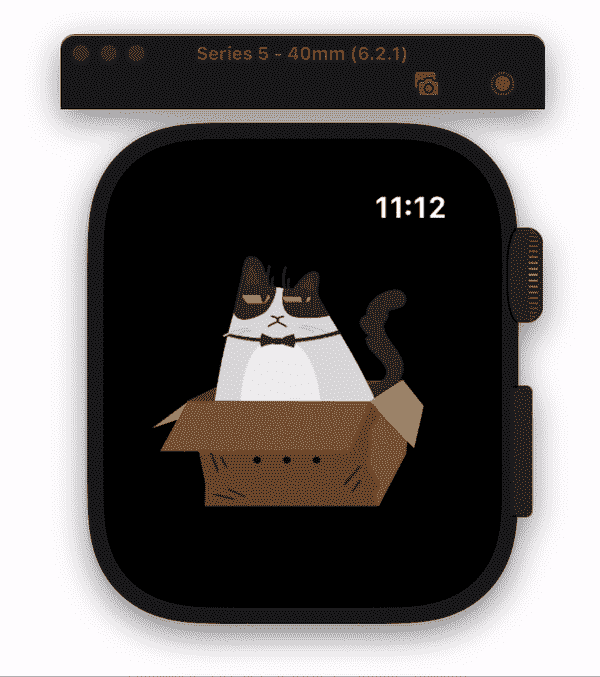

# 在 watchOS 中使用洛蒂动画

> 原文：<https://medium.com/geekculture/using-lottie-animations-in-watchos-b896760f14ab?source=collection_archive---------13----------------------->

洛蒂动画已经改变了你的生活，对开发者来说，添加魔法让你的用户眼花缭乱变得轻而易举。为此，你、你的团队、你的朋友、你的伙伴、孩子甚至你的狗都在到处使用很酷的动画！太美了！


洛蒂[支持](https://github.com/LottieFiles/awesome-lottie) Web、Android、iOS、桌面甚至多平台。所以基本上一切，对不对？😁

如果你一直在使用 Airbnb 的 Lottie Library，生活一直对你很好，嗯，直到你需要在你的 Apple Watch 应用程序中添加一些这种魔力，并且你意识到它不被支持。这就是你的反应:


本文旨在让您安心，并向您展示如何在 watchOS 应用程序中支持 Lottie 动画。😁



# 入门指南

好吧，首先，我们需要了解 Airbnb 的 Lottie library 不支持 watchOS，原因是它需要 CoreGraphics 来渲染动画，而该框架不是 watchOS 捆绑包的一部分。

但是不要担心，我们有替代方案，这就是我们今天要讨论的。首先，为 watchOS 创建一个新的 Xcode 项目(如果它是一个独立的应用程序或 iOS 应用程序的扩展，您实际上并不决定如何做)。



创建项目后，关闭它，并在“终端”中导航到项目的根文件夹。然后，使用以下内容启动项目的 cocoapods:

```
pod init
```

然后使用您选择的编辑器打开 Podfile。在这里，我们将把所需的 pod 添加到我们的 **watchOS 扩展目标**。

```
target 'LottieTutorialWatchOS WatchKit **Extension**' do
  platform :watchos, '6.0'
  use_frameworks! pod 'SDWebImageLottieCoder', '~> 0.1.0'
end
```

然后回到终端，安装吊舱，包括:

```
pod install
```

安装完依赖项后，使用 xcworkspace 文件打开您的项目。

在这个阶段，您应该尝试使用 **CMD+B** 来构建项目，以确保一切正常。

您可能会遇到编译窗格的问题，如下图所示。



如果是这样，只需导航到`rlottie_capi.h`文件并替换下面一行。

```
// from
#include <rlottiecommon.h>// to
#include "rlottiecommon.h"
```

试着重新建造，一切都会好的。😊

# 在带有故事板的 watchOS 上实现

在这个阶段，你已经做好了一切准备，是时候享受一下乐趣了！


首先打开故事板，添加一个 InterfaceImage，并将其连接到您的 InterfaceController 类。



然后，导航到 InterfaceController.swift，通过导入 **SDWebImageLottieCoder 开始。**

```
import SDWebImageLottieCoder
```

现在，我们将开始添加我们的动画配置。第一步是添加变量来支持我们的实现。在**唤醒功能**关闭后立即添加。

```
// MARK: **- Animation****private** **var** coder: SDImageLottieCoder?
**private** **var** animationTimer: Timer?
**private** **var** currentFrame: UInt = 0
**private** **var** playing: Bool = **false
private** **var** speed: Double = 1.0
```

设置好之后，让我们加载动画数据。

```
/// Loads animation data
/// - **Parameter** url: url of animation JSON
**private** **func** loadAnimation(url: URL) {
 **let** session = URLSession.shared
  **let** dataTask = session.dataTask(with: URLRequest(url: url)) { (data, response, error) **in
    guard** **let** data = data **else** { **return** }
    DispatchQueue.main.async {
      **self**.setupAnimation(with: data)
    }
  }
  dataTask.resume()
}
```

然后，我们用加载的数据配置动画:

```
/// Decodify animation with given data
/// - **Parameter** data: data of animation
**private** **func** setupAnimation(with data: Data) {
  coder = SDImageLottieCoder(animatedImageData: data, options: [SDImageCoderOption.decodeLottieResourcePath: Bundle.main.resourcePath!]) // resets to first frame
  currentFrame = 0
  setImage(frame: currentFrame)
  play()
}
```

之后，我们将当前帧设置到 WKInterfaceImage 中:

```
/// Set current animation
/// - **Parameter** frame: Set image for given frame
**private** **func** setImage(frame: UInt) {
  **guard** **let** coder = coder **else** { **return** }
  imageView.setImage(coder.animatedImageFrame(at: frame))
}
```

下面是我们播放/暂停动画的方法:

```
/// Start playing animation
**private** **func** play() {
  playing = **true** animationTimer?.invalidate()
  animationTimer = Timer.scheduledTimer(withTimeInterval: 0.05/speed, repeats: **true**, block: { (timer) **in
    guard** **self**.playing **else** {
      timer.invalidate()
      **return** }
    **self**.nextFrame()
  })
}/// Pauses animation
**private** **func** pause() {
  playing = **false** animationTimer?.invalidate()
}
```

然后，我们设置循环和下一帧配置:

```
/// Replace current frame with next one
**private** **func** nextFrame() {
  **guard** **let** coder = coder **else** { **return** }

  currentFrame += 1 // make sure that current frame is within frame count
  // if reaches the end, we set it back to 0 so it loops
  **if** currentFrame >= coder.animatedImageFrameCount {
    currentFrame = 0
  } setImage(frame: currentFrame)
}
```

最后，我们从唤醒功能中请求动画:

```
**override** **func** awake(withContext context: **Any**?) {
  **super**.awake(withContext: context)
  loadAnimation(url: URL(string: "https://assets8.lottiefiles.com/packages/lf20_Zz37yH.json")!)
}
```

如果你遵循了上面的所有说明(当然，如果你也没有决定在你自己的实现上半途而废🤓)这是你应该看到的:



太棒了，对吧？现在，你的 watchOS 应用程序已经准备好了，让我们发挥创意吧！🤩你可以在这里找到完整的代码。如果你想更多地了解洛蒂，[点击这里](https://lottiefiles.com/blog)。

# PS。

这个实现使用的是 [rlottie](https://github.com/Samsung/rlottie) 框架(三星)，而不是[Lottie](https://github.com/airbnb/lottie-ios)(Airbnb)，这意味着我们不是渲染矢量，而是将动画渲染成光栅化位图，一帧一帧。这意味着有些动画可能不会像使用向量那样加载。