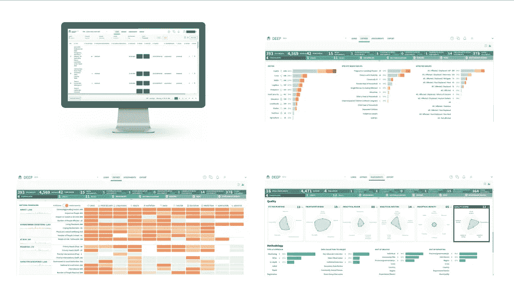
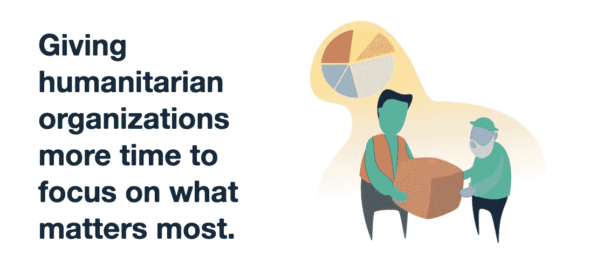
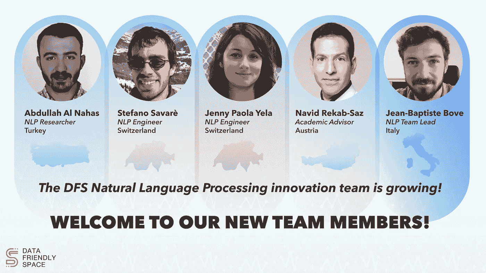

# 使用机器学习加快人道主义行动

> 原文：<https://medium.com/geekculture/using-machine-learning-to-expedite-humanitarian-action-a194568c717?source=collection_archive---------58----------------------->

**创建人道主义数据生态系统**

今天，一年产生的数据比人类历史上其他时期产生的数据总和还要多。曾经苦于数据匮乏的人道主义部门，现在被为一个项目收集的大量数据所淹没。

大量一手和二手数据以及基于媒体的数据源产生的信息规模之大，组织和分析师无法独立处理。适当利用大量可用数据有许多优势——分析师可以获得实时信息，做出更明智的决策。

**二手数据审查(SDR)**

*阅读:* [*什么是二次资料审核？*](https://deephelp.zendesk.com/hc/en-us/articles/360006969311-What-is-Secondary-Data-Review-)

如今有相当多的工具可以用来处理人道主义数据。例如，来自调查结果的定量数据被处理并经常通过 HDX 的——联合国 OCHA 倡议共享。然而，大多数定性数据是非结构化的；因此，数据处理和分析需要在时间和资源方面进行大量投资，使得大部分数据未被处理或利用不足。

**数据录入与探索平台(深度)**

*读:* [*什么是深？*](https://www.thedeep.io/)

2015 年尼泊尔地震后，伊万·奥格尔索普(Exec。数据友好空间的主管)降落在加德满都伸出援手。祖籍硅谷的数据科学家 Ewan 加入了联合国国家办事处营地的危机应对团队。他意识到，联合国分析现有数据的系统还不成熟，可以从更先进的技术中受益。在危机期间，伊万带着一个小型技术团队，与人道主义专家和分析师协商，创建了第一个版本的[数据输入&勘探平台(DEEP)](https://www.thedeep.io/) 。

> *“有几种软件解决方案可用于管理和处理定性数据，包括 Envivo、Mxeg 和 DEEP。ACAPS 和难民署都在试行一个名为 DEEP 的项目，这是一个专门由人道主义行为体开发并为其开发的平台，用于处理大量非结构化数据。用户可以上传各种来源(新闻文章、pdf、Word 文档等。)并使用定制的分析框架对它们进行标记/分类。然后，可以将编目信息导出到 Excel 或 Word 中，以供进一步分析。”*

*资料来源:联合处理罗辛亚危机定性数据试点(2018 年 5 月)* [*人道主义响应*](https://www.humanitarianresponse.info/) *，OCHA 服务(2018 年 5 月)*

自成立以来，DEEP 已被用于二级数据审查(SDR)和标记 1 200 多个项目中的大型数据集，这些项目支持全世界所有人道主义部门的人道主义应急工作。举几个例子，深度对

*   难民署对委内瑞拉移民危机的回应
*   [ACAPS & IFRC](https://www.humanitarianresponse.info/sites/www.humanitarianresponse.info/files/assessments/project_description_rohingya_crisis_joint_processing.pdf) 对[罗兴亚人危机](http://bit.ly/a%C2%B2capsrohingya)的回应。
*   DEEP 由美国国际开发署资助，由 Data Friendly Space 与 iMMAP 合作实施，在非洲中部和东部、中东、东南亚和拉丁美洲的 14 个国家积极协调新冠肺炎应对措施。

The DEEP Platform

**数据友好空间和深度**

数据友好空间(DFS)目前是 DEEP 的技术主管和主机。外勤支助部一直在与几个主要人道主义组织合作实施深度项目。外勤支助部支持深度理事机构的理事会，该理事会包括儿童基金会、难民署、联合国 OCHA 办事处、人权高专办、红十字国际联合会、ACAPS、IDMC、Okular-Analytics、JIPS 和 iMMAP。自 2018 年第一个项目以来，外勤支助部一直在不断提高其能力及其合作伙伴产生持久影响的能力。

> 今天，**平台上托管了超过 85，000 份带注释的人道主义响应文档， **DEEP 处于一个独特的位置，可以利用 NLP 模型**来加速对人道主义危机的响应。**

**机器学习加快人道主义行动**

自成立以来，DFS 一直专注于创建以数据为中心的应用程序，以支持人道主义组织从其数据中提取可操作的见解，并履行其使命。

如今，**平台上托管了超过 85，000 份带注释的人道主义响应文档**,**DEEP 在利用 NLP 模型**加快人道主义危机响应方面处于独特的地位。随着新的 NLP 模型的开发，DFS 旨在自动执行由内容标记团队完成的二级数据审查(一个漫长的过程),并通过更加关注数据分析而不仅仅是数据获取，使人道主义利益攸关方能够对任何危机做出快速响应。

DFS 专注于由人工智能和人类知识驱动的数据自动化过程之间的交集，特别是当一个可以帮助另一个执行分析时。DFS 的 NLP 创新团队已经发展到五名遍布欧洲的专业工程师。

除了现有的 NLP 团队，DEEP 董事会成员[伊玛普](http://iMMAP.org)还与 [ISI 基金会](https://www.isi.it/en/home)建立了研究合作关系，该基金会是一家总部位于都灵(意大利)的著名私人机构，从事复杂系统科学领域的研究。ISI 基金会已经任命 Nicolò Tamagnone 专门负责在 DEEP 中实现 NLP 功能。

**开源技术**

作为全球领先的非营利组织，DFS 致力于让应急响应和发展组织能够获得其技术。为了实现其目标并最大限度地扩大其影响:

*   DFS 与顶级学术机构合作，为 DEEP 和其他人道主义合作伙伴进行基于机器学习的功能的研发
*   在应用机器学习日，DFS 与 [CERN](https://home.cern/) 和 [EPFL](https://www.epfl.ch/en/) (欧洲最著名的技术大学之一)组织了黑客马拉松
*   DFS 与合作大学公开共享数据，并支持学生的硕士论文项目、实习和课堂相关项目
*   通过这些合作，DFS 邀请优秀学生尽可能加入创新团队。他们的研究成果被整合到 DEEP 和其他服务中
*   通过这些合作，DFS 吸引了最优秀的人才，并为希望在人道主义技术领域寻求职业生涯的学生提供了真正的机会——在学习期间或学习结束后
*   目前，在[Navid Rekab-saz](https://www.linkedin.com/in/navid-rekab-saz-28a299153/)(JKU 助理教授和 DFS NLP 创新团队成员)的指导下，奥地利林茨约翰尼斯·开普勒大学的三组学生正在对从 DEEP 提取的人道主义数据进行句子提取和分类
*   今年夏天，DFS 将从 [EPFL](https://www.epfl.ch/en/) 雇佣两名实习生

*要了解更多关于 DFS 及其项目和深度的信息，请在*[*www.datafriendlyspace.com*](https://datafriendlyspace.org/)上注册我们的简讯

*或写信给 hello@datafriendlyspace.com 的我们*

*作者:Rishi Jha —通信&合作伙伴—数据友好空间*