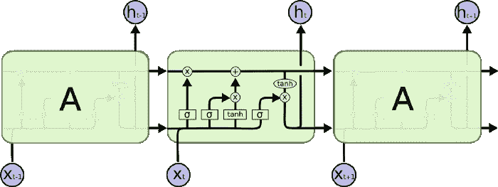
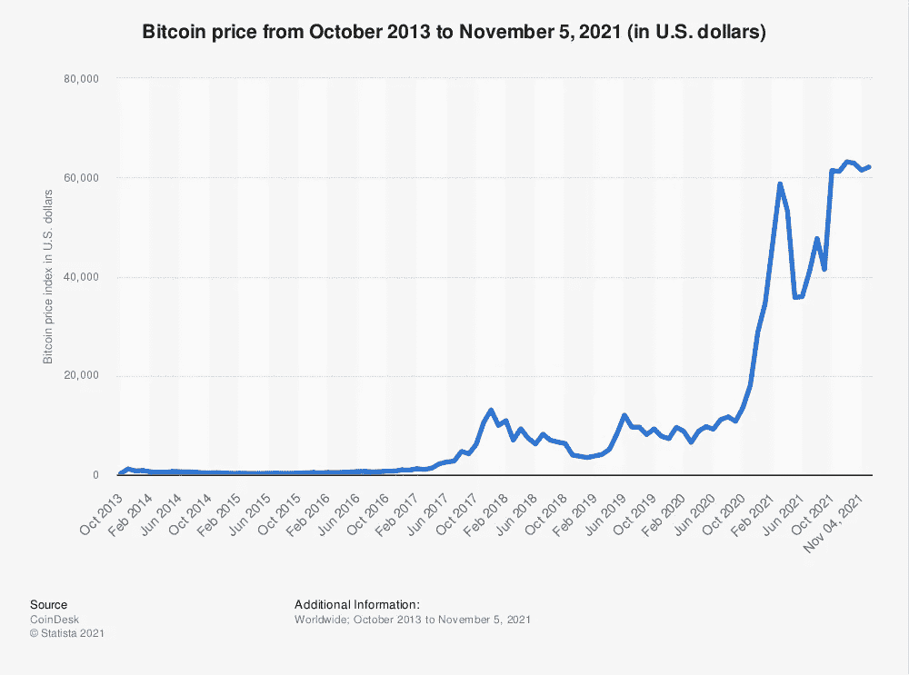

# 使用机器学习预测加密货币的未来

> 原文：<https://medium.com/geekculture/using-machine-learning-to-predict-the-futures-of-cryptocurrencies-dafb3f823adb?source=collection_archive---------16----------------------->

时至今日，我们的许多日常活动都是通过虚拟方式进行的，例如，上课、在家办公，甚至买车买房都可以通过虚拟方式完成。随着我们向一个可以虚拟地做许多重要事情的世界转变，它已经完全改变了我们思考和处理日常生活的方式。虚拟货币也在我们的生活中留下了印记。借记卡/信用卡成为第一种虚拟货币只是为虚拟货币的未来铺平了道路。这就是加密货币的用武之地。一种不受联邦当局控制的货币，一种交易可以通过其复杂的加密和极端的波动率进行跟踪的货币，加密可以用作长期投资或支付方法。特斯拉、微软和乐天等大型科技公司开始接受加密货币作为支付手段。这只会让每种密码的价格成倍上涨。在我们生活的世界中，我们的生活由 ML(机器学习)算法驱动，以帮助我们的生活变得更加轻松。我们有 Alexa 和 Siri 这样的虚拟助手来帮助我们计划我们的一天，或者我们有谷歌地图来帮助我们在晚餐预订迟到时找到更快的路线。如果我告诉你，我们可以使用一种非常复杂的特定算法，它可以帮助我们预测加密货币的未来及其价格。作为一名计算机/软件爱好者，我相信加密货币和 ML 具有相关性，可以帮助预测未来的价格。

AI(人工智能)& ML 已经在我们不知不觉中影响了我们的生活。我们会与某人就某个特定主题进行文字对话，在你打开 Tiktok 或 Instagram 后，你会看到你的 feed 中谈论的确切主题。ML & AI 的力量是无情的。有了 AI & ML，它已经帮助许多投资银行家和风险投资公司预测一只股票是上涨还是下跌。这也有助于公众理解未来的 IPO 及其价值。加密货币现在在投资领域扮演着重要角色。软件公司正试图提出复杂的算法来帮助确定每种密码的未来。每一个创造性的解决方案背后都有一个需要克服的挑战。Crypto 面临的挑战是它的高波动性，这使得预测它的未来几乎是不可能的。但是仍然有办法预测每种特定加密货币的短期结果。

许多像我一样的数据科学家和软件工程师能够创建算法，根据一段时间内每个硬币的给定数据集来预测价格、交易量、开盘价、最高价和最低价。通过使用代码语言 Python，我们可以实现特定硬币在某段时间内的每日高点/低点，并设置一个指令，将数据分成两组，分别测试 80%和 20%的数据。随着分别以不同货币设置价格的实现，我们必须建立一个特定的体系结构来接收数据并在一定时间内跟踪特定的数据。最常用的架构是 LSTM 架构。LSTM 架构允许代码跟踪数据，这些数据将用于根据给定的数据预测结果。为了跟踪可能产生的误差，我们可以使用平均绝对误差(MAE)公式来评估这些数字。MAE 公式用于测量一组预测中的任何误差。利用 MAE 公式模型，可以稍微帮助代码预测最终结果。借助 LSTM 神经网络，我们当然可以预测加密货币的短期未来。

LSTM Architecture Blueprint

当使用术语 Crypto 时，人们通常会想到比特币。它是所有密码中市值最高的。如果你在 2012 年购买几个比特币，当时每枚比特币的价格约为 12 美元。你现在的投资净值将远远超过 6 位数。没有人预测比特币会以指数级增长到今天的价格。是什么使硬币的价格涨得这么高？作为一种支付方式，它将会得到越来越多的应用。许多公司已经开始接受它作为支付方式。特斯拉是最大的，他们接受顾客的比特币作为电动汽车的支付方式。科技公司开始提出影响加密货币波动性的具体趋势，并开发可以预测价格的算法。尽管由于其高波动性、安全问题、政治因素和内部竞争，其发展受到了限制。科技公司相信，最终可以创造出一种算法，将所有因素纳入其波动性，并预测其未来。这种复杂算法的发展将为技术世界带来革命性的变化。这将是全新一代的开始，我们的未来可以完全由算法来预测。比特币、以太坊和索拉纳等市值最高的加密技术，在现有数据趋势下更容易预测。每天我们都会看到新型加密货币。他们的灵感要么来自一个流行的电视节目，要么来自一个他们想与之竞争的迷因币。随着所有新硬币的出现，预测未来变得更加困难。Doge 和 Shiba Inu 等硬币是最好的例子，没有人见过这些 meme 硬币的指数市值增长。在特斯拉首席执行官埃隆·马斯克(Elon Musk)的支持下，doge coin 在过去一年中上涨了 9800%。而柴犬的崛起从来没有预测到它在过去一年的 74，000，000%的增长。这只是一个不可预测的密码与股票指数相比的例子。

Price of Bitcoin over the years

在这一代人中，投资资金迅速增加。人们宁愿将他们一生的积蓄投入股票或证券市场，也不愿购买房子或房产，或者许多人愿意辞去工作，从事日间交易，因为大多数人认为这样做有可能赚更多的钱。由于加密市场的高波动性，许多人已经找到了一种可能在短时间内赚到比股票市场更多钱的方法。随着平台提供比以往任何时候都更容易的加密货币交易，这也是加密货币在如此短的时间内如此受欢迎的原因之一。

作为一名参与加密货币世界的投资者&我的职业生涯是在技术领域，我坚信我们将每天使用加密货币作为支付手段，并且将有一种算法帮助我们预测加密的长期未来，这将彻底改变行业和经济，使其变得更好。