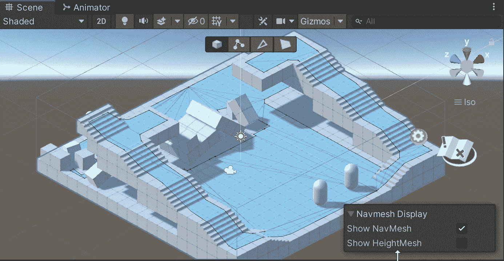
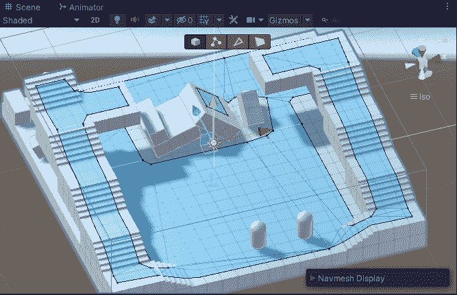
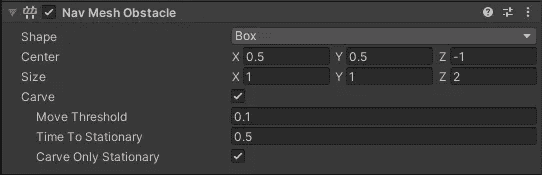
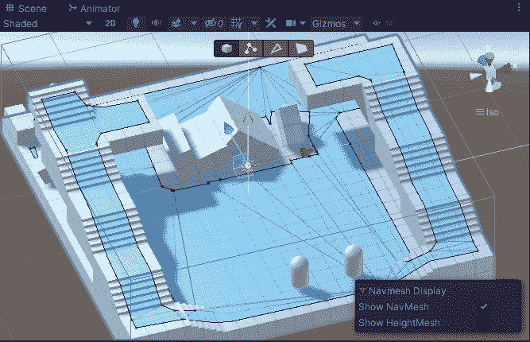

# 在 Unity 中使用 NavMesh 障碍物

> 原文：<https://medium.com/geekculture/using-navmesh-obstacles-in-unity-da50dd76f385?source=collection_archive---------20----------------------->

今天，我们来到了一个突发的城市悲剧现场:一场地震摧毁了一些人行道，一名旁观者被困在废墟下！幸运的是，我们有一对英雄在现场，准备拯救世界。

今天的示威游行就这样开始了。

从游戏性的角度来看，我们需要能够与场景中可以移动的对象进行交互，但我们也需要那些对象来防止 NavMesh 代理穿过它们。

这两个目标是冲突的。如果我们在编辑器中将这些对象烘焙到 NavMesh 中，那么在运行时移动它们会在 NavMesh 中留下不可见的障碍物。将对象放到新位置不会创建新的不可通过区域；NavMesh 代理将完全忽略障碍物，相信 NavMesh 会指示它可以移动和不可以移动的位置。

我们可以在运行时重新烘焙 NavMesh，但是等级越高，游戏速度越慢。

进入 NavMesh 障碍组件。

该组件可以添加到场景中的任何对象。它会让物体*在静止的时候在 NavMesh 上雕刻*一个洞，当物体移动的时候这个洞就会消失。有几个选项可以自定义此行为，包括调整障碍区域的大小和形状(对于形状奇怪的对象很有用)，但默认设置应该适合大多数用途。

让我们来看看我的场景如何使用 NavMesh 障碍物组件，而不是烘焙到网格中的所有可移动块:

太好了！嗯，很明显我需要注意我让玩家掉了一格的地方……但除此之外，很好！你可以看到网格随时更新我们的块开始或停止移动，确保一个静止的障碍仍然是一个障碍，无论它停在哪里。