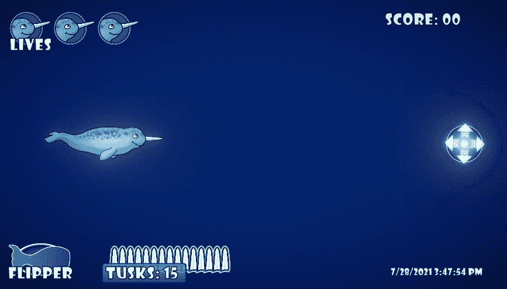

# 使用负值翻转脚本

> 原文：<https://medium.com/geekculture/using-negative-values-to-flip-the-script-ee4d0974bb0b?source=collection_archive---------39----------------------->

当上是下，左是右时，试图在这些深蓝色的水域中航行可能会有问题。我今天的**目标**是创造一个伤害玩家的能量。我决定让玩家的动作反转五秒钟，直到能量消失。这项任务做起来非常简单，所以下面是我是如何完成的。