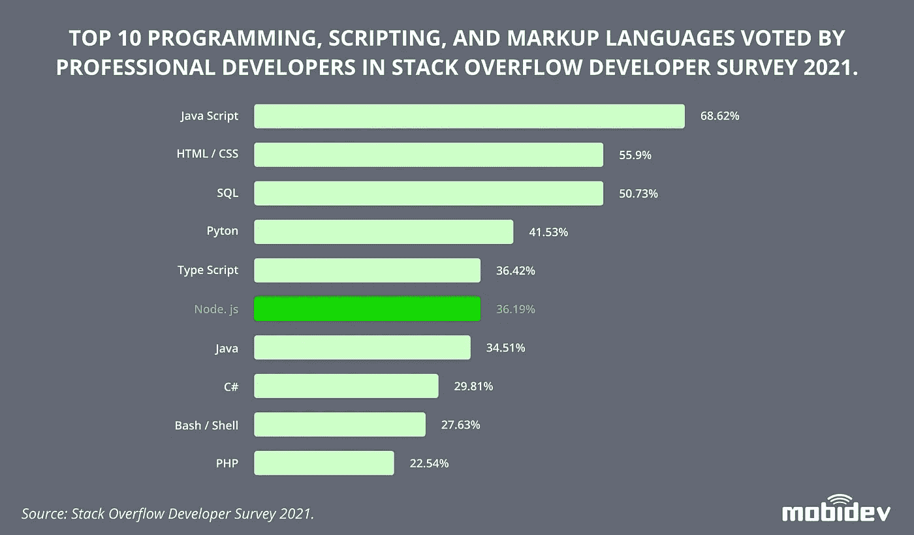
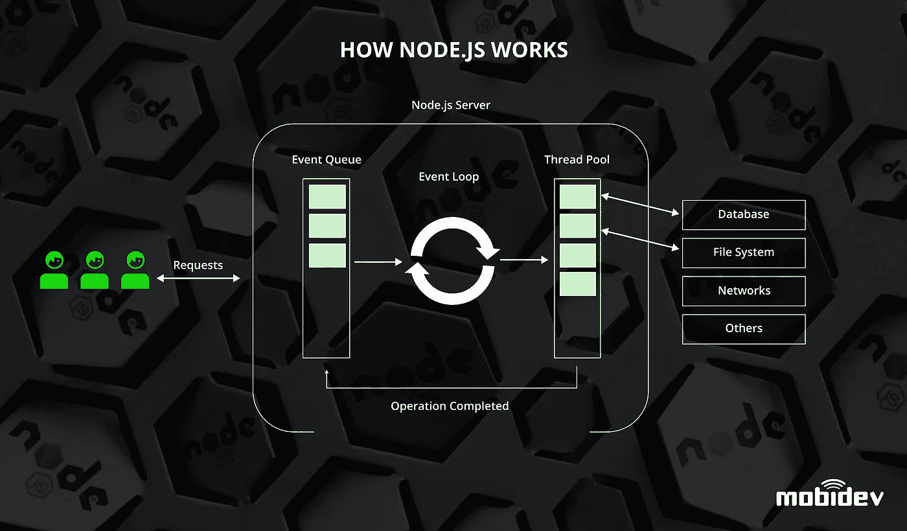
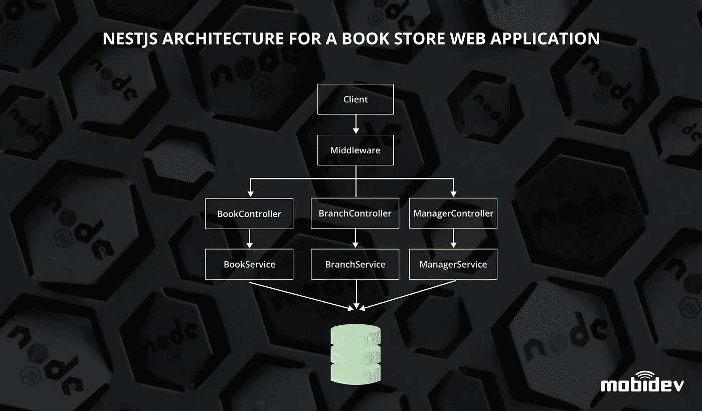
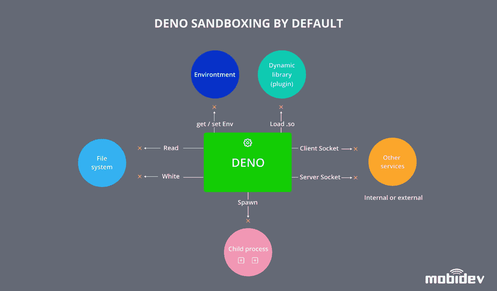

# 2022 年使用 Node.js 进行后端 Web 开发

> 原文：<https://medium.com/geekculture/using-node-js-for-backend-web-development-in-2022-f2917c6c0a87?source=collection_archive---------2----------------------->

[Image credit](https://unsplash.com/photos/j0TOma0mHdc)

开发现代软件应用程序是任何成长型企业的基本任务。幸运的是，应用程序开发技术的不断进步为企业所有者和项目经理提供了大量的选择。然而，可用技术的广度可能是压倒性的。根据您确定的目标和优先事项，为您的企业选择合适的技术组合非常重要。

Node.js 是目前广泛使用的一种技术。作为一种现代应用程序框架，Node.js 已被许多公司采用来构建他们的后端技术堆栈。它的使用在各行各业都被视为服务器端应用程序开发的一个流行选项。

如今 Node.js 的受欢迎程度正呈指数级增长。Node.js 目前被知名公司使用，如[网飞](https://netflixtechblog.com/making-netflix-com-faster-f95d15f2e972)、[优步](https://eng.uber.com/uber-tech-stack-part-two/)、 [PayPal](/paypal-tech/node-js-at-paypal-4e2d1d08ce4f) 、 [Twitter](https://blog.twitter.com/engineering/en_us/topics/open-source/2017/how-we-built-twitter-lite) 等等。根据 StackOverflow 的 2021 年开发者调查，Node.js 在程序员中被列为第六大最受欢迎的技术(尽管这也包括 Javascript、SQL 和 TypeScript，因为它们在 Node.js 开发中使用),超过三分之一的专业开发人员将其排在首位。

但是 Node.js 是什么呢？它是如何工作的，它在今天的技术和商业环境中仍然相关吗？更重要的是，为什么那么多大牌公司和专业开发者都在用？这些是我们将在本文中回答的问题。

# 什么是 Node.js，它是如何工作的

就应用程序栈而言，Node.js 呈现了前端和后端技术的有趣交叉。Node.js 构建于 JavaScript 之上，JavaScript 传统上是一种前端客户端 web 脚本语言，node . js 扩展了 JavaScript 的功能，使其可以在 web 应用程序架构的后端服务器端部分以及无服务器架构上运行。

Node.js 通过在服务器上自己的运行时内执行来实现这一点。一个很好的类比是 Node.js 和 Java 之间的比较，Java 也在自己的运行时内运行应用程序。Node.js 运行时被设计为轻量级和高效的，具有非阻塞 I/O 和包管理器，使得在 Node.js 生态系统中构建应用程序更加容易。

Node.js 的包管理器称为 npm。它的目的是作为 Node.js 开发人员社区构建的库的索引，这些库很容易被其他项目共享和导入。这些包为简化搭建新项目和改进旧项目的常见功能和代码提供了有用的解决方案。

# Node.js 框架/方法

尽管 Node.js 本身是一个功能强大、用途广泛的平台，但仍有一些框架/方法构建在 Node.js 之上，对其进行进一步改进。

# NESTJS

NestJS 是一个开源的、可扩展的、通用的 Node.js 框架，它包含了 TypeScript(一种强类型编程语言 JavaScript 的超集)。它建立在 Express 和 Fastify 等其他 Node.js 框架的抽象之上。这种抽象使得学习和快速构建项目变得容易。

NestJS 建立在模块、提供者和控制器的概念之上。模块是组织在一起的代码的逻辑单元。每个应用程序至少有一个根模块，但是随着代码的组织，可以在此基础上构建更多的根模块。提供者是代码的抽象，可以作为依赖项注入。控制器处理来自客户端的传入请求，以执行应用程序逻辑并返回响应。

NestJS 框架非常适合 TypeScript 的优点和其他抽象框架的优点。易用性和可扩展性也有利于围绕微服务架构开发应用程序。该框架提供了一个严格的项目结构，并暗示了几个程序员的团队工作，这有助于建立一个较少错误的开发过程。

# 电子

JavaScript 主要是一种用于 web 应用程序开发的语言，因此基于它构建的大多数框架也是为 web 设计的是有道理的。然而，Electron 结合了 Chromium 渲染引擎和 Node.js 运行时，并允许使用 JavaScript 开发桌面应用程序。

[电子](https://www.electronjs.org/)通过允许程序员用 HTML5 和 CSS 等平台无关的 web 语言编写这些应用程序，简化了桌面应用程序的开发。这也使得这些应用程序的打包和安装更加容易。

因此，当您的业务使用需要一个桌面应用程序，而不需要为不同平台开发本地应用程序的复杂性和冗余性时，可以考虑使用 electronic。电子框架对网络语言的使用加速了开发过程，减少了新产品的上市时间。

# 德诺

[Deno](https://deno.land/) 由 Node.js 的创建者于 2018 年发布，旨在解决 Node.js 开发者和用户经历过的许多问题。具体来说，这些包括解决围绕安全性、模块和兼容性的问题。

像 Node.js 一样，Deno 运行时在自己的应用程序中执行代码。然而，Deno 程序更安全，因为运行时在沙箱中执行，与底层文件系统隔离。这增加了安全性，防止攻击者“突破”可执行运行时并获得对运行代码的服务器的访问。

Deno 还消除了对像 Node.js 的 npm 这样的集中式包管理器系统的需求。它允许通过 URL 直接导入模块，并在宿主 URL 不可用的情况下缓存这些模块。

最后，Deno 支持 TypeScript，并努力增强浏览器兼容性。出于这些原因，有一些[公司](https://github.com/denoland/deno/wiki#companies-interested-in-deno)已经表示有兴趣在他们自己的用例中采用 Deno，但是你应该记住，它还没有得到主要云提供商的支持，所以应该使用 [Docker images](https://github.com/denoland/deno_docker) 。

# 为什么使用 Node.js

Node.js 是许多不同类型用例的适用解决方案。作为一个主要的服务器端框架，Node.js 适用于技术栈后端的应用程序。下面是使用 Node.js 有意义的几个例子。

# 具有实时通信的轻量级快速应用程序

了解产品的规模对于选择合适的技术来构建产品是至关重要的。Node.js 灵活高效的特性有助于构建小型、快速和可伸缩的应用程序。即时消息和协作工具等实时应用程序就是一个例子。这一点，再加上 Node.js 的快速同步能力，也使它对基于事件的应用程序非常有用。这些例子包括使用 WebSockets 和 WebRTC 的应用程序。

# 无服务器和微服务架构

由于其灵活性，Node.js 非常适合构建无服务器和基于微服务的应用程序。这些设计风格在节省资源和有效管理应用程序生命周期方面都非常流行。

[无服务器架构](https://www.serverless.com/)因其能够节省计算成本而广受欢迎，因为它只需要应用运行所需的资源，无需额外开销。这些应用程序是无状态和轻量级的。这使得 Node.js 与无服务器架构的集成成为一个很好的组合。有用于无服务器设计的 npm 包，当服务器负载不稳定时，构建无服务器 Node.js 应用程序在 C2C 和 B2C 用例中与整体微服务架构配合良好。

# 物联网

Node.js 非常擅长处理并发连接。由于物联网建立在许多发送必须快速处理的小消息的设备上，Node.js 为这类应用程序提供了一个很好的后端，提供了无服务器架构和实时通信支持。

# 音频/视频处理

Node.js 处理异步输入和输出比其他技术好得多。因此，当与外部媒体工具结合使用时，Node.js 可以用作处理多媒体数据的选项。例如，可以使用 Node.js 轻松配置流设置。

# 迅速发展

Node.js 构建在通用 web 语言之上，易于使用，这使得加速时间非常短。新产品可以快速制造出来，并毫不延迟地推向市场。这样做所需的工程资源量也因此而减少。

我们的一个案例表明 Node.js 可以帮助满足严格的截止日期。该产品是一个面向冰雹损坏修复承包商和客户的在线市场，计划在旺季开始前推出。在 PHP 和 Node.js 之间进行选择，我们决定使用 Node.js 来满足功能需求和最后期限。使用同构架构允许我们减少开发时间。

# 与 C++代码集成

Node.js 能够与现有的 C++库无缝集成。这是因为 Node.js 运行时本质上是在运行于主机节点上的 C++服务器上构建的。这允许 Node.js 在 C++和应用程序代码之间快速传输数据。

# 将 Node.js 与其他后端技术进行比较

Node.js 与其他技术截然不同，这似乎令人困惑，它们之间的差异可能不会立即显现出来。毕竟，每个框架都是为一个目的而设计的。下面是 Node.js 和类似技术之间的一些最常见的比较。

# Node.js vs Java

将 Node.js 与 Java 进行比较是很常见的，因为每个工具都在自己的运行时环境中运行程序。然而，这是大多数相似之处的终点。Java 是一种编译的、面向对象的编程语言，语法类似于 C++。Java 程序通常很大，开发成本很高。相比之下，Node.js 程序是轻量级的，并且基于像 JavaScript 这样的非编译 web 语言。它也更适合于 I/O 应用程序和高效的服务器端 HTTP 请求处理。

因此，尽管 Java 和 Node.js 在运行时应用程序中可能有相似之处，但它们的用例实际上是非常不同的。由于事件循环，Node.js 在操作 I/O 应用程序时效率更高，而 Java 的线程池在复杂计算时更强大。然而，我们可以在一个项目中利用这两种微服务。

# Node.js vs Python

Python 是一种广泛流行的编程语言，因为它语法简单，易于使用。这些使得在 Python 中构建新的项目非常容易，这导致了它的流行，并解释了它与 Node.js 的相似性。然而，Python 是另一种像 Java 一样的面向对象语言。即使它是解释的(像 JavaScript)，它的程序也会消耗大量的计算资源。

然而，它在大型项目中很有用，例如人工智能和数学密集型模拟，而 Node.js 在这些领域没有用处。Python 的库使得构建应用程序逻辑变得更加容易，但是它的架构使得性能具有挑战性，并且需要非常熟练的程序员参与。

# 何时不使用 Node.js

有哪些不应该使用 Node.js 的情况？

# 开发财务软件

不幸的是，在财务领域，Node.js 是绝对不推荐使用的，因为浮动小数点的工作细节——它会导致处理财务的变量中的错误累积，这是不可接受的。有工具可以让你用高精度的计算建立逻辑；然而，它们都有缺点，必须明智地使用。我们自己的财务管理解决方案的好例子是基于 Ruby 的。

# 具有复杂 CPU 计算的应用

当处理涉及 CPU 的高负载线程时，Node.js 不是最佳解决方案。一个很好的例子是在后端编写音频和视频处理，而不是上述推荐使用的外部处理工具，例如 ffmpeg / imagemagic 或 C++或 Go 的外部库。

# Node.js 年及以后的趋势

Node.js 作为一种流行的后端技术的统治地位已经确立。随着目前超过 2000 万网站采用 Node.js，node . js 肯定会在可预见的未来继续使用。但展望 2022 年及以后，这种受欢迎程度将如何演变？

Deno 作为 Node.js 替代品的出现是一种趋势，这种趋势看起来会继续下去。随着越来越多的企业扩展到 web 技术领域，Deno 对安全性和兼容性的改进是非常必要的。与 Deno 一样，NestJS 由于其可扩展性和模块化，使其能够灵活地适应不断增长的应用程序，正在获得越来越多的采用。

向无服务器和微服务应用程序设计的广泛转变推动了对可伸缩性的需求。这些小的、轻量级的架构风格与传统软件设计的大块不同。轻量级应用程序更便宜，更容易构建，它们的反应性使它们非常适合实时应用程序和物联网。

# 包裹

总之，Node.js 的用例数量已经很大，并且随着其他技术领域的进步也可以应用于 Node.js，用例数量还在继续增长。没有迹象表明这种增长会很快放缓。因此，通过适当的研究和正确的用例，Node.js 可以成为现在和未来构建许多不同类型产品的绝佳选择。

没有“好”或“坏”的技术。每一个都适合其特定的任务。每个软件产品所有者都必须根据业务目标和现有的约束来确定最重要的选择标准——在此之后，选择将变得更加明显。

由 MobiDev 的 JavaScript 小组负责人塞维多夫·卢恰尼诺夫撰写。

*全文原载于*[*https://mobidev . biz*](https://mobidev.biz/blog/node-js-for-backend-development)*基于 mobi dev 技术研究。*