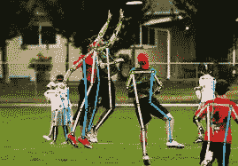
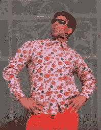
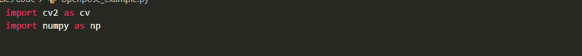
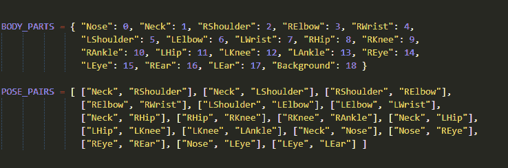
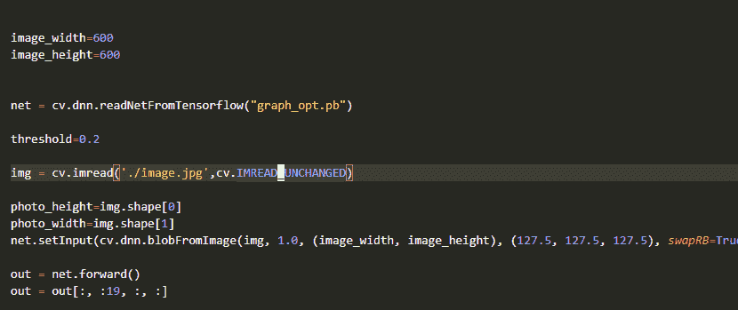
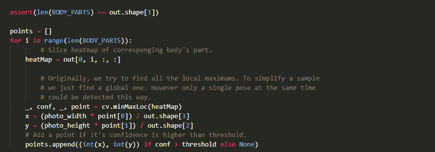
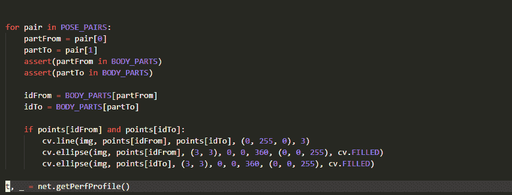
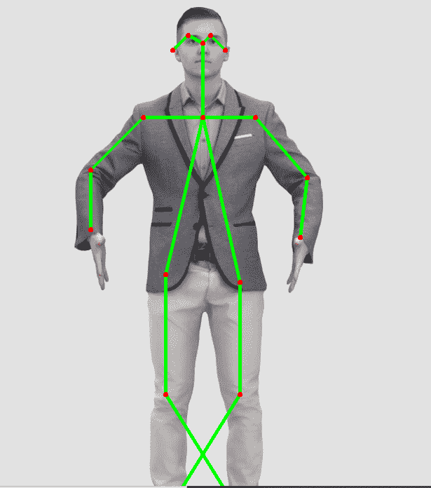

# 结合 openpose TensorFlow 和 OpenCV 使用 python 中的 openpose 库

> 原文：<https://medium.com/geekculture/using-openpose-library-in-python-with-openpose-tensorflow-and-opencv-10a5496c359a?source=collection_archive---------4----------------------->

Openpose python GitHub 链接在最后，所以也来看看吧。

大家好，今天就来说说“Openpose ' '吧(因为大家都在说)。让我们从头开始，我们想到的第一个问题是什么是开放式，为什么每个人都在谈论它？

Openpose 是一个用 C++编写的流行的姿态估计开源库，但是 openpose 的所有者和创建者同情 Python 程序员，因此他们也为我们提供了 PyTorch、Keras 和 TensorFlow 实现，以便 Python 程序员也可以使用它。(感谢主人对易道程序员的照顾)。

**open pose 能做什么？**

所以作为一个姿态估计库，但是我们先来了解一下什么是姿态估计？

*姿势估计不是什么复杂的东西。它是一种计算机视觉技术，使计算机能够确定视频图像中任何对象的姿态，视频图像是运动图像的集合。*

简单来说，姿势估计是一种告诉计算机一个物体正在做出什么姿势的技术，例如，你有一张自己的照片，照片中你站着，同时像这样把手放在腰上—

因此，使用姿势估计技术，你可以告诉你的电脑，“嘿，你这个盲人机器，照片中的人一直把手放在腰间。”并让您的计算机看到您在图片中所做的姿势。

所以基本上这就是 openpose 所做的。

你也可以在视频中使用姿势估计，不仅仅是在图像中，它真的很好用。

**为什么要用 Openpose？**

所以现在我希望你对什么是姿态估计有一个很好的了解。现在让我们来看看为什么我们应该特别使用 Openpose 库。

1.  使用 openpose 的第一个原因是，它真的很快。它是用 C++写的，我们都知道我们的 C++马有多快。
2.  第二个原因是，这是你能找到的唯一免费的好姿势估计开源库。

我不认为你需要知道第二个原因之后的其他原因，但我也想告诉你其他原因。

3.第三个原因是，如果在一个图像和视频中有多个人和物体，那么 too Openpose 将完美地完成它的工作，并将检测每个人的每个姿势、关节点和每个关键点。这是**“第一个在单一图像上联合检测人体、手、面部和脚关键点(总共 135 个关键点)的实时多人系统。”**

4.使用 Openpose 的最后一个原因是，它在 TensorFlow、Keras 和 PyTorch 中也有 python 实现，这是激励 Python 编码人员使用 openpose 的唯一原因。它在 Tensorflow 和 Keras 中的实现使得它非常容易使用，因此编码人员可以实现 openpose 并以他们想要的任何方式使用它。

这些都是激励你使用开放式姿势的原因，如果我没有做到，请在评论中告诉我。

让我们深入 python 内部 openpose 的实际实现。

**如何使用 TensorFlow 和 OpenCV 将 openpose 与 python 配合使用？**

我们现在将看到如何使用 Openpose。为此，我们将使用 TensorFlow 和 OpenCV，好的，让我们开始吧。

为了演示，我们将使用这张照片:

让我们开始吧

*   首先导入这些库:

*   现在我们需要定义身体部位及其配对:

*   我们还必须分配一个需要裁剪的图像。

创建一个 openpose 移动网络(说真的，我不知道它是什么，但每个人都使用它)，并将我们的图像分配到该网络中，获得输出并对输出进行切片。

*   将身体部位分配到我们需要强调的地方:

*   制作一对身体部位，用线将一个部位连接到另一个部位，并在连接点或点处创建一个椭圆:

*   现在简单展示一下图像:

结果是:

让我们在我之前给你们看的图片上试试，结果—

不像预期的那样，但是看起来很好。

自己试试这个，在[我的 Instagram](https://www.instagram.com/aviar.org_/) 上给我发 DM。如果你对 Openpose 有任何很酷的项目想法，我很乐意和你一起做这个项目。

是的，代码在我的小组的 GitHub 页面上

【https://github.com/Aviar-org/openpose_example 

就这些了，再见，也请跟我来。我写了一些很棒的文章，可能会引起你的兴趣。

订阅我的**免费**电子邮件时事通讯，我会告诉你关于网页开发和设计的相关新闻，还会免费给你高级网页设计、图形用户界面、脚本等代码，所以也来看看吧——

订阅我的免费电子邮件简讯。