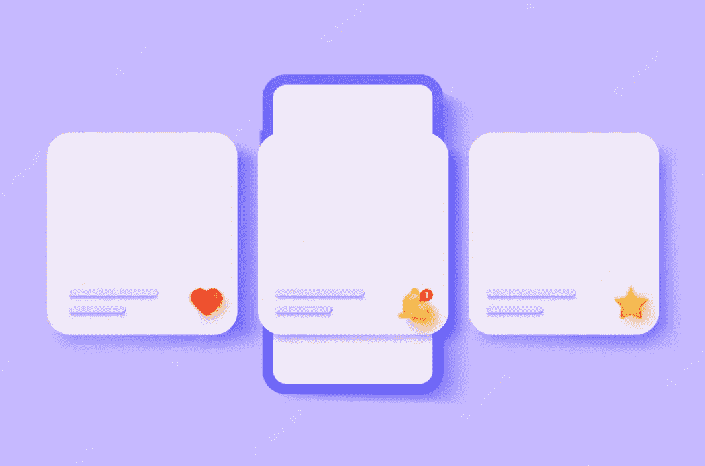
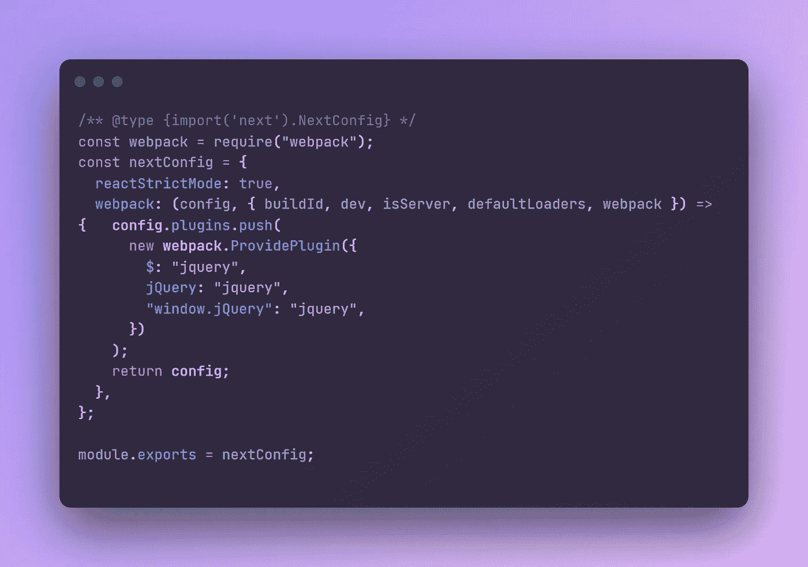
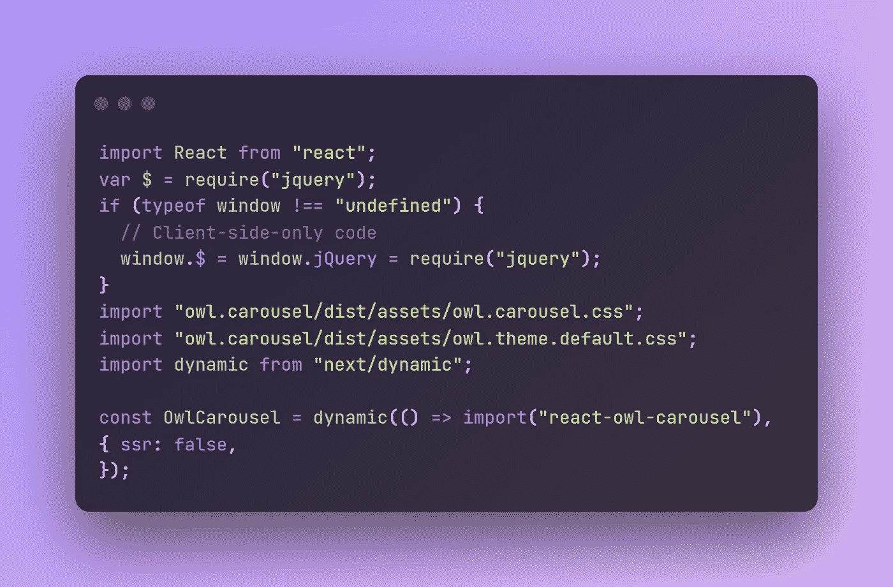
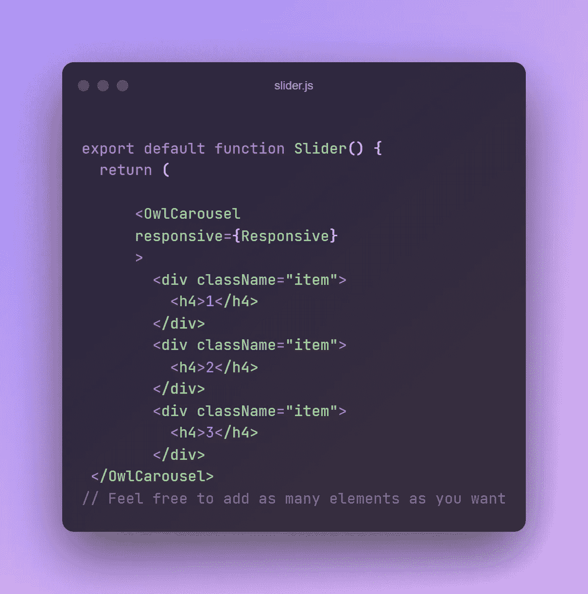
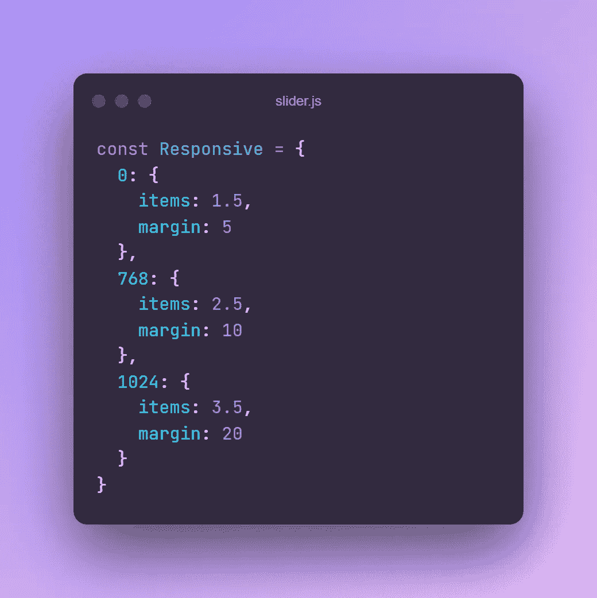
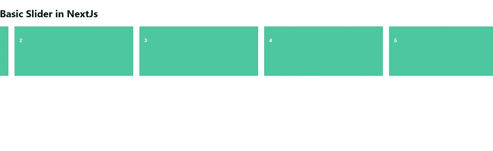

# 通过 NextJs 使用 Owl Carousel

> 原文：<https://medium.com/geekculture/using-owl-carousel-with-nextjs-e63a166225b0?source=collection_archive---------0----------------------->

在这里，我们将学习如何初始化一个简单的 next 应用程序，并使用每个开发人员最喜欢的滑块:Owl Carousel



Source: FreePik

如果你想跳过我不必要的演讲，你可以在这里查找知识库:[https://github.com/Uny1me/owl-nextjs](https://github.com/Uny1me/owl-nextjs)

如果你只是听说过 Netxt.js，还没有真正涉足它:

Next.js 是一个灵活的 **React 框架**，它给你构建快速 **web 应用**的基础。

另一方面:

> Owl carousel 是一个支持触摸的 jQuery 插件，可以让你创建一个漂亮的响应性 carousel 滑块。

我应该指出，在 StackOverflow 上有很多问题和失败的尝试，所以如果你遇到任何需要帮助的人，请随时向他们推荐这篇文章。

# 开始:设置下一个项目

第一步是初始化你的下一个项目。

```
npx create-next-app@latest
# or
yarn create next-app
```

设置完成后，在控制台中，

```
npm run dev
```

现在，下一步是安装 owl carousel，请在这里查看或使用命令:

```
npm i react-owl-carousel
npm i jquery
```

转到 pages 文件夹，创建一个名为 slider.js 的文件，并导出 slider 函数，如下所示:

```
import React from “react”;export default function Slider() {
    return <div>Hello</div>;
 }
```

在我们继续之前，还有一些配置要做:

## 在 next.config.js 文件中

在 nextConfig 函数之前导入 webpack，使用

```
const webpack = require("webpack");
```

然后把这个加到函数里，

```
webpack: (config, { buildId, dev, isServer, defaultLoaders, webpack }) => {
   config.plugins.push(
    new webpack.ProvidePlugin({
    $: “jquery”,
    jQuery: “jquery”,
    “window.jQuery”: “jquery”,
 }));return config;
```

你的文件是这样的:



next-config.js

> 您可能会收到一个错误，告诉您在 slider.js 中没有定义**窗口**，继续添加以下代码:

```
var $ = require(“jquery”);
if (typeof window !== “undefined”) {
   window.$ = window.jQuery = require(“jquery”);
}
```

下一步是加载所需的样式表和 JS:

```
import "owl.carousel/dist/assets/owl.carousel.css";
import "owl.carousel/dist/assets/owl.theme.default.css";
```

这样您的 slider js 文件看起来就像这样:



slider.js

接下来，我们需要将 owl carousel 组件导入到我们的应用程序中，我们将使用 Next.js 动态导入

```
import dynamic from “next/dynamic”;const OwlCarousel = dynamic(() => import(“react-owl-carousel”), {
  ssr: false,
});
```

*动态导入允许仅在需要时渲染库，而不会加重整个应用程序的负担，并且我们将服务器端渲染设置为 false，以防止它在渲染组件时发送新的 HTML 页面如果我错了请纠正我*

现在我们都设置好了，你的猫头鹰转盘应该完全加载好了。

# 自定义

这部分不是强制性的，但是这里有一个简单的方法可以用来定制你的转盘。

## **CSS**

我们必须让它看起来漂亮，不是吗？

```
.item {
 height: 10rem;
 background: #4dc7a0;
 padding: 1rem;
 color: white;
 font-family: Arial, Helvetica, sans-serif;
}
```



对于 responsive 参数，我创建了一个对象来避免下面混乱的代码:



享受你的滑球！



Finished Preview