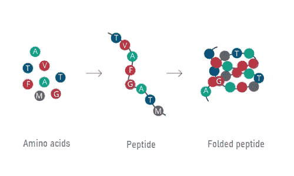
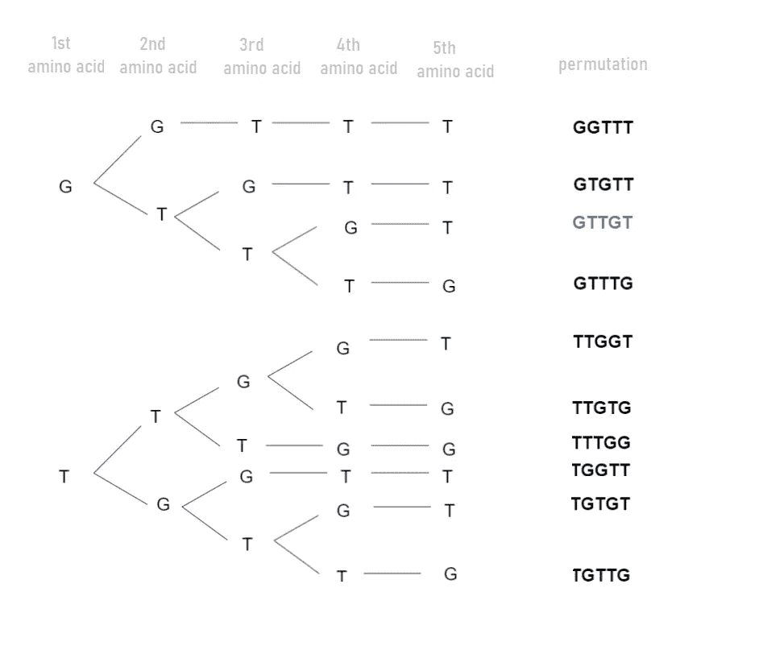

# 在生物学的例子中使用排列

> 原文：<https://medium.com/geekculture/using-permutations-in-a-biological-example-29844d97b0cf?source=collection_archive---------32----------------------->

学习统计学的第三天我学到了什么

Photo by [Bud Helisson](https://unsplash.com/@budhelisson?utm_source=medium&utm_medium=referral) on [Unsplash](https://unsplash.com?utm_source=medium&utm_medium=referral)

# 介绍

肽和蛋白质是大分子，这意味着它们是由更小的分子构成的，更小的分子是链状结合的氨基酸。简而言之，肽和蛋白质可以被描述为氨基酸序列。

Picture by [drsusanmarra.com](http://drsusanmarra.com/peptides/)

在我以前在课堂上或实验室的经历中，我通常通过肽(或蛋白质)的生物学作用、它们的 3D 结构、它们与其他分子的相互作用以及它们的生化特征来检查它们。

我对组合学的短暂接触为我思考蛋白质和肽创造了一个额外的视角。

# 个案研究

免疫球蛋白重多样性 1–1**(也被称为**igh D1–1**)是一种肽，研究人员发现它是抗体重链的一部分，参与抗原识别和免疫的建立。**

**igh D1–1 具有以下氨基酸序列: **GTTGT****

> **igh D1–1 的氨基酸序列是一组 5 个有序元素！**
> 
> **注意，在这个 5 元素组中，氨基酸甘氨酸(G)出现了 2 次，氨基酸苏氨酸(T)出现了 3 次。**

**总之，肽 igh D1–1 的氨基酸序列是来自集合 X = {G，T}的一组 5 个有序元素(n=5 ),其中元素 G 使用两次(n1=2 ),元素 T 使用三次(n2=3)。**

**根据组合学的规则，来自集合 X = {G，T}的 5 个有序元素(n=5)的排列数等于:**

****

**排列的数量很少，我们可以尝试用树形图将它们形象化。**

****

**igh D1–1 氨基酸序列(GTTGT)是元素{G，T}的 10 种排列之一，使用 G 两次，T 三次。剩下的 9 个氨基酸组合(GGTTT，GTTTG，TGTGT，…)完全没有被大自然利用？**

**随着对 UniProt 蛋白质数据库的进一步研究，我发现剩下的 9 种氨基酸组合都没有在数据库中注册。这意味着它们要么还没有被发现，要么根本不存在！**

# **概念:自然从许多选项中做出选择**

**从组合学的角度来看，大自然可能会显得很挑剔。在 ig hd1–1 的情况下，我们可以说大自然可能从 10 个氨基酸组合中挑选了 1 个来形成功能肽。对于更长的肽和蛋白质，自然会显得更加挑剔，因为可能的组合数量随着长度的增加而增加。**

**我们只需要想到，对于一个 10 个氨基酸长的肽，我们用来计算排列数的片段的共轭子是 10！等于 3，628，800。**

# **关于我的学习之旅**

**我的目标是在接下来的 21 天里每天学一点统计学。我将学习基础知识，以巩固我的统计知识，并为更高级的数据科学概念打下坚实的基础。**

**这个挑战是更大挑战的一部分，即#66daysofdata 挑战！要了解更多关于#66daysofdata 挑战赛的信息，请点击[此处](https://www.youtube.com/watch?v=uXLnbdHMf8w)和[此处](https://www.youtube.com/watch?v=qV_AlRwhI3I)。**

# **资源**

**[概率统计导论](https://www.dardanosnet.gr/product/isagogi-stis-pithanotites-ke-ti-statistiki/)，乔治·帕帕多普洛斯、古腾堡(希腊语)**

**感谢您的阅读**

**要查看我的 UniProt 分析的代码，请点击[这里](https://github.com/ReaKal/Uniprot)**