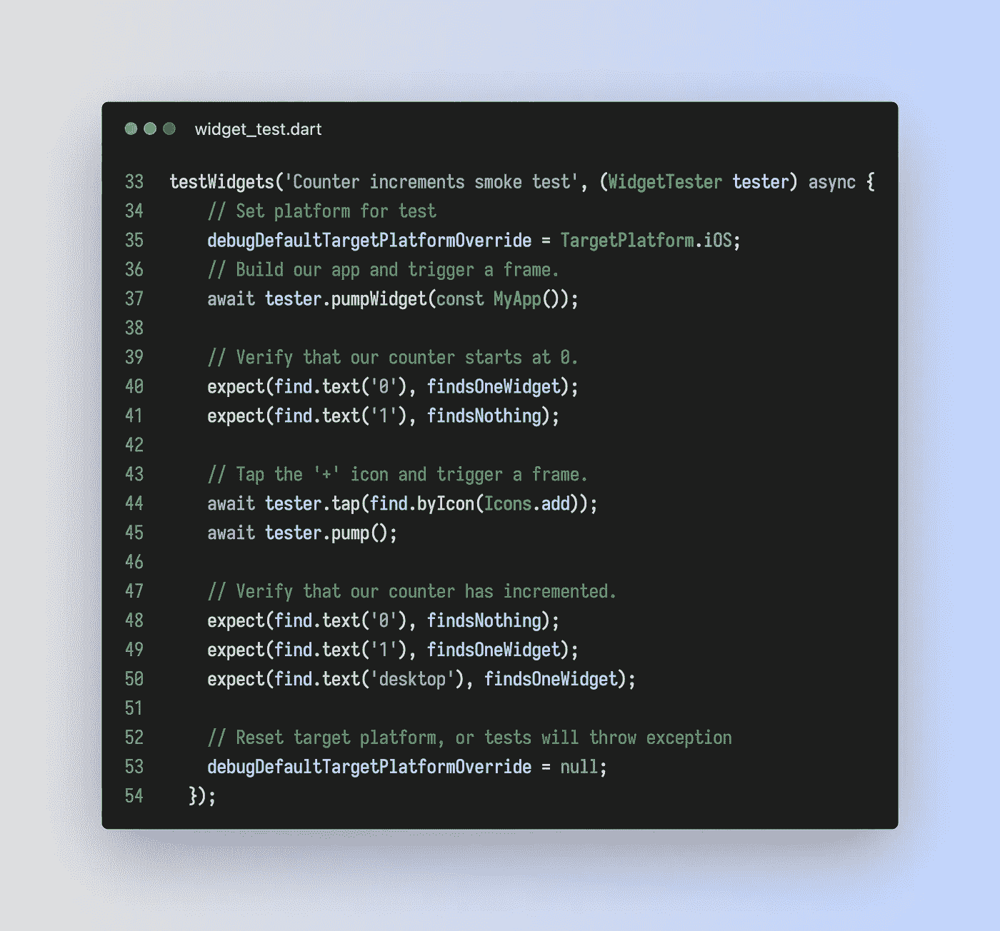
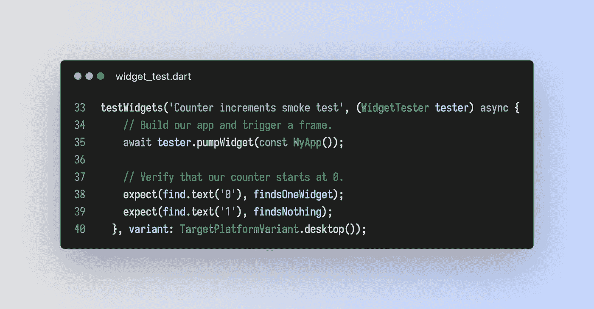
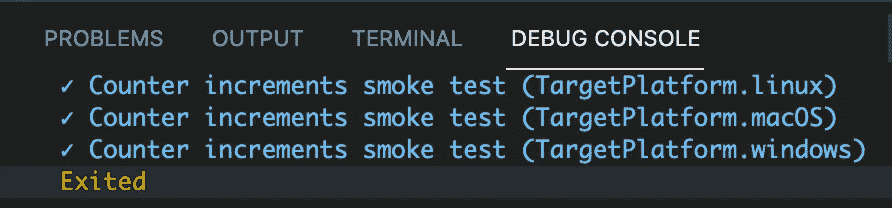
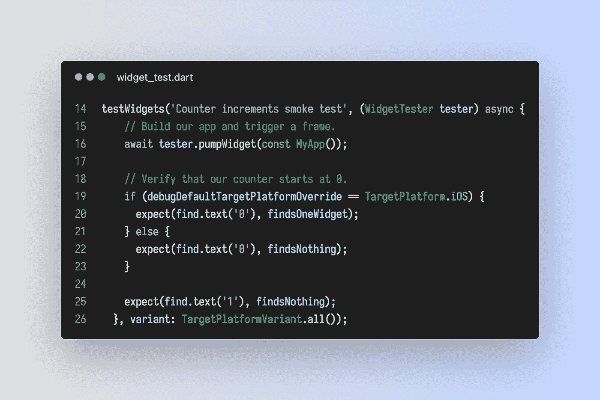

# 测试 flutter 小部件时使用平台变体

> 原文：<https://medium.com/geekculture/using-platform-variants-when-testing-flutter-widgets-d3a750d452f0?source=collection_archive---------14----------------------->

随着 Flutter 从主要关注移动设备开发发展到包括桌面和 web，在所有可能的平台上测试您的小部件变得越来越重要。

Flutter 使得使用`theme.of(context).platform`检查您的代码运行在哪个平台上变得容易，然后对照`TargetPlatform`枚举进行检查。当您编写测试时，您应该确保您的小部件在任何平台上都能按预期执行或显示。

从历史上看，这样做的方法是用测试中的`debugDefaultTargetPlatformOverride`设置来编写测试，并确保小部件按预期工作。如果我们使用默认的 flutter 应用程序和用它创建的默认测试，我们可以修改如图所示的测试，以确保我们的小部件在 iOS 上工作(默认情况下，所有测试都在 Android 上运行)。还要注意需要将`debugDefaultTargetPlatformOverride`重置为零，否则测试将失败。

当我们确保我们的小部件在 Android 和 iOS 上工作时，这已经足够好了。但是，当你想检查是否所有的东西都运行在所有的桌面版本(Linux，Windows，Mac)上，以及所有的移动版本上时，这就变得很麻烦了。随着我们向前发展，我认为最好确保所有的小部件都经过了所有平台的测试。

## 出现了变体

`testWidgets`函数有一个名为`variant:`的参数，可用于运行测试的多个变量。您可以通过子类化`TestVariant`类来创建您的变体。点击查看课程文档[。Flutter 提供了这个类的一个具体实现，叫做`TargetPlatformVariant`。这个实现为`all`、`desktop`、`mobile`和`only`内置了构造函数。让我们来看看上面这个实现的默认测试的一个较小版本:](https://api.flutter.dev/flutter/flutter_test/TestVariant-class.html)

如我所说，我只是缩短了`testWidgets`函数以节省空间。关注添加的`variant:`参数。就这么简单。如果我运行这个测试(在 VSCode 中)，这是调试窗口中的输出:

您可以看到，一次测试自动运行了 flutter 支持的所有桌面变体的测试。我倾向于只用`TargetPlatformVariant.all()`。这很容易做到，它只是确保特定平台不会出现意外问题。

## 测试期间检查目标平台

即使您选择在所有平台上运行测试，您也可能会遇到在不同平台上得到不同结果的情况。这就是前面提到的`debugDefaultTargetPlatformOverride`的用武之地。您可以使用它来检查平台，并期待不同的结果。这里有一个例子(在默认的应用程序上下文中没有多大意义，但会向您展示我的意思):

不是最好的例子，但你应该明白了。尽管该版本将在所有平台上运行该测试，但对 iOS 版本的期望会有所不同。

## debugDefaultTargetPlatformOverride 的含义

`TargetPlatformVariant`和`debugDefaultTargetPlatformOverride`依赖于使用`Theme.of(context).platform`在您的代码中做出平台决策。有一些不同的 pub 包试图在做出平台决策时消除对`context`的需求。通过使用`[universal_platform](https://pub.dev/packages/universal_platform)`和`[GetX](https://pub.dev/packages/get)`(这恰好是我选择的状态管理解决方案，我认为是目前最好的一个)，我陷入了不可测试代码的陷阱。这些解决方案中的每一个(可能还有其他的)都允许您在没有上下文的情况下运行平台检查。但是，当您试图用`variant:`或`defaultDebugTargetPlatformOverride`运行您的测试时，您的代码将不会识别平台的变化，也不会像预期的那样运行。

我已经了解并接受了做平台检查需要一个`context`，如果你想给你的小部件添加测试，这就是生活的现实。

为了帮助自己，我创建了一个名为`RunningPlatform`的实用程序类，其中包含一组静态函数(都需要`context`)，让我可以在代码中进行几乎所有需要的平台检查。我只需`import '<path_to>/utils/running_platform.dart'`，然后使用`RunningPlatform.isDesktop(context)`(或任何其他实用函数)来做我的平台检查。我在下面提供了代码，如果有用的话，请随意使用。

随着 flutter 从它的移动根基发展到网络和桌面，我鼓励每个人理所当然地在所有平台上测试他们的所有小部件。另外，如果有人有更好/更简单的方法，请告诉我。