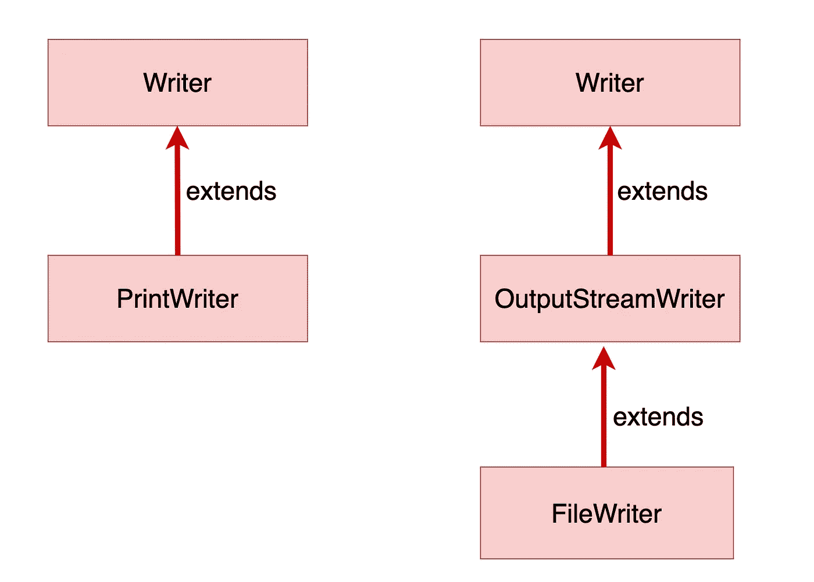

# 在 Java 中使用 PrintWriter 与 FileWriter

> 原文：<https://medium.com/geekculture/using-printwriter-vs-filewriter-in-java-2958df85f105?source=collection_archive---------7----------------------->

PrintWriter 和 FileWriter 是允许将数据写入文件的 JAVA 类。


```
**public static void** main(String[] args) {
    *//creating object of class File using path - is not the same as 
    //creating file*File filePrintWriter = **new** File(**"printwriter.txt"**);
    File fileFileWriter = **new** File(**"filewriter.txt"**);

    **try** { *//creating object of PrintWriter class with File object as          
        //parameter*PrintWriter  printWriter = **new** PrintWriter(filePrintWriter); *//using methods and close write inherrited from parent 
        //Writer*printWriter.write(**"I love Java"**); */*Closes the stream and releases any system resources 
        associated with it. It needs to be done
        to flush buffer*/*printWriter.close();

        *//creating object of FileWriter class with File object as   
        //parameter\*FileWriter fileWriter =  **new** FileWriter(fileFileWriter); *//using method write and close obtained throw multilevel 
        //inheritance from Writer*fileWriter.write(**"I love Java"**); */*Closes the stream and releases any system resources 
        associated with it.It needs to be done
        to flush buffer*/*fileWriter.close();

    } **catch** (IOException e) {
        e.printStackTrace();
    }
}
```

在上面的代码示例中，有下面两行

```
File filePrintWriter = **new** File(**"printwriter.txt"**);
File fileFileWriter = **new** File(**"filewriter.txt"**);
```

我们创建类文件的两个对象，这与创建文件不同。这些对象可以用来创建文件和使用它们。文件名作为参数传递(printwriter.txt 和 filewriter.txt)。

Java 迫使我们将代码放在 try-catch 块中，以捕捉可能发生的 IO 异常。

以下代码初始化允许创建 printwriter.txt 文件的 PrintWriter 对象，并在其中写入文本“我爱 Java”。

```
*//creating object of PrintWriter class with File object as parameter*PrintWriter  printWriter = **new** PrintWriter(filePrintWriter);*//using methods and close write inherrited from parent Writer*printWriter.write(**"I love Java"**);*/*Closes the stream and releases any system resources associated with it. It needs to be done
to flush buffer*/*printWriter.close();
```

这里创建了 FileWriter 对象，用于创建 filewriter.txt 文件，并在其中写入“我爱 java”。

```
*/creating object of FileWriter class with File object as parameter*FileWriter fileWriter =  **new** FileWriter(fileFileWriter);*//using method write and close obtained throw multilevel inheritance //from Writer*fileWriter.write(**"I love Java"**);*/*Closes the stream and releases any system resources associated with it.It needs to be done
to flush buffer*/*fileWriter.close();
```

输出:

```
**printwriter.txt:**
```

我喜欢 Java

```
**filewriter.txt**
```

我喜欢 Java

嗯嗯…


不管我们使用 FileWriter 还是 PrintWriter，结果似乎都是一样的。让我们深入研究 Oracle 文档，找出其中的区别。

PrintWriter:

 [## PrintWriter (Java 平台 SE 8)

### 与 PrintStream 类不同，如果启用了自动刷新，则只有当 println、printf 或……

docs.oracle.com](https://docs.oracle.com/javase/8/docs/api/java/io/PrintWriter.html) 

文件编写器:

 [## 文件写入器(Java 平台 SE 8)

### 文件是否可用或是否可以创建取决于底层平台。有些平台，在…

docs.oracle.com](https://docs.oracle.com/javase/8/docs/api/java/io/FileWriter.html) 

首先，我们看到 PrintWriter 和 FileWriter 都是 Writer 类的子类，这在某种程度上解释了为什么我们会得到相似的结果。



“PrintWriter”将对象的格式化表示打印到文本输出流中 PrintWriter 提供了格式化输出的方法(println()、printf())。看一下下面的代码:

```
**public static void** main(String[] args) {
        *//creating object of class File using path - is not the same 
        //as creating file*File filePrintWriter = **new** File(**"printwriter.txt"**);

        **try** {
            *//creating object of PrintWriter class with File object 
            //as parameter*PrintWriter  printWriter = **new** PrintWriter(filePrintWriter); *//using methods and close write inherrited from parent  
            //Writer*printWriter.write(**"I love Java"**); *//method to terminate the current line by writing the 
            //line separator string*printWriter.println(); *//unicode character for happy face* printWriter.append(**'\u263A'**);
            printWriter.println(); *//ASCII*printWriter.write(33);
            printWriter.println();
            *//method to write a formatted string to this writer 
            //using the specified format string and arguments*printWriter.printf(**"My name is %s"**, **"Awesome!"**);

            */*Closes the stream and releases any system resources associated with it. It needs to be done
            to flush buffer*/* printWriter.close();
} **catch** (IOException e) {
            e.printStackTrace();
        }
    }
```

输出:

```
I love Java
☺
!
My name is Awesome!
```

为了用 FileWriter 实现相同的结果，我们必须在输出之前应用格式化:

```
**public static void** main(String[] args) {
    *//creating object of class File using path - is not the same as creating file* 
    File fileFileWriter = **new** File(**"filewriter.txt"**);

    String newLine = System.*getProperty*(**"line.separator"**);

    **try** {
        *
        //creating object of FileWriter class with File object as   
        //parameter*FileWriter fileWriter =  **new** FileWriter(fileFileWriter);fileWriter.write(**"I love Java"**);
        fileWriter.append(newLine).append(**'\u263A'**).append(newLine);
        fileWriter.write(33);
        fileWriter.write(10); *//format() method of String class returns a formatted string 
        //using the specified format string and arguments*fileWriter.append(String.*format*(**"My name is %s"**, **"Awesome!"**));

        fileWriter.close();

    } **catch** (IOException e) {
        e.printStackTrace();
    }
}
```

FileWriter 是一个方便的类，它扩展了 OutputStreamWriter 并自己创建所需的 FileOutputStream。FileWriter 在一行中将数据写入文件。要放置一个新的行，我们必须使用一些特殊的字符，这些字符因系统而异。

FileWriter 无法写入原始数据。举个例子，

```
fileWriter.write(100);
```

将在输出中产生。

两条线:

```
fileWriter.write(10.5);
fileWriter.write(**true**);
```

会产生错误。

PrintWriter 有这样的方法:

```
**public static void** main(String[] args) { *//creating object of class File using path - is not the same as 
    //creating file* File filePrintWriter = **new** File(**"printwriter.txt"**);

    **try** {
        *//creating object of PrintWriter class with File object as 
        //parameter*PrintWriter  printWriter = **new** PrintWriter(filePrintWriter);
        *
        //print string and then terminate the line*printWriter.println(**"I love Java"**); *//print an integer and then terminate the line*printWriter.println(100);

        *//print a floating-point number and then terminate the line*printWriter.println(10.5);

        *//print a boolean value and then terminate the line*printWriter.println(**true**);
        printWriter.close();} **catch** (IOException e) {
        e.printStackTrace();
    }
}
```

输出:

```
I love Java
100
10.5
true
```

使用 PrintWriter 还是 FileWriter 取决于程序的需要。PrintWriter 似乎是一个更通用的选择。

快乐编码，我的朋友们！


您可以在此处找到代码:

[](https://github.com/forfireonly/MediumArticlesJava/blob/master/src/com/company/PrintWriterVSFileWriter.java) [## MediumArticlesJava/printwritervsfilewriter . Java at master for fire only/MediumArticlesJava

### 在 GitHub 上创建一个帐户，为 forfireonly/MediumArticlesJava 开发做贡献。

github.com](https://github.com/forfireonly/MediumArticlesJava/blob/master/src/com/company/PrintWriterVSFileWriter.java)