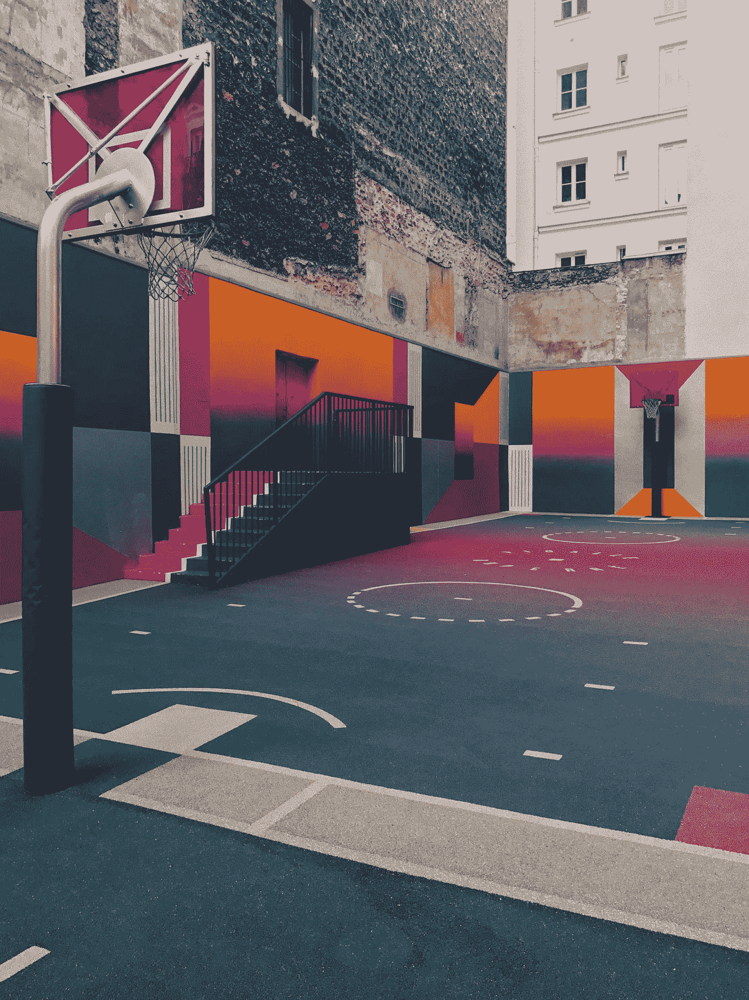
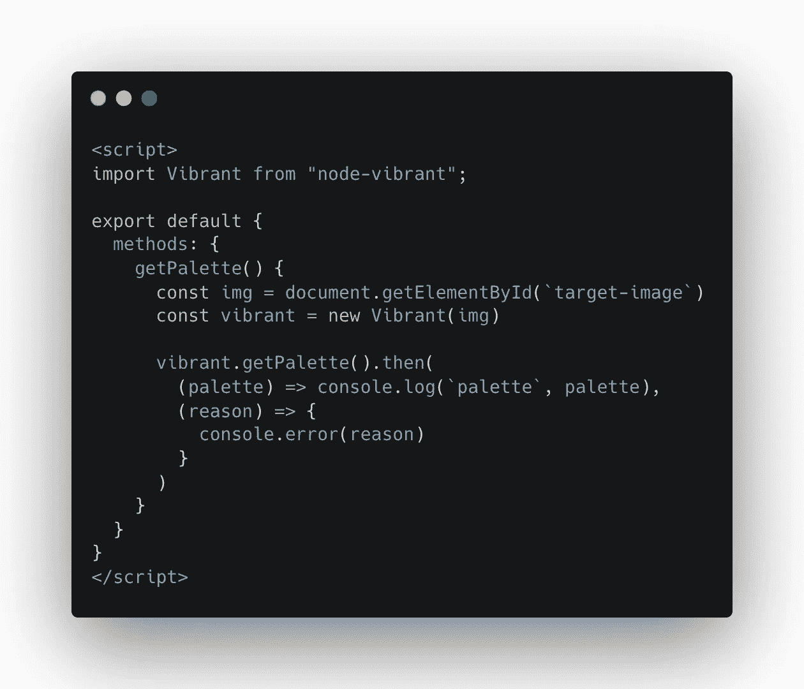
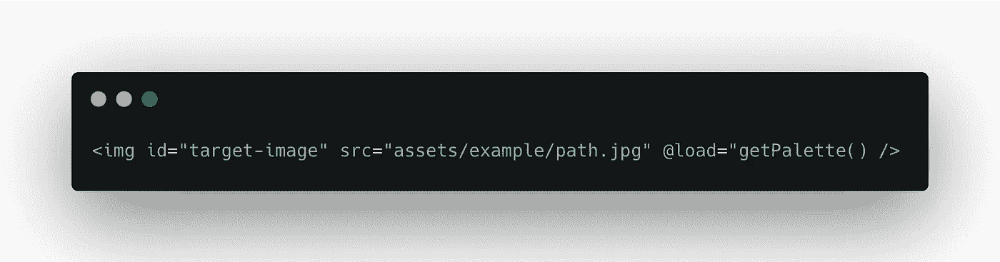
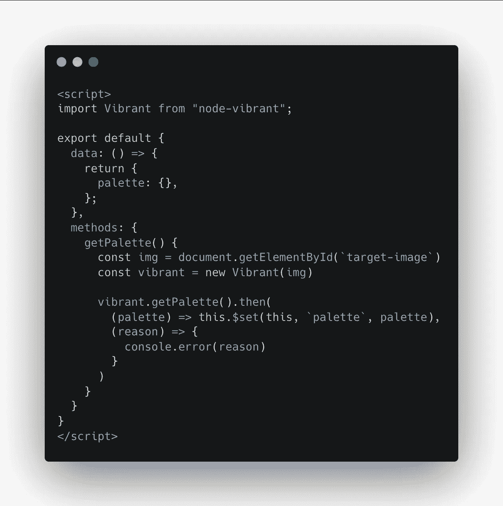
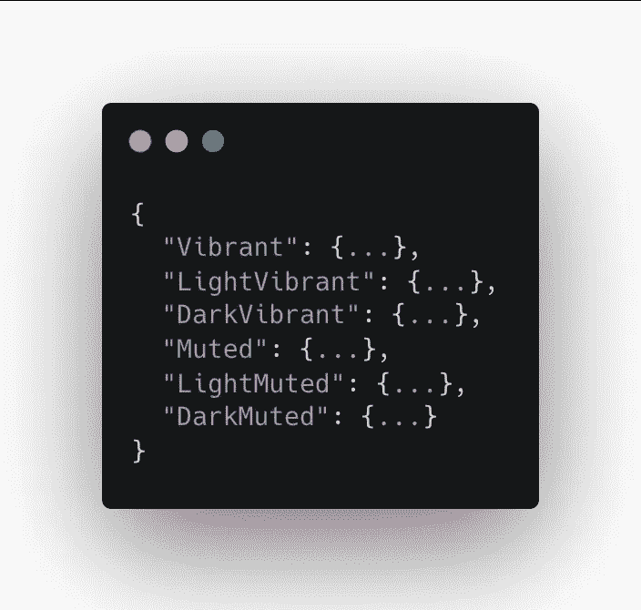
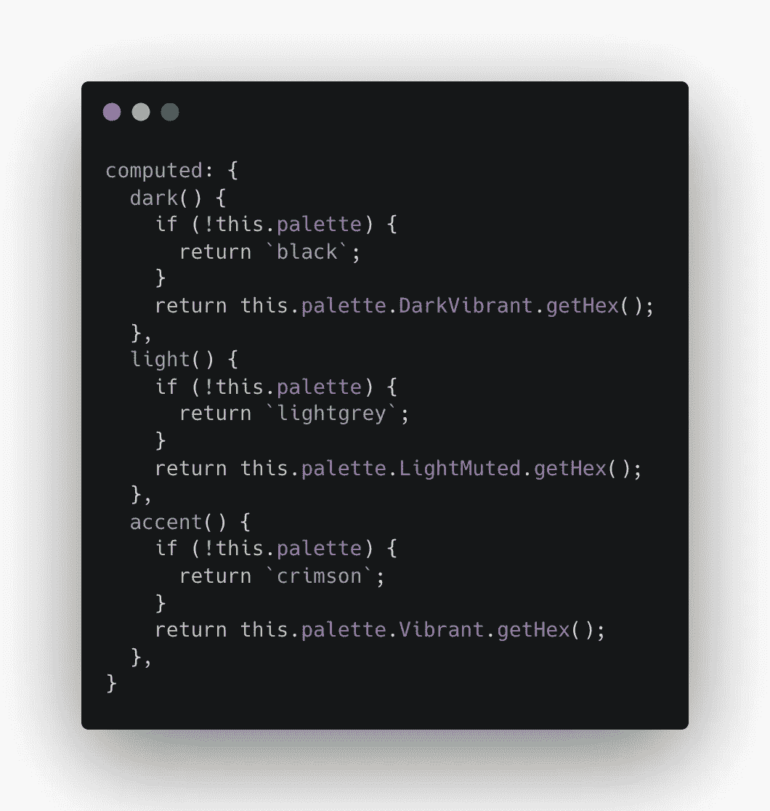
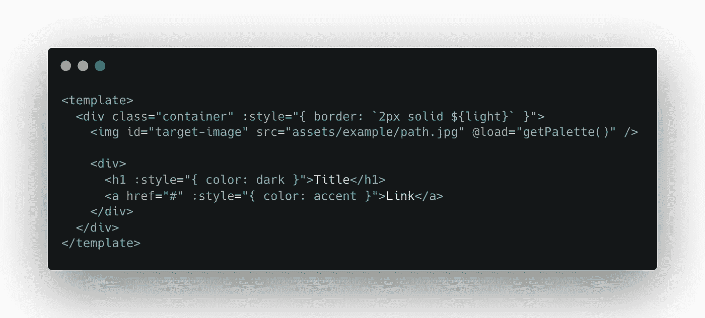

# 为组件使用突出的图像颜色，以在 Vue 中生成独特的调色板

> 原文：<https://medium.com/geekculture/using-prominent-image-colours-for-components-to-have-their-own-colour-schemes-in-vue-6c4881b682bd?source=collection_archive---------11----------------------->



Photo by [Ilnur Kalimullin](https://unsplash.com/@kalimullin?utm_source=unsplash&utm_medium=referral&utm_content=creditCopyText) on [Unsplash](https://unsplash.com/s/photos/color-design?utm_source=unsplash&utm_medium=referral&utm_content=creditCopyText)

是的——我知道，*我知道*。设计师在调色板上花了很多心思。这是一个免责声明，我并不建议这种方法应该被轻率地应用，因为图像中突出的颜色总有可能是不美观的。然而，我认为能够生成颜色来补充主要图像会很有趣。

我认为这将是非常好的极简产品页面或照片画廊。

*本文中的片段是图片，所以不能复制——*[*下面的图片*](https://github.com/emily-wheatcroft/image-palette-components) 我在这里提供了一个 Github 回购。


The same card component with a different colour palette depending on the picture

# 安装软件包

我们将使用 npm 包 [node-vibrant](https://github.com/Vibrant-Colors/node-vibrant) ，它从图像中挑选出[不同的调色板。由于一个](http://jariz.github.io/vibrant.js/) [Github 问题](https://github.com/Vibrant-Colors/node-vibrant/issues/85)在撰写本文时仍未解决，我不得不使用一个旧版本的包，如下所示:

```
yarn add node-vibrant@3.1.6
```

# 使用动态 getPalette 函数

在您希望拥有动态调色板的组件中，导入模块并编写生成调色板的函数:



Function that will log generate and log the colour palette

# 加载图像时运行

我们希望在图像加载后运行这段代码。这就是我们如何从图像标签中触发事件:



Image tag that calls getNewPalette on load

# 存储结果

我将使用 Vue $set 功能将调色板存储在组件数据中，现在我的代码如下所示:



Updated Vue script where we store the palette information in data

这是我们保存在组件数据中的输出结构:



这就是我们个人偏好的地方。对于我的示例，我只想从调色板中检索 3 种颜色:

*   一种深色
*   一种浅色
*   更亮的强调色



有很多方法可以检索这些，但是我将对每种方法使用一个计算值

如您所见，我提供了一个后备方案，以防调色板无法生成。

# 内嵌样式

内嵌式风格是我喜欢的运用这些颜色的方法。下面是一个如何做到这一点的示例:



# 谢谢大家！

感谢您抽出时间阅读！请在这里查看 [Github 回购](https://github.com/emily-wheatcroft/image-palette-components)并玩得开心。我很有兴趣看看你用这种方法创造了什么！