# 使用 Python 从 911 呼叫数据中获取洞察力

> 原文：<https://medium.com/geekculture/using-python-to-derive-insights-from-911-calls-data-1c4313746f63?source=collection_archive---------11----------------------->

## 对美国蒙哥马利郡 911 电话记录的探索性分析。这是一次使用 Python 分析数据并获得有意义的见解的尝试

任何应急响应系统都应该为处理突发或意外情况做好准备，例如火灾、犯罪、车祸、需要警方、消防部门或救护车立即援助的医疗紧急情况。它防止伤亡，减少对建筑物和设备的损害，保护环境和社区，并加速恢复正常运作。

911 是北美的热线号码，只用于紧急情况。无论何时拨打 911，都会收集基本信息，例如紧急情况的位置/街道名称、电话号码、紧急情况的性质以及关于紧急情况的细节，例如对可能犯罪的人的身体描述、对可能正在燃烧的任何火灾的描述，或者对具有医疗紧急情况的人所经历的伤害或症状的描述。

我们将从 Kaggle 收集 911 电话数据。我们试图分析蒙哥马利市的一些电话。蒙哥马利县成立于 1776 年 9 月 6 日，并以少将·理查德·蒙哥马利的名字命名。根据美国人口普查局的数据，它是美国人口最多的县之一，截至 2019 年，该县的人口估计为 1，050，688 人。收集的数据有 9 列，即纬度、经度、描述、邮政编码、标题/原因、时间戳、城镇、地址和 99492 个条目。从这个数据集中，我们将尝试分析原因和其他动态，如通话的频率和时间范围。

我们将首先导入必要的库，如 Pandas，用于数据集的基本数据操作，以及 Matplotlib 和 Seaborn，用于数据可视化。

```
#import necessary librariesimport pandas as pd
import matplotlib.pyplot as plt
import seaborn as sns
sns.set(style="darkgrid")
%matplotlib inline
```

下一步是上传我们的数据集。你可以从[这里](https://www.kaggle.com/mchirico/montcoalert)下载数据集，并上传到 Python，如下所示。

```
#importing data from csv file
calls=pd.read_csv("GIVE THE PATH NAME WHERE YOU HAVE SAVED YOUR FILE")
```

# 数据集的简要介绍

导入后，我们将尝试通过使用检查数据集中可用的数据类型来了解我们手头的数据。info()函数。

```
#checking data types
calls.info()
```

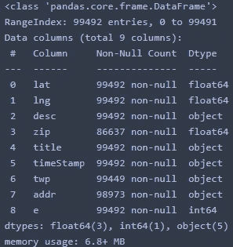

从上图中我们可以看到有 99492 行 9 列，其中有 3 个浮点型，5 个对象型和 1 个整型数据。经度、纬度、城镇、邮政编码和地址等栏目告诉我们事件/情况的位置，而描述和标题等栏目告诉我们情况的性质。我们可以观察到在上面的数据集中有一些丢失的值，这可以通过使用。isnull()函数。

```
#checking for null values
calls.isnull().sum()
```

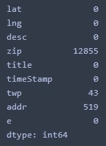

在上面的块中，我们可以看到邮政编码的主要部分以及城镇名称和地址都是空值。空值意味着某些数据值在数据集中不存在或未定义，因此我们无法了解数据集的全貌，这可能会在将来造成问题。为了避免这种情况，我们将使用向前填充来填充空值。ffill())函数。前向填充功能用于填充数据帧中缺失的值，该值将乘以前向的最后一个有效观察值。

```
#filling up the null values
columns=["zip","twp","addr"]
calls.loc[:, columns]=calls.loc[:, columns].ffill()calls.info()
```

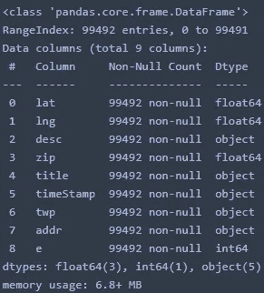

我们可以根据需要进一步修改任何列，例如 title 和 timeStamsp 列。标题列有所有拨打 911 电话的原因。我们将把所有来电分为三大类——紧急医疗服务、火灾和交通。

```
#grouping all tiltles under 3 main reasons EMS, Fire, Traffic
calls['Reason'] = calls['title'].apply(lambda title: title.split(':')[0])
calls.head()
```

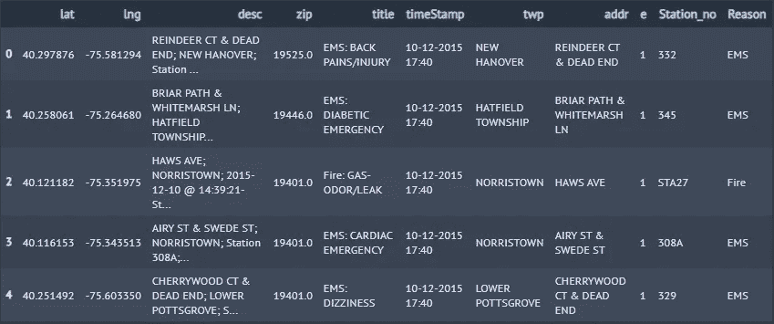

确保时间戳列是 datetime 格式，我们使用 pd.to_datetime()函数转换它，然后将时间戳列分成月、小时、星期几、日期和年列。

```
#checking type of timeStamp column
type(calls['timeStamp'])Out[]:pandas.core.series.Series#converting series to datetiem format
calls["timeStamp"]=pd.to_datetime(calls["timeStamp"])
time=calls["timeStamp"].iloc[0]#Dividing timeStamp column into hours, month, week, year and date
calls["Hours"]=calls["timeStamp"].apply(lambda time : time.hour)
calls["Month"]=calls["timeStamp"].apply(lambda time : time.month)
calls["Day of Week"]=calls["timeStamp"].apply(lambda time : time.dayofweek)
calls['Date']=calls['timeStamp'].apply(lambda time: time.date())
calls["Year"]=calls['timeStamp'].apply(lambda time: time.year)
calls.head()
```


接下来，我们将删除纬度、经度、描述、e 和**时间戳**列，因为我们的分析不需要它。

```
#droping columns that are not required
calls.drop(["lat","lng","e","desc","timeStamp"],axis=1,inplace=True)
```

下一步，假设 2015 年在数据集中只有 3 个月的条目，我们将丢弃 2015 年的所有条目，只分析 2016 年的呼叫。

```
#droping all the rows from year 2015
calls.drop(calls.loc[calls['Year']==2015].index, inplace=True)
```

# 数据集分析

在清理并删除所有不必要的数据后，现在我们将分析数据集，首先确定拨打 911 次数最多的 10 大原因。

## 拨打 911 的十大原因

```
#top 10 causes
calls["title"].value_counts()[:10]
```

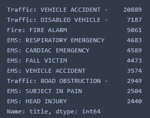

## 十大城镇

```
#Top 10 townships
calls["twp"].value_counts()[:10]
```

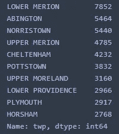

## 前 3 名城镇的前 5 名紧急情况

```
town1=calls[calls["twp"]=="LOWER MERION"]["title"].value_counts().head()
town1
```

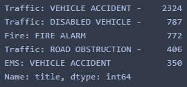

```
town2=calls[calls["twp"]=="ABINGTON"]["title"].value_counts().head()
town2
```

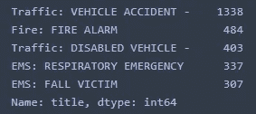

```
town3=calls[calls["twp"]=="NORRISTOWN"]["title"].value_counts().head()
town3
```

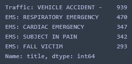

从以上几个街区，我们可以推断，拨打 911 最常见的原因是车祸，拨打次数最多的城镇是下梅里恩、阿宾顿和诺里斯敦。由此我们可以得出结论，这些城镇存在许多与交通相关的问题。

现在我们要用图形来表示拨打 911 的主要原因。我们可以看到，大多数人拨打 911 是因为 EMS 原因，其次是交通和火灾引起的问题。

```
#top most reason to call 911
sns.countplot(x='Reason',data=calls,palette='viridis')
plt.style.use('dark_background')
```

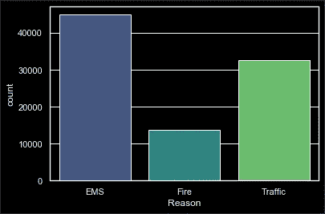

在我们的数据集中，星期几和月份是数字格式的，我们将把它们转换成字符串星期名和月份名。首先，我们将为周和月制作两个字典，然后我们将使用。map()函数。

```
#converting integer value into its actual string names to the day of the week and month using .map() function
weekmap={0:"Mon", 1:"Tue", 2:"Wed", 3:"Thur", 4:"Fri", 5:"Sat", 6:"Sun"}
calls["Day of Week"]=calls["Day of Week"].map(weekmap)
monthmap={1:"Jan", 2:"Feb", 3:"Mar", 4:"Apr", 5:"May", 6:"Jun", 7:"Jul", 8:"Aug", 9:"Sep",10:"Oct", 11:"Nov", 12:"Dec"}
calls["Month"]=calls["Month"].map(monthmap)
calls.head()
```

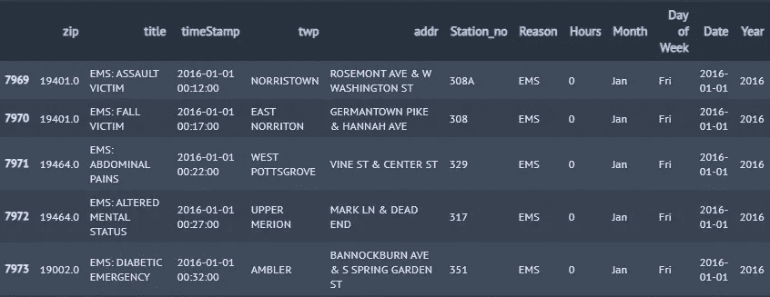

接下来，我们将看到每月、每周和每小时的呼叫频率

```
#Frequency of calls per month
months = ['Jan', 'Feb', 'Mar', 'Apr','May','Jun', 'Jul', 'Aug','Sep', 'Oct', 'Nov', 'Dec']
calls["Month"].value_counts().reindex(months).plot(kind="bar")
plt.style.use('dark_background')
plt.xlabel('Month') 
plt.ylabel('Frequency') 
plt.title('Frequency of calls per month')#Frequency of calls per week
weeks = ["Mon","Tue","Wed","Thur","Fri","Sat","Sun"]
calls["Day of Week"].value_counts().reindex(weeks).plot(kind="bar")
plt.xlabel('Day of the Week') 
plt.ylabel('Frequency') 
plt.title('Frequency of calls per week') 
plt.style.use('dark_background')#hourly distribution of calls
plt.style.use('dark_background')
calls['Hours'].hist(bins=30)
plt.xlabel('Hours') 
plt.ylabel('Frequency') 
plt.title('Frequency of calls per hour')
```

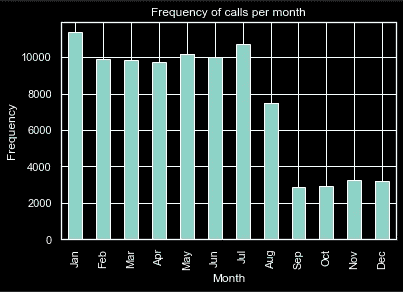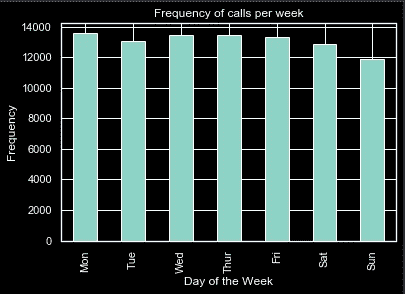

从上面的两个图表中，我们可以观察到，在工作日而不是周末的 15:00 到 17:00 之间，拨打了最多的电话。在所有月份中，1 月和 7 月的电话数量有所增加，而 7 月之后电话数量大幅下降。

每周、每月和每小时每天的 EMS、火灾和交通计数

```
#Count of EMS, Fire and Traffic week wise
fig_dims = (12, 5)
fig = plt.subplots(figsize=fig_dims)
sns.countplot(x='Day of Week',data=calls,hue='Reason',palette='Dark2')
plt.legend(bbox_to_anchor=(1, 1), loc=2, borderaxespad=0.5)
plt.style.use('dark_background')
plt.title('Count of each reason per week')#count of EMS, Fire and Traffic month wise
fig_dims = (12, 5)
fig = plt.subplots(figsize=fig_dims)
sns.countplot(x='Month',data=calls,hue='Reason',palette='Dark2')
plt.legend(bbox_to_anchor=(1, 1), loc=2, borderaxespad=0.5)
plt.style.use('dark_background')
plt.title('Count of each reason per month')#count of EMS, Fire and Traffic hour wise
fig_dims = (14, 5)
fig = plt.subplots(figsize=fig_dims)
sns.countplot(x='Hours',data=calls,hue='Reason',palette='Dark2')
plt.legend(bbox_to_anchor=(1, 1), loc=2, borderaxespad=0.5)
plt.style.use('dark_background')
plt.title('Count of each reason per hour')
```

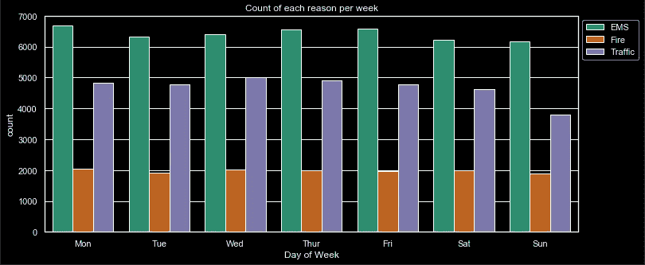

火警电话的频率在一周内保持不变，因为周一和周三对 EMS 和交通的呼叫更多。

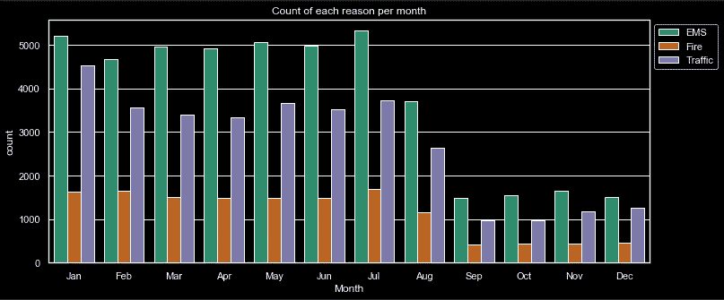

7 月份打了最多的消防和急救电话，1 月份打了最多的交通电话。

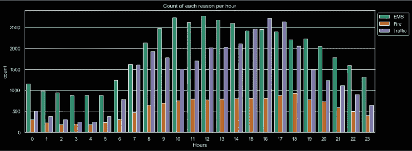

我们看到中午 12 点有大量紧急呼叫，而火灾和交通事故的频率在晚上 5 点到 6 点之间最高。

现在，我们将尝试找出呼叫频率在月份、星期几和小时之间是否有任何关系。

> **月 v/s 小时**

```
#grouping number of calls month/hour
monthhour=calls.groupby(["Month","Hours"]).count()["Reason"].unstack().reindex(months)
plt.figure(figsize=(15,6))
sns.heatmap(monthhour,cmap='viridis',linewidths=1)
plt.style.use('dark_background')
```

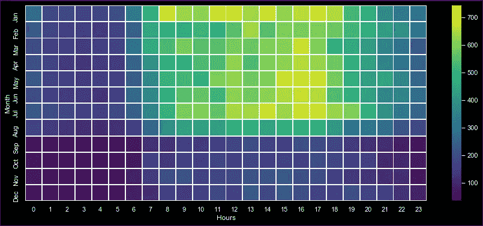

从上面的热图中，我们可以推断，从 1 月到 7 月，中午 12 点到 17 点之间的通话次数最多。

> **星期 v/s 小时**

```
weekhour=calls.groupby(["Day of Week","Hours"]).count()["Reason"].unstack().reindex(weeks)
plt.figure(figsize=(15,6))
sns.heatmap(weekhour,cmap='viridis',linewidths=1)
plt.style.use('dark_background')
```

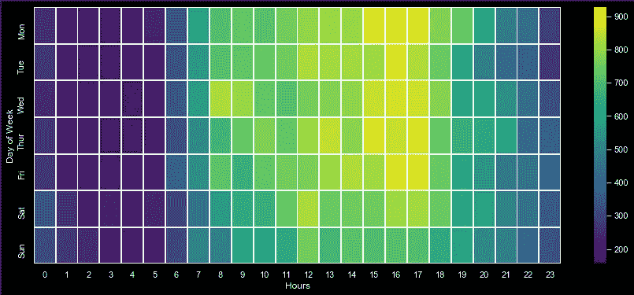

从上面的热图中，我们可以分析出工作日在中午 12 点到 17:00 点之间接到的电话数量比周末多。

> **周 v/s 月**

```
#grouping count of calls week/month
wm1=calls.groupby(["Day of Week","Month"]).count()["Reason"].unstack().reindex(weeks)
wm2=wm.transpose().reindex(months)
weekmonth=wm2.transpose()
plt.figure(figsize=(15,6))
sns.heatmap(weekmonth,cmap='viridis',linewidths=1)
plt.style.use('dark_background')
```

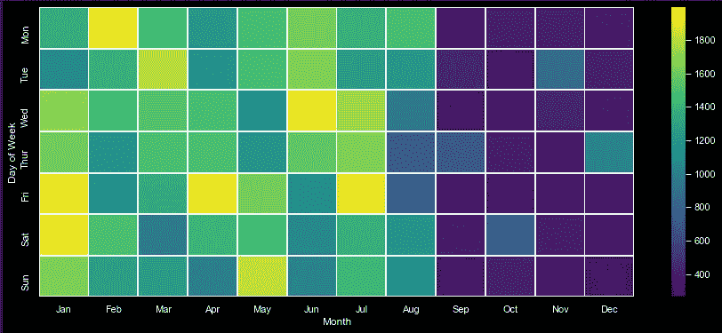

从上面的热图中，我们可以观察到星期五在一月和七月收到了最多的电话。

现在，我们将探究每月每个 EMS 因火灾和交通原因拨打的电话总数。

```
#count of each EMS calls month wise
EMS=calls[calls.Reason.isin(["EMS"])]
pvt3=pd.pivot_table(EMS,index="title",columns="Month",values="Date",aggfunc=len,fill_value=0)
pvt3["Total"]=round(pvt3.sum(numeric_only=True, axis=1),2)
df3=pvt3.sort_values(by="Total", ascending=False).head(5)
eg=df3.drop("Total",axis=1).transpose().reindex(months)
eg.plot.line()
plt.gcf().set_size_inches(15,7)
plt.title('Frequency of Top 5 EMS Situations Monthly')#count of each Fire calls month wise
Fire=calls[calls.Reason.isin(["Fire"])]
pvt4=pd.pivot_table(Fire,index="title",columns="Month",values="Date",aggfunc=len,fill_value=0)
pvt4["Total"]=round(pvt4.sum(numeric_only=True, axis=1),2)
df4=pvt4.sort_values(by="Total", ascending=False).head(5)
fg=df4.drop("Total",axis=1).transpose().reindex(months)
fg.plot.line()
plt.gcf().set_size_inches(15,7)
plt.title('Frequency of Top 5 Fire Situations Monthly')#count of each Traffic calls month wise
Traffic=calls[calls.Reason.isin(["Traffic"])]
pvt5=pd.pivot_table(Traffic,index="title",columns="Month",values="Date",aggfunc=len,fill_value=0)
pvt5["Total"]=round(pvt5.sum(numeric_only=True, axis=1),2)
df5=pvt5.sort_values(by="Total", ascending=False).head(5)
tg=df5.drop("Total",axis=1).transpose().reindex(months)
tg.plot.line()
plt.gcf().set_size_inches(15,7)
plt.title('Frequency of Top 5 Traffic Situations Monthly')
```

> 每月 5 大 EMS 情况的发生频率

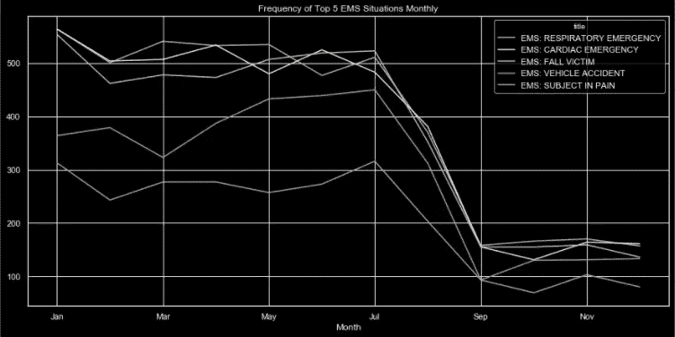

> 每月 5 大火灾发生频率

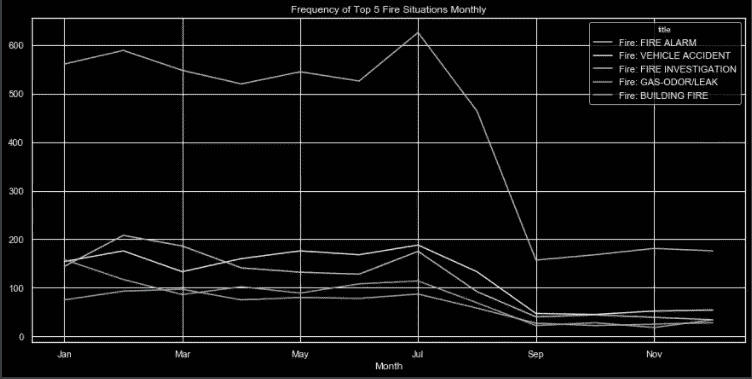

> 每月 5 大交通状况的发生频率

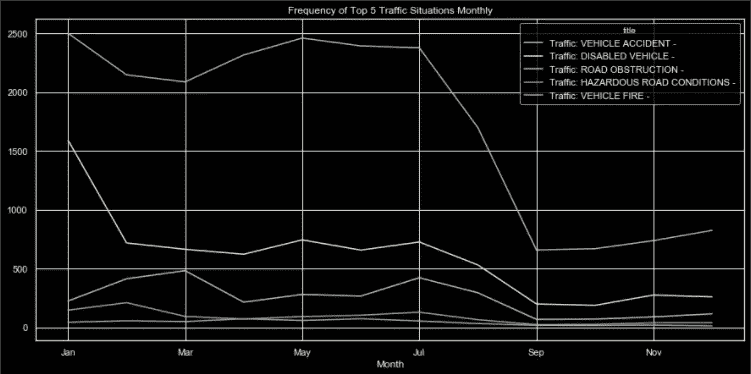

# 结论

*   在我们分析的时间段内，蒙哥马利的居民因紧急原因(EMS)拨打了大多数 911 电话。
*   来电次数最多的前三个城镇是下梅里恩、阿宾顿和诺里斯敦
*   在工作日的 15:00 至 17:00 之间，拨打电话的总次数最多。从月份来看，通话频率在 1 月和 7 月有所上升。
*   火警电话的频率在一周内保持不变
*   7 月份打了最多的消防和急救电话，1 月份打了最多的交通电话
*   周一紧急呼叫的频率最高
*   大多数交通电话都是在周三打的
*   排在前五位的紧急医疗服务情况是呼吸紧急情况、心脏紧急情况、跌倒、交通事故和受试者疼痛
*   前 5 名火灾情况是报警、车辆事故、火灾调查、气体气味/泄漏和建筑火灾
*   前 5 种交通状况是车辆事故、车辆故障、道路阻塞、危险路况和车辆火灾。

有关代码的更多参考，请点击[此处](https://github.com/yashnab/911-calls)