# 用量子计算机给期权定价

> 原文：<https://medium.com/geekculture/using-quantum-computers-to-price-options-5bd92ab5fe5c?source=collection_archive---------6----------------------->

[Unsplash](https://unsplash.com/photos/mHdATQY9fIU)

虽然量子计算仍处于起步阶段，但它已经显示出对经典的昂贵计算问题有希望的加速。虽然该行业仍然面临着相当多的批评，但许多金融机构正在意识到这项技术走向未来的重要性，并已进行大量投资，以击败市场竞争对手。

随着经典计算的发展，在 70 年代，在最先进的计算机上需要几天时间的市场模拟，现在在你的家用笔记本电脑上只需要几分钟。量子计算被视为计算改进的下一个催化剂。银行家可能会看到市场模拟等计算复杂的问题大幅加速，他们愿意在这项技术的早期投资上下赌注。最早的采用者，或者更好地说是最先将技术推向市场的人，坐拥一座金矿。

量子计算机在银行手中会有怎样的用途？显然，这个问题有许多不同的答案。有些人可能会说信用风险评估，其他人可能会指出保险费的计算，但在这里，我想指出的是定价选项的方向。

什么是选项？

本质上，期权是一种金融合约，它赋予持有者在给定的时间范围内*(行权窗口)*以确定的价格*(行权)*买入*(看涨期权)*或卖出*(看跌期权)*金融资产的权利，而非义务。

在投资者购买看涨期权的情况下，他们认为股票在执行窗口的趋势将会超过其执行价格。例如，如果一个投资者在 30 美元的行权价购买了一个看涨期权，一周后，标的股票的交易价格为 40 美元，他们可以行使他们的看涨期权，并获得股票当前价格和行权价之间的差价。更明确地说，投资者能够行使他们的看涨期权，以 30 美元的价格买入标的，并立即以当前 40 美元的市场价格卖出。当然，在计算回报时，必须考虑购买看涨期权的相关费用。

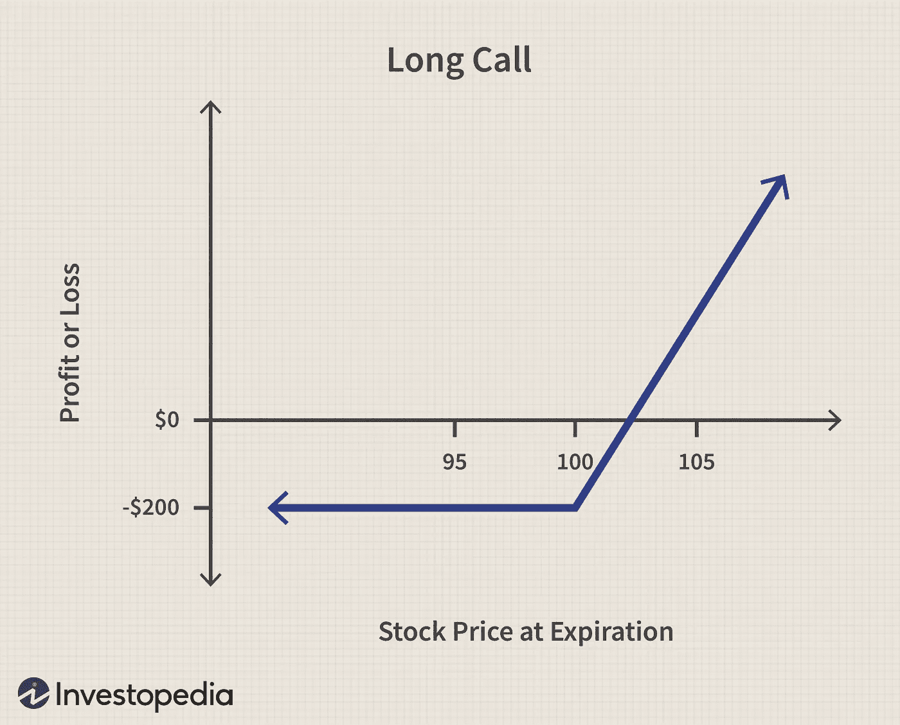

Profit and Loss (P/L) graph for a call option with the $102.5 strike price. As the price of the underlying moves above the strike, an investor nets a profit. As the price of the underlying moves downwards, an investor nets a loss. The most an investor risks to lose is the price of the option (the premium). [Investopedia](https://www.investopedia.com/terms/c/calloption.asp)

看跌期权也有同样的直觉，但方向相反。这些期权押注于股票价格将在给定的执行窗口内跌破执行价格。在这种情况下，投资者可以购买看跌期权，当股票跌破给定的执行价时，投资者可以以高于当前市场价格的价格出售，从而获得执行价和市场价格之间的差额。

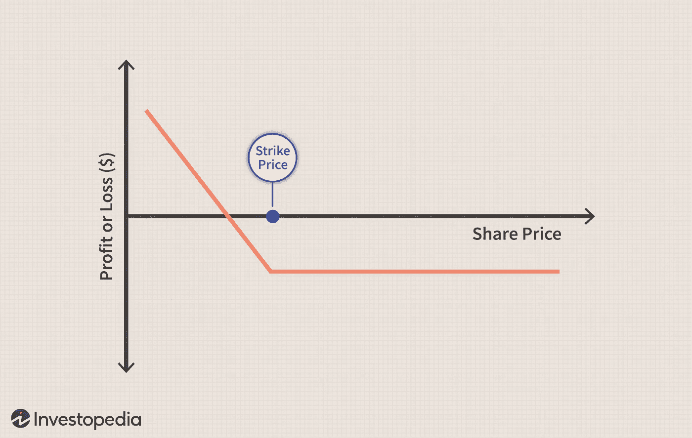

P/L graph for a put option. As the underlying stock trades below our strike, an investor stands to make money. However, as the underlying stock trades near and above the strike, the investor stands to lose money, up to the cost of the premium on the put. [Investopedia](https://www.investopedia.com/articles/optioninvestor/120401.asp)

**为什么选择？**

你可能会有这样的直觉或疑问:

> 为什么不直接购买或做空我感兴趣的股票呢？为什么我需要一个选项？

期权提供了一些购买股票所没有的优势。首先，期权具有更高的杠杆作用。投资者可以以比购买同等数量股票更低的成本购买一种证券。因此，它们在资本配置方面给予投资者更多的自由。

期权提供了减轻投资组合风险的另一种方式，因为它们通常被用作对冲机制。作为一种对冲手段，如果投资者的交易出现问题，期权有助于将负面影响降至最低。看跌期权*(我们保证以固定价格卖出)*将有助于抵消投资者在证券价格暴跌时可能遭受的任何损失。

如果使用得当，它们也有助于增加回报。由于期权往往更容易接受标的股票的变动，因此它们提供的投资回报比购买股票更高。例如，如果标的价格上涨 1%，我的看涨期权价值可能会上涨 10%。当然，相反，投资者可能会损失 10%，这是一种可能性，也是尽职调查的主要动力。

期权让投资者不仅可以选择在股票市场建仓，还可以让他们对市场的波动性和时间推移进行押注，无论市场的总体走势如何。对于那些寻求在股票和债券之外获得额外回报的人来说，它们提供了一个有效的选择。

金融衍生品，尤其是期权，占据了全球市场的很大一部分。2021 年，全球交易的期权合约超过 330 亿份**，高于前一年的 210 亿份。对于金融机构来说，确保期权定价正确是一个巨大的问题，以确保他们有效地评估了风险，并最大限度地提高了他们提供和交易的合同的利润。**

****定价溢价****

**任何期权定价的尝试都必须建立在对未来标的定价的基础上。由于期权的价值来源于基础证券的价格，我们必须了解基础证券将如何发展，以准确评估期权将如何发展。**

**标的资产的定价，也就是期权的定价，依赖于三个主要因素:标的资产的价格、期权的时间价值和标的资产的隐含波动率。**

**可以推断，标的价格是期权溢价背后的主要因素。要想拥有买入或卖出当前交易价格为 1000 美元的股票的权利，支付的溢价必须高于拥有 10 美元股票的相同权利。否则，投资者就没有动力购买更便宜股票的期权，因为更贵的股票会有更多的机会。**

**期权的时间价值是指从购买时间到期权到期之间的时间。距离期权到期的时间越长，标的资产达到指定执行点的机会就越多。因此，在相同的执行情况下，购买后 6 个月到期的期权比 3 个月到期的期权更昂贵。**

**另一个必须考虑的因素是基础资产的隐含波动率。期权的价格随着卖方对标的波动性的感知增加而增加。价格上涨是因为与一种更成熟的可能波动 1%的证券相比，买方在一种波动 10%的资产上能赚更多的钱。卖方在波动性更大的证券上会损失更多的钱，他们在出售该证券的期权时所承担的风险被计入溢价。**

****底线****

**在考虑是否购买期权时，基本问题可以归结为:**

> **我买这个期权赚钱吗？**

**当然，这是一个很难回答的问题。一个具体的答案需要了解市场未来的价格走势，这对大多数银行家来说是一个童话。但是，他们目前如何试图回答这个问题呢？**

**回答这个问题的一个有效方法是分析方法，利用市场的随机性质将它们的演变归结为一个我们可以解决的公式。当然，我指的是布莱克-斯科尔斯-默顿公式，这可能是现代金融中最著名的公式。**

**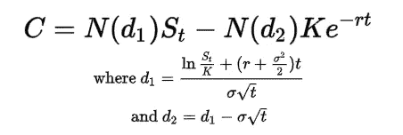**

**BSM model, which encapsulates options into a concrete mathematical formula, taking into account cost of the underlying, time value, and the implied volatility of an underlying to predict the profitability of an option. [Suhail Saqan](/swlh/calculating-option-premiums-using-the-black-scholes-model-in-python-e9ed227afbee)**

**BSM 模型是革命性的，因为它是期权定价的第一个数学基础，尽管几十年前基本的直觉驱动着衍生品市场。它将布朗运动纳入了市场的运动，这是一个强有力的认识，承认市场在时间中前进时就像随机行走一样。**

**该公式存在各种限制，包括假设一段时间内无风险利率不变、一段时间内波动不变、股票不支付股息等等。尽管遇到了这些挫折，银行家们还是采用了这一公式，通过使用被称为“希腊式”的部分衍生品，来帮助准确地为期权定价。**

****蒙特卡洛****

**另一种方法是多次模拟市场，直到对期权的收益有一个好的估计。这种方法被称为蒙特卡罗模拟，在用 BSM 等分析方法难以或不可能定价的期权定价中特别有用。**

**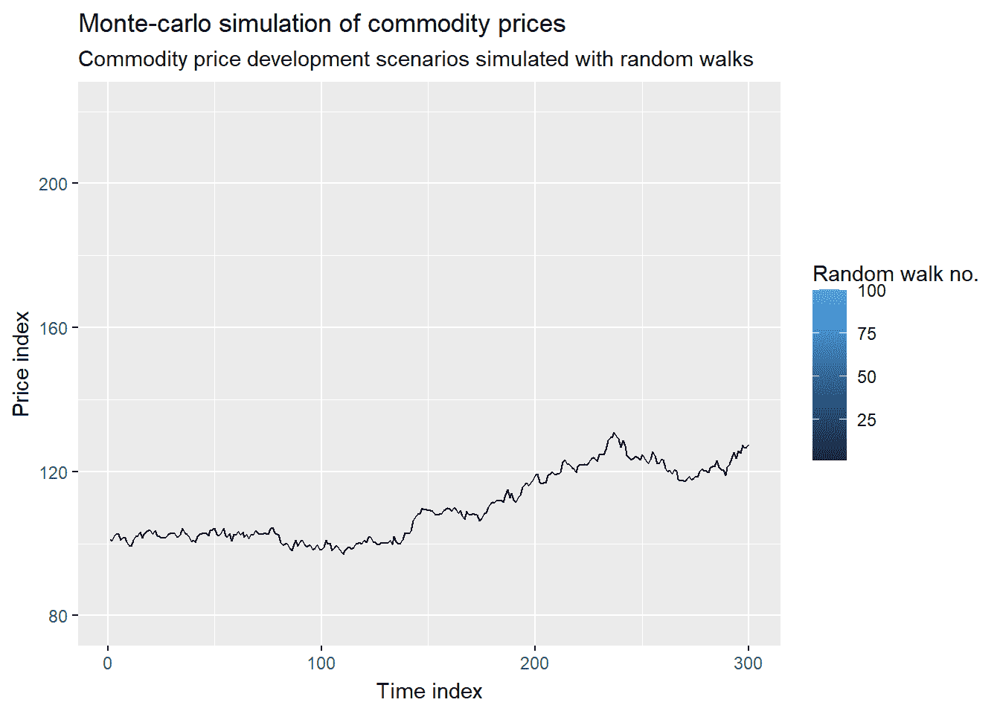**

**Monte Carlo simulation of a commodity. Each path represents a different simulation of a random walk in the price of a security. As we continue adding paths, they begin to converge, giving investors a estimate of the future price dynamics. [Supply Chain Data Analytics](https://www.supplychaindataanalytics.com/animated-monte-carlo-simulation-with-gganimate-in-r/)**

**蒙特卡洛仍然是对复杂的路径相关期权进行定价的最有效的*(经典)*方法。顾名思义，这些期权在期权合约的执行窗口的不同时间点获得其价值，因此通常需要完全了解基础市场的动态才能对其定价。路径相关选项包括障碍选项、回看选项和亚洲选项。**

**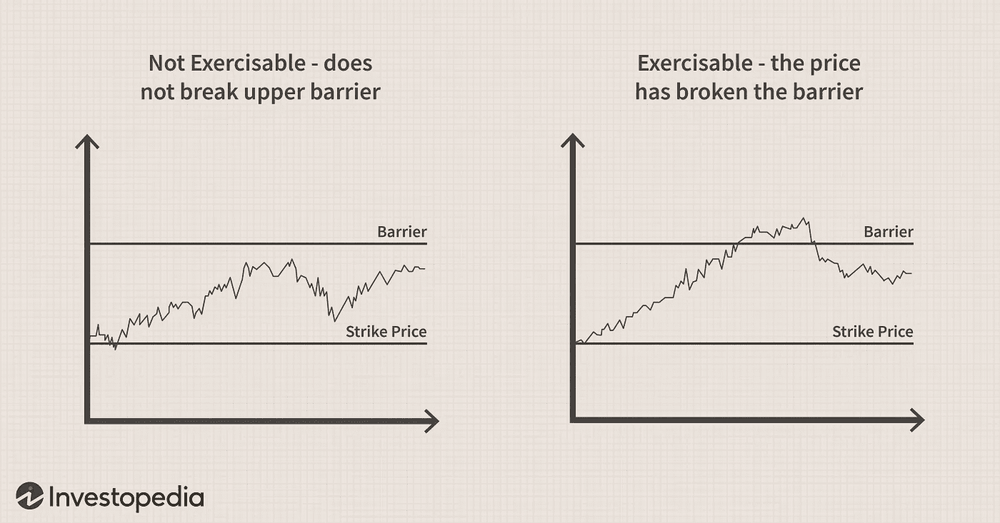**

**Example of a path-dependent barrier option, where the option contract is only exercisable when the price of the underlying has crossed a ‘barrier’. [Investopedia](https://www.investopedia.com/terms/u/up-and-inoption.asp)**

**对期权的收益进行模拟，直到投资者有足够的信心进行投资，这是一项计算量很大的任务。随着现代计算机技术的进步，运行所有这些路径所需的时间已经大大减少，但尽管如此，对一个有数百万个期权的投资组合进行定价通常需要几个小时才能完成，因此被用于通宵分析投资组合。**

****量子振幅估计****

**量子计算在期权定价中有着重要的前景，与经典的蒙特卡罗期权定价方法相比，使用量子振幅估计算法可以提出二次加速。**

**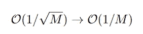**

**Quadratic speedup achieved when using Quantum Amplitude Estimation to price options, where M is the number of quantum samples used.**

**由于这种加速可以应用于经典的难以定价的期权，量子计算机很可能成为高效期权定价的未来。**

****打基础****

**在量子计算机上实现期权定价有三个步骤:**

**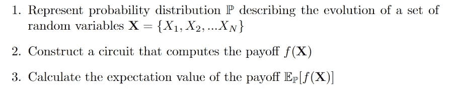**

**We capture the random walk evolution of a set of underlyings in set X. We compute the payoff of this set in the second step. In the third step, we compute the expectation value of the probability distribution of the payoff function to find a fair price for the option.**

**为了实现这些步骤，我们可以利用现有的量子算法在我们的电路中实现。**

1.  ****加载概率分布****

**在第一步中，我们可以利用各种量子机器学习算法来有效地将概率分布加载到量子寄存器中。存在各种方法，包括人工神经网络(ANN)和量子生成对抗网络(QGAN)。**

**在量子寄存器上进行人工神经网络通常计算成本更高，但在隔夜期权风险计算中仍然有用，特别是在较大的模型和投资组合中。计算成本主要来自训练 ANN 模型，这需要高处理能力和相对较长的时间。**

**QGANs 在考虑期权定价时也很有用。这是因为他们能够通过观察价格路径来学习随机分布 **X** ，并将概率分布直接加载到量子寄存器中。**

**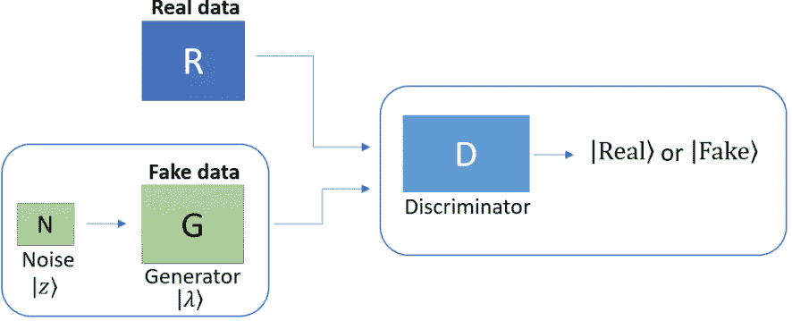**

**Visualization of a QGAN. The generator does its best to create a perfect replica of the real data, while the discriminator determines which data is fake (generator created) and which is real. The general idea is that the generator will create high-quality fake data, which will reach the exact representation of the random distribution of the underlyings on a quantum computer. [Pennylane](https://pennylane.ai/qml/demos/tutorial_QGAN.html)**

**当考虑时间和硬件受限的问题时，QGANs 是有用的，特别是在 NISQ 时代的低保真度计算机上。这是因为我们可以利用它们的形式来构造短深度(即低门数)电路来最小化引入系统的误差量。**

**此外，QGANs 的商业用途也不能打折扣。随着新的市场数据在工作日结束时出现，QGANs 不需要完全重新培训。前一天的训练被用作最新模型的初始分布，这允许模型更快地收敛。**

**出于实验目的，我们仍然可以使用 Black-Scholes 的简化价格机制，它需要相对较少的门，并在考虑装载选项时提供更多的选项。**

**加载不是这篇文章的主要焦点，但是我建议您参考在[qgan](https://pennylane.ai/qml/demos/tutorial_quantum_gans.html)和[ann](https://www.sciencedirect.com/topics/earth-and-planetary-sciences/artificial-neural-network)上的各种资源。**

**2.**计算收益的电路****

**第二步，计算收益，大部分工作由量子逻辑门和比较器电路组成。我们以二进制编码期权的执行价值，并将每个数字与编码基础概率分布的量子位进行比较，以找到合理的价格。我们已经介绍了如何对一组期权的概率分布进行编码，所以唯一需要的是在量子计算机上计算期权的支付函数。**

**在考虑这个问题时，有必要记住，需要一个与振幅估计(AE)兼容的运算符，因为这是用于计算期望值以及期权公允价值的最终工具。构造一个算子*一个*:**

**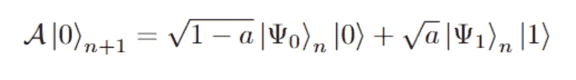**

**By acting on a register of n + 1 qubits in the zero state, the A operator creates a superposition over the n qubits, controlled on the last qubit (the +1). As can be seen from the equation, little a is isolated in the right term, allowing for perfect integration with AE.**

**为了能够使用 AE 推导出公允价值，我们将*和*编码为随机变量的线性函数的期望值，**

**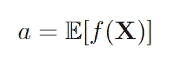**

**其中, **X** 是上一节中的一组随机价格路径。**

**你可能还记得，在文章的前面，我们发现观察到的许多期权都有分段线性收益，也就是说，当市场走向与我们预测相反的方向时，收益为 0，随着执行价格和现货价格之间的差异增加，收益线性增加。**

**期权的收益可以编码为分段线性函数，映射到[0，1]:**

**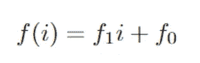**

**Where f₀ represents the constant term.**

**这个函数的结果可以在量子计算机上单个量子位上编码。这被想象成一个量子寄存器 *i* 对概率分布和单个量子位进行编码，我们将在该量子位上对线性函数进行编码，该量子位被初始化为状态 0:**

**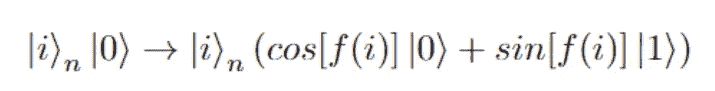**

**The final qubit in a superposition representing the result of the linear function over each qubit (represented by i) in the quantum register.**

**为了创造这种状态，可以利用受控的 Y 轴旋转。我们将使用这些门来编码收益函数的线性部分。在 *i* 寄存器*(编码概率分布的那个)*中编码的每个量子位将被用作受控-Y 的控制，编码一个旋转**

**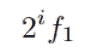**

**安西拉量子位上。也就是说，如果在索引为 3 的量子位上有一个受控的-Y 旋转，则副量子位被旋转**

**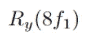**

**这看起来很武断，但这只是将由 *i* 寄存器表示的二进制表示转换回十进制，以确保精确的旋转。作为一个例子，在应用受控的-Y 旋转之后，具有三个处于|111⟩态的量子位的量子态对应于 7 的十进制值:**

**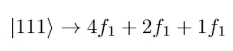**

**回头看看原来的线性函数 *f(i)* ，还有一个常数项要实现。这可以通过在辅助量子位上使用 Y 旋转来容易地实现，而无需控制。**

**完成这两个步骤后，输出电路可能看起来像这样:**

**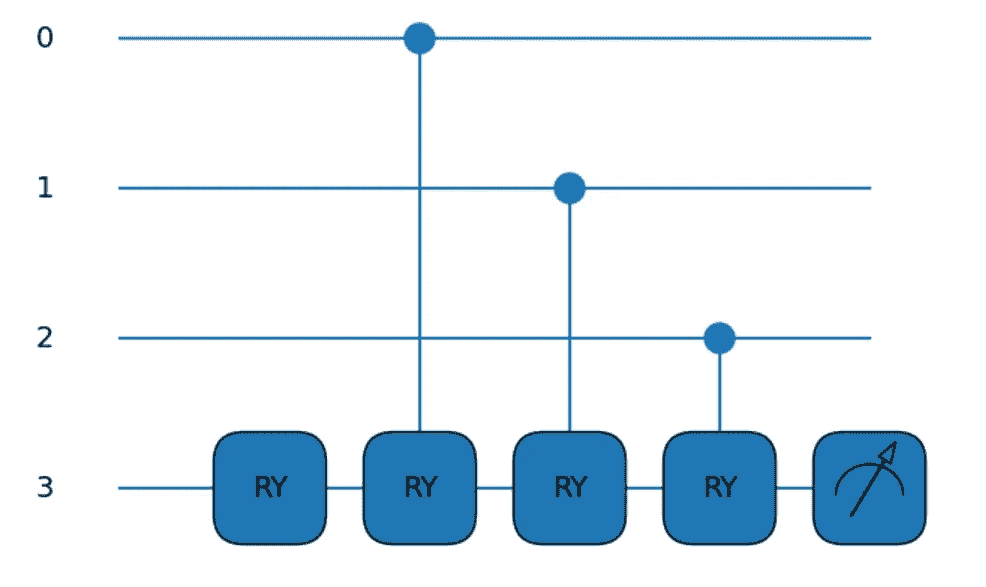**

**The constant term is implemented by the first RY, and the subsequent CRYs implement the linear rotation onto the qubit at index 3, the ancilla.**

**举一个更具体的例子，我们可以考察如何获得一组随机变量的线性函数的期望值。为此，我们使用上面的 controlled-Y 过程来实现一个操作符，该操作符映射:**

**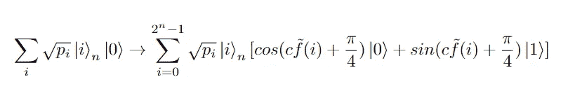**

**在上述等式中，进行了一些更改，即:**

**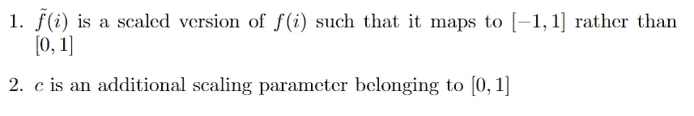**

**这似乎是一个相当武断的改变，但在实践中却很有用。当在量子力学中考虑概率时，玻恩法则发挥了作用。因此，在测量|1⟩态的振幅时，整个函数是平方的。这个正方形在 *f(i) = 0 附近创建一个反对称函数。*在这种情况下，反对称函数可以理解为我们的两个变量的交换导致符号发生变化的函数，如变化 1 所示。**

**我们在|1⟩态中找到最终副量子比特的测量概率被给出为:**

**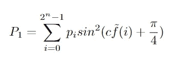**

**基于我们问题的结构和与本文目的无关的其他近似，概率可以通过下面的等式很好地估计出来:**

**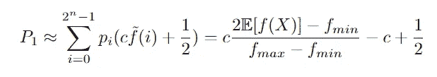**

**在哪里**

**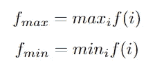**

**利用一阶近似，幅度估计的收敛性被给出为:**

**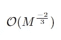**

**为了恢复完全的 *(1/M)* 收敛，需要更大的电路深度。必须注意的是，为了实现这些加速，需要精确的 *c* 值，这就变成了在期望值估计中最小化设定误差的门数量的问题。**

**因为我们知道 ***f*** *max、****f****min、*和 *c.* 的值，所以期望值***E****【f(x)】*可以从上面的概率测量中恢复**

**3.**振幅估计****

**回头参考我们早先的一些澄清，我们使用振幅估计来在应用 ***A*** 算符之后找到副量子位的|1⟩态振幅中的 *a* 值:**

****

**虽然可以使用传统的量子振幅估计方法，但 NISQ 时代的量子计算机在量子位计数、互连性、保真度和相干性方面仍然有限。因此，简化 AE 可以用来降低电路深度，使结果更加精确。这种对 AE 的简化来自于*铃木等人*的工作，他们已经证明 AE 可以在没有量子相位估计的情况下执行，量子相位估计贡献了额外的门和采样量子位。**

**AE 由量子算符 ***Q*** 表示，其作用为**

**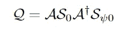**

**在哪里**

**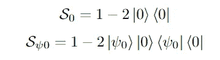**

**这个完整的方程对应于由|ψ₀⟩和|ψ₁⟩.跨越的二维向量空间中的角度 ***2θₐ*** 的旋转为了获得更直观的方法，请务必阅读我的关于 Grover 算法的文章。**

**使用*铃木等人*概述的技巧，即**

**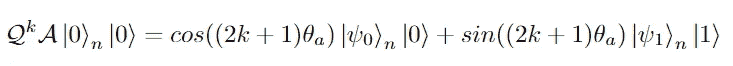**

**通过测量**

**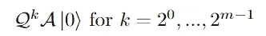**

**对于给定数量的附加采样量子位 *m* ，应用最大似然近似将导致对*的良好估计，并因此导致对*a、 的良好估计，其将期权的公平的、未贴现的价值编码在副量子位中的|1⟩的振幅中！****

******实际应用******

****现在有了各种免费使用的量子计算 SDK，运行量子算法和可视化结果比以往任何时候都更容易。对这些电路进行编程有助于理解它们在实践中是如何工作的。我将使用 Qiskit 的金融模块来可视化这些量子电路。他们的网站上有关于所有这些类型选项的很棒的教程，我强烈鼓励你去探索。****

******定价欧式看涨期权******

****如前所述，这些是一些最容易定价的期权，因为它们有一个固定的执行日期和线性回报。它们不需要知道标的资产的整个价格变动，只需要知道到期时的价格。买入期权的构建使得如果标的价格高于执行价格，期权支付执行价格和现货*(当前交易)*价格之间的差额。否则，期权没有任何回报。****

****将这种直觉转化为数学符号:****

****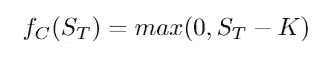****

****Where f꜀ is the call option, S is spot price at time T, and K is the strike.****

****回头看，我们知道如何使用分段线性函数计算给定现货价格的收益，但我们仍然需要检查现货价格是否大于履约价格。这将确定如果光斑低于冲击，是仅应用函数的常数项，还是在光斑大于或等于冲击的情况下应用常数项和线性项。首先想到的是使用一个量子位作为比较器来检查这两个条件中哪一个是真的。****

****比较器量子位| *c* ⟩被初始化为 state|0⟩.如果现货价格高于履约价格，它将被转换为|1⟩，否则将留在|0⟩。转换看起来像:****

****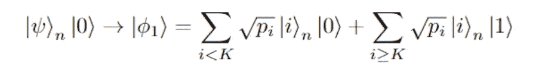****

****为了实现这个电路，我们可以使用托夫里和 CNOT 门来完成量子位的逐位加法。创建执行价格的二进制位串的经典数组，用于计算量子电路中的进位。一个具有相同数量量子位的量子寄存器被添加到电路中，以帮助进行逐位加法，一个最终的比较器量子位被添加到电路中，以存储最终结果。****

****当我们通过电路中的每个量子位时，我们计算是否存在来自量子位| *i* ⟩和经典数组中相应的二进制数字 t[ *i* ]的进位，其结果然后被存储在辅助量子位| *aᵢ* ⟩.中****

****正如你所想象的，可能会发生各种情况，需要考虑以前量子位的进位、当前量子位的状态和经典阵列的二进制。每种情况都需要不同的量子门，可以根据经典位串进行调整。****

****在计算完所有的进位之后，如果在最后一个也是最重要的量子位中有进位，那么最终的量子位|ψ⟩ₙ将会大于或等于 strike。****

****让我们看一个例子。假设我们有一个 5 美元的执行价格，转换成二进制对应于[101]。需要对概率分布进行编码的 3 个量子位，以及 3 个辅助量子位和 1 个比较器来保存最终结果，这意味着需要包含 7 个量子位的量子电路。****

****经典阵列的第 0 索引是 1，这导致由第 0 寄存器量子位控制的第 0 辅助量子位上的 CNOT。****

****经典阵列的第一个索引是 0，这导致第一个索引辅助设备上的 Toffoli 门由寄存器上的第一个索引量子位和第 0 个辅助设备控制。****

****阵列中的第二个索引是 1，这导致由第二个索引寄存器量子位和第一个索引辅助量子位控制的、应用于第二个索引辅助量子位的逻辑或。逻辑“或”可以用 X 和 Toffoli 门来实现。****

****最后，使用 CNOT 将计算结果存储在比较器量子位上。****

****最终电路看起来像这样:****

****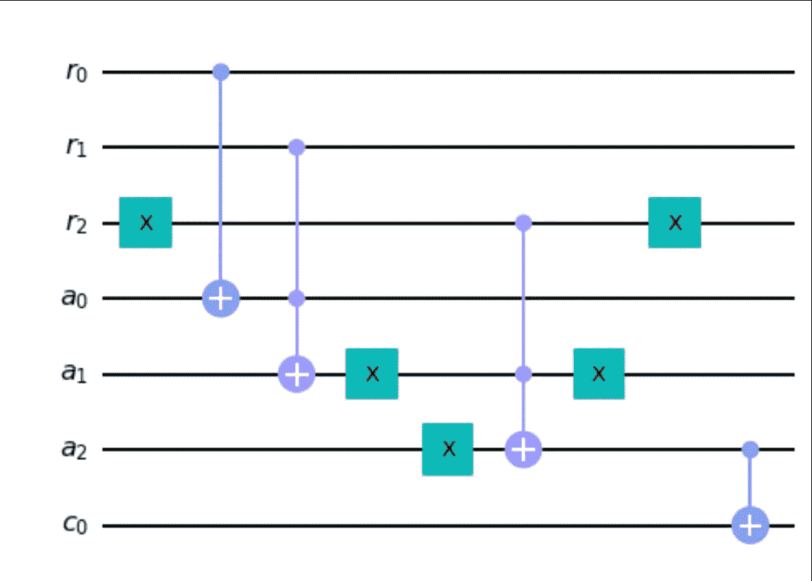****

****Note that the X gate on the second register appears early.****

****我们现在有一个比较电路，能够检查现货价格是否大于或等于执行价。为了实际实现线性支付函数，第二个辅助量子位被添加到φ₁.这个额外的量子位对应于上面定义的变换函数中的最后一个量子位。期权的分段线性收益函数可以写成:****

****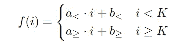****

****对于欧式看涨期权，变量取值为:****

****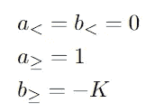****

****回到计算 AE 使用的收益的部分，收益被定制为:****

****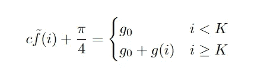****

****Where g(i) is a linear function of i and g₀ is an angle to be selected.****

****通过在最后一个副量子位上旋转实现*cos(g₀)*|0⟩+*sin(g₀)*|1⟩，然后添加由比较器量子位和概率寄存器中的量子位控制的 *g(i)* 的旋转，可以从状态|φ₁⟩|0⟩创建前述等式形式的收益。这意味着只有当 *i ≥ K* 时，才会发生该角度的旋转。****

****以上可以用这个量子电路来实现:****

****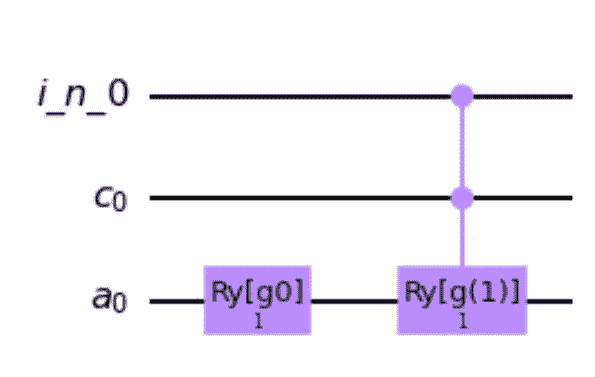****

****在这种转换之后，量子位的状态变成:****

****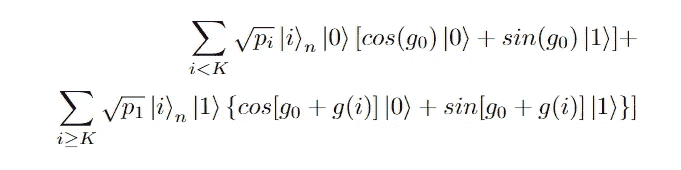****

****如可以观察到的，在状态|1⟩中找到第二辅助设备的概率被给出为:****

****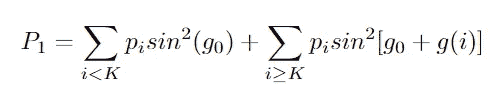****

****剩下要做的就是找出使用 *g₀* 和 *g(i)* 的哪个值。我们已经在前面计算收益的部分定义了 P₁近似，我们将使用它作为参考点来恢复收益**e**[*f(****x****)*。****

****满足以下两个条件:****

****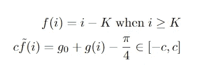****

*****g(i)* 必须设置为****

****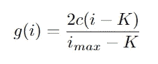****

****在哪里****

****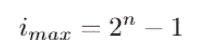****

****在 g(i)的这个选择之后，g ₀承担****

****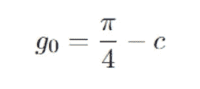****

****从这些定义中， **E** [ *max(0，i-K)* ]可以从 P₁恢复到一个比例因子和一个常数，然后可以从该比例因子和常数中恢复期望值 **E** [ *f(i)* 。****

****当然，这个过程会产生期权的未贴现价格。要知道期权的现值，需要用未来利率折现，但这在传统硬件上很容易做到。****

****在 Qiskit Finance 模块的帮助下，将现货价格为 3 美元、波动率为 20%、到期日为 100 天的期权的概率分布加载到 quantum 寄存器中，该概率分布可视化为:****

****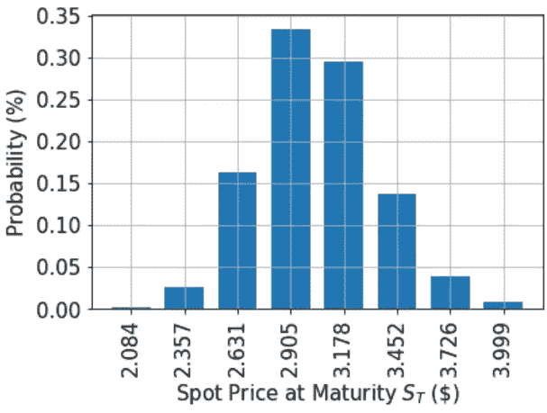****

****以 3.40 美元的执行价格购买基础看涨期权，收益函数具有以下形式:****

****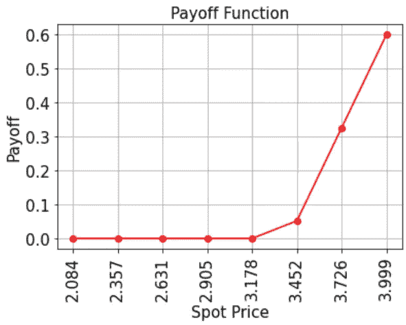****

****由于看涨期权在经典硬件上很容易定价，我们获得了经典计算的期权的“精确价值”，以及量化估计和置信区间。****

****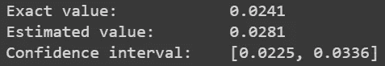****

****注意，精确度相对较低，因为“估计值”是在仅 3 个量子位上计算的，这可以提高精确度。****

******定价欧式看跌期权******

****欧式看跌期权的定价方法与上述方法相同，只需改变几个等式来恰当地表示看跌期权的收益。看跌期权的收益可以建模为:****

****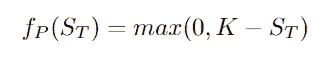****

****上面所示的分段符号中表示的这个收益对应于以下值:****

****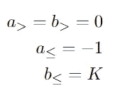****

****在与上一节相同的概率分布上实现这个收益，执行价格为 3.40 美元，收益函数变为:****

****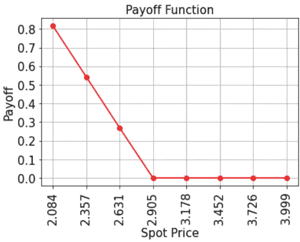****

****正如可以观察到的，当标的现货价格低于执行价格时，期权就赚钱了，这是有道理的，因为看跌期权是对股票的押注，并预测未来价格会下跌。****

****再次经典地计算收益，在 3 个量子位的量子寄存器上，我们得到输出:****

****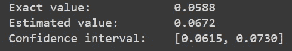****

******一揽子期权定价******

****欧式篮子期权是前两种期权的延伸，现在的回报取决于许多基础的加权和，建立了多种资产的组合头寸。****

****这种期权依赖于随机变量的多元分布，因为它依赖于多重基础的价格行为。这种分布代表一篮子基础资产到期时的现货价格，可以写成:****

****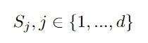****

****这个概率分布的量子态可以写成:****

****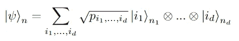****

****Where each pᵢ represents the probability that the underlying has taken values id, with d quantum registers representing each asset in the basket of underlying assets. Each register has nⱼ qubits as a sum over all j.****

****除了这个状态，篮子期权也需要找到随机变量的总和。为了实现量子加法器电路来计算两个寄存器的和，需要一个额外的具有*n’*个量子位的量子位寄存器作为累加器。****

****我们通过转变创造了一个新的状态:****

****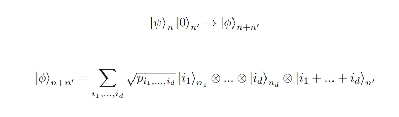****

****现在我们已经建立了量子态，我们可以看看篮子买入期权的收益，它给出为:****

****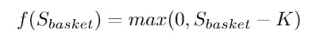****

****在哪里****

********

****Where w is a vector of basket weight and S is a vector of spot prices at expiration****

****在这个例子中，多元对数正态分布被用于对基础资产价格建模。****

****为欧洲篮子买入期权定价的量子电路类似于标准的单一资产电路，只是增加了一个额外的酉电路来计算每个资产寄存器的加权和。然后应用比较器和支付电路，由添加的附加累加器寄存器控制。****

****考虑到 *i* 寄存器上的负载概率分布，电路输出如下所示:****

********

****Where the first operation computes the weighted sum of all of the i registers, and the second operation compares the weighted sum of the basket to the strike. Finally, the linear function is implemented on the last qubit, controlled on both the last i register and the comparator.****

****但是与经典的蒙特卡罗方法相比，这真的提供了加速吗？****

****振幅估计使用经典映射作为关于量子状态的给定知识的估计。在 AE 过程的最后，测量量子位，并且它们的值产生整数*y*∈{ 0，…，M-1}，，其中 M 是量子位的数量。这个结果被经典地映射到幅度估计值 *a* ，看起来像:****

********

****任何两个值之间的最大距离为:****

********

****本质上，这个等式给出了我们需要多少次应用算子 *Q* 来充分接近正确编码期权价格的振幅。****

****使用:****

********

****可以表明:****

********

****从这个事实来看:****

********

****和为早期欧式看涨期权幅度估计给出的 P₁估计，估计值将在以下范围内****

********

****至少有 8/π的概率。****

****将这与经典的蒙特卡洛相比，在三个资产上具有相应的 8/π置信区间，AE 显示出比经典的蒙特卡洛具有 ***二次加速*** 。它展示了***【m^(-1】***缩放与经典***【m^(-1/2】***的对比，并且在***【2⁹】***样本上变得更加高效。****

****太好了！我们再次观察到 AE 在篮子期权上的二次加速。实施它们与实施欧式看涨期权非常相似。****

****使用两个基础资产的篮子是对篮子期权定价的很好的介绍，也是最容易可视化的，所以从它们开始是有意义的。加载两个相同的基础资产的概率分布，现货为 2 美元，波动率为 20%，到期日为 100 天，得到一个三维图形:****

********

****收益函数看起来与欧式看涨期权非常相似，只是它现在是两个变量的函数，而不是单一资产:****

********

****电路中量子位的总数是 11，其中 5 个量子位代表到期时底层的现货价格，6 个量子位用作计算的辅助。****

****幸运的是，这种计算在经典计算机上仍然可行，因此除了量子当量和置信区间之外，还会计算出一个精确值:****

********

****同样，量子估计值可以通过更多的量子位和更好的量子计算机来进一步提高，这将继续发展到 NISQ 时代及以后。****

******致谢******

****这篇文章是基于 Stamatopoulos 等人的工作而写的，这些工作对于提供使用量子计算机为期权定价的想法背后的数学和动机是至关重要的。****

****本文中的模拟是通过 Qiskit 的财务模块实现的，该模块提供了大量的教程。****

****如果你喜欢这篇文章或者觉得它有帮助，请留下一些掌声，并与朋友分享！****

*****如果你发现了一个错误或者想谈论任何与技术有关的事情，请务必在* [*LinkedIn*](https://www.linkedin.com/in/alexander-yevchenko-1334291b3/) *和*[*Twitter*](https://twitter.com/alex_yevchenko)*上添加我。关于我的更多信息，这里是我的* [*网站*](https://alexyev.github.io/landing_page.html) *。*****