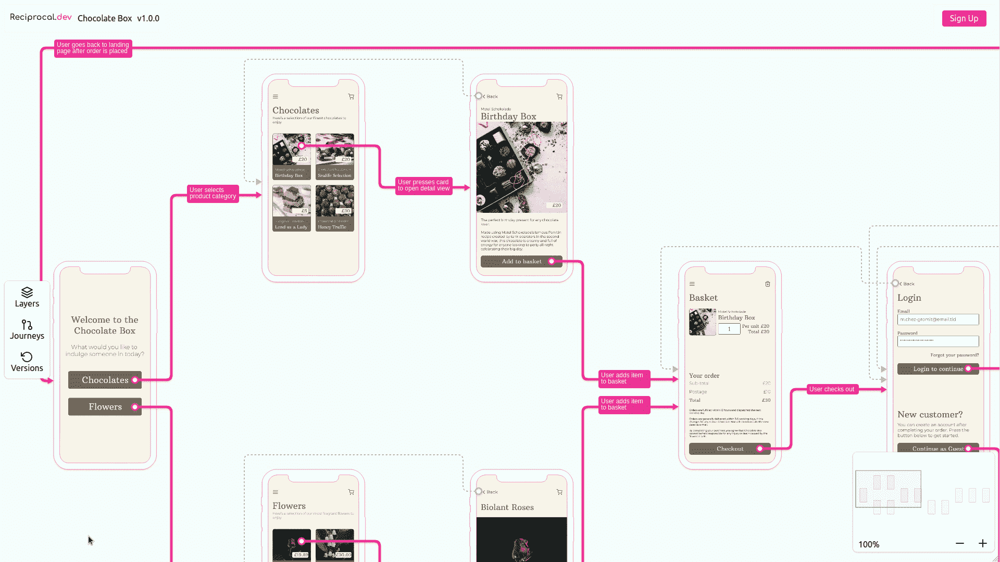

# 通过 React-konva 使用 React 上下文

> 原文：<https://medium.com/geekculture/using-react-context-with-react-konva-e0fa85b0f71c?source=collection_archive---------17----------------------->

The shared state means that the changes in the left hand menu can update the data used to render the screen components in the user journey map

继我的关于使用`react-konva`作为 [reciprocal.dev](https://reciprocal.dev) 的一部分来构建[用户旅程地图](https://bootcamp.uxdesign.cc/building-a-user-journey-map-using-figma-konva-react-konva-e83dbad9d9bf)然后[向所述地图添加缩放和平移](https://colinwren.medium.com/adding-zoom-and-panning-to-your-react-konva-stage-3e0a38c31d38)的帖子之后，我决定添加一些增强来改变从画布外部呈现在画布上的组件的属性。

为了实现这个增强，我需要引入一个应用范围的状态，这样我就可以跟踪非画布中的交互…