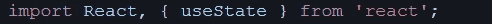
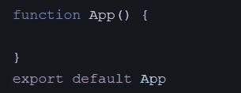
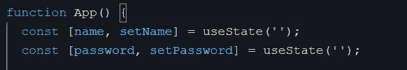
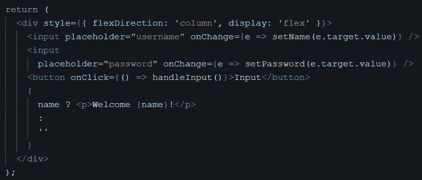
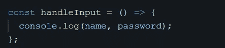
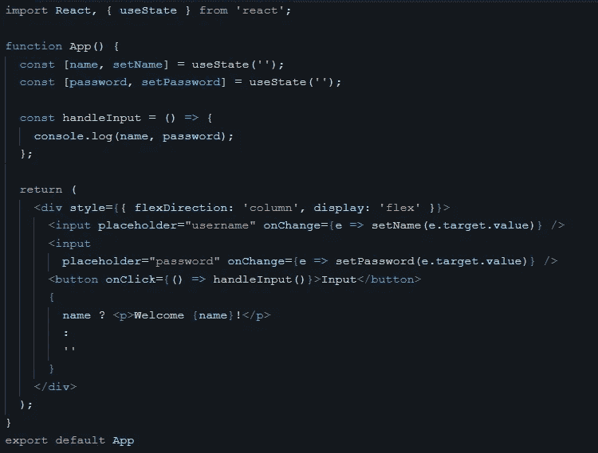

# 使用 React 挂钩获取输入值

> 原文：<https://medium.com/geekculture/using-react-hooks-to-get-input-value-9e0aa19b6b37?source=collection_archive---------5----------------------->

嗨！今天我们将学习如何以简单的方式使用 react 钩子，以便在 react 钩子中获得强大的基础。

我们需要设置的第一件事当然是 react JS 环境，你可以参考他们的[文档](https://reactjs.org/docs/getting-started.html)。如果一切准备就绪，我们就可以开始了！

# 第一步

让我们打开项目文件，然后打开 App.js 文件，你可以从导入 react 和 hooks *useState* 开始，这样我们以后就可以使用它了。这是它的样子。

Importing React and hooks

接下来是创建名为 App 的函数，这里我们使用功能组件，所以它是一致的，因为我们将使用 react 挂钩。

Creating functional component

不要忘记在我们代码的最后导入它，这样它就不会产生错误。

# 第二步

Declare hooks.

在那里我们定义*的名字，集合名。Name* 是我们可以用来显示其值的变量。同时 *setName* 是我们可以用来改变 *name 的值的 setter 方法。useState* 是定义名称*的初始值*，它可以是空字符串、空数组、布尔值等。为了更好的解释 react 钩子，你可以参考他们的[文档](https://reactjs.org/docs/hooks-intro.html)。

# 第三步

我们需要在我们的*应用程序组件*中提供 return，这样它就会在屏幕上显示一些东西。

Add return

看起来很可怕？是的。冷静点，我会解释的。

*   所以第一件事是我们创建一个 *div* 标签，它将包装所有其他元素。在那里，我给 div 标签添加了一些样式。
*   接下来我们定义两个*输入*标签，一个*按钮*和一些占位符
*   然后我们在 *input* 标签里面定义 *onChange* props。在 *onChange* props 中，我们定义了具有 *e* 参数的匿名函数，这样我们就可以访问 *input* 标签中的值。(匿名函数使用的是 arrow 函数，如果你还不熟悉可以通过 [W3School](https://www.w3schools.com/js/js_es6.asp#mark_arrow) 查一下。)
*   然后在匿名函数里面，我们调用我之前已经解释过的 setter 方法，我们也在 setter 方法里面传递了 *e* 参数，所以每次 *input* 标签里面的值在变化的时候 *name* ， *password* 的值也在变化。

*   我还添加了一个带有 *handleInput* 方法的按钮到 *console.log* 来确保一切正常。
*   在按钮下面，我添加了三元运算符，以便在 name 变量填充了内容时显示一些文本。

这是我们到目前为止编写的整个代码的外观。

The whole code

结束了。这三个简单步骤足以以简单的方式使用钩子，只是为了开始并对 react 钩子有坚实的基本理解。谢谢你读到这里，再见！✨