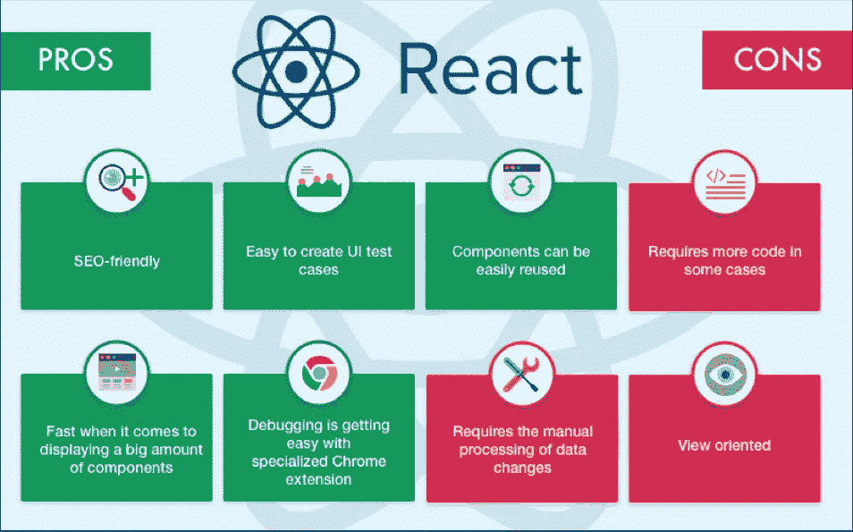
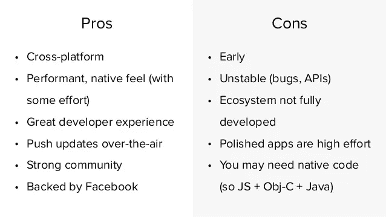

# 使用 React with React Native

> 原文：<https://medium.com/geekculture/using-reactjs-with-react-native-f14057a9ca4?source=collection_archive---------2----------------------->

## ReactJs 和 React Native 的分析

web 和移动开发世界每天都在发展，它们的应用程序变得更加强大。这两个部门有没有可能互相分享各自的特色？

答案最终取决于用户的观点。人们浏览网站，但他们只是使用手机应用程序。移动应用程序通过帮助执行特定任务而被主动使用，而网络应用程序被被动使用以提供大量信息。

面向客户的产品同时存在于网络和移动电话上可能是有益的。比如必胜客、多米诺、麦当劳等。这些食品配送公司在网络和手机上都有应用程序。

这些应用程序可能共享几乎相同的特性和功能。整合网络和手机并不容易。在本文中，我们将讨论更多关于使用最常用的 web/移动应用程序开发技术 React 和 React Native 在移动和 web 应用程序之间共享代码的内容。

# 为什么反应和反应原生？

React 和 React Native 完全不同，尽管名称相似。它们有不同的用途，但是将它们结合到您的项目中会给您带来很多好处。

React 是一个用于前端 web 开发的库，而 React Native 是一个促进移动应用程序开发的跨平台兼容性的框架。

在 React Native 中，你只需编写一个 React 代码，但它充当了 JavaScript(JS)和移动设备的本机属性之间的桥梁。React Native 的额外优势是跨平台兼容性，这让你可以在 IOS 和 Android 设备上运行你的应用程序。

## 反应堆

ReactJs 是一个用于创建用户界面(UI)的 Js 库，它使用一种简单的方法来呈现 web 页面，使它们动态并响应用户。

如果您想直接使用 React 进行开发，可以访问以下链接:

> [*上手反应过来*](https://reactjs.org/docs/getting-started.html)
> 
> [*React 文档*](https://reactjs.org/docs/getting-started.html#versioned-documentation)
> 
> [*对 Github 上的存储库做出反应*](https://github.com/facebook/react) 以有助于其开发或更深入。
> 
> [*堆栈溢出*](https://stackoverflow.com/questions/tagged/reactjs) 查找最热门或非常具体问题的答案
> 
> [*React 教程*](https://reactjs.org/tutorial/tutorial.html) 实操
> 
> 要了解 ReactJs，请访问[*【reactjs.org】*](https://reactjs.org/)

## 反应自然

React 发布两年后，脸书创建了 React Native。虽然 React 库是为创建 web UIs 而开发的，但 React Native 是一个面向 iOS 和 Android 的混合应用开发框架，允许您重用高达 95%的代码。

如果您想使用 React Native 开始开发，请查看以下几个有用的链接。

> 【React Native 入门
> 
> [设置开发环境](https://reactnative.dev/docs/environment-setup)
> 
> 访问 [React 原生 Github 库](https://github.com/facebook/react-native)

## 反应 vs 反应本地

据我们目前所知，这两者在性质上非常相似，但它们之间有一些主要的界限。

**技术**

> React 使用虚拟 DOM 呈现代码
> 
> React Native 是一个使用本机 API 运行组件和功能的桥接框架。
> 
> React Native 不使用 HTML，而是有自己的语法(比如用<text>代替</text>
> 
> ，用<view>代替</view>
> 
> )。
> 
> React Native 还使用 CSS-in-JS 而不是标准 CSS 提供了一个动画库和样式 UI 组件。

**导航(路由)**

> 当在 React 应用程序的页面之间路由时，它使用外部库(如 [react-router](https://github.com/ReactTraining/react-router) )来开发其导航功能和页面之间的平滑过渡。
> 
> 在 React Native 中，构建 UI 要简单得多。
> 
> React Native 提供了自己的导航器组件。
> 
> 如果你的 React 原生应用并不复杂，你就不需要任何外部库

**平台特定代码**

> 与 React 不同，React Native 解决了编写特定于平台的代码和创建符合特定于平台的 UI 和 UX 准则的应用程序的需求。
> 
> React Native 不需要在单独的文件夹中组织组件。相反，它提供了不同的方法来更高效地构建跨平台应用。

# 从 React web 转换到 React Native

如果你想将基于 React 的 web 应用程序转换为 IOS 和 Android 设备的移动应用程序，React Native 是理想的选择。您可以随时将 React 本机应用程序恢复为 web 应用程序。

但是，请记住，为了使该过程顺利运行，您需要一个熟悉 React 和 React Native 的专业开发团队。如果你只擅长一件事是不够的。

在网络和手机之间共享代码并不容易。由于 React 和 React Native 都使用 JS，所以 app 的根组件和逻辑是类似的。您需要了解特定于平台的组件，以便从 React 转换到 React Native，并且需要一些桥接本机代码方面的知识。共享代码库不仅仅意味着重用代码。移植 React/React Native 的过程有时会非常复杂，而分别创建 web 和移动应用程序通常更容易。这完全取决于你正在制作的应用程序的类型和你想要包含的功能。

**兼容性问题**

> 这只是为什么你需要一个 React 本地经验丰富的开发团队的另一个解释。一些组件库和调试工具可能需要额外的关注，从而降低整个方法的速度。

**可扩展性**

> 当谈到 app 的架构时，需要进行一些仔细的规划。有些选择应该在一开始就正确做出，所以如果你计划同时开发你的网络和移动应用程序，应该实施一个长期战略。
> 
> 与其在 React 和 React Native 之间转换，不如使用 React Native for Web 或 ReactXP 这样的库从头开始。

## 共享代码

框架之间的主要区别不一定是使用不同的 API 来实现相同的特性。UI 的呈现和 UX 的流程有很大的不同。

然而，API 和 UI/UX 的变化并不妨碍平台之间的代码共享。Render Props 模式有助于我们将特定于平台的基本组件(如<views>和<divs>)与组件业务逻辑分开，使我们能够跨平台共享大量代码。</divs></views>

有关代码共享技术的更多信息，请参考“【React Web 和 React 本地应用程序之间的代码共享 ”。

# ReactJS 和 React 本机应用程序

已经部署 React 或 React Native 的公司这样做有很多原因。除了脸书，这些是最值得注意的早期采用者。

Photo by [CardMapr](https://unsplash.com/@cardmapr?utm_source=medium&utm_medium=referral) on [Unsplash](https://unsplash.com?utm_source=medium&utm_medium=referral)

N **etflix** 在 2015 年采用了 ReactJS，现在与 Gibbon 这个渲染层一起使用。网飞当时更喜欢 React，因为它的单向数据流模型和声明式编程方法。

我决定开发一个网站，一个单页的应用程序，来鼓励网络用户使用社交网络。ReactJS 似乎是这次任务的最佳选择。这款网络应用的用户界面和 UX 设计得非常好。现在 web 和移动平台都是用 React 开发的

Uber 开发了一个移动仪表板，用于选择带有 React 本地组件的餐饮和餐馆，并添加了包括推送通知在内的有用功能。这使得通过 UberEats 订餐变得快捷方便。创建这个平台的主要想法是加入三种类型的参与者:餐馆、司机和客户。框架容量帮助他们扩大和发展服务。

K **汉学苑**是最大的在线教育平台之一。ReactJS 在其中被广泛使用。Khan Academy 选择该框架来开发其电子学习门户，因为它可以防止不必要的页面重组，同时平稳高效地替换其元素。

loomberg 为 iOS 和 Android 开发的新移动应用程序为用户提供了简单的互动体验，用户可以轻松访问彭博媒体上的个性化内容、视频和直播。这家在线杂志在开发其移动应用程序时选择了 React Native。

A 现在它被用在公司的移动应用程序和网页的内部结构中。

# 结论

到目前为止，我们已经了解了 React 和 React Native 之间的差异，阐明了后者的优缺点，两者之间的代码共享，并展示了其使用示例。

鉴于许多企业已经采用了 React 平台，React 平台在性能方面极具创新性。

当其他框架专注于在软件性能方面改善 UI 时，React Native 的目标是彻底改变应用程序与软件和硬件连接的方式。另一方面，ReactJS 已经从一个简单的故障排除概念发展成为一个解决方案，可以极大地减少 web 开发工作并提高性能。react 社区也在不断进步。

## 什么时候应该考虑 React Native？

> **当你想开发一个既能在网络上运行又能在手机上运行的应用时。**虽然使用 React 和 React Native 进行开发并不是一个完整的单代码库解决方案，但由于这两种技术堆栈之间的许多相似之处，它仍然是创建跨平台产品的最有效方法之一。
> 
> **当您想要将 web 应用程序转换为移动应用程序时。然而，你仍然需要一个精通 React 和 React Native 的开发团队。只知道其中一个是不够的。**
> 
> **当你想开发一款同时适用于 Android 和 iOS 的手机 app 时。** React Native 是一个可以在两个移动平台上呈现原生 UI 组件的框架，所以你不需要编写和维护两个独立的代码库。

如果你想从商业角度了解更多关于 React 的知识，或者与其他类似技术进行比较，请阅读“ [React Web 开发:CTO 实用指南](https://brainhub.eu/library/react-web-development/)”。