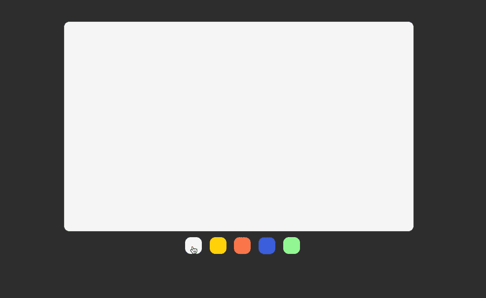
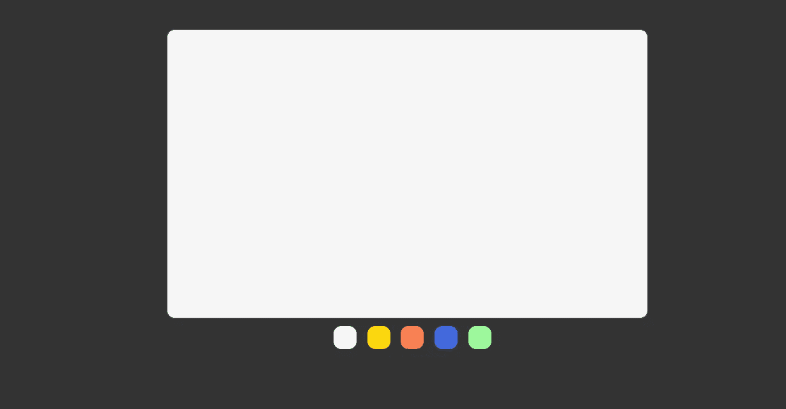

# 使用 React 的状态动态更新 CSS

> 原文：<https://medium.com/geekculture/using-reacts-state-to-update-css-dynamically-c9b45570340c?source=collection_archive---------3----------------------->

Photo by [Sharon McCutcheon](https://unsplash.com/@sharonmccutcheon?utm_source=medium&utm_medium=referral) on [Unsplash](https://unsplash.com?utm_source=medium&utm_medium=referral)

React 很棒，尤其是在 SPA(单页应用程序)方面。我想到的一个小技巧可能对 React 的其他用户来说不太明显，就是使用 state 可以动态修改页面的 CSS。所以我将举例说明如何使用状态来修改带有事件监听器的 CSS。

## 这就是我们将要建造的。

# 让我们开始编码吧

首先，我会假设你知道如何开始一个新项目。如果没有，你可以在这里阅读操作指南[https://reactjs.org/docs/create-a-new-react-app.html](https://reactjs.org/docs/create-a-new-react-app.html)。既然你已经开始了一个新项目，现在打开`/scr/App.js`我们将修改它。直接复制下面的代码。一会儿我会快速浏览一遍，解释我们正在做什么。

首先，我们需要从 react 导入`useState`(第 4 行)。然后在第 8 行，我们正在为 https://reactjs.org/docs/hooks-state.html[了解更多信息`useState`创建我们的钩子。第 10 行现在创建了一个颜色数组，它需要与我们一会儿将要讨论的 CSS 类相一致。第 12–19 行是创建按钮的函数。这是我们诡计的第一部分。如您所见，我们将 colors 数组映射到 className(第 15 行)中的一个变量，并在第 16 行设置 onClick listening 事件。](https://reactjs.org/docs/hooks-state.html)

这个魔术的第二部分是第 23 行，其中我们将类名设置为我们的状态。这会导致 div 区域在状态改变时重新呈现。太酷了，这就是我们的 JSX。现在我们需要在 CSS 文档中创建一些类和 id。

# 现在是 CSS

再一次，将下面的 git 要点复制到`src/App.css`中，你可以删除已经存在的内容，因为这是我们需要的所有 CSS 规则。

因为这只是一个演示如何解释组件的实际构建。第 0–30 行只与演示的显示相关。虽然它们确实会影响页面上项目的显示，但是动态改变页面上的颜色最重要的是第 32 行等等。

如您所见，类名与 App.js 中的数组中包含的名称相同。我继续修改了实际的颜色，以显示更柔和的颜色，而不是令人眼花缭乱的通用绿色、红色和蓝色。

如果你执行。"`npm start”`这是你应该在浏览器窗口看到的。

现在你知道如何使用 React 的状态来动态修改 CSS 了。虽然这是一个简单的例子，但是这种技术的应用是无限的，从表单的错误状态、画布元素上的画笔，到网站的亮/暗模式。快乐编码。