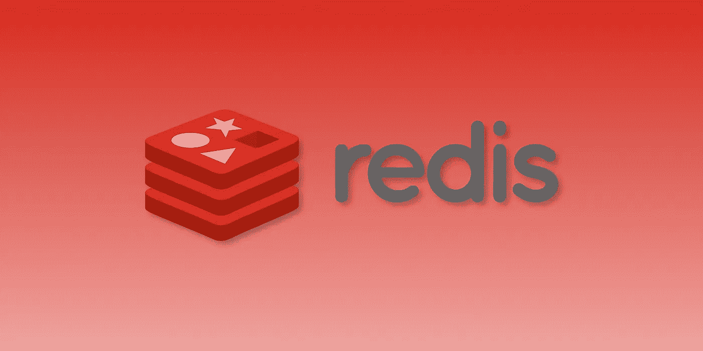
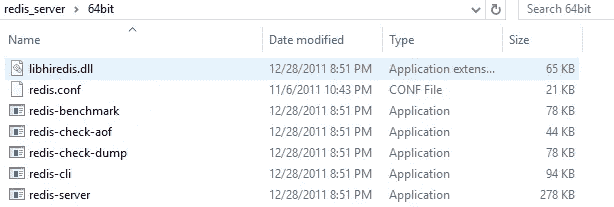
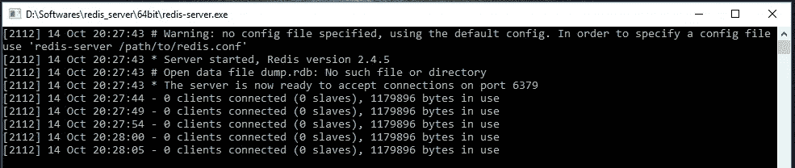
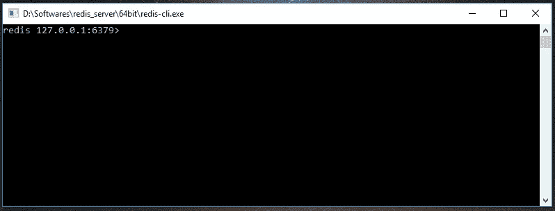

# 使用 Redis 缓存 NodeJS 和 ExpressJS 服务器中的数据。

> 原文：<https://medium.com/geekculture/using-redis-to-cache-data-in-nodejs-and-expressjs-server-f6a7596dd77e?source=collection_archive---------4----------------------->



redis image

# 什么是缓存？

*   **缓存**是**本地存储**，用于存储经常使用的数据。
*   缓存是将文件副本存储在缓存或临时存储位置以便可以更快地访问它们的过程。

# Redis 是什么？

*   **Redis** 代表**远程词典服务器**。
*   Redis 是一个开源的内存中键值数据存储，可用作数据库、缓存、消息代理和队列。

# 安装 Redis 服务器:

**第一步:**从 [*官方 git hub 位置*](https://github.com/dmajkic/redis/downloads) 下载最新的 Redis zip 文件。对我来说是 Redis-2.4.5-win32-win64.zip。

**第二步:**将 redis-2.4.5-win32-win64.zip 文件解压到您的首选位置。

**第三步:**根据您的操作系统，它将带有两个不同的文件夹，一个用于 32 位，另一个用于 64 位。

**第四步:**转到 64bit，在那里你可以找到下面的文件。



第四步:双击 redis-server.exe 文件，可以看到 Redis-server 启动并等待连接客户端，如下图。



**第五步:**现在打开 Redis-cli.exe 文件到 Redis 命令行界面。



因为它充当 Redis 客户端，所以我们一打开这个 cli，就可以在 Redis 服务器中看到客户端连接的消息，如下所示。

*   安装 Redis 后，有两种方法可以使用 Redis

1.  正在安装 Redis-CLI。
2.  在服务器应用程序中使用 Redis。

# 步骤 1:-创建基本 Express 服务器并安装软件包。

*   创建 Express 服务器后，现在安装名为“Axios”的 npm 包，以便向任何第三方 API 发出请求。然后导入它。

```
npm install axios --save
```

*   现在创建一个路由来处理“/ **starwar** ”路径上的 **GET** 方法。
*   用户**参数**在访问到**的路径时传递，使用 **Axios** 包从第三方获取数据**。

# 步骤:-2 使用 Redis 缓存数据。

*   安装 Redis npm 包。

```
npm i redis --save
```

*   我们必须首先导入 redis npm 包。
*   **Redis** 包给了我们 **createClient()** 方法，该方法将接受 Redis-server 端口号，默认情况下是 **6379** 。
*   如果出现任何错误，我们可以使用 **client.on("error "，()= > {})。**中间件记录错误消息。
*   现在，在处理“/starwars”路线时，我们必须使用 **client.setex()** 方法将收到的数据缓存到 Redis 中。

# **步骤:-3 添加中间件以检查数据是否存在于缓存中。**

*   现在我们必须创建名为 **checkCache，**的中间件，它可以访问 req、res 和 next。
*   在端中间件中，我们可以使用 **client.get()** 方法来检查所需数据是否在缓存中。
*   client.get()方法将接受 string 作为第一个参数，回调函数作为第二个参数。
*   我们可以将需要在缓存中搜索的键的名称作为第一个参数传递。
*   最后，我们必须将这个中间件添加到路由处理器中。