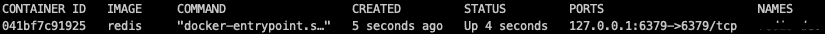

# 将 Redis 与 Docker 和 NodeJS/Express 一起使用

> 原文：<https://medium.com/geekculture/using-redis-with-docker-and-nodejs-express-71dccd495fd3?source=collection_archive---------0----------------------->


[https://unsplash.com/photos/EaB4Ml7C7fE?utm_source=unsplash&utm_medium=referral&utm_content=creditShareLink](https://unsplash.com/photos/EaB4Ml7C7fE?utm_source=unsplash&utm_medium=referral&utm_content=creditShareLink)

在本文中，我将介绍在本地机器上使用 **DOCKER** 安装 **REDIS** 的步骤，并在本地运行的 **node/expressJS** 应用程序中访问 DOCKER 容器服务。

# 先决条件

我假设您已经在本地机器上完成了基本设置，例如**节点包管理器、Docker** ，并且对 **Javascript** 、 **NodeJS** 、 **Express** 、 **REDIS、**和 **Docker** 有相当的了解。

# 我们开始吧

我将从使用 docker 安装 REDIS 的构造开始，然后转向在本地开发环境中的使用。

# 使用 DOCKER 安装 REDIS

要完成这一步，启动您的终端并执行以下命令。

```
docker run -d --name <CONTAINER_NAME> -p 127.0.0.1:6379:6379 redis
```

*   **运行** —创建并启动容器
*   **d** —以分离模式运行容器
*   **—名称<容器名称>** —为容器指定名称。
*   **p** —将端口和 IP 映射到本地机器。这是在本地启用服务的关键。如果您创建的映像没有本地映射，那么您将无法访问这些信息。 **6379** 是 **REDIS** 的**默认端口**。
*   **Redis** —要下载的图像的名称。

```
docker ps -a
```

这个命令将向您显示与您机器上的 docker 相关联的所有容器的列表。



```
docker exec -it <CONTAINER_NAME|ID> sh
```

如果您已经为容器提供了名称，那么就使用名称或利用与容器相关联的 ID。

要测试您的安装，请按如下步骤进行并运行一些基本的 REDIS 命令

```
# redis-cli
127.0.0.1:6379> ping
PONG
127.0.0.1:6379> set customer_name "John Doe"
OK
127.0.0.1:6379> get customer_name
"John Doe"
127.0.0.1:6379> del customer_name
(integer) 1
127.0.0.1:6379> exit
# exit
```

# 基本 ExpressJS 应用程序设置

既然我们已经完成了 REDIS 的安装，那么让我们继续创建一个小型的 ExpressJS 应用程序。

转到您的终端并执行以下命令

```
npm init
```

init 命令将通过一个基于终端的向导为 package.json 文件提供默认值。

```
npm i -P express
npm i -D nodemon
```

上面的命令将安装开发所需的依赖项。

在您选择的编辑器中打开 package.json 文件，并在脚本部分下添加以下命令。

```
"dev": "nodemon server"
```

接下来，打开您的**index . js/server . js(main)**并添加以下代码片段来创建一个基本的 ExpressJS 应用程序。

```
const express = require('express');const PORT = 5001;const app = express();
const router = express.Router();app.use(express.json());router.get('/', (req,res) => {
    res.status(200).json({
        message : "Sample Docker Redis Application"
    });
});app.listen(PORT, () => {
    console.log(`Server running on PORT ${PORT}`);
});
```

我们的基本 ExpressJs 应用程序已经准备好了。

接下来，启动服务器。

```
npm run dev
```

打开一个新的终端实例，使用“cURL”命令检查应用程序是否正常工作。输出将类似于以下内容。

```
HTTP/1.1 200 OK
X-Powered-By: Express
Content-Type: application/json; charset=utf-8
Content-Length: 45
ETag: W/"2d-bO6czhAp6+qsrxSQWqx38pGjRvo"
Date: Thu, 15 Apr 2021 18:14:24 GMT
Connection: keep-alive
Keep-Alive: timeout=5{"message":"Sample Docker Redis Application"}
```

# 通过应用程序访问 REDIS

要访问 REDIS，我们需要在我们的应用程序中访问 **REDIS 客户端**。

转到您的终端->应用程序根文件夹

```
npm i -P redis
```

这将为您的应用程序安装 **REDIS** 支持。

在编辑器中打开 s【erver.js/index.js】的**主文件**，并对 enable access 进行修改。

```
const redis = require('redis');const redisClient = redis.createClient(6379,'127.0.0.1');redisClient.on('error', (err) => {
    console.log('Error occured while connecting or accessing redis server');
});if(!redisClient.get('customer_name',redis.print)) {
    //create a new record
    redisClient.set('customer_name','John Doe', redis.print);
    console.log('Writing Property : customer_name');
} else {
    let val = redisClient.get('customer_name',redis.print);
    console.log(`Reading property : customer_name - ${val}`);
}
```

当您保存文件时，由于我们有 **nodemon** 监视我们的资产变化，服务器将重启。

```
[nodemon] starting `node server.js`
Writing Property : customer_name
Server running on PORT 5001
Reply: null
Reply: OK
```

通过终止线程或再次保存文件来重新启动服务器。现在，它将从 REDIS 中读取属性，并在控制台上显示它。

```
[nodemon] restarting due to changes...
[nodemon] starting `node server.js`
Writing Property : customer_name
Server running on PORT 5001
Reply: John Doe
Reply: OK
```

以进一步检查信息是否成功存储在实例中。“SSH”加载到容器中，并读取属性。

好吧，就这样。我们已经准备好在本地应用程序中访问 REDIS。本文到此结束。

如果你喜欢这篇文章，请随意分享。

访问示例代码@[https://github.com/cmgabriel/docker_redis_express](https://github.com/cmgabriel/docker_redis_express)

感谢您的阅读和快乐编码！