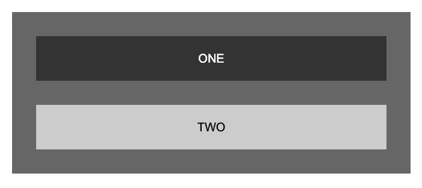
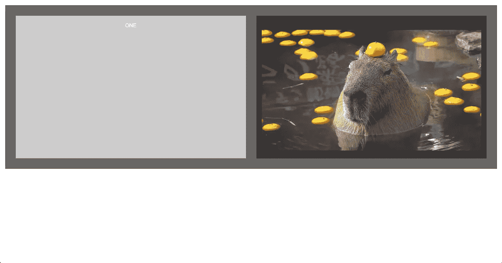

# 将调整观察器大小用于响应式设计

> 原文：<https://medium.com/geekculture/using-resize-observer-for-responsive-design-5034ec2e785b?source=collection_archive---------44----------------------->


本周我遇到了一个非常强大的 API/hook，叫做“调整观察者”。简而言之，Resize Observer 使您能够根据查看页面的维度将完全不同的元素呈现到页面上。例如，如果你的屏幕宽度超过 1200 像素，那么 Resize Observer 可以让你呈现一个完全不同于 1200 像素以下的 div，同样的情况也可以出现在 900 像素以下或者 300 像素以下。响应式设计显然是组装 web 应用程序以保持跨设备和平台的一致外观的一个重要部分，通过这一点，您不仅能够实现这种一致性，而且有望看到根据屏幕大小触发完全不同的元素或组件的潜力，因为被观察的屏幕大小的整个概念本质上是一个事件侦听器。

# 例子

这是一个调整观察器如何根据屏幕尺寸改变外观的例子。下面是嵌套在一个 div 中的两个部分，样式化以提供对比:



这是它在屏幕大小约为整个屏幕区域的四分之一时的样子(在我的显示器上，约为 600 像素)。当我们将屏幕扩展到最大尺寸时，我们会看到:



令人惊讶(容器的变化和水豚在头上平衡一个克莱门汀)对吗？

下面是代码方面发生的变化。要实现这一变化，我们需要三个函数，一个在屏幕满足最大宽度条件时添加照片，一个在照片低于条件值时移除照片，一个处理 resize 事件。

首先，这是 addPhoto 函数:

```
function addPhoto() {
  if (!document.querySelector('.two img')) {
    let img = document.createElement('img')
    img.src = 'http://redd.it/xkifu5yylqx41.jpg'
    img.alt = 'capybara'
    document.querySelector('.two p').appendChild(img)
  }
} 
```

不言自明。接下来，我们有 removePhoto 函数:

```
function removePhoto() {
  let img = document.querySelector('.two img')
   img?.parentElement.removeChild(img)
}
```

那个“？”是一种叫做“可选链接”的东西。基本上，这意味着它将在执行下一个代码块之前检查该元素是否存在，以防止由于缺乏定义而导致的任何错误。

接下来，我们有 handleResize 函数，它结合了前面提到的两个函数:

```
function handleResize(entries) {
  let div = entries[0].target
  if (entries[0].contentRect.width > 900) {
    div.classList.add('big')
    addPhoto()
  } else {
    div.classList.remove('big')
    removePhoto()
  }
}
```

这本书涵盖的内容很少:

*   Entries 作为参数被传递，但它引用了可以在页面中看到的可能元素的数组。
*   entries[0]的目标是包含我们正在处理的两个部分的 div。
*   添加到类列表中的“big”为 div 添加了一个全新的类，因此我拍摄的截图显示了顺序和颜色的改变。

最后一部分是添加一个事件侦听器，并初始化 Resize Observer 以监视容器内的更改:

```
document.addEventListener('DOMContentLoaded', () => {
  let resizer = new ResizeObserver(handleResize)
  resizer.observe(document.querySelector('.container'))
})
```

handleResize 作为 Resize Observer 的参数传递，并被指示注意容器大小的变化！

这样，两个完全不同的元素根据大小呈现出来，虽然在这个例子中，两者之间的方向和风格的变化很微妙，但根据屏幕大小，有很大的潜在彻底变化，这应该激励我们所有人考虑为我们的应用程序添加功能和风格的可能性，这违背了现代的惯例，并开创了一个新的精神错乱的网页设计时代！

感谢阅读。

