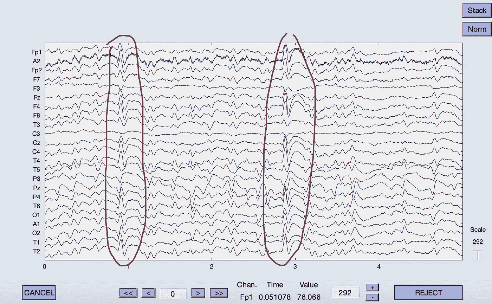
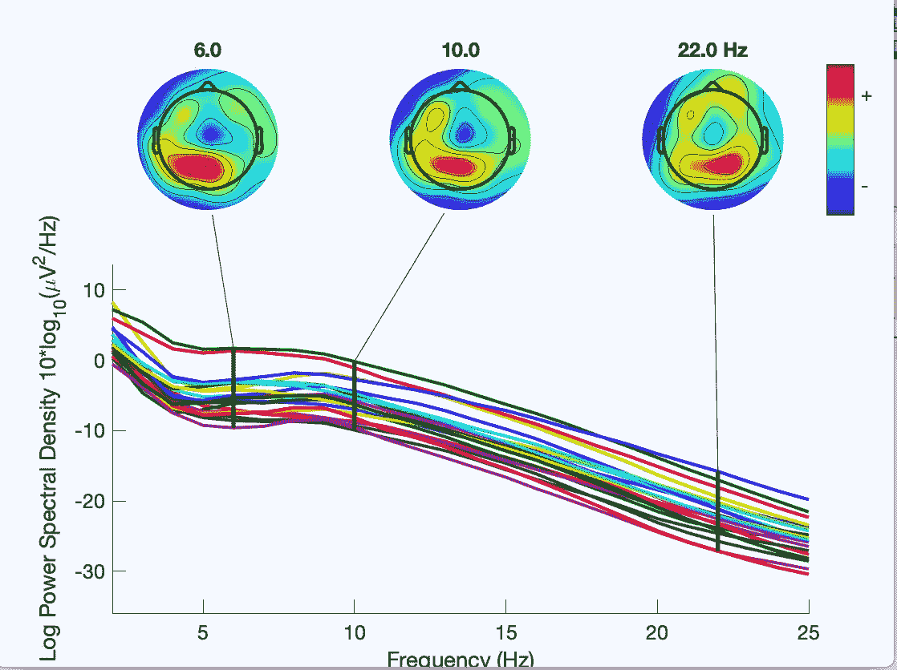
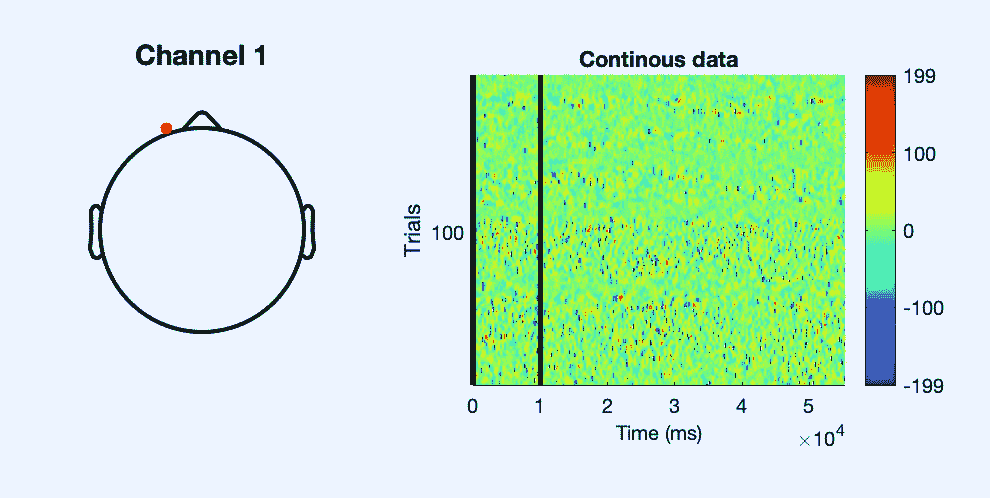
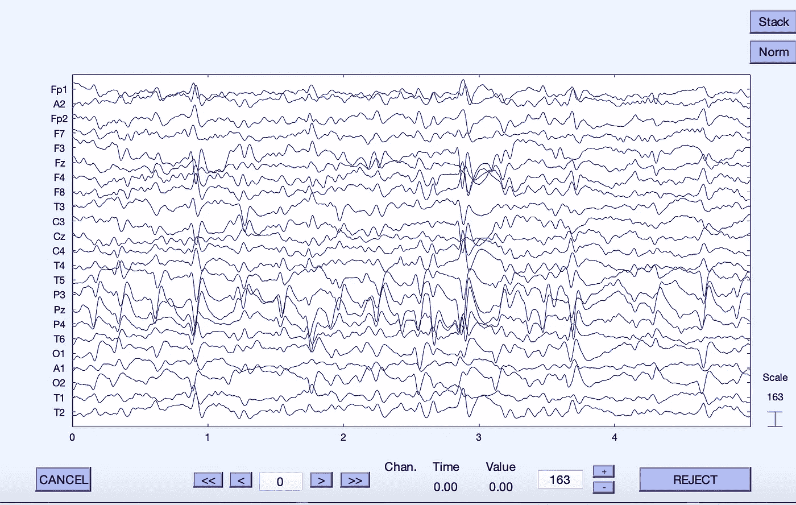

# 使用癫痫患者的静息状态 EEG 数据进行功能连接

> 原文：<https://medium.com/geekculture/using-resting-state-eeg-data-of-patients-with-epilepsy-for-functional-connectivity-2235f3f32485?source=collection_archive---------42----------------------->

一种基于编程的方法，通过功能连接范围来清理和分析癫痫患者的脑活动变化。

## 目录

1.  介绍
2.  癫痫和脑电图基础
3.  MatLab 和软件扩展
4.  清理数据的重要性以及我如何清理我的数据
5.  分析…还是不分析？
6.  如何利用这一点
7.  后续步骤
8.  关键要点

## 介绍

想象一下:你正在做一件你已经做过一千次的例行公事。你可能在任何地方:体育馆、学校或工作场所、海滩，或者任何你去过的地方。前一秒一切都很正常，但接下来不知从哪里冒出一股不受控制的电活动穿过你的大脑。当你再次睁开眼睛时，你躺在地板上，不知道刚刚发生了什么。有那么一小会儿，你甚至不知道自己身在何处，你感到虚弱和疲惫，你头疼，你可能会呕吐，还有一种无法摆脱的可怕的焦虑感。

这就是癫痫发作的感觉。癫痫发作是很可怕的，它可能在任何时候发生在任何人身上。但是，全世界有超过 6500 万人面临着一种状况，这种状况使他们经常容易发生这些可怕的癫痫发作，以及各种其他基于大脑的破坏性损伤。一种叫做癫痫的疾病。

## 癫痫和脑电图基础

有四种主要类型的癫痫，根据患者经历的癫痫发作类型以及它们在大脑中的位置进行分类。第一种类型是全身性癫痫，患有这种类型癫痫的患者经历从大脑两侧开始的癫痫发作，或者可以非常迅速地对两侧产生影响。下一种类型是局灶性癫痫，患者在大脑一侧的同一个大脑区域反复经历癫痫发作。第三种类型是全身性和局灶性癫痫，其中患者经历两种类型，最后是未分类或未知的癫痫，当不清楚或未确定哪种类型适用时。

Intense uncontrolled electrical activity occurs in the brain, causing a seizure.

基于癫痫患者经历的持续挑战，简单地尝试以其他人毫不费力和下意识的方式生活，很明显，他们的大脑与没有他们疾病的人非常不同。但是乍看之下，它们的不同之处有点难以理解。为此，科学家使用特殊的成像方法。

由于癫痫是一种基于电活动水平的疾病，用于这种疾病的逻辑成像方法是 EEG。脑电图的简称，EEG 成像使用放置在头皮外部的称为电极的小金属盘来检测大脑中的电活动。

## MatLab 和软件扩展

我从来自癫痫患儿数据集的原始数据开始。为了执行我需要做的所有清理、分类和处理，我使用了一个流行的基于科学和工程的编程平台 MatLab，以及它专门基于 EEG 的工具箱扩展 EEGLAB。这是一个非常有组织的和更方便的方式来执行我需要的所有任务(有很多)，这是一个巨大的时间节省，即使你知道如何编程，我强烈推荐任何基于科学或工程的编程项目。

## 清理数据的重要性以及我如何清理我的数据

在任何清洗之前，我所拥有的数据是完全未经过滤的，只是病人戴着脑电图帽时的读数。这些数据还不能按原样进行分析，因为它们一点也不干净。清理数据非常重要，因为原始读数可能包含您正在寻找的数据，但它们也包括白噪声、眨眼和其他会稀释数据的东西。为了获得清晰准确的结果，您需要确保您正在分析的数据是干净的，因为无用的数据输入只会导致无用的结论。

**预处理**

在任何清理之前，数据看起来像这样。正如你所看到的，眨眼(用红色圈出)与其他读数相比，在幅度和频率上产生了巨大的变化，这将妨碍正确地分析数据。因此，我需要通过有限脉冲响应(FIR)滤波器来运行数据，该滤波器会限制波的频率，以消除眨眼和其他不必要的异常值。我将最大频率设置为 30 赫兹(这是相当标准的)，标准最小值为 0.05 赫兹。通过这样做，我能够消除眨眼，因为它们的频率与其他数据有很大不同。

The channel data prior to any filtering. Eye blinks (circled in red) create large variations in frequency across channels.

在我把数据通过 FIR 滤波器后，是时候重新引用它了。脑电图帽看起来像病人头上的一张网，但这张网是由电极组成的，可以读取脑电波。在任何数据集中，都有一个电极称为公共参考，所有其他通道都可以将其用作比较的基础。科学家们围绕这一主题存在分歧，但没有通用的“最佳”公共电极。然而，对于单一数据集，将会有单独的最适合的参考电极。通过重新引用数据，您可以将数据集的引用点转换为其个人平均引用。这是一个更好的比较点，也可以进行更好的分析。

EEG caps are nets made of electrodes, which take readings from a subject’s brain.

**拒绝工件/ICA**

既然我们已经预处理了数据，那么是时候拒绝工件了。我将工件作为一个总括术语，因为您可以拒绝整个通道、数据的特定部分，或者两者都拒绝。我选择用一种称为独立分量分析(ICA)的技术来剔除伪像，因为它可以消除数据中嵌入的不良伪像，而不必消除整个通道或部分良好数据。有各种不同的 ICA 算法适合不同类型的数据，但是我使用的算法叫做 jade。

我发现 ICA 优于手动拒绝数据或使用自动拒绝的主要原因是它对所有类型的噪声或干扰的细致考虑，这使它能够更好地区分并最终分解数据。很难从视觉上区分，自动剔除只涉及较低层次的细节和考虑，所以我使用 ICA 来最大限度地提高精度。

**提取数据历元**

运行 ICA 后，是时候提取纪元了。提取时期的目的是为了能够研究不间断数据的事件相关细节。例如，如果存在与某些刺激的时间相关联的时期，则应该从数据中提取这些时期。

为此，要去除每个数据通道的平均值。在 EEGLAB 中提取纪元相对简单，所以我很容易地完成了这一步，没有遇到任何问题或复杂情况。您可以选择只提取特定频道类型的纪元，但我对所有频道都这样做了。

**标图数据**

一旦我提取了纪元，我就完成了清理数据的步骤！然而，在进行分析之前，我想确保我做的一切都是正确的，并且我的数据是完全干净的。为此，我创建了一些不同类型的情节。

第一种类型的图是 spectopo 图。这将绘制通道光谱，每条线代表一个通道。如果有任何线远离其余的通道，并且在任何一点都没有接触到超过几个其他通道，那么这些线也需要被移除。这是我的 spectopo 图在上述清洁步骤后的样子:

My spectopo plot after cleaning the data.

正如你所看到的，所有的线路都是紧密相连的。虽然有两条线开始略高于其他线，但它们最终与图上的其他通道相连，我们需要尽可能多的数据用于主要分析，所以我做出了保留它们的行政决定。

第二种类型的绘图是 ERP 图像。在该图中，每条水平线代表单次试验的活性。你要看的是，是否有任何线条在它们的颜色或这些颜色出现的频率上看起来非常不同。这里数据的水平线的颜色和出现的分布也是相对一致的(除非你一遍又一遍地运行相同的数据，否则不会 100%相同)，所以在这个意义上我也开了绿灯。

My ERP image plot after filtering the data.

在继续之前，我看的最后一个图是通道数据，您最初看到的是它的原始状态。清理后，它应该有许多看起来相似的线，具有相似大小的波，但没有比异常值更小或更大的波，也没有完全相同的通道。这是剧情的样子:

My channel data after having filtered the data.

它也检查出来，所以我已经成功地完成了清理阶段，并准备继续进行分析！！要了解我是如何做到的，你所要做的就是继续阅读😊

## 分析…还是不分析？

转换原始数据是这个项目的主旨，因为它需要大量的努力、解决问题、重复和坚持。基于半简单的解释，我可能已经把它列了出来，看起来很容易，但这涉及到很多尝试和错误，尤其是作为一个以前从未使用过该软件的人。获取无用数据并使其变得有用的能力是我在这里寻求训练的主要技能，之后我准备进行分析，作为各种各样的最后接触。

然而，结果并不像我预期的那样。我花了几个小时浏览不同的潜在软件，为各种方法寻找研究方法、扩展和协议，结果却一无所获。一些想法是短命的，而另一些则涉及冗长的兔子洞，最终都以同样的失败告终。然而，这一系列的失败对我的学习至关重要，也让我对我正在做的工作有了更多的了解。因此，我投入的时间仍然为我自己以及整个项目增加了价值，并成为我经历的重要部分。我将仔细检查我看过的每一种方法，为什么它没有达到要求，以及它向我展示了什么。此外，我尝试的方法越多，就越容易在早期发现缺点，每次我都离成功更近一步。

**连接工具箱**

CONN toolbox 是一个基于 MatLab 的工具箱扩展，我的许多同事和基于功能连接的项目的角色模型都使用它，这自然使它看起来比其他替代方案更可信、更合理。我成功地将它及其所有子文件夹放入 MatLab 并运行了扩展，但当我看到它是为 fMRI 数据设计的，并且缺乏使我能够成功分析的 EEG 定制功能时，这个试验被中断了。

**PLV**

在与我的一位导师交谈后，我发现 PLV 是分析功能连通性的一个强有力的指标，它可能是我成功分析的关键！这通常在 python 中执行，但是因为我使用 MatLab 作为我项目的机制，所以我需要看看它在 MatLab/eeglab 中是否可用。我发现一些链接表明 MatLab 中有类似的函数，但是经过更深入的分析，我发现这些函数根本不一样。

**FCLab**

FCLab 是专门为功能连接而设计的 MatLab 扩展。我读了一些论文，它们看起来非常吻合，所以我想我可能找到了答案！然而，当我进一步了解这些特性时，我发现它们是针对单个主题数据的(而我的不是)，而且这个扩展似乎已经不存在了。

**功能连接工具箱**

在我发现 FCLab 工具箱不再存在后，我很好奇想看看 MatLab 上是否还有其他功能连接工具箱仍然存在。我能够在 MatLab 上找到功能连接工具箱，但不幸的是，该功能不足以满足我的期望。它对初学者一点也不友好，缺乏可理解的指导，所以对于这个领域的新手来说，这显然是行不通的，因此我知道我必须继续前进。

**经济连接组**

这是我离成功最近的一次。Econnectome 也是 MatLab 中的扩展，用于功能连接成像，更具体地用于 EEG、MEG 和 ECoG 数据。我能够在 MatLab 中成功下载并安装扩展，甚至开始摆弄它！我开始对这个扩展和它的特性有所了解，但是后来我插入了我自己的数据。我真的以为我成功了，但是后来我注意到我只能导入 TXT 或者 MAT 文件。我所有的文件不是 edf，set，就是 fdt。我发现一些网站能够将我的数据转换成这些格式，但 txt 和 mat 文件都有非常特殊的格式，所以即使是转换应用程序也无法根据文件中数据的布局来转换我的数据。这非常不幸，但我仍然有机会尝试扩展，这是很好的学习，也是我所有尝试中最接近成功的一次。

虽然在这些分析方法中没有找到成功的方法令人失望，但每种方法都为我提供了新的知识和价值，这不仅帮助我在新方法试验中不断进步，还帮助我理解这些扩展如何工作、寻找什么以及如何使用它们。

## 如何利用这一点

如果你不知道这个新清理的数据集有什么用，即使是事后分析，它也是无用的。有许多不同的方法可以使用干净的数据集，但基于我分析的主要目标和清理数据的目的是利用它进行功能连接这一事实，这也是我在利用结果时考虑的观点。

在研究癫痫时，功能连接是很有用的，因为理解突触连接对于在整个癫痫发作过程中确定病因非常有帮助。癫痫发作的最开始始于不受控制的电活动。功能连接可以用来确定这种活动从哪里开始，然后它如何通过连接传播，直到它最终达到导致癫痫发作的传播水平或强度。当癫痫发作时，功能连接有助于确定特定大脑区域发生了什么，以及这些区域之间的连接如何影响输出。癫痫发作后，功能连接将有助于医生不仅了解癫痫发作的开始，而且了解影响癫痫发作的区域的强连接。他们可以利用这些信息来确定监控大脑的哪些区域，以便在起始点识别潜在的未来癫痫发作，并积极主动地关闭它们。

但是，我的新的、干净的数据在哪里发挥作用呢？嗯，我们刚刚确定，重点是寻找模式和趋势(利用功能连接)，这将有助于我们在积极的癫痫治疗方法中预测和预防癫痫发作。但是，如果没有来自患有相同疾病的患者的干净数据，我们怎么可能确定模式呢？

虽然癫痫是一种异质性疾病(这意味着这种疾病有很大的多样性，它包括许多亚组，所有癫痫都有更相似的变化)，但这些数据仍然非常有帮助，原因有二。首先，虽然这是两种方法中精度较低的一种，但从整体上确定病情的总体趋势仍然是有价值的信息。然而，干净的数据也有助于确定生物群(回想一下我之前给你看的图！)并确定这些组中更有针对性的特定趋势，以获得更准确的预测模型。

## 后续步骤

该项目的下一步将是获取干净的数据，并为整个数据集和通过聚类分析确定的特定生物群(也可以通过使用无监督神经网络来实现)创建监督神经网络，以形成预测模型。

这可能看起来只是一堆数据清理和一些功能连接分析，但它有能力影响数百万人的生活。癫痫患者以我们其他人无法理解的方式不断挣扎，通过利用我在这个项目中所做的，我们最终可以使他们茁壮成长，而没有他们被迫生活的持续痛苦和令人疲惫的中断。

## 关键要点

1.  癫痫是一种基于大脑的疾病，由大脑中不受控制的电活动的持续波动引起。它可以导致频繁的癫痫发作以及其他严重的症状，并极大地损害了数百万与之斗争的人。
2.  脑电图(EEG)是一种大脑成像方法，专门测量大脑中的电活动。由于癫痫是基于电活动水平，脑电图是分析这种情况的完美成像方法。
3.  为了清理我的脑电图数据，我使用了 MatLab 和 EEGLAB 扩展。我通过四个主要步骤完成了这项工作:预处理、运行独立成分分析(ICA)、提取时期以及用几种方法绘制数据以验证成功。
4.  接下来是分析。我希望执行的分析类型是功能连接性分析，我尝试了五种不同的方法来执行这一分析，但我无法全部完成。然而，他们每个人都教会了我关于这个分析和软件的新东西，这是一个学习和成长的好机会。
5.  这种新的干净数据与功能连接的使用相结合，在癫痫发作的所有阶段对癫痫患者都非常有帮助，并且可以预测和预防癫痫发作。
6.  癫痫是多种多样的，这意味着在这种情况下有很多变化，它可以更好地被认为是一个整体上更小的癫痫亚组的保护伞。然而，为疾病整体和这些亚组(可以使用数据图确定)建立预测模型都是有帮助的。
7.  该项目的下一步将涉及通过神经网络对数据进行处理，以形成整体数据及其子群的预测模型。

嗨，非常感谢你阅读我的文章！我叫刘冰·博恩施泰因，今年 15 岁，我对神经科学充满热情。如果你有兴趣合作，进一步推进这个项目，或者与我会面，我很乐意安排！请随时在 LinkedIn 上与我联系，或者在 rainabornstein@gmail.com 与我联系。期待收到你的来信！