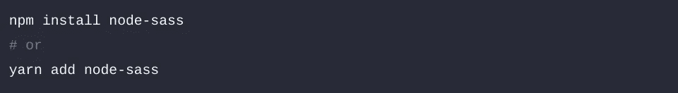
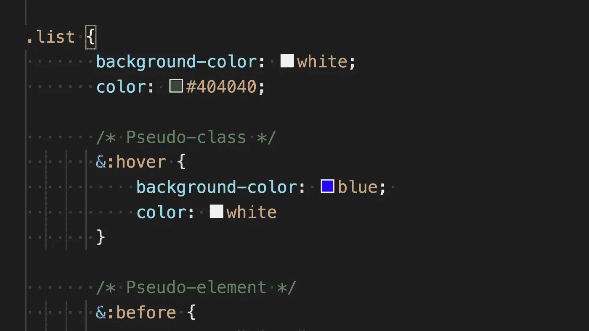
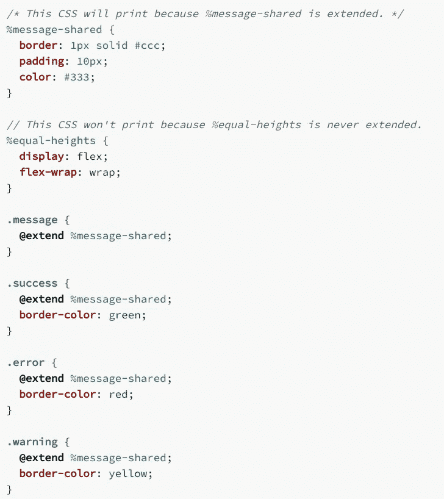

# 使用 SASS 来提升您的 CSS

> 原文：<https://medium.com/geekculture/using-sass-to-level-up-your-css-666489419908?source=collection_archive---------57----------------------->

React.js 是一个流行于开发者世界的前端 JavaScript 框架。可以说，这是最受欢迎的一个。它如此受欢迎的原因之一是因为它提供了构建各种 web 应用程序的高效方法。React 由脸书开发，从社交媒体平台的角度出发，专门为最终用户体验而设计。然而，如果你和我一样，你仍然会发现自己在努力编写有效的 CSS 并提供你想要的用户体验。在我自己尝试提升我的 CSS 游戏时，我偶然发现了 Sass，我想与你分享它给我的超能力，这样你也可以为你的应用程序开发令人惊叹的前端。

# **Sass**

Sass 是一个 React 库，包含许多非常有用且易于使用的特性。所有这些都是为了帮助你写得更好，更有条理，更容易阅读。

## 为什么要用 Sass？

Sass 代表语法上令人敬畏的样式表，它名副其实。Sass 允许您使用变量、嵌套规则和继承等东西。总的来说，它可以让你更快地组织和创建你的样式表。

## 设置 Sass Up

要启动 Sass 并在您的项目上运行，您需要运行 npm install node-sass 或 yarn add node-sass，这取决于您更喜欢哪个包管理器。

之后，你唯一需要做的事情就是确保你所有的 CSS 文件都有扩展名。scss 或。sass 并更新您的导入以匹配。一旦解决了这个问题，您就可以在代码中自由使用 Sass 的所有功能了！

## Sass 的基本功能

Sass 为您提供的第一个特性是在样式表中使用变量的能力。

将变量视为一种存储信息的便捷方式，您将在整个工作表中多次使用这些信息。Sass 允许您一次性定义它们，然后根据需要多次引用它们。写好变量名也将有助于使你的样式表更具可读性。

Sass 让您做的第二件事是嵌套您的样式。

正如您在这里看到的，Sass 让您可以选择将更具体的样式需求嵌套在它们所属的一般元素中。你会注意到它看起来更像 HTML 而不是 CSS，这是因为 HTML 也有嵌套元素的能力，而传统的 CSS 没有。这有助于您将相关的样式保持在彼此靠近的位置，并以逻辑的方式对它们进行排序，从而使外部查看者更容易跟踪您的样式表中正在发生的事情。

我们将要讨论的 Sass 的最后一个功能，也许是最有用的一个，是扩展/继承不同风格的能力。

使用 Sass，您可以创建预设的伪类，以后可以在子元素中扩展这些伪类。就像对象从它们的父类继承属性一样，这些元素从它们扩展的样式中继承一切。然后，您可以向它们添加新的样式，使每个样式与其他样式区分开来，并赋予它们您只希望其中一些样式具有的独特属性。

# 勇往直前

我希望你和我一样被萨斯的力量所鼓舞。作为一名开发人员，总会有更多的工具等待您去发现，所有这些工具都旨在使您的生活更加轻松，并作为一名程序员为您提供更强大的功能。感谢你阅读这篇文章，如果你喜欢，记得下周回来看另一篇精彩的文章。