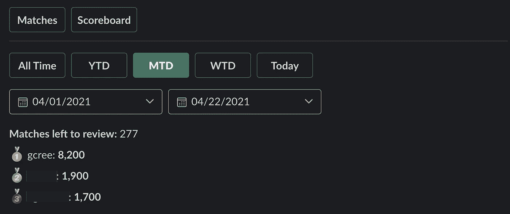

# 使用 Slack 优化手动实体解析

> 原文：<https://medium.com/geekculture/using-slack-to-optimize-manual-entity-resolution-f159b3745a5e?source=collection_archive---------48----------------------->

Photo by [Stefano Ferretti](https://unsplash.com/@ferrez?utm_source=medium&utm_medium=referral)

有时候真的很难区分两件事是不是一回事。 **ABC 公司**和 **ABC 公司**是一回事吗？ **CBR 建设**和**建设 CBR 公司**怎么样？ **AAD 国际**和**空中自动防御国际**？有时候你只需要做出判断。很简单，但是现在试着每天做几千次判断。听起来像是电脑的工作。然而，当你得到像 AAD 这样的例子时，计算机就会有所欠缺；有足够的相似性让计算机标记为可能的匹配，但没有足够的相似性来自动处理它。当与自动匹配结合使用时，这就是偶尔的判断调用变得有用的地方。

我在多伦多的火星探索区工作，为了创建我们的分析产品，我们从一大堆不同的数据源中提取关于加拿大企业的数据。然后，我的团队对这些数据进行分析，以获得加拿大风险投资生态系统的全面情况。我们的数据的问题是，风险投资有许多名称，没有很好的方法可以轻松自动地将风险投资从一个数据源匹配到另一个数据源。

举个例子，一个假的企业以不同的名字存在于多个数据源中。在数据源 1 中，它被称为'**cle tus potatos**'。在数据源 2 中，它被称为'**cle tus ' potatos Inc .**。。在 Datasource 3 中，它被称为' **Potatopocalypse** '(实际上是他们的一个产品的名称，用来代替企业名称)。在我们的数据库中，名字只是'**克莱特斯土豆**'。

我们可以很有把握地将数据源 1 中的风险与数据库中的风险进行匹配，因为字符串是完全匹配的(**克莱特斯土豆** = **克莱特斯土豆**)。Datasource 2 中的 venture 有一个后缀“Inc .”好的，当我们进行匹配时，我们可以很容易地删除常见的停用词，如“Inc .”和“Incorporated”，这样**clet us potatos**=**clet us potatos***Inc*。然而，来自数据源 3 的企业名称甚至与我们数据库中的名称都不相似，所以我们必须完全依赖元数据来进行匹配，并且我们可能必须手动检查匹配以确保它是正确的(可能有一个粗略的匹配，数据源 3 的 URL 是**www.cletuspots.com/potatopocalypse**，而我们的数据库 URL 是**www.cletuspots.com**——足以将这两个标记为可能的匹配)。

这家公司可能只是成千上万家公司中的一家，而在这么大的一批公司中，需要人工审核的不精确匹配的数量很容易就达到数千家。一个人(我！)在合理的时间内手动审查数千个匹配是不可能的，而且不幸的是，我们不可能对几乎准确的风险匹配感到满意。一些风险企业对风险企业生态系统有着不成比例的影响，如果我们错过了一个大公司的比赛，那么我们最终可能会通过将它们视为多家公司来放大它们的影响，而它们本应被视为一家公司。所以，这些匹配必须被审查。

现在，我们如何解决需要高度准确的匹配，但我没有时间手动检查它们以确保高准确性的问题？

# AI？

虽然一个好的人工智能将是解决这个问题的好方法，但在我们的例子中，这种方法有点超出范围。这对于仅使用名称而不使用其他信息就可以合理地将名称相互匹配的情况也是最有用的，但是像上面这样的情况，其中一个值是公司的名称，另一个值是公司的产品或服务，人工智能的复杂性可能会进一步增长。

所以如果我们不能使用人工智能，那就留给我们古老的自然智能。

# 众包 it

如果我没有时间手动审查所有这些公司，那么为什么不让我的同事来帮忙呢？现在，我可以很容易地查询我们的数据库来检查匹配，然后根据我的检查结果执行正确的 SQL 过程，但是我不可能期望我的所有同事都能够这样做(反正这真的是自找麻烦)。

这就是 Slack 的用武之地。Slack 有一个很棒的开发工具包，允许你创建带有“主页标签”的定制应用，作为交互式用户界面。

我创建了一个定制的 Slack 应用程序，并在应用程序的主页选项卡上发布了需要审查的风险匹配。因此，我现在可以在一个漂亮的 Slack 界面中查看匹配，而不是在数据库表中查看风险匹配:

The match interface (venture info redacted)

但更重要的是，我的同事现在也可以在空闲时间查看比赛了！每个用户都可以将不同的内容发布到他们的主页选项卡上，因此每当用户打开自定义 Slack 应用程序的主页选项卡时，他们都会看到下一个要完成的审阅，并可以按照自己的节奏完成这些审阅。

方便的是，这些 URL 是实时链接，所以点击它们会立即将用户带到一个浏览器，如果需要的话，他们可以在那里做进一步的研究。完成审核后，用户只需点击底部 3 个按钮中的一个即可提交审核。每当点击其中一个按钮时，Slack 应用程序都会向 AWS Lambda 函数发送一条消息，然后触发我们的数据库中的一个过程，将匹配标记为已验证或已拒绝，或者如果用户点击了“不确定”，则将匹配返回到审核队列。

最后一个问题是如何让人们真正回顾比赛？

# 让它游戏化

如果有什么东西是数据迷喜欢看的，那就是数字。为了激励我的同事参与进来，我建立了一个记分牌标签，在这里我所有的同事都被排名，还有他们的分数。现在我可以好好利用他们好胜的个性了。

Eat my dust, losers!

我还编写了一个日期范围功能，这样我们就可以看到从 X 日到 Y 日的分数，这对举办锦标赛很有帮助。这是因为在这一点上，我的历史记录是不可能被打破的，所以在特定日期开始和结束的锦标赛中，每个人都可以从相同的分数开始。

我有很多方法可以改进这个过程(例如，每场比赛的多次评论，比赛的引用)，但这代表了对旧方法的巨大改进。到目前为止，我们已经集体审查了 2000 多场比赛，这将需要我花费数周的全职工作来完成。通过这种方式，我可以在外出散步或会议间隙回顾比赛，我的整个团队也可以。

就是这样！我计划很快发表一篇文章，为任何对后端设计感兴趣的人详细介绍这个解决方案的架构(它是用 AWS、Slack、无服务器框架、Python 和 Postgres 构建的)。

编辑:这里是[架构篇](https://gcree.medium.com/serverless-slack-app-architecture-d1f310338eba)。