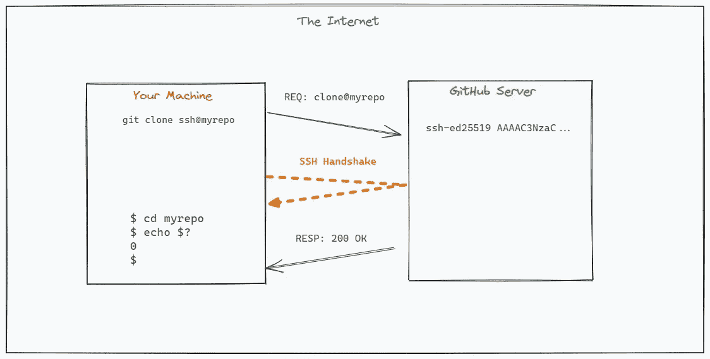

# 在 GitHub 中使用 SSH

> 原文：<https://medium.com/geekculture/using-ssh-with-github-bb252348de48?source=collection_archive---------12----------------------->

## 保护对代码库的更改

你好世界！你还在通过 HTTPS 使用密码认证来管理你的代码库吗？如果你是，那你真可耻！在这篇文章中，我将向你展示如何使用 SSH 密钥来管理你的 GitHub 代码库。为什么？因为使用 SSH 密钥比使用基于密码的身份验证安全得多，因为…