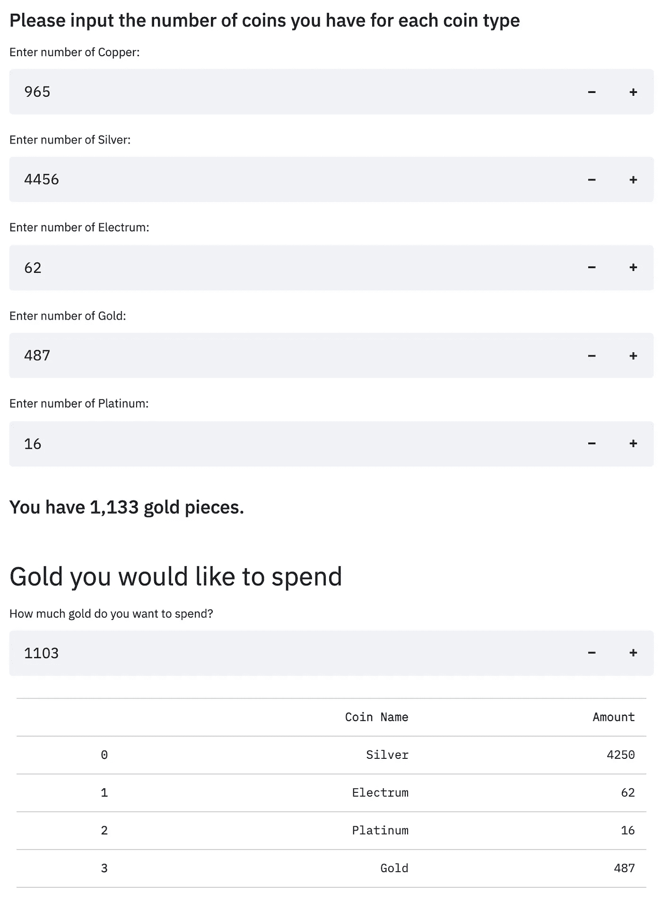

# 使用 Streamlit 创建计算应用程序

> 原文：<https://medium.com/geekculture/using-streamlit-to-create-a-calculating-app-69ae5252f6c7?source=collection_archive---------31----------------------->

## 一个疫情的爱好如何导致一个网络应用

Photo by [Vlad Zaytsev](https://unsplash.com/@vladizlo?utm_source=medium&utm_medium=referral) on [Unsplash](https://unsplash.com?utm_source=medium&utm_medium=referral)

当新冠肺炎疫情让所有人都呆在室内时，许多人在新的爱好和项目中寻求安慰。

我的一个朋友决定尝试领导一个龙与地下城(D&D)活动。他召集了几个人，开始创作一个引人入胜的故事。

一个游戏创造了一个我们从未面对过的场景。我们每个人都积攒了大量不同的硬币，是时候花掉它们了。就像较小的硬币可以加在一起成为一美元一样，D&D 的硬币与黄金相似，黄金等同于美元。昂贵物品的价格通常用黄金来确定，类似于用美元而不是镍币来列出一辆新车的价格。

正如在现实世界中可能发生的那样，当涉及到数学时，出现了一个障碍。我们用来追踪硬币的程序告诉我们它们加起来的黄金价值，所以我们知道我们可以买得起一件精致的，尽管价格很高的物品。然而，该程序并没有告诉你如何使用较小的硬币来支付新的项目。

输入我和我的编程技能。我创建了一个算法，能够从用户那里获取输入，并告诉他们需要哪些硬币来完成购买。但是我的队友和普通大众一样，将无法利用它。

做了一些研究后，我来到了 streamlit . io——一个可以使用 Python 创建 web 应用的网站。由于它的可用性和简单性，它越来越受欢迎(在 Medium 上快速搜索可以找到许多有用的文章)。

[Photo Source](https://www.businesswire.com/news/home/20200616005364/en/Streamlit-Raises-21M-in-Series-A-Funding-From-GGV-Capital-and-Gradient-Ventures-to-Amplify-the-Impact-of-Data-Science-and-Machine-Learning)

# 使用细流

下载 Streamlit 并导入它和其他库一样简单。我的挑战来自继续使用 Jupyter 笔记本编写 Streamlit 代码的愿望。幸运的是，我发现这三行代码在命令行中运行时，会在本地浏览器选项卡上显示应用程序。

Replace Streamlit_code with your file name and rename app.py to your preference

使用这些行简化了我的过程，并且不需要我在任何时候通过 GitHub 提交和推送我的代码，我就可以看到这些变化对应用程序的影响。

请记住，Streamlit 连接到您的 GitHub，因此您需要一个帐户。另外，你的库名、分支名和文件名(在我的例子中是 app.py)将出现在你的 url 中，所以要保持优雅。

目前，Streamlit 是“仅邀请”，但请求邀请很容易，审批只需几天时间。耐心点，不断查看网站，看看你什么时候被录取，因为没有邮件通知你什么时候被录取。

Streamlit 可以创建惊人的可视化和仪表板，但是我的算法只需要一个表来显示结果。尽管我很想要一个彩色的图表，但最终，它是不必要的，也是无益的。

Example of D&D Currency Calculation app

如果你很好奇，或者需要一个 D&D 货币计算器，你来对地方了。请点击此处查看应用程序:

[https://share . streamlit . io/cassnutt/dnd _ currency _ converter/main/app . py](https://share.streamlit.io/cassnutt/dnd_currency_converter/main/app.py)

访问 https://streamlit.io/[创建您自己的应用程序。](https://streamlit.io/)

如果你想看代码，[访问我的 GitHub 库](https://github.com/cassnutt/DND_currency_converter)。如果你在我的 Streamlit 页面上[，点击右上角堆叠的 3 行，选择“查看应用源代码”也可以看到代码。](https://share.streamlit.io/cassnutt/dnd_currency_converter/main/app.py)

[在 LinkedIn](https://www.linkedin.com/in/cassie-nutter/) 和快乐猎龙上和我联系！