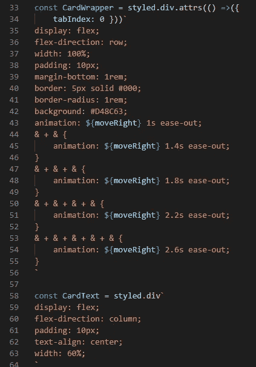
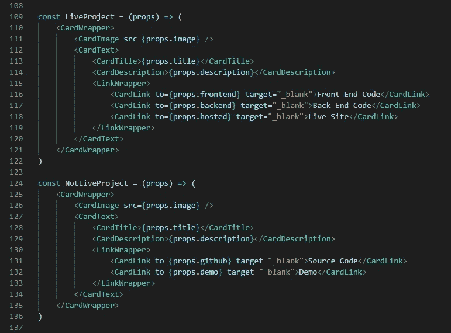
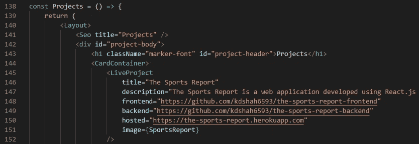

# 在 GatsbyJS 中使用样式化组件

> 原文：<https://medium.com/geekculture/using-styled-components-in-gatsbyjs-5a0cd8d74fe8?source=collection_archive---------26----------------------->

和任何其他刚从编码训练营毕业的人一样，我开始着手我的个人作品集网站。刚刚学会 React，我想坚持用我刚刚学到的技巧来建立我的网站。我之前使用 Create-React-App 创建了一个应用程序，但由于我的作品集网站严格地说是基于内容的，我发现 GatsbyJS 更适合静态网站(尽管它可以做得更多！Gatsby 网站仍然是功能齐全的 React 应用程序)。

所以当我在建网站的时候，我想为我的项目设计一个卡片。基本上每张“卡片”都有标题、描述、图片和链接。在我之前创建的应用中，我使用了 Material-UI 和 Bootstrap 的卡片模板来显示我的内容。为了学习新的东西，我使用了 Styled Components，这是一个 CSS-in-JS 库。

样式化的组件允许你在组件中直接编写实际的 CSS 语法。使用 CSS-in-JS 的一个主要好处是它有助于消除选择器名称冲突。通常你必须确保你没有在站点的其他地方覆盖 CSS 选择器。这可能会导致复杂和混乱的命名。使用 CSS-in-JS，所有的样式都直接作用于它们的组件，这使得编辑组件的 CSS 更加容易。您不再需要考虑为您的元素指定什么类或 id 名称，也不需要考虑您是否已经使用了一个名称作为类或 id，或者搜索。css 文件来查找特定标签需要编辑的样式。

要开始使用 GatsbyJS 中的样式化组件(假设您已经创建了一个站点)，您需要安装适当的依赖项:

```
npm install gatsby-plugin-styled-components styled-components babel-plugin-styled-components
```

然后你将把这个插件添加到你站点的 ***gatsby-config.js*** 文件中:

```
module.exports = {
  plugins: [`gatsby-plugin-styled-components`],
}
```

现在，在您想要使用样式化组件的页面上，您想要在页面顶部导入样式化组件

```
import styled from "styled-components"
```

现在您已经准备好开始创建样式化的组件了。下面是我的作品集网站代码的几个截图，向你展示流程。



样式化组件移除了组件和样式之间的映射。它利用标记的模板文字。在定义样式时，它实际上创建了一个带有附加样式的 React 组件。您用组件的名称创建一个变量，并将其设置为上面导入的“styled”。然后你链接到组件将要使用的 HTML 元素，比如

、

、

## 、等等。最后，使用反斜杠( `` )来包装 CSS，这与在 CSS 文件中的编写方式完全一样。

注意:如果你想设计一个链接，而不是，你可以设计盖茨比的链接。这使您可以利用 Gatsby 的链接在页面之间导航，而无需重新加载页面。

```
import { Link } from "gatsby"
...
const componentName = styled(Link)`
cssRule = css
`
```



这里你可以看到我已经创建了一个功能组件，它将呈现样式化的组件，并让我将*道具*传递给它们。此外，记住这些是 React 组件，所以在构建它们时要考虑可重用性。正如你所看到的，我能够创建 2 个不同的项目组件，因为我的实时和非实时项目需要不同的链接，但我希望他们的 CSS 看起来一样。React 和样式组件使这变得非常容易。



最后，在实际呈现到页面的功能组件中，我需要做的就是用*道具*呈现 1 个组件，该组件包含我的样式化组件将使用的内容。

这就对了，你现在知道如何创建风格化的组件了！同样，我认为最大的好处基本上是构建了内置 CSS 的可重用 React 组件。如果你愿意，你可以查看[我的网站的项目页面](https://kunals-portfolio.web.app/projects)来看看他们的工作和[源代码](https://github.com/kdshah6593/portfolio-website/blob/main/src/pages/projects.js)到我如何建立那个页面。

编码快乐！